### LAN INTERFACE

1.  SCOPE.

    1.  <u>Scope</u>.

> This appendix describes the requirements for an optional local area network (LAN) interface for radio data modems.

1.  <u>Applicability</u>.

> This appendix is a non-mandatory part of MIL-STD-188-110D.

1.  APPLICABLE DOCUMENTS.

> None.

1.  DEFINITIONS.

> See section 3.

1.  GENERAL REQUIREMENTS.

    1.  <u>Protocol overview</u>.

> This interface is designed to enable a Data Terminal Equipment (DTE) to interact with a modem via a data network. Only one DTE at a time can control the modem using this interface.
>
> Attempts by a second DTE to establish a connection shall be rejected by the modem.
>
> Two protocols are specified here: a TCP-based protocol for higher-performance networks, and a UDP-based protocol for data networks that experience long delays or non-negligible packet loss rates. Both protocols shall be supported in all implementations of this appendix.

1.  <u>TCP port number</u>.

> Both the TCP-based and UDP-based protocols require the DTE to establish a TCP connection through the Ethernet interface of the modem. The TCP port number on the modem shall be configurable (port 3000 is suggested). After the connection is established the DTE and modem shall exchange control and data packets in accordance with the requirements of section 5 of this appendix.

1.  <u>Full duplex threads</u>.

> Both the modem and the DTE device may send packets asynchronously on this interface, i.e., without prompting from the other device. Therefore, a separate thread blocked only on socket input port must be employed in each device to prevent system failure.

1.  <u>Byte order</u>.

> Unless otherwise specified, all multi-byte fields shall be sent in network byte order i.e., most-significant byte first.

1.  DETAILED REQUIREMENTS.

    1.  TCP socket interface.

        1.  Packet format.

> Each packet exchanged between the DTE and the modem shall consist of an 8-byte header, optionally followed by a variable-length payload and a 16-bit CRC computed on the payload data (see Figure A-1). The total packet length shall be less than or equal to 4096 bytes.
>
> Therefore at most 4086 payload bytes may be sent in a single packet.
>
> 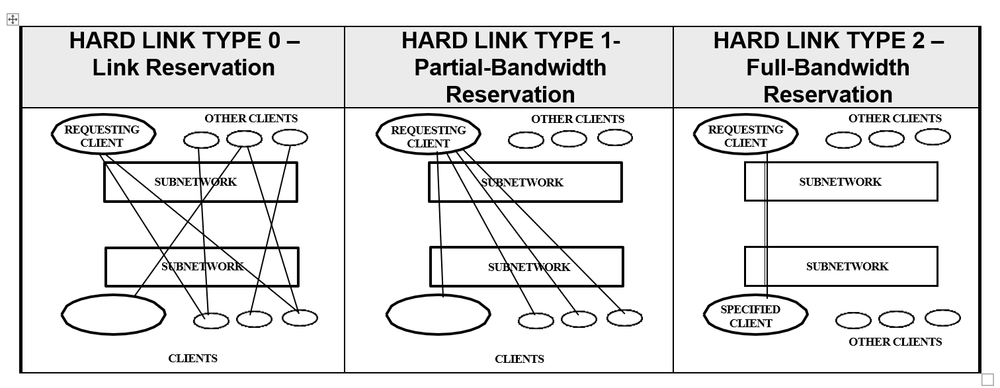

**Figure A-1. Packet Format**

1.  Packet header format.

> Each packet shall begin with a header consisting of the following fields (see Figure A-2):
>
> 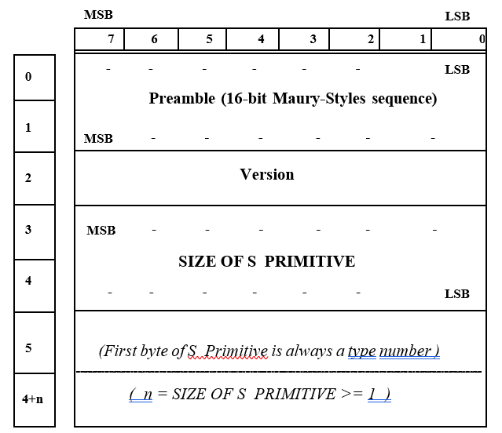
>
> **Figure A-2. Packet Header Format**

The header shall begin with a three-byte Preamble containing the fixed values Ox49, Ox50, Ox55.

> A 1-byte Type field shall follow the Preamble. The following meanings are assigned to the Type field values specified. Unused values shall not be sent, and shall result in an Error (0xFF) response if received.

**Table A-1: Packet Type Byte Values**

<table>
<colgroup>
<col style="width: 8%" />
<col style="width: 24%" />
<col style="width: 66%" />
</colgroup>
<thead>
<tr class="header">
<th><blockquote>

<strong>Byte Value</strong>

</blockquote></th>
<th><blockquote>

<strong>Packet Type Name</strong>

</blockquote></th>
<th><blockquote>

<strong>Description</strong>

</blockquote></th>
</tr>
</thead>
<tbody>
<tr class="odd">
<td><blockquote>

0x00

</blockquote></td>
<td><blockquote>

DATA

</blockquote></td>
<td><blockquote>

Data type packet <em>(see</em> A.5.1.1.3)

</blockquote></td>
</tr>
<tr class="even">
<td><blockquote>

0x0l

</blockquote></td>
<td><blockquote>

CONNECT

</blockquote></td>
<td><blockquote>

Initial Socket Connection packet (see A.5.1.1.2)

</blockquote></td>
</tr>
<tr class="odd">
<td><blockquote>

0x02

</blockquote></td>
<td><blockquote>

CONNECTACK

</blockquote></td>
<td><blockquote>

Initial Socket Connection Acknowledgement packet (see A.5.1.1.2)

</blockquote></td>
</tr>
<tr class="even">
<td><blockquote>

0xFF

</blockquote></td>
<td><blockquote>

ERROR

</blockquote></td>
<td><blockquote>

Packet format or protocol error (see Section A.5.1.2.3)

</blockquote></td>
</tr>
</tbody>
</table>

> The Type field shall be followed by a 2 byte Payload Size field, which indicates the number of bytes in the packet payload (exclusive of Payload CRC). Valid values for this field range from 0 to 4086 bytes.
>
> The header shall be concluded with a 2 byte Header CRC, following the Payload Size field. The Header CRC shall be computed (see A.5.3) for the preceding 6 header bytes only.

1.  <u>CONNECT and CONNECT ACK payload format</u>.

> Both CONNECT and CONNECT ACK packets shall have a one (1) byte version number payload. The version number may be used by the DTE and modem to differentiate among protocol format variations. The version number shall be set to 12 for devices that implement the protocol described in this appendix.

1.  <u>DATA Mode packet payload format</u>.

> If the payload size is zero in a DATA mode packet, no payload bytes are sent following the header. If the payload size is non-zero, the 8 byte header shall be followed by the number of payload bytes specified in the header Payload Size field, which are in turn followed by a 16-bit Payload CRC. The Payload CRC shall be computed (see A.5.3) for the payload bytes only.
>
> The first byte of the payload shall be a Payload Command (see A.5.1.1.4). The format of the remainder of the payload field varies, depending on the Payload Command (see Table A-II).

1.  <u>Payload command Field</u>.

> The valid Payload Commands for use within DATA packets are specified in Table A-II. Unused values shall not be sent, and shall result in an Error response if received.

### Table A-II: Payload Commands

<table>
<colgroup>
<col style="width: 22%" />
<col style="width: 14%" />
<col style="width: 36%" />
<col style="width: 14%" />
<col style="width: 11%" />
</colgroup>
<thead>
<tr class="header">
<th><blockquote>

Command

</blockquote></th>
<th><blockquote>

Command Byte

</blockquote></th>
<th><blockquote>

Arguments (in the remaining payload bytes)

</blockquote></th>
<th>Details</th>
<th>Sent by</th>
</tr>
</thead>
<tbody>
<tr class="odd">
<td><blockquote>

Data Transfer

</blockquote></td>
<td>0x00</td>
<td><blockquote>

Packet order byte Packet ID

Data to be sent over the air

</blockquote></td>
<td>A.5.1.1.5</td>
<td>both</td>
</tr>
<tr class="even">
<td><blockquote>

Transmit Arm

</blockquote></td>
<td>0x01</td>
<td><blockquote>

none

</blockquote></td>
<td></td>
<td>DTE</td>
</tr>
<tr class="odd">
<td><blockquote>

Transmit Start

</blockquote></td>
<td>0x02</td>
<td><blockquote>

none

</blockquote></td>
<td></td>
<td>DTE</td>
</tr>
<tr class="even">
<td><blockquote>

Request Tx Status

</blockquote></td>
<td>0x03</td>
<td><blockquote>

none

</blockquote></td>
<td></td>
<td>DTE</td>
</tr>
<tr class="odd">
<td><blockquote>

Tx_Data_NAK

</blockquote></td>
<td>0x04</td>
<td><blockquote>

Cause Packet ID

</blockquote></td>
<td>A.5.1.1.6</td>
<td>modem</td>
</tr>
<tr class="even">
<td><blockquote>

Tx_Status

</blockquote></td>
<td>0x05</td>
<td><blockquote>

modem TX state and buffer status

</blockquote></td>
<td>A.5.1.1.7</td>
<td>modem</td>
</tr>
<tr class="odd">
<td><blockquote>

Abort_reception

</blockquote></td>
<td>0x06</td>
<td><blockquote>

none

</blockquote></td>
<td></td>
<td>DTE</td>
</tr>
<tr class="even">
<td><blockquote>

Carrier Detect

</blockquote></td>
<td>0x08</td>
<td><blockquote>

Carrier State

Receive Data Rate Info

</blockquote></td>
<td>A.5.1.1.8</td>
<td>Modem</td>
</tr>
<tr class="odd">
<td><blockquote>

Transmit Setup

</blockquote></td>
<td>0x09</td>
<td><blockquote>

Transmit Data Rate Info

</blockquote></td>
<td>A.5.1.1.9</td>
<td>Modem</td>
</tr>
<tr class="even">
<td><blockquote>

Initial Setup

</blockquote></td>
<td>0x0A</td>
<td><blockquote>

Data Socket Setup Parameters Sync/Async Setup

Version

</blockquote></td>
<td>A.5.1.1.10</td>
<td>Modem</td>
</tr>
<tr class="odd">
<td><blockquote>

Connection Probe

</blockquote></td>
<td>0x0B</td>
<td><blockquote>

None

</blockquote></td>
<td></td>
<td>Both</td>
</tr>
</tbody>
</table>

1.  <u>Data transfer payloads: (sent to/from modem from/to DTE)</u>.

> Between 0 and 4072 bytes of over-the-air data may be sent to/from the modem using a data transfer payload. If N is the number of data bytes to be sent, the 14 + N information bytes of a data transfer payload shall be formatted as shown in Figure A-3.

<table>
<colgroup>
<col style="width: 28%" />
<col style="width: 25%" />
<col style="width: 21%" />
<col style="width: 24%" />
</colgroup>
<thead>
<tr class="header">
<th><blockquote>

Payload Command

(0x00)

</blockquote></th>
<th><blockquote>

Packet Order

(1 byte)

</blockquote></th>
<th><blockquote>

Packet ID

(12 bytes)

</blockquote></th>
<th>
Data

(0 to 4072 bytes)
</th>
</tr>
</thead>
<tbody>
</tbody>
</table>

### Figure A-3. Data Transfer Payload Format

1.  Packet order byte.

> The packet order byte shall take one of the following 4 values:

**Table A-III: Packet Order Byte Values**

<table>
<colgroup>
<col style="width: 10%" />
<col style="width: 27%" />
<col style="width: 61%" />
</colgroup>
<thead>
<tr class="header">
<th><blockquote>

Byte

<strong>Value</strong>

</blockquote></th>
<th><blockquote>

<strong>Order Type Name</strong>

</blockquote></th>
<th><blockquote>

<strong>Description</strong>

</blockquote></th>
</tr>
</thead>
<tbody>
<tr class="odd">
<td><blockquote>

1

</blockquote></td>
<td><blockquote>

FIRSTONLY

</blockquote></td>
<td><blockquote>

The first packet of a multi-packet transmission

</blockquote></td>
</tr>
<tr class="even">
<td><blockquote>

2

</blockquote></td>
<td><blockquote>

FIRST AND LAST

</blockquote></td>
<td><blockquote>

The only packet of a transmission

</blockquote></td>
</tr>
<tr class="odd">
<td><blockquote>

3

</blockquote></td>
<td><blockquote>

CONTINUATION

</blockquote></td>
<td><blockquote>

A continuation packet of a multi-packet transmission

</blockquote></td>
</tr>
<tr class="even">
<td><blockquote>

4

</blockquote></td>
<td><blockquote>

LAST

</blockquote></td>
<td><blockquote>

The last packet of a multi-packet transmission

</blockquote></td>
</tr>
</tbody>
</table>

> The packet order byte of first packet of complete over-the-air transmission/reception must be either FIRST\_ONLY or FIRST\_AND\_LAST. If only entire transmission/reception fits within a single packet, that packet may be sent with the packet order byte set to FIRST\_AND\_LAST. Othe1wise, the packet order byte must be FIRST\_ONLY for the first packet.
>
> Each additional packet sent/received must have packet order set to either CONTINUATION if more data is to follow or LAST if this is the last data packet.
>
> Packets with no data bytes are accepted, e.g. to notify transmitter of data termination with LAST set.

1.  Packet ID field.

> The Packet ID field shall contain a unique 12-byte identifier for each Data Transfer packet sent. This value is used only in acknowledgements (see A.5.1.1.6).

1.  Transmitted data packet NACK payload. Sent from modem to DTE only.

> This message shall be sent by the modem in response to an unaccepted data packet from the DTE. Note that packets that fail CRC checks shall be silently dropped by the DTE or Modem (no NACK packet shall be generated).

<table>
<colgroup>
<col style="width: 30%" />
<col style="width: 24%" />
<col style="width: 44%" />
</colgroup>
<thead>
<tr class="header">
<th><blockquote>

Payload Command

(0x04)

</blockquote></th>
<th><blockquote>

Cause

(1 byte)

</blockquote></th>
<th><blockquote>

NACKed Packet ID

(12 bytes)

</blockquote></th>
</tr>
</thead>
<tbody>
</tbody>
</table>

**Figure A-4. NACK Payload Format**

> The Cause byte shall take one of the following values:

**Table A-IV: NACK Cause Byte Values**

<table>
<colgroup>
<col style="width: 8%" />
<col style="width: 24%" />
<col style="width: 66%" />
</colgroup>
<thead>
<tr class="header">
<th><blockquote>

Byte

<strong>Value</strong>

</blockquote></th>
<th><blockquote>

<strong>Cause for NACK</strong>

</blockquote></th>
<th><blockquote>

<strong>Description</strong>

</blockquote></th>
</tr>
</thead>
<tbody>
<tr class="odd">
<td><blockquote>

o

</blockquote></td>
<td><blockquote>

TRANSMIT QUEUESNOT ARJ\1ED

</blockquote></td>
<td><blockquote>

Modem transmit queues are not in armed or started state

</blockquote></td>
</tr>
<tr class="even">
<td><blockquote>

1

</blockquote></td>
<td><blockquote>

TRANSMIT UNDERRUN

</blockquote></td>
<td><blockquote>

Modem transmitter unde1nm, transmitter is currently in a forced drain state

</blockquote></td>
</tr>
<tr class="odd">
<td><blockquote>

2

</blockquote></td>
<td><blockquote>

MISSING FIRST PACKET

</blockquote></td>
<td><blockquote>

Modem transmitter has not received a previous data packet marked as a 11FIRST"-type data packet for the current transmission.

</blockquote></td>
</tr>
<tr class="even">
<td><blockquote>

3

</blockquote></td>
<td><blockquote>

MULTIPLE FIRST PACKET

</blockquote></td>
<td><blockquote>

More than one packets received for current transmission marked as a 11FIRST"-type data packet

</blockquote></td>
</tr>
</tbody>
</table>

> The NACKed packet ID shall contain the Packet ID of the data packet that caused the NACK command to be sent by the modem.

1.  Transmitter status payload. Sent from modem to DTE only.

> Sent by modem in response to a Request Tx Status packet from the DTE or unsolicited when the modem transmitter's queues and/or status changes.

<table style="width:100%;">
<colgroup>
<col style="width: 12%" />
<col style="width: 16%" />
<col style="width: 15%" />
<col style="width: 16%" />
<col style="width: 18%" />
<col style="width: 19%" />
</colgroup>
<thead>
<tr class="header">
<th><blockquote>

Payload Command

</blockquote>

0x05
</th>
<th>
Transmitter State

<blockquote>

1 byte

</blockquote></th>
<th>
Serial FIFO Space

32 bits
</th>
<th><blockquote>

Se1ial FIFO Fill

</blockquote>

32 bits
</th>
<th>
FIFO Critical Milliseconds

32 bits
</th>
<th><blockquote>

FIFO Critical Bytes

32 bits

</blockquote></th>
</tr>
</thead>
<tbody>
</tbody>
</table>

**Figure A-5: Transmitter Status Payload Format**

> The Transmitter State byte shall take one of the values shown in Table A-V according to the current state of the Modem transmitter.

**Table A-V: Transmitter State Byte Values**

<table>
<colgroup>
<col style="width: 8%" />
<col style="width: 24%" />
<col style="width: 66%" />
</colgroup>
<thead>
<tr class="header">
<th><blockquote>

<strong>Byte</strong>

<strong>Value</strong>

</blockquote></th>
<th><blockquote>

<strong>Command Name</strong>

</blockquote></th>
<th><blockquote>

<strong>Description</strong>

</blockquote></th>
</tr>
</thead>
<tbody>
<tr class="odd">
<td><blockquote>

1

</blockquote></td>
<td><blockquote>

PLUSHED

</blockquote></td>
<td><blockquote>

Modem Transmitter flushed (Idle)

</blockquote></td>
</tr>
<tr class="even">
<td><blockquote>

2

</blockquote></td>
<td><blockquote>

QUEUES ARMED AND PORT NOT READY

</blockquote></td>
<td><blockquote>

Modem Transmitter is ready to queue data bytes from DTE but is not ready to accept requests to start transmission

</blockquote></td>
</tr>
<tr class="odd">
<td><blockquote>

3

</blockquote></td>
<td><blockquote>

QUEDES ARMED AND PORT READY

</blockquote></td>
<td><blockquote>

Modem Transmitter is ready to queue data bytes and is ready to accept requests to start transmission

</blockquote></td>
</tr>
<tr class="even">
<td><blockquote>

4

</blockquote></td>
<td><blockquote>

STARTED

</blockquote></td>
<td><blockquote>

Modem Transmitter has started processing the serial data

</blockquote></td>
</tr>
<tr class="odd">
<td><blockquote>

5

</blockquote></td>
<td><blockquote>

DRAININGOK

</blockquote></td>
<td><blockquote>

Modem transmitter is in a drain phase in response to a "LAST"-type data packet

</blockquote></td>
</tr>
<tr class="even">
<td><blockquote>

6

</blockquote></td>
<td><blockquote>

DRAINING FORCED

</blockquote></td>
<td><blockquote>

Modem transmitter is in a forced drain phase in response to a data underrun condition.

</blockquote></td>
</tr>
</tbody>
</table>

> The Serial FIFO Space field shall indicate the space in bytes available in the transmitter serial PIFO.
>
> The Serial FIFO Fill field shall indicate the space in bytes used in the transmitter serial PIFO.
>
> The FIFO Critical Milliseconds field shall indicate the time in milliseconds before the modem goes into a forced drain state if no more data is sent to the modem by the DTE.
>
> The FIFO Critical Bytes field shall indicate the number of bytes that the DTE must send to the modem to prevent the modem from going into a forced drain state.

1.  Carrier detect payload. Sent from modem to DTE only.

> This packet shall be sent by the modem in response to any change in the state of the receiver. This packet shall also be sent by the modem to the DTE after the initial connection handshake and after a non-destructive configuration change.

<table>
<colgroup>
<col style="width: 18%" />
<col style="width: 19%" />
<col style="width: 32%" />
<col style="width: 29%" />
</colgroup>
<thead>
<tr class="header">
<th><blockquote>

Payload Command

(0x08)

</blockquote></th>
<th><blockquote>

Carrier State

(1 byte)

</blockquote></th>
<th><blockquote>

Rx Data Rate in bits/s

(32 bits)

</blockquote></th>
<th><blockquote>

Rx Blocking Factor in bits

(32 bits)

</blockquote></th>
</tr>
</thead>
<tbody>
</tbody>
</table>

**Figure A-6: Carrier Detect Payload Format**

**Table A-VI: Carrier State Byte Values**

<table>
<colgroup>
<col style="width: 8%" />
<col style="width: 24%" />
<col style="width: 66%" />
</colgroup>
<thead>
<tr class="header">
<th><blockquote>

<strong>Byte Value</strong>

</blockquote></th>
<th><blockquote>

<strong>State Name</strong>

</blockquote></th>
<th><blockquote>

<strong>Description</strong>

</blockquote></th>
</tr>
</thead>
<tbody>
<tr class="odd">
<td><blockquote>

o

</blockquote></td>
<td><blockquote>

NO CARRIER

</blockquote></td>
<td><blockquote>

Modem receiver is Idle

</blockquote></td>
</tr>
<tr class="even">
<td><blockquote>

1

</blockquote></td>
<td><blockquote>

CARRIER DETECTED

</blockquote></td>
<td><blockquote>

Modem has synchronized on a preamble or is processing data from the air. This state indicates CARRIER DETECTED or RECEIVING state from Figure A-10

</blockquote></td>
</tr>
</tbody>
</table>

> The Rx Data Rate field shall indicate the data rate in bits per second of the received signal.
>
> The Rx Blocking Factor field shall indicate the chunk: size in bits of the received signal. This value is tied to the interleaver length of the receive signal of most waveforms. Data shall be transferred to the DTE in data chunks equal to this value.

1.  Transmit setup payload. Sent from modem to DTE only.

> Sent by modem in response to a change in the state of the transmitter. This packet shall be sent by the modem to the DTE after the initial connection handshake and after a non-destructive configuration change.

<table>
<colgroup>
<col style="width: 17%" />
<col style="width: 38%" />
<col style="width: 43%" />
</colgroup>
<thead>
<tr class="header">
<th><blockquote>

Payload Command

(0x09)

</blockquote></th>
<th><blockquote>

Tx Data Rate in bits/s

(32 bits)

</blockquote></th>
<th><blockquote>

Tx Blocking Factor in bits

(32 bits)

</blockquote></th>
</tr>
</thead>
<tbody>
</tbody>
</table>

### Figure A-7: Transmit Setup Payload Format

> The Tx Data Rate field shall indicate the data rate in bits per second of the transmitted signal.
>
> The Tx Blocking Factor field shall indicate the chunk size in bits of the transmitter signal. This value is tied to the interleaver length of the transmitter of most waveforms. Data shall be read from the transmit buffers in data chunks equal to this value.

1.  <u>Initial setup payload</u>.

> Sent from modem to DTE only, as part of the initial connection exchange (see A.5.1.2.1). This packet contains information about the configuration of the data socket, and shall be formatted as shown in Figure A-8.

<table>
<colgroup>
<col style="width: 13%" />
<col style="width: 17%" />
<col style="width: 13%" />
<col style="width: 13%" />
<col style="width: 13%" />
<col style="width: 15%" />
<col style="width: 13%" />
</colgroup>
<thead>
<tr class="header">
<th><blockquote>

Payload Command

(0x0A)

</blockquote></th>
<th colspan="2"><blockquote>

Round-Trip Time in milliseconds

(32 bits)

</blockquote></th>
<th colspan="4"><blockquote>

Minimum Socket Latency in milliseconds

(32 bits)

</blockquote></th>
</tr>
</thead>
<tbody>
<tr class="odd">
<td colspan="2"><blockquote>

Maximum Socket Latency in Milliseconds

(32 bits)

</blockquote></td>
<td><blockquote>

Sync Flag

(1 byte)

</blockquote></td>
<td><blockquote>

Async Data Bits

(1 byte)

</blockquote></td>
<td><blockquote>

Async Stop Bits

(1 byte)

</blockquote></td>
<td><blockquote>

Async Parity

(1 byte)

</blockquote></td>
<td><blockquote>

Async Data Mode

(1 byte)

</blockquote></td>
</tr>
</tbody>
</table>

### Figure A-8: Initial Setup Payload Format

> The Round-Trip Time field shall indicate the Ethernet link round-trip time in milliseconds as calculated by the Modem during the initial connection probe exchange (see A.5.1.2).
>
> The Minimum Socket Latency field shall indicate the minimum allowed socket latency value in milliseconds as configured on the modem. This value may be used by the modem for pre-buffer calculations instead of the Round-Trip Time value if it is greater than the Round-Trip Time.
>
> The Maximum Socket Latency field shall indicate the maximum allowed socket latency value in milliseconds as configured on the modem. The connection may be dropped by the modem if the Round-Trip Time is greater than the Maximum Socket Latency.

**Table A-VII: Synchronous Flag Byte Values**

<table>
<colgroup>
<col style="width: 8%" />
<col style="width: 24%" />
<col style="width: 66%" />
</colgroup>
<thead>
<tr class="header">
<th><blockquote>

<strong>Byte Value</strong>

</blockquote></th>
<th><blockquote>

<strong>State Name</strong>

</blockquote></th>
<th><blockquote>

<strong>Description</strong>

</blockquote></th>
</tr>
</thead>
<tbody>
<tr class="odd">
<td><blockquote>

0

</blockquote></td>
<td><blockquote>

ASYNCHRONOUS

</blockquote></td>
<td><blockquote>

Operate socket in asynchronous mode. When in this mode, the modem shall convert the data stream into an asynchronous bit stream (see A.5.2.6.8.2)

</blockquote></td>
</tr>
<tr class="even">
<td><blockquote>

1

</blockquote></td>
<td><blockquote>

SYNCHRONOUS

</blockquote></td>
<td><blockquote>

Standard synchronous socket mode of operation. When this mode is enabled, the four following bytes shall be set to 0

</blockquote></td>
</tr>
</tbody>
</table>

**Table A-VIII: Async Setup Fields Byte Values**

<table>
<colgroup>
<col style="width: 10%" />
<col style="width: 29%" />
<col style="width: 29%" />
<col style="width: 29%" />
</colgroup>
<thead>
<tr class="header">
<th><blockquote>

<strong>Byte Value</strong>

</blockquote></th>
<th><strong>Data Bits Field</strong></th>
<th><blockquote>

<strong>Stop Bits Field</strong>

</blockquote></th>
<th><blockquote>

<strong>Parity Field</strong>

</blockquote></th>
</tr>
</thead>
<tbody>
<tr class="odd">
<td><blockquote>

0

</blockquote></td>
<td>5 DATA BITS</td>
<td><blockquote>

1 STOP BIT

</blockquote></td>
<td><blockquote>

NO PARITY BIT

</blockquote></td>
</tr>
<tr class="even">
<td><blockquote>

1

</blockquote></td>
<td>6 DATABITS</td>
<td rowspan="2"><blockquote>

2 STOP BITS

(reserved)

</blockquote></td>
<td><blockquote>

EVEN PARITY BIT

</blockquote></td>
</tr>
<tr class="odd">
<td><blockquote>

2

</blockquote></td>
<td>7 DATA BITS</td>
<td><blockquote>

ODD PARITY BIT

</blockquote></td>
</tr>
<tr class="even">
<td><blockquote>

3

</blockquote></td>
<td>8 DATA BITS</td>
<td><blockquote>

(reserved)

</blockquote></td>
<td><blockquote>

(reserved)

</blockquote></td>
</tr>
</tbody>
</table>

**Table A-IX: Async Data Mode Field**

<table>
<colgroup>
<col style="width: 8%" />
<col style="width: 27%" />
<col style="width: 63%" />
</colgroup>
<thead>
<tr class="header">
<th><blockquote>

<strong>Byte</strong>

<strong>Value</strong>

</blockquote></th>
<th><blockquote>

<strong>State Name</strong>

</blockquote></th>
<th><blockquote>

<strong>Description</strong>

</blockquote></th>
</tr>
</thead>
<tbody>
<tr class="odd">
<td><blockquote>

o

</blockquote></td>
<td><blockquote>

STANDARD MODE

</blockquote></td>
<td><blockquote>

Sends all start, stop and parity bits over the air

</blockquote></td>
</tr>
<tr class="even">
<td><blockquote>

1

</blockquote></td>
<td><blockquote>

DATA ONLY MODE

</blockquote></td>
<td><blockquote>

Sends only the data bits over the air

</blockquote></td>
</tr>
</tbody>
</table>

1.  TCP socket interface protocol.

    1.  Initial Connection Operation

> Immediately after the Data terminal (DTE) device establishes a TCP-streaming connection to the modem, both the modem and DTE shall each send a CONNECT packet with version number set to 12 (see A.5.1.1.2). If the CONNECT packet is not received within 3 seconds of the socket establishment, the entity that timed out (DTE or modem) shall terminate the TCP connection by closing the TCP socket.
>
> After receiving a correct CONNECT packet, the modem or DTE shall validate the version numbers by immediately sending a CONNECT\_ACK packet with version number set to 12 (see A.5.1.1.2). If the CONNECT\_ACK packet is not received within 3 seconds of the CONNECT packet transmission, the entity that timed out (DTE or modem) shall terminate the TCP connection.
>
> If the version is not 12 for any of the above packets, the TCP connection shall be terminated by the DTE or modem. The modem shall terminate the TCP connection if any timeout (as stated above) or packet failures occur during the initial connection phase.
>
> Once the connection is established, the modem shall send a CONNECTION\_PROBE packet to the DTE. The DTE shall immediately respond to the packet with another CONNECTION\_PROBE packet. If the modem does not receive a CONNECTION\_PROBE from the DTE within 6 seconds of the CONNECTION\_PROBE transmission, it shall terminate the TCP connection.
>
> The modem shall then send the following packets to the DTE:

1.  Initial Setup Packet: The modem takes the time taken between the transmission of the CONNECTION\_PROBE and the reception of the CONNECTION\_PROBE from the DTE and saves it in the Round-Trip Time field. The rest of the settings are obtained from the Modem Data Socket configuration (user configured using a mechanism beyond the scope of this Appendix.)

2.  Transmit Setup Packet: The data rate and blocking factor fields are obtained from the waveform configuration (user configured).

3.  Transmit Status Packet: The state shall be set to FLUSHED and all other fields except for “Serial FIFO space” shall be set to 0

4.  Carrier Detect Packet: If the modem is not currently receiving, the payload shall indicate NO CARRIER with all other fields set to 0. If the modem was receiving when the socket was established, the payload shall indicate CARRIER DETECTED and the Receive Rate and Receive Blocking Factor fields shall indicate the detected received waveform parameters.

    1.  <u>Connection Keep-Alive</u>

> After successful completion of the Initial Connection protocol (see A.5.1.2.1), when no packet (status, control or data) has been sent for a period of 2 seconds (by the DTE or modem), a keep-alive packet shall be sent. The keep-alive packet shall be a DATA type packet (see A.5.1.1.3) with no payload (0 bytes).
>
> When any DATA type packet (including the 0 byte keep-alive packet) is received by the DTE or Modem, a timeout timer is reset. If this timeout timer reaches 30 seconds, the TCP connection is terminated by the entity (DTE or modem) whose timeout has reached 30 seconds.

1.  <u>Error Handling</u>

> Any packet received by the DTE or Modem that fails the header or payload CRC check shall be silently dropped as if the packet was never received.
>
> In the event of a protocol error for which a response is not specified elsewhere in this appendix (e.g., receipt of a reserved or unimplemented command, or receipt of a payload-bearing packet before the initial connection has been established), an ERROR type packet (see A.5.1.1.1) shall be returned by the receiving device, and that device shall terminate the TCP connection by closing the TCP socket.

1.  <u>Modem Configuration Changes</u>

> Modifying the modem configuration while the data socket connection is established may cause the modem to terminate the TCP connection. When this happens, the DTE should detect the TCP socket closure, re-establish the TCP connection and perform a new initial connection handshake.

1.  Full Duplex Modem Transmitter operation

> The Initial Connection handshake must be successfully completed before data can be sent from the DTE to the modem.
>
> 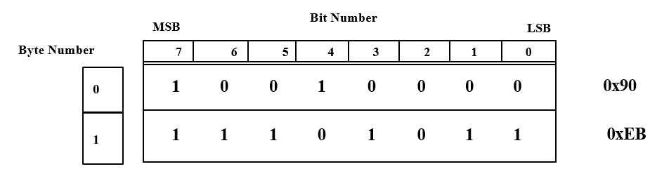

**Figure A-9: Sending Modem States**

> The sending process from the DTE to the modem shall proceed as follows:

1.  Before sending a TRANSMIT\_ARM command packet to the modem, the DTE should wait until it receives a transmit status packet from the modem indicating a FLUSHED state. If a TRANSIMIT \_ARM command packet is sent when the modem is not in the FLUSHED state, the modem shall send a Transmit Status Packet to the DTE indicating the modem's current state.

2.  The DTE sends a TRANSMIT\_ARM packet to the modem to rum the modem's transmit queues.

3.  The modem shall respond with a transmit status packet of either (see A.5**.1.1.**7) QUEUES\_ARMED\_AND \_PORT\_NOT\_READY or QUEUES\_ARMED \_AND \_PORT\_READY if the packet is accepted. Otherwise, repeat from step 1.

4.  The DTE sends at least three blocking factors of data packets to pre-fill the modem's interleaver queue (waveform and Ethernet link jitter dependent). Data packets shall be sent using proper packet order as described in A.5.1.1.5. The DTE may send fewer than three blocking factors of data packets if a FIRST\_AND\_LAST or a LAST packet is sent.

5.  The DTE sends a TRANSMIT\_START packet after receiving a transmit status packet with QUEUES\_ARMED\_AND\_PORT\_READY state to start the transmission.

6.  If the transmission has started, the modem shall respond with a transmit status packet with state STARTED.

7.  The DTE should wait for a TRANSMIT\_STATUS packet to arrive from the modem. If the state of the packet is not STARTED, the DTE should wait at least 10 milliseconds and repeat step 5. This may happen when the modem is in receive-master half-duplex mode (see A.5.1.2.7).

8.  When the modem is in the STARTED or DRAINING state, it shall send transmit status packets to the DTE indicating the number of queued bytes and number of spaces for bytes in the modem’s transmitter’s queue at least every 2 seconds.

9.  At any time, the client may request a transmit status packet by sending a Request Tx Status packet.

10. Data packets that are in transit to the modem are not included in the calculation of the queue size. Packets shall not be inserted into the queue if the number of free bytes in the queue is less than the maximum packet data size. This shall cause the TCP socket on the DTE to block until the modem’s queue frees up.

11. If the critical bytes parameter of the transmit setup packet is non-zero, the modem shall receive from the DTE at least that number of bytes before the critical milliseconds parameter expires, or the modem shall transition into a DRAINING\_FORCED state. This shall cause the modem to send a TRANSMIT\_UNDERRUN Tx Data NACK packet to the DTE.

12. When the modem is in the STARTED state, if a packet is processed with the packet order set to ORDER\_FIRST\_AND\_LAST or ORDER\_LAST, and if the modem transmitter has not transitioned into a DRAINING\_FORCED state, transmit status packets shall be issued with the DRAINING\_OK state.

13. After the modem transmitter has finished sending all the user data to the DTE, the modem transmitter shall transition into the FLUSHED state.

> While in any state shown in Figure A-9, if the TCP connection is terminated by either the DTE or the modem (from an error or a timeout), the modem transmitter shall immediately transition into the DISCONNECTED state.

1.  Full Duplex Modem Receiver Operation

> The Initial Connection handshake must be successfully completed before data can be sent from the modem to the DTE.
>
> 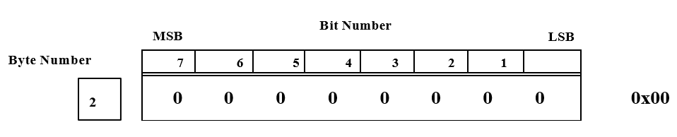

**Figure A-10: Receiving Modem States**

> The receiving process at the DTE shall proceed as follows:

1.  When the modem receiver is in a sync-acquire phase, at least one Canier Detect packet shall be sent to the DTE with the canier state set to NO\_CARRIER. The data rate and blocking factor shall be set to 0.

2.  When the modem receiver has fully detected a preamble, the modem shall issue a Canier Detect packet with the canier state set to CARRIER\_DETECTED. The data rate and blocking factor shall be set to the detected values of the received waveform.

3.  Once data is available, the modem shall begin sending data packets (fust packet's order is either FIRST\_AND\_LAST for single packet or FIRST\_ONLY).

4.  If available, any additional data packets shall be sent with the CONTINUATION order flag set.

5.  ln a multi-packet transfer, the last packet (potentially zero data bytes) shall be marked as LAST packet.

6.  When the modem is in the RECEIVING state, to cancel a reception and force the modem to return to the sync-acquire phase, the DTE may send an ABORT\_RECEPTION packet to the modem. This shall force the modem to send a LAST packet and transition into the NO\_CARRIER state until it can resynchronize on the stream.

7.  Once an end of message condition has been detected on the modem receiver a Canier Detect packet shall be sent to the DTE with state set to NO\_CARRIER. The data rate and blocking factor shall be set to 0. This may happen before or after the last data packet is delivered to the DTE.

> While in any states shown in Figure A-10, if the TCP connection is terminated by either the DTE or the modem (from an error or a timeout), the modem receiver shall immediately transition into the DISCONNECTED state.

1.  <u>Half Duplex Operation</u>.

> In addition to the Full-Duplex receiver and transmitter operation described in A.5.1.2.5 and A.5.1.2.6, half-duplex operation shall also be supported. In half-duplex mode, the modem shall only be able to receive or transmit at any one time (not both at the same time). In addition, the modem shall also support the following two modes of operation when operating in half-duplex mode:

1.  Transmitter Master

2.  Receiver Master

    1.  <u>Half Duplex Transmitter Master</u>

> When in half-duplex transmitter master mode, the modem shall prioritize the transmitter operation.
>
> If a reception is currently in progress (CARRIER\_DETECTED or RECEIVING states from Figure A-10), and the transmitter is in the FLUSHED state (see Figure A-9), the DTE may send a TRANSMIT\_ARM command and initiate a transfer as shown in A.5.1.2.5. Once the modem is transitioned into the STARTED state, the modem receiver shall immediately return to the NO CARRIER state (see Figure A-10), which shall abort the reception. The modem shall then send a LAST data packet to the DTE and send a Carrier Detect packet with state set to NO\_CARRIER to the DTE.
>
> While the modem transmitter is in the STARTED, DRAINING\_OK or DRAINING\_FORCED states (Figure A-9), the modem receiver shall remain in the NO\_CARRIER state (Figure A-10).

1.  <u>Half Duplex Receiver Master</u>

> When in half-duplex receiver master mode, the modem shall prioritize the receiver operation if a transmission is not currently in progress.
>
> If a reception is currently in progress (CARRIER\_DETECTED or RECEIVING states from Figure A-10), and the transmitter is in the FLUSHED state (see Figure A-9), the DTE may send a TRANSMIT\_ARM command to the modem. While the modem reception is in progress, the modem shall transition into the QUEUES\_ARMED\_AND\_PORT\_NOT\_READY state and remain in that state until the modem receiver transitions into the NO\_CARRIER state.
>
> While the modem is in the QUEUES\_ARMED\_AND\_PORT\_NOT\_READY state, the DTE may send data packets to be queued onto the modem but may not send a TRANSMIT\_START command to the modem. If the DTE sends a TRANSMIT\_START command to the modem, the modem shall send another Transmit Status packet with state set to QUEUES\_ARMED\_AND\_PORT\_NOT\_READY to the DTE. In this case, once the modem receiver transitions into the NO\_CARRIER state, the modem shall send a Transmit Status packet with state set to QUEUES\_ARMED\_AND\_PORT\_READY to the DTE. The DTE may then send a TRANSFER\_STARTED command to the modem and perform a data transfer as shown in A.5.1.2.5.
>
> The receiver master mode shall only prevent the modem from transitioning into the STARTED state while the receiver is in the CARRIER\_DETECTED or RECEIVING state. Once the modem transmitter is in the STARTED, DRAINING\_OK or DRAINING\_FORCED states (see Figure A-9), the modem receiver shall remain in the NO\_CARRIER state (see Figure A-10).

1.  <u>Data Socket Modes</u>

> The TCP data socket interface (TDSI) supports both synchronous and asynchronous operation. The differences between the two data modes are explained in this section. The mode of operation is specified by the modem and is sent to the DTE during the connection handshake.

1.  <u>Synchronous</u>

> While the TDSI is in the synchronous mode of operation the data shall be transferred from the DTE to the modem at the specified data rate to prevent the modem from going into a TRANSMIT\_UNDERRUN state. The data is also not byte-synchronized in this mode of operation, which means that the DTE shall perform bit-synchronization to byte-align the received data stream.

1.  <u>Asynchronous</u>

> The asynchronous mode of operation supports two sub-modes of operation:

1.  Standard Mode: All asynchronous data bits are transmitted over the air

2.  Data Only Mode: Only the data bits are transmitted over the air

    1.  <u>Asynchronous Standard Mode (Send-All)</u>

> When the Async Data Mode is set to STANDARD MODE, the sending modem shall convert the data stream into an asynchronous bit stream (adding start bits, stop bits and parity bits) with the specified settings before sending the data over the air. The receiving modem shall decode the received asynchronous stream from the air and convert it to a standard data stream before sending it to the DTE.
>
> In this mode, the DTE does not have to keep a steady data stream to the modem. If the modem’s transmit queues are emptied, it shall transmit stop bits over the air until more data is available for transmission up to a user specified keep-alive time. If no data is received by the modem for a period longer than the keep-alive time, the modem shall transition into a TRANSMIT\_UNDERRUN state.
>
> Data is always exchanged in the data packets using 8-bit byte alignment. If the ASYNC DATA BITS parameter is set to N DATA BITS, where N is less than 8, the least significant N bits of each 8-bit data bytes of the Data Payload shall be used for the OTA stream.

1.  <u>Asynchronous Data-Only Mode</u>

> When the Async Data Mode is set to DATA ONLY MODE, only the data bits are transmitted over the air. In this mode, the ASYNC DATA BITS shall be 8 DATA BITS and the ASYNC
>
> PARITY shall be NO PARITY. Since no control bits are sent over the air, the data shall be transferred from the DTE to the modem at the specified data rate to prevent the modem from going into a TRANSMIT\_UNDERRUN state.
>
> The difference between asynchronous DATA ONLY MODE and synchronous is that for async mode, the modem receiver does not need to buffer data at the start of a reception before sending it to the DTE. The data is sent directly to the DTE as it is decoded from the waveform. For the synchronous mode, the modem shall buffer the data to keep the constant data rate specified by the receiving waveform before starting the data stream to the DTE.

1.  <u>UDP socket interface (UDSI)</u>.

    1.  <u>Control connection</u>.

> UDP packets shall not be exchanged between the DTE and modem until a TCP Remote Control Interface (RCI) connection is established from the DTE to the modem. The RCI connection shall be used by the modem to obtain the DTE source address and port number that will be used for the UDP data stream. The protocol used for the RCI is beyond the scope of this appendix.

1.  <u>UDP socket interface packet format</u>.

> Each UDP packet exchanged between the DTE and the modem shall consist of a 4-byte header, optionally followed by a variable-length payload. A 16 bit CRC shall be appended to the end of each packet. The total packet length, including the 2 byte CRC, shall be less than or equal to 1226 bytes; at most 1220 payload bytes may be sent in a single packet.

<table>
<colgroup>
<col style="width: 16%" />
<col style="width: 69%" />
<col style="width: 14%" />
</colgroup>
<thead>
<tr class="header">
<th><blockquote>

Packet

Header (4 bytes)

</blockquote></th>
<th>
Payload

(0 to 1220 bytes)
</th>
<th><blockquote>

Packet CRC

(16 bits)

</blockquote></th>
</tr>
</thead>
<tbody>
</tbody>
</table>

### Figure A-11: UDSI packet format

> The payload length may be inferred from the packet type (see Table A-X). The Packet CRC shall be computed (see A.5.3) for the Packet Header bytes and Payload Bytes (if present).

1.  <u>UDP socket interface packet header format</u>.

> Each packet shall begin with a header consisting of the following fields:

<table>
<colgroup>
<col style="width: 15%" />
<col style="width: 17%" />
<col style="width: 66%" />
</colgroup>
<thead>
<tr class="header">
<th><blockquote>

Version

(4 bits)

</blockquote></th>
<th><blockquote>

Packet Type

(4 bits)

</blockquote></th>
<th><blockquote>

Session Identification

(24 bits)

</blockquote></th>
</tr>
</thead>
<tbody>
</tbody>
</table>

**Figure A-12: Packet Header Format**

> The header shall begin with a 4-bit version number set to 1. Only packets with the version number field set to 1 shall be processed.
>
> A 4-bit Packet Type field shall follow the Preamble. Valid values for the Packet Type field values are listed in Table A-X. Values not specified in Table A-X shall not be sent, and shall result in an Enor response if received.

**Table A-X: Packet Type Byte Values**

<table>
<colgroup>
<col style="width: 9%" />
<col style="width: 17%" />
<col style="width: 37%" />
<col style="width: 13%" />
<col style="width: 12%" />
<col style="width: 10%" />
</colgroup>
<thead>
<tr class="header">
<th><blockquote>

<strong>Packet Type</strong>

</blockquote></th>
<th><blockquote>

<strong>Packet Type Name</strong>

</blockquote></th>
<th><blockquote>

<strong>Description</strong>

</blockquote></th>
<th><blockquote>

<strong>Details</strong>

</blockquote></th>
<th><blockquote>

<strong>Payload Size</strong>

</blockquote></th>
<th><blockquote>

<strong>Sent By</strong>

</blockquote></th>
</tr>
</thead>
<tbody>
<tr class="odd">
<td><blockquote>

1

</blockquote></td>
<td><blockquote>

PING

REQUEST

</blockquote></td>
<td><blockquote>

Connection Keep-Alive

</blockquote></td>
<td></td>
<td><blockquote>

0 bytes

</blockquote></td>
<td><blockquote>

Both

</blockquote></td>
</tr>
<tr class="even">
<td><blockquote>

2

</blockquote></td>
<td><blockquote>

PINGREPLY

</blockquote></td>
<td><blockquote>

Connection Keep-Alive Reply

</blockquote></td>
<td></td>
<td><blockquote>

0 bytes

</blockquote></td>
<td><blockquote>

Both

</blockquote></td>
</tr>
<tr class="odd">
<td><blockquote>

3

</blockquote></td>
<td><blockquote>

STATUS REQUEST

</blockquote></td>
<td><blockquote>

Force the transmission of a modem status packet

</blockquote></td>
<td></td>
<td><blockquote>

0 bytes

</blockquote></td>
<td><blockquote>

DTE

</blockquote></td>
</tr>
<tr class="even">
<td><blockquote>

4

</blockquote></td>
<td><blockquote>

STATUS REPLY

</blockquote></td>
<td><blockquote>

Transfer, error, state, link quality, modem buffer and tx and 1x wavefo1m data rate info

</blockquote></td>
<td><blockquote>

A.5.2.4.1

</blockquote></td>
<td><blockquote>

32 bytes

</blockquote></td>
<td><blockquote>

Modem

</blockquote></td>
</tr>
<tr class="odd">
<td><blockquote>

5

</blockquote></td>
<td><blockquote>

ENCODED DATA

</blockquote></td>
<td><blockquote>

FEC Encoded Data Packet

</blockquote></td>
<td><blockquote>

A.5.2.4.2

</blockquote></td>
<td><blockquote>

16 bytes + data

</blockquote></td>
<td><blockquote>

Both

</blockquote></td>
</tr>
<tr class="even">
<td><blockquote>

6

</blockquote></td>
<td><blockquote>

ENHANCED ENCODED DATA

</blockquote></td>
<td><blockquote>

FEC Encoded Data Packet with data rate information

</blockquote></td>
<td><blockquote>

A.5.2.4.3

</blockquote></td>
<td><blockquote>

20 bytes + data

</blockquote></td>
<td><blockquote>

Modem

</blockquote></td>
</tr>
<tr class="odd">
<td><blockquote>

7

</blockquote></td>
<td><blockquote>

MODEM COMMAND REQUEST

</blockquote></td>
<td><blockquote>

Reliable Modem Command Request

</blockquote></td>
<td><blockquote>

A.5.2.4.4

</blockquote></td>
<td><blockquote>

4 bytes

</blockquote></td>
<td><blockquote>

DTE

</blockquote></td>
</tr>
<tr class="even">
<td><blockquote>

8

</blockquote></td>
<td><blockquote>

MODEM COMMAND ACK

</blockquote></td>
<td><blockquote>

Modem Command Request Acknowledgement

</blockquote></td>
<td><blockquote>

A.5.2.4.5

</blockquote></td>
<td><blockquote>

4 bytes

</blockquote></td>
<td><blockquote>

Modem

</blockquote></td>
</tr>
</tbody>
</table>

> The Packet Type field shall be followed by a pseudo-random 24-bit Session Identification number, which shall be selected by the initiating device before the initial connection exchange. When the modem configuration changes the modem may increment this number, thus notifying the DTE that a new session has started. The DTE may also change this number to force a resynchronization on the modem side.

1.  <u>Packet types</u>.

    1.  <u>Status reply payload</u>.

> (Sent from modem to DTE only.) This message shall be sent by the modem when the state of any field changes or if a Status Reply packet has not been sent for 500 milliseconds. The DTE may also request a transmission of this packet from the modem by sending a STATUS\_ REQUEST packet.

<table>
<colgroup>
<col style="width: 24%" />
<col style="width: 25%" />
<col style="width: 12%" />
<col style="width: 12%" />
<col style="width: 12%" />
<col style="width: 12%" />
</colgroup>
<thead>
<tr class="header">
<th><blockquote>

Packet Sequence Number

(16 bits)

</blockquote></th>
<th><blockquote>

Current Transfer Identification

(16 bit)

</blockquote></th>
<th colspan="2"><blockquote>

Reserved

(16 bits)

</blockquote></th>
<th><blockquote>

Error Vector

(8 bits)

</blockquote></th>
<th><blockquote>

Status Vector

(8 bits)

</blockquote></th>
</tr>
</thead>
<tbody>
<tr class="odd">
<td><blockquote>

Packets Dropped

(16 bits)

</blockquote></td>
<td><blockquote>

Jitter

(16 bits)

</blockquote></td>
<td colspan="4"><blockquote>

Transmit Queue Fill

(32 bits)

</blockquote></td>
</tr>
<tr class="even">
<td colspan="2"><blockquote>

Transmit Queue Space

(32 bits)

</blockquote></td>
<td colspan="3"><blockquote>

OTA Receive Bit Rate

(24 bits)

</blockquote></td>
<td><blockquote>

MSB of next field

</blockquote></td>
</tr>
<tr class="odd">
<td><blockquote>

OTA Receive Blocking Factor

(24 bits)

</blockquote></td>
<td colspan="2"><blockquote>

OTA Transmit Bit Rate

(24 bits)

</blockquote></td>
<td colspan="3"><blockquote>

OTA Transmit Blocking Factor

(24 bits)

</blockquote></td>
</tr>
</tbody>
</table>

### Figure A-13: Status Reply Payload Format

> <u>Packet Sequence Number</u> (16-bit number sent in network byte order): The modem shall increment the sequence number of the status packet for every successive packet. The Packet sequence number shall be computed modulo 65536 so that 0xFFFF, when incremented by 1 shall become 0. This shall be used by the DTE to detect out-of-order and duplicate status packets. The DTE shall calculate the modulo 65536 differences between the packet sequence number and the last received status sequence number. If this difference is less than zero when treated as a signed 16 bit value, the DTE shall ignore the status packet. This results in packets being ignored if the sequence number falls within the 0xFFFF/2 values previous to the last received sequence number. The DTE shall always accept the first status packet.
>
> <u>Current Transfer Identification</u> (16-bit number sent in network byte order): The transfer ID shall be used by the DTE to identify which transfer the status packet pertains to, when sending many short transfers over a long latency network.
>
> The modem shall set the current transfer identification number of the status packet to the transfer ID of the current transmission.
>
> <u>Reserved</u>: This field shall be set to 0
>
> The Error Vector shall be a bit field formatted as follows:

<table>
<colgroup>
<col style="width: 38%" />
<col style="width: 12%" />
<col style="width: 12%" />
<col style="width: 12%" />
<col style="width: 12%" />
<col style="width: 11%" />
</colgroup>
<thead>
<tr class="header">
<th><blockquote>

Reserved

(bits 7-5)

</blockquote></th>
<th><blockquote>

Not in Control

(bit 4)

</blockquote></th>
<th>
Rx Underrun

(bit 3)
</th>
<th><blockquote>

Rx Overrun

(bit 2)

</blockquote></th>
<th>
Tx Underrun

(bit 1)
</th>
<th><blockquote>

Tx Overrun

(bit 0)

</blockquote></th>
</tr>
</thead>
<tbody>
</tbody>
</table>

> **Figure A-1.4: Error Vector Format**
>
> When the modem is not in an error state all bits in this vector shall be 0. The reserved bits shall always be 0. The following table provides a description of the error bits:
>
> **Table A-XI: Error Vector Bit Values**

<table>
<colgroup>
<col style="width: 8%" />
<col style="width: 20%" />
<col style="width: 70%" />
</colgroup>
<thead>
<tr class="header">
<th><blockquote>

<strong>Bit</strong>

</blockquote></th>
<th><blockquote>

<strong>Bit Name</strong>

</blockquote></th>
<th><blockquote>

<strong>Description</strong>

</blockquote></th>
</tr>
</thead>
<tbody>
<tr class="odd">
<td><blockquote>

0

</blockquote></td>
<td><blockquote>

TX OVERRUN

</blockquote></td>
<td><blockquote>

When set to 1, The modem's transmit buffers have overflowed. This happens when the DTE sends data to the modem too fast. The transfer will be terminated and the modem's transmitter will return to the FLUSHED state

</blockquote></td>
</tr>
<tr class="even">
<td><blockquote>

1

</blockquote></td>
<td><blockquote>

TX UNDERRUN

</blockquote></td>
<td><blockquote>

When set to 1, The modem's transmitter buffers have emptied unexpectedly. This happens when the DTE does not send data fast enough to the modem. The transfer will be terminated and the modem's transmitter will return to the FLUSHED state

</blockquote></td>
</tr>
<tr class="odd">
<td><blockquote>

2

</blockquote></td>
<td><blockquote>

RX OVERRUN

</blockquote></td>
<td><blockquote>

When set to l, The modem's receive buffers have overflowed. This should not happen during normal operation

</blockquote></td>
</tr>
<tr class="even">
<td><blockquote>

3

</blockquote></td>
<td><blockquote>

RX UNDERRUN

</blockquote></td>
<td><blockquote>

When set to l, The modem's receive buffers have emptied unexpectedly. This should not happen during normal operation

</blockquote></td>
</tr>
<tr class="odd">
<td><blockquote>

4

</blockquote></td>
<td><blockquote>

NOT IN CONTROL

</blockquote></td>
<td><blockquote>

When set to l, The modem has received data from the DTE but the DTE does not have "Control Mode" enabled on the RCI connection. No data will be accepted by the modem

</blockquote></td>
</tr>
</tbody>
</table>

> The Status Vector shall be a bit field formatted as follows:

<table>
<colgroup>
<col style="width: 12%" />
<col style="width: 25%" />
<col style="width: 18%" />
<col style="width: 27%" />
<col style="width: 15%" />
</colgroup>
<thead>
<tr class="header">
<th><blockquote>

Reserved

(bit 7)

</blockquote></th>
<th><blockquote>

Receiver State

(bits 6-5)

</blockquote></th>
<th><blockquote>

Carrier Detect

(bit 4)

</blockquote></th>
<th>
Transmitter State

(bits 3-1)
</th>
<th><blockquote>

In Control

(bit 0)

</blockquote></th>
</tr>
</thead>
<tbody>
</tbody>
</table>

> **Figure A-15: Status Vector Format**
>
> The reserved bits shall always be 0.
>
> The following table provides a. description of the status bits:

**Table A-XII: Status Vector Bit Values**

<table>
<colgroup>
<col style="width: 9%" />
<col style="width: 20%" />
<col style="width: 69%" />
</colgroup>
<thead>
<tr class="header">
<th><blockquote>

<strong>Bit(s)</strong>

</blockquote></th>
<th><blockquote>

<strong>Bit Name</strong>

</blockquote></th>
<th><blockquote>

<strong>Description</strong>

</blockquote></th>
</tr>
</thead>
<tbody>
<tr class="odd">
<td><blockquote>

6-5

</blockquote></td>
<td><blockquote>

RECEIVER STATE

</blockquote></td>
<td><blockquote>

2-bit value (MSB is bit 6): Reflects the current state of the modem receiver (see Table A-XIII)

</blockquote></td>
</tr>
<tr class="even">
<td><blockquote>

4

</blockquote></td>
<td><blockquote>

CARRIER DETECT

</blockquote></td>
<td><blockquote>

When set to 1, the modem's receiver has synchronized on a preamble or is processing data from the air

</blockquote></td>
</tr>
<tr class="odd">
<td><blockquote>

3-1

</blockquote></td>
<td><blockquote>

TRANSMITTER STATE

</blockquote></td>
<td><blockquote>

3-bit value (MSB is bit 3): Reflects the current state of the modem transmitter (see Table A-XIV)

</blockquote></td>
</tr>
<tr class="even">
<td><blockquote>

0

</blockquote></td>
<td><blockquote>

ln Control

</blockquote></td>
<td><blockquote>

When set to 1, the modem has received the "Control Mode" request from the DTE on its RCI connection. The client may now send data to the modem

</blockquote></td>
</tr>
</tbody>
</table>

**Table A-XIII: Status Vector Receiver State Values**

<table>
<colgroup>
<col style="width: 9%" />
<col style="width: 20%" />
<col style="width: 69%" />
</colgroup>
<thead>
<tr class="header">
<th><blockquote>

<strong>Bit Value</strong>

</blockquote></th>
<th><blockquote>

<strong>Status Name</strong>

</blockquote></th>
<th><blockquote>

<strong>Description</strong>

</blockquote></th>
</tr>
</thead>
<tbody>
<tr class="odd">
<td><blockquote>

00

</blockquote></td>
<td><blockquote>

FLUSHED

</blockquote></td>
<td><blockquote>

Modem Receiver is flushed (Idle)

</blockquote></td>
</tr>
<tr class="even">
<td><blockquote>

01

</blockquote></td>
<td><blockquote>

STARTED

</blockquote></td>
<td><blockquote>

Modem Receiver has started processing user data

</blockquote></td>
</tr>
</tbody>
</table>

**Table A-XIV: Status Vector Transmitter State Values**

<table>
<colgroup>
<col style="width: 9%" />
<col style="width: 20%" />
<col style="width: 69%" />
</colgroup>
<thead>
<tr class="header">
<th><blockquote>

<strong>Bit Value</strong>

</blockquote></th>
<th><blockquote>

<strong>Status Name</strong>

</blockquote></th>
<th><blockquote>

<strong>Description</strong>

</blockquote></th>
</tr>
</thead>
<tbody>
<tr class="odd">
<td><blockquote>

000

</blockquote></td>
<td><blockquote>

FLUSHED

</blockquote></td>
<td><blockquote>

Modem Transmitter flushed (Idle)

</blockquote></td>
</tr>
<tr class="even">
<td><blockquote>

001

</blockquote></td>
<td><blockquote>

QUEUEING

</blockquote></td>
<td><blockquote>

Modem Transmitter has started receiving data from the DTE but has not started OTA transmission yet

</blockquote></td>
</tr>
<tr class="odd">
<td><blockquote>

010

</blockquote></td>
<td><blockquote>

STARTED

</blockquote></td>
<td><blockquote>

Modem Transmitter has started OTA transmission

</blockquote></td>
</tr>
<tr class="even">
<td><blockquote>

011

</blockquote></td>
<td><blockquote>

DRAINING

</blockquote></td>
<td><blockquote>

Modem Transmitter is in a drain phase in response to a "Last" type data packet, an underrun condition or an unrecoverable data error (too many missed packets)

</blockquote></td>
</tr>
</tbody>
</table>

> Packets Dropped (16-bit number sent in network byte order): The number of packets that have been missed (dropped) by the modem for the current transmission. Packets are dropped either because of a network error (packet error) or because the packet arrives late. The dropped packets are recovered by the modem (using FEC) unless the modem transmitter has unexpectedly changed to a DRAINING state. This value may be used by the DTE as an Ethernet link quality value.
>
> <u>Jitter</u>: The Ethernet packet jitter in milliseconds as seen by the modem for the current transmission. This value shall be the standard deviation of: the inter-packet arrival time minus the expected arrival time (uses the packet timestamp for calculations). This value is calculated over a window of 100 packets and is based on the standard deviation of the difference between the time of reception of a packet and the timestamp in the packet.
>
> <u>Transmit Queue Fill</u>: Space in bytes used in the transmitter serial queue. <u>Transmit Queue Space</u>: Space in bytes available in the transmitter serial queue.
>
> <u>OTA Receive Bit Rate</u>: Over-the-air data rate in bits per second of the received signal.
>
> <u>OTA Receive Blocking Factor</u>: Chunk size in bits of the received signal. This value is tied to the interleaver length of the receive signal of most waveforms. Data shall be written to the DTE in data chunks equal to this value.
>
> <u>OTA Transmit Bit Rate</u>: Over-the-air data rate in bits per second of the transmitter waveform.
>
> <u>OTA Transmit Blocking Factor</u>: Chunk size in bits of the transmitter waveform. This value is tied to the interleaver length of the transmit signal of most waveforms. Data shall be written to the DTE in data chunks equal to this value.
>
> <u>Encoded data payload</u>.
>
> Between 0 and 1200 bytes of FEC/interleaved data may be sent to/from the modem using an encoded data payload (see A.5.2.5 for more information on the FEC/Interleaver scheme). If N is the number of data bytes to be sent, the 16 + N information bytes of a data packet shall consist of:
>
> 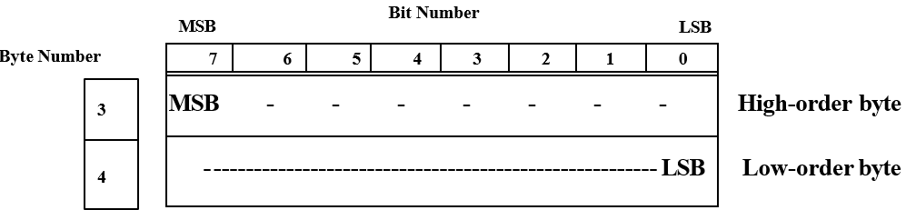
>
> Figure A-16: Encoded Data Payload Format
>
> Transfer Identification (16-bit number sent in network byte order): A pseudo-random number shall be selected and maintained for the duration of a transfer. This number shall be incremented every time a new transfer is started. The transfer identification number shall be computed modulo 65536 so that 0xFFFF, when incremented by 1 shall become 0.
>
> Packet Sequence Number (16-bit number sent in network byte order): Each successive encoded data packet has an incremented sequence number associated to it. The packet sequence number shall be computed modulo 65536 so that OxFFFF, when incremented by I shall become 0. This number is initialized to 0 for each new transfer. This is used by the DTE and modem to detect duplicate data packets and reorder out-of-order packets.
>
> The Control Vector is a bit field as follows:
>
> 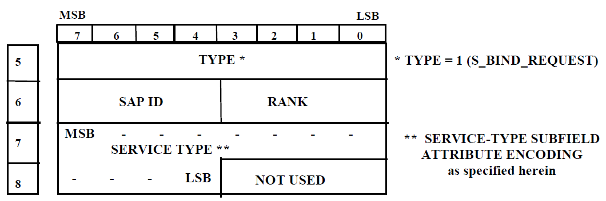
>
> **Figure A-17: Control Vector Format**
>
> The reserved bits shall always be 0. The following table provides an explanation of the control bits:

**Table A-XV: Control Vector Bit Values**

<table>
<colgroup>
<col style="width: 9%" />
<col style="width: 34%" />
<col style="width: 55%" />
</colgroup>
<thead>
<tr class="header">
<th><blockquote>

<strong>Bit</strong>

</blockquote></th>
<th><blockquote>

<strong>Bit Name</strong>

</blockquote></th>
<th><blockquote>

<strong>Description</strong>

</blockquote></th>
</tr>
</thead>
<tbody>
<tr class="odd">
<td><blockquote>

2

</blockquote></td>
<td><blockquote>

HOLD OFF FLAG

</blockquote></td>
<td><blockquote>

May be used by the DTE to affect the modem's auto-prebuffer handling (default 0 for auto-prebuffer handling). See A.5.2.6.5.

</blockquote></td>
</tr>
<tr class="even">
<td><blockquote>

1

</blockquote></td>
<td><blockquote>

LAST INTERLEAVER SET

</blockquote></td>
<td><blockquote>

When set to <strong>1,</strong> this packet belongs to the last interleaver set of a transfer. An interleaver set is defined as <strong>N</strong> packets, where <strong>N</strong> is the FEC N value.

</blockquote></td>
</tr>
<tr class="odd">
<td><blockquote>

0

</blockquote></td>
<td><blockquote>

FIRST INTERLEAVER SET

</blockquote></td>
<td><blockquote>

When set to <strong>1,</strong> this packet belongs to the first interleaver set of a transfer

</blockquote></td>
</tr>
</tbody>
</table>

> FEC Type (4-bits): The UDP data socket currently only supports the "Reed Solomon with Erasures" (see A.5.2.5) FEC Type, which is type 1. Only packets with FEC Type set to 1 shall be accepted.
>
> Interleaver Type (4-bits): The UDP data socket currently only suppo11s the "Standard FEC-matched byte-wise Interleaver" Interleaver Type, which is type 1. Only packets with Interleaver Type set to 1 shall be accepted.
>
> FEC N Value (8-bits): The total number of bytes per FEC codeword.
>
> <u>FEC *K* Value</u> (8-bits): The number of user bytes per FEC codeword.
>
> <u>Data Length</u> (16-bit number sent in network byte order): The number of data bytes stored in the Encoded Data Payload packet (immediately following the Timestamp bytes).
>
> <u>Reserved</u>: This field shall be set to 0
>
> <u>Timestamp</u> field shall indicate the A timestamp in milliseconds taken at the source just before the packet is sent to the UDP socket. The timestamp may be calculated from the system time as follows:
>
> struct timeval tv; unsigned int nTimestamp;
>
> gettimeofday(&tv, NULL);
>
> nTimestamp = ((tv.tv\_sec % 3600) \* 1000000) + tv.tv\_usec;
>
> A.5.2.4.3 <u>Enhanced encoded data payload</u>.
>
> (Sent from modem to DTE only) Between 0 and 1200 bytes of FEC/interleaved data may be sent to/from the modem using an enhanced encoded data payload (see A.5.2.5 for more information on the FEC/Interleaver scheme). If *N* is the number of data bytes to be sent, the 20 + *N* information bytes of a data packet consist of:
>
> 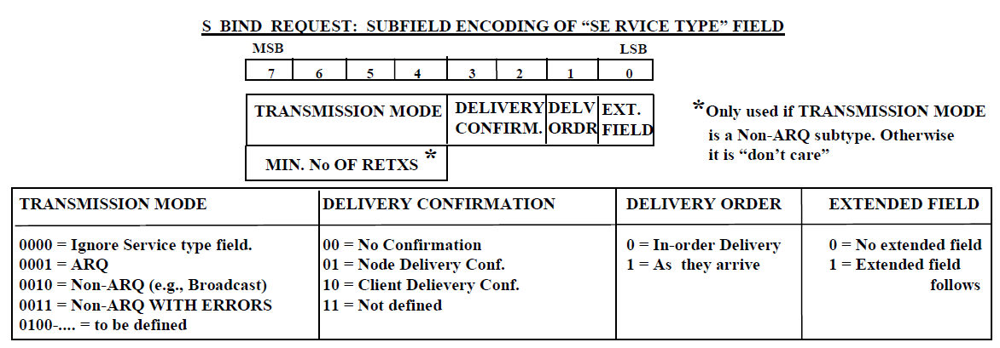
>
> FigureA-18: Encoded Data Payload Format
>
> The Enhanced Encoded Data Payload has all the same fields as the Encoded Data Payload. Extra fields are provided to supply data rate information. The modem shall send an interleaver set of Extended Encoded Data packets at the start of each transfer and continue with Encoded Data packets if required.
>
> See A.5.2.4.2 for descriptions of the following fields:

-   Transfer Identification

-   Packet Sequence Number

-   Control Vector

-   FEC Type

-   Interleaver Type

-   FEC *N* Value

-   FEC *K* Value

-   Data Length

-   Timestamp

> <u>Data Bit Rate</u> (24-bit number sent in network byte order): Data rate in bits per second of the received data stream. This value shall not change for the remainder of the transfer.
>
> <u>Data Blocking Factor</u> (24-bit number sent in network byte order): Chunk size in bits of the received signal. This value is tied to the interleaver length of the receive signal of most waveforms. Data shall be written to the DTE in data chunks equal to this value. This value shall not change for the remainder of the transfer.
>
> <u>Modem command request payload</u>.
>
> (Sent from DTE to Modem only) This packet may be sent by the DTE to instruct the modem to execute a particular command. Since this command is reliable, if the DTE does not get a Modem Command ACK packet in response to a Modem Command Request, it shall re-send the command. See A.5.2.6.7.

<table>
<colgroup>
<col style="width: 50%" />
<col style="width: 25%" />
<col style="width: 25%" />
</colgroup>
<thead>
<tr class="header">
<th><blockquote>

Packet Sequence Number

(16 bits)

</blockquote></th>
<th><blockquote>

Command

(8 bits)

</blockquote></th>
<th><blockquote>

Reserved

(8 bits)

</blockquote></th>
</tr>
</thead>
<tbody>
</tbody>
</table>

### FigureA-19: Modem Command Request Payload Format

> <u>Packet Sequence Number</u> (16-bit number sent in network byte order): Each successive encoded Modem Command Request packet shall have an incremented sequence number associated to it. This number shall be initialized to 0 for the first command sent. If a packet is retransmitted, it shall keep the same sequence number as when it was initially transmitted.
>
> The following table shows the list of commands that shall be supplied by the protocol:

**Table A-XVI: Command Byte Values**

<table>
<colgroup>
<col style="width: 9%" />
<col style="width: 20%" />
<col style="width: 69%" />
</colgroup>
<thead>
<tr class="header">
<th><blockquote>

<strong>Byte</strong>

<strong>Value</strong>

</blockquote></th>
<th><blockquote>

<strong>Command Name</strong>

</blockquote></th>
<th><blockquote>

<strong>Description</strong>

</blockquote></th>
</tr>
</thead>
<tbody>
<tr class="odd">
<td><blockquote>

1

</blockquote></td>
<td><blockquote>

ABORT RECEPTION

</blockquote></td>
<td><blockquote>

Force the modem to return to the Sync-Acquire phase. This will cause the modem to issue a LAST packet and switch to a FLUSHED state until it can resynchronize to the stream

</blockquote></td>
</tr>
</tbody>
</table>

> The modem shall ignore command request packets with unsupported command values.
>
> Reserved: This field shall be set to 0
>
> A.5.2.4.5 Modem command acknowledgement payload.
>
> (Sent from Modem to DTE only) This packet shall be sent by the modem in response to a Modem Command Request packet.

<table>
<colgroup>
<col style="width: 50%" />
<col style="width: 49%" />
</colgroup>
<thead>
<tr class="header">
<th>
Packet Sequence Number

(16 bits)
</th>
<th>
Reserved

(16 bits)
</th>
</tr>
</thead>
<tbody>
</tbody>
</table>

> **Figure A-20: Modem Command Acknowledgement Payload Format**
>
> Packet Sequence Number (16-bit number sent in network byte order): The sequence number of the Modem Command Request that is being acknowledged
>
> Reserved: This field shall be set to 0

1.  Data FEC and interleaving.

> A Reed Solomon code is used to encode data so that data from late or missing data packets can be reconstructed by the receiver, whether it is Modem or DTE. Data to be sent are used to fi.11 the data portion of an interleaver block and RS parity symbols are used to fill the remainder of the interleaver block.
>
> The interleaver block is shown pictorially below, where the M \* N symbols of the interleaver block are composed of rows consisting of RS encoded data with N-K parity symbols for each K data symbols. Note that the RS symbol size used, 4 bits, is one nibble or one half of a byte, so that in the diagram below, the cells with diagonal stripes represent the lower nibble of each byte. Data is written into the interleaver in rows. That is, the first row of the interleaver shown below, which contains the first Reed Solomon codeword is f01med fr01n the upper nibble of the first K data bytes. The second row of the interleaver, containing the second Reed Solomon codeword is formed using the lower nibbles of the first K data bytes. Data is transmitted, one interleaver at a time, with data being read out in columns. The precise details are described in this section.
>
> 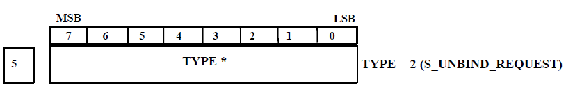
>
> **Figure A-21: FEC Interleaver**
>
> To allow the Modem or DTE to recover from late data packets or data packet losses, the UDSI shall provide forward error correction coding using Shortened Reed-Solomon (RS) error correction coding with erasures using 4-bit symbols, whose generator polynomial is:

> where a is a non zero element of the Galois field (GF)(24) formed as the field of polynomials over GF(2) modulo x4 + x + 1.
>
> For each data stream, an appropriate set of shortened N, shortened K and L parameters is chosen to maximize error recove1y while minimizing the amount of pre-buffering, delay and overhead that is added by using the FEC and Interleaving scheme. The parameters are dependent on the Data Rate and Blocking Factor (tied to the waveform interleaver) of the waveform using the following formula:

**Table A-XVII: FEC Coding Length Table**

<table>
<colgroup>
<col style="width: 44%" />
<col style="width: 7%" />
<col style="width: 8%" />
<col style="width: 19%" />
<col style="width: 19%" />
</colgroup>
<thead>
<tr class="header">
<th><blockquote>

<strong>Data Rate (bps)</strong>

</blockquote></th>
<th><blockquote>

<strong>N</strong>

</blockquote></th>
<th><blockquote>

<strong>K</strong>

</blockquote></th>
<th><blockquote>

<strong>Shortened N</strong>

</blockquote></th>
<th><blockquote>

<strong>Shortened K</strong>

</blockquote></th>
</tr>
</thead>
<tbody>
<tr class="odd">
<td><blockquote>

50 to 2400

</blockquote></td>
<td><blockquote>

15

</blockquote></td>
<td><blockquote>

11

</blockquote></td>
<td><blockquote>

6

</blockquote></td>
<td><blockquote>

2

</blockquote></td>
</tr>
<tr class="even">
<td><blockquote>

3200 to 28800

</blockquote></td>
<td><blockquote>

15

</blockquote></td>
<td><blockquote>

12

</blockquote></td>
<td><blockquote>

7

</blockquote></td>
<td><blockquote>

4

</blockquote></td>
</tr>
<tr class="odd">
<td><blockquote>

32000 to 76800

</blockquote></td>
<td><blockquote>

15

</blockquote></td>
<td><blockquote>

12

</blockquote></td>
<td><blockquote>

8

</blockquote></td>
<td><blockquote>

5

</blockquote></td>
</tr>
</tbody>
</table>

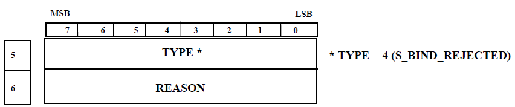

**Figure A-22: Interleaver Length Calculation**

> The sho1iened N value (stored in the data packets as FEC N) is the length in RS Symbols (or nibbles as the symbol size used is 4 bits or one nibble) of each RS codeword (This also translates to the number of data packets in an interleaver set).
>
> The shortened K value (stored in the data packets as FEC K) is the number of user nibbles stored in each RS codeword.
>
> L is the total number of bytes (data and parity) stored in an interleaver set of packets. (L/N) translates to the number of bytes stored in each packet.
>
> The resulting Reed-Solomon codes are spread across N packets. Data packets that are late or lost are flagged as erasures. Using erasures, N-K packet loss may be recovered per interleaver. The user data length of each packet shall be equal to the interleaver length L/N.

1.  FEC and interleaving example.

> Assuming the data stream consists of the bytes {ABCDEFGHIJKLMNOP} the N, K is (7, 4) and L is 14 bytes, the FEC shall be applied to the data stream to as follows:

**Table A-XVIII: Reed-Solomon Table (NEXT FIGURE)**

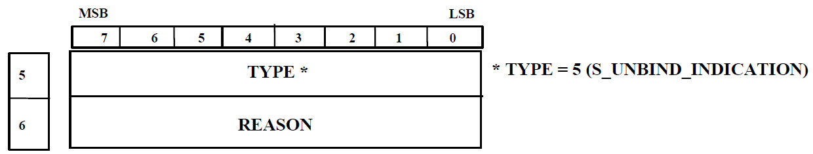

> where capital letters have been used to denote the upper (most significant) nibble of each byte, lower case letters have been used to denote the lower (least significant) nibble of each byte, and upper and lower case X have been used to denote the RS parity symbols constructed from the data symbols in that row. ln the example above the byte stream ABCD is shown as the following set of 4-bit nibbles: AaBbCcDd
>
> The first RS codeword, stored in the most significant 4 bits of each byte, is created from the most significant **4** bits of each user byte (denoted by uppercase letters) resulting in{ XXXABCD}
>
> The second RS codeword, stored in the least significant 4 bits of each byte, is created from the least significant 4 bits of each user byte (denoted by lowercase letters) resulting in{ xxxabcd}
>
> L bytes of RS encoded data are then segmented into an "'interleaver set" of N packets. As such, each data packet shall contain L / N bytes of data (14 / 7 = 2). The fust four rows of Table A-XVIII are shaded to outline the **14** bytes that will be inserted in the first interleaver set of packets. The first black box containing Xx and Xx shows the set of2 bytes that will be inserted in the first data packet. See Table A-XIX for an example showing how the first 7 enhanced encoded data packets shall be created, including the pe1tinent header information:
>
> **Table A-XIX: FEC and Interleaving Example 1**

<table>
<colgroup>
<col style="width: 31%" />
<col style="width: 9%" />
<col style="width: 9%" />
<col style="width: 9%" />
<col style="width: 9%" />
<col style="width: 10%" />
<col style="width: 9%" />
<col style="width: 9%" />
</colgroup>
<thead>
<tr class="header">
<th><blockquote>

<strong>Data Packet Number</strong>

</blockquote></th>
<th><blockquote>

<strong>1</strong>

</blockquote></th>
<th><blockquote>

<strong>2</strong>

</blockquote></th>
<th><blockquote>

<strong>3</strong>

</blockquote></th>
<th><blockquote>

<strong>4</strong>

</blockquote></th>
<th><blockquote>

5

</blockquote></th>
<th><blockquote>

<strong>6</strong>

</blockquote></th>
<th><blockquote>

7

</blockquote></th>
</tr>
</thead>
<tbody>
<tr class="odd">
<td><blockquote>

<strong>Transfer ID</strong>

</blockquote></td>
<td><blockquote>

0

</blockquote></td>
<td><blockquote>

0

</blockquote></td>
<td><blockquote>

0

</blockquote></td>
<td><blockquote>

0

</blockquote></td>
<td><blockquote>

0

</blockquote></td>
<td><blockquote>

0

</blockquote></td>
<td><blockquote>

0

</blockquote></td>
</tr>
<tr class="even">
<td><blockquote>

<strong>Packet Sequence</strong>

</blockquote></td>
<td><blockquote>

0

</blockquote></td>
<td><blockquote>

1

</blockquote></td>
<td><blockquote>

2

</blockquote></td>
<td><blockquote>

3

</blockquote></td>
<td><blockquote>

4

</blockquote></td>
<td><blockquote>

5

</blockquote></td>
<td><blockquote>

6

</blockquote></td>
</tr>
<tr class="odd">
<td><blockquote>

<strong>First Interleaver Set</strong>

</blockquote></td>
<td><blockquote>

1

</blockquote></td>
<td><blockquote>

1

</blockquote></td>
<td><blockquote>

1

</blockquote></td>
<td><blockquote>

<strong>1</strong>

</blockquote></td>
<td><blockquote>

1

</blockquote></td>
<td><blockquote>

1

</blockquote></td>
<td><blockquote>

1

</blockquote></td>
</tr>
<tr class="even">
<td><blockquote>

<strong>Last Interleaver Set</strong>

</blockquote></td>
<td><blockquote>

0

</blockquote></td>
<td><blockquote>

0

</blockquote></td>
<td><blockquote>

0

</blockquote></td>
<td><blockquote>

0

</blockquote></td>
<td><blockquote>

0

</blockquote></td>
<td><blockquote>

0

</blockquote></td>
<td><blockquote>

0

</blockquote></td>
</tr>
<tr class="odd">
<td><blockquote>

<strong>Data Length</strong>

</blockquote></td>
<td><blockquote>

2

</blockquote></td>
<td><blockquote>

2

</blockquote></td>
<td><blockquote>

2

</blockquote></td>
<td><blockquote>

2

</blockquote></td>
<td><blockquote>

2

</blockquote></td>
<td><blockquote>

2

</blockquote></td>
<td><blockquote>

2

</blockquote></td>
</tr>
<tr class="even">
<td><blockquote>

<strong>Data</strong>

</blockquote></td>
<td><blockquote>

XxXx

</blockquote></td>
<td><blockquote>

XxXx

</blockquote></td>
<td><blockquote>

XxXx

</blockquote></td>
<td><blockquote>

AaEe

</blockquote></td>
<td><blockquote>

BbFf

</blockquote></td>
<td><blockquote>

CcGg

</blockquote></td>
<td><blockquote>

DdHh

</blockquote></td>
</tr>
</tbody>
</table>

> The above packets shall be transmitted to the DTE or modem and the remaining data is encoded in the same manner:

**Table A-XX: FEC and Interleaving Example 2**

<table>
<colgroup>
<col style="width: 28%" />
<col style="width: 12%" />
<col style="width: 10%" />
<col style="width: 10%" />
<col style="width: 10%" />
<col style="width: 10%" />
<col style="width: 9%" />
<col style="width: 8%" />
</colgroup>
<thead>
<tr class="header">
<th><blockquote>

<strong>Data Packet Number</strong>

</blockquote></th>
<th><blockquote>

<strong>8</strong>

</blockquote></th>
<th><blockquote>

9

</blockquote></th>
<th><blockquote>

<strong>10</strong>

</blockquote></th>
<th><blockquote>

<strong>11</strong>

</blockquote></th>
<th><blockquote>

<strong>12</strong>

</blockquote></th>
<th><blockquote>

<strong>13</strong>

</blockquote></th>
<th><strong>14</strong></th>
</tr>
</thead>
<tbody>
<tr class="odd">
<td><blockquote>

<strong>Transfer</strong> ID

</blockquote></td>
<td><blockquote>

0

</blockquote></td>
<td><blockquote>

0

</blockquote></td>
<td><blockquote>

0

</blockquote></td>
<td><blockquote>

0

</blockquote></td>
<td><blockquote>

0

</blockquote></td>
<td><blockquote>

0

</blockquote></td>
<td>0</td>
</tr>
<tr class="even">
<td><blockquote>

<strong>Packet Sequence</strong>

</blockquote></td>
<td><blockquote>

7

</blockquote></td>
<td><blockquote>

8

</blockquote></td>
<td><blockquote>

9

</blockquote></td>
<td><blockquote>

10

</blockquote></td>
<td><blockquote>

11

</blockquote></td>
<td><blockquote>

12

</blockquote></td>
<td>13</td>
</tr>
<tr class="odd">
<td><blockquote>

<strong>First Interleaver Set</strong>

</blockquote></td>
<td><blockquote>

0

</blockquote></td>
<td><blockquote>

0

</blockquote></td>
<td><blockquote>

0

</blockquote></td>
<td><blockquote>

0

</blockquote></td>
<td><blockquote>

0

</blockquote></td>
<td><blockquote>

0

</blockquote></td>
<td>0</td>
</tr>
<tr class="even">
<td><blockquote>

<strong>Last Interleaver Set</strong>

</blockquote></td>
<td><blockquote>

1

</blockquote></td>
<td><blockquote>

1

</blockquote></td>
<td><blockquote>

1

</blockquote></td>
<td><blockquote>

1

</blockquote></td>
<td><blockquote>

1

</blockquote></td>
<td><blockquote>

1

</blockquote></td>
<td>1</td>
</tr>
<tr class="odd">
<td><blockquote>

<strong>Data Len2th</strong>

</blockquote></td>
<td><blockquote>

2

</blockquote></td>
<td><blockquote>

2

</blockquote></td>
<td><blockquote>

2

</blockquote></td>
<td><blockquote>

2

</blockquote></td>
<td><blockquote>

2

</blockquote></td>
<td><blockquote>

2

</blockquote></td>
<td>2</td>
</tr>
<tr class="even">
<td><blockquote>

<strong>Data</strong>

</blockquote></td>
<td><blockquote>

XxXx

</blockquote></td>
<td><blockquote>

XxXx

</blockquote></td>
<td><blockquote>

XxXx

</blockquote></td>
<td><blockquote>

IiMm

</blockquote></td>
<td><blockquote>

JjNn

</blockquote></td>
<td><blockquote>

Kk:Oo

</blockquote></td>
<td>LlPp</td>
</tr>
</tbody>
</table>

> Assuming packets 2, and 5 and 6 are late or lost at the receiver, the receiver shall replace the missed code bytes with erasures. In this case since the code length is (7,4), up to 7 - **4** = 3 packets may be lost per interleaver set.
>
> The data received from the First Interleaver Set would look as follows: Codeword pair 1 = {Xx??XxAa????Dd}
>
> Codeword pair 2 = {Xx??XxEe????Hh}
>
> Where the “?” nibbles from the lost packets and are marked as erasures before running each codeword through the RS decoder.
>
> Codeword pair 1 shall be decoded as {AaBbCcDd} and Codeword pair 2 as {EeFfGgHh}.

1.  <u>End of message detection</u>.

> The following EOM string shall be used to delineate the end of the user data portion of a data stream:
>
> {0x4B, 0x65, 0xA5, 0xB2, 0x26, 0xD2, 0xD3, 0x69}
>
> The above string of bytes shall be appended to the end of the user data stream. The bytes shall be added before running the FEC encoder and Interleaver (i.e. the EOM bytes are also FECed). Any remaining bytes (to fill the rest of the last interleaver) shall be padded with 0x00. Note that the EOM string may span multiple interleaver sets. Upon reception, the EOM string and following padding bytes shall be detected and removed from the data stream.

1.  <u>Protocol operation</u>.

    1.  <u>Initial connection operation</u>.

> Since UDP is a connectionless protocol, no connection is required before the data terminal (DTE) can send UDP data to the modem. However, the DTE shall establish a control connection, and obtain write lockout of the modem before sending data. The modem shall use the source address of the control connection to ensure that UDP data is only sent to, and received from a single DTE.

1.  <u>Connection keep-alive</u>.

> As a means to detect network failures, keep-alive ping packets shall be regularly sent from the DTE or the modem. Ping packets shall be sent to the modem at a rate of once every five seconds. The keep-alive packet shall be a PING REQUEST type packet (see A.5.2.1) with no payload (0 bytes).
>
> When any PING REPLY type packet is received by the DTE or Modem, a timeout timer shall be reset. If the timeout timer reaches 30 seconds, the modem shall ignore any further data sent by the DTE and shall abort the current transmission. The modem shall only accept further data sent by the DTE once a PING REPLY is received, or the DTE sends data with a new session ID.

1.  <u>Error handling</u>.

> Packets received containing error(s) in the header or payload CRC shall be ignored. Packets of unrecognized type or incorrect format shall be ignored. Duplicate packets shall also be ignored.
>
> Both the modem and DTE are responsible for re-ordering the packets they receive, and discarding packets that arrive late (after the interleaver set has been decoded).
>
> The modem shall decode interleaver sets as they come, replacing any missing packets with erasures. If **an** interleaver set is unable to be decoded by the modem, an end of message will be sent over the air and the modem will transition to a DRAINING state.
>
> Likewise, the DTE shall determine a maximum time to wait for a packet before considering it lost. This timeout shall be calculated as the amount of time to transmit the user data of the interleaver over the air ((FEC K \* L \* 8 bits/byte)/ over air data rate (bps)), plus the expected latency of the UDP socket, plus the maximum expected jitter of the UDP socket. If the packet is considered lost, the DTE shall replace it with an erasure before performing the FEC decoding.

1.  Modem configuration changes.

> Modifying the modem configuration while the data socket is in use may cause the current transmission to be terminated. When this happens, the modem shall update its session ID, and return to a flushed transmitter state.

1.  Modem transmitter operation.

> The DTE must gain control of the modem before **it** can successfully send data.
>
> 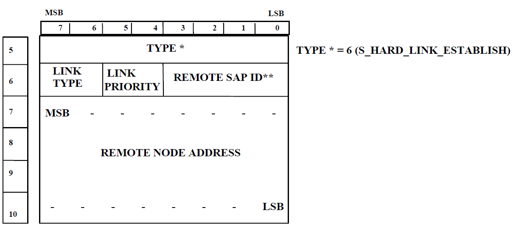

**Figure A-23: Sending Modem States**

> The sending process from the DTE to the modem shall proceed as follows:

1.  Before sending commands, the DTE must wait until it receives a modem transmit status packet from the modem indicating a FLUSHED state.

2.  The Modem will transition to a QUEUEING state when it begins to receive data from the DTE.

3.  The modem will automatically detect when it has enough data queued, and will begin to transmit. At this point, the modem will transition to a STARTED state. The DTE may prevent the modem from automatically starting by setting the hold off flag in the control vector of the encoded data packets. The modem will remain in a queueing state until this flag is cleared (in which case automatic pre-buffer detection resumes) or the last interleaver set is received by the modem (in which case the modem will transition to a draining state).

4.  When the last interleaver set is received by the modem, it will transition into a DRAINING state.

5.  When the modem is in the STARTED or DRAINING state, it shall periodically send status packets to the DTE indicating the number of queued bytes and number of spaces for bytes in the udp receive buffer. The udp receive buffer is a packet based buffer, so all packets are considered to be of max length (1200) for the purposes of the queued/space bytes calculation. The DTE shall use longer interleaver and lower N/K ratios at higher data rates. See Table

> A-XXI for a list of recommended FEC settings.

1.  At anytime, the client may request a status packet by sending a Status Request packet.

2.  Data packets that are in transit to the modem are not included in the calculation of the queue size. Packets will not be inserted into the queue if there is no remaining space in the queue. In this case the packet will be dropped.

3.  The data sent from the DTE to the modem shall be paced such that the amount of user data sent to the modem over a given period of time is equal to the amount of data the modem is capable of sending over air in the same period of time.

4.  If the modem is unable to decode data due to insufficient packets, or too much packet loss, it will force an end of transmission and transition to a DRAINING state.

5.  After the transmitter has finished sending all the radio data, the modem transmitter will transition into the FLUSHED state.

### Table A-XXI: Recommended FEC Settings

<table>
<colgroup>
<col style="width: 35%" />
<col style="width: 18%" />
<col style="width: 18%" />
<col style="width: 27%" />
</colgroup>
<thead>
<tr class="header">
<th><blockquote>

<strong>Data Rate (bps)</strong>

</blockquote></th>
<th><blockquote>

<strong>FEC N</strong>

</blockquote></th>
<th><blockquote>

<strong>FEC K</strong>

</blockquote></th>
<th><blockquote>

<strong>Interleaver</strong>

</blockquote></th>
</tr>
</thead>
<tbody>
<tr class="odd">
<td>50</td>
<td>6</td>
<td>2</td>
<td><blockquote>

1

</blockquote></td>
</tr>
<tr class="even">
<td>75</td>
<td>6</td>
<td>2</td>
<td><blockquote>

1

</blockquote></td>
</tr>
<tr class="odd">
<td>150</td>
<td>6</td>
<td>2</td>
<td><blockquote>

1

</blockquote></td>
</tr>
<tr class="even">
<td>300</td>
<td>6</td>
<td>2</td>
<td><blockquote>

2

</blockquote></td>
</tr>
<tr class="odd">
<td>600</td>
<td>6</td>
<td>2</td>
<td><blockquote>

4

</blockquote></td>
</tr>
<tr class="even">
<td>1200</td>
<td>6</td>
<td>2</td>
<td><blockquote>

8

</blockquote></td>
</tr>
<tr class="odd">
<td>1800</td>
<td>6</td>
<td>2</td>
<td><blockquote>

12

</blockquote></td>
</tr>
<tr class="even">
<td>2400</td>
<td>6</td>
<td>2</td>
<td><blockquote>

15

</blockquote></td>
</tr>
<tr class="odd">
<td>3200</td>
<td>7</td>
<td>4</td>
<td><blockquote>

10

</blockquote></td>
</tr>
<tr class="even">
<td>3600</td>
<td>7</td>
<td>4</td>
<td><blockquote>

12

</blockquote></td>
</tr>
<tr class="odd">
<td>4800</td>
<td>7</td>
<td>4</td>
<td><blockquote>

15

</blockquote></td>
</tr>
<tr class="even">
<td>6400</td>
<td>7</td>
<td>4</td>
<td><blockquote>

20

</blockquote></td>
</tr>
<tr class="odd">
<td>7680</td>
<td>7</td>
<td>4</td>
<td><blockquote>

24

</blockquote></td>
</tr>
<tr class="even">
<td>8000</td>
<td>7</td>
<td>4</td>
<td><blockquote>

25

</blockquote></td>
</tr>
<tr class="odd">
<td>9600</td>
<td>7</td>
<td>4</td>
<td><blockquote>

30

</blockquote></td>
</tr>
<tr class="even">
<td>12800</td>
<td>7</td>
<td>4</td>
<td><blockquote>

40

</blockquote></td>
</tr>
<tr class="odd">
<td>14400</td>
<td>7</td>
<td>4</td>
<td><blockquote>

45

</blockquote></td>
</tr>
<tr class="even">
<td>16000</td>
<td>7</td>
<td>4</td>
<td><blockquote>

50

</blockquote></td>
</tr>
<tr class="odd">
<td>19200</td>
<td>7</td>
<td>4</td>
<td><blockquote>

60

</blockquote></td>
</tr>
<tr class="even">
<td>24000</td>
<td>7</td>
<td>4</td>
<td><blockquote>

75

</blockquote></td>
</tr>
<tr class="odd">
<td>25600</td>
<td>7</td>
<td>4</td>
<td><blockquote>

80

</blockquote></td>
</tr>
<tr class="even">
<td>28800</td>
<td>7</td>
<td>4</td>
<td><blockquote>

90

</blockquote></td>
</tr>
<tr class="odd">
<td>32000</td>
<td>8</td>
<td>5</td>
<td><blockquote>

32

</blockquote></td>
</tr>
<tr class="even">
<td>38400</td>
<td>8</td>
<td>5</td>
<td><blockquote>

39

</blockquote></td>
</tr>
<tr class="odd">
<td>48000</td>
<td>8</td>
<td>5</td>
<td><blockquote>

48

</blockquote></td>
</tr>
<tr class="even">
<td>51200</td>
<td>8</td>
<td>5</td>
<td><blockquote>

52

</blockquote></td>
</tr>
<tr class="odd">
<td>64000</td>
<td>8</td>
<td>5</td>
<td><blockquote>

64

</blockquote></td>
</tr>
<tr class="even">
<td>76800</td>
<td>8</td>
<td>5</td>
<td><blockquote>

77

</blockquote></td>
</tr>
<tr class="odd">
<td>80000</td>
<td>8</td>
<td>5</td>
<td><blockquote>

80

</blockquote></td>
</tr>
<tr class="even">
<td>96000</td>
<td>8</td>
<td>5</td>
<td><blockquote>

96

</blockquote></td>
</tr>
<tr class="odd">
<td>128000</td>
<td>8</td>
<td>5</td>
<td><blockquote>

128

</blockquote></td>
</tr>
<tr class="even">
<td>192000</td>
<td>8</td>
<td>5</td>
<td><blockquote>

192

</blockquote></td>
</tr>
<tr class="odd">
<td>256000</td>
<td>8</td>
<td>5</td>
<td><blockquote>

256

</blockquote></td>
</tr>
<tr class="even">
<td>384000</td>
<td>8</td>
<td>5</td>
<td><blockquote>

384

</blockquote></td>
</tr>
</tbody>
</table>

1.  Modem receiver operation.

> The DTE must gain control of the modem before the modem can send data to the DTE.
>
> 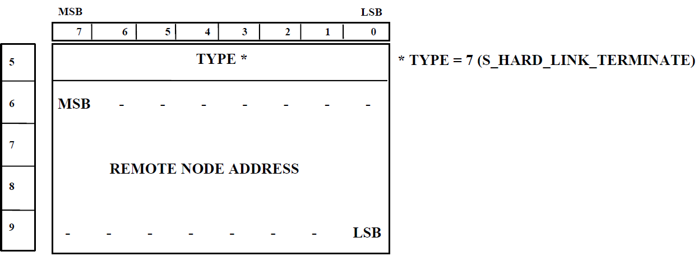
>
> **Figure A-24: Receiving Modem States**
>
> The receiving process at the DTE shall proceed as follows:

1.  When the modem receiver is in a sync-acquire phase, status reply packets shall be sent to the DTE with the carrier detect flag set to 0.

2.  When the modem receiver has fully detected a preamble, the modem shall issue a status reply packet with the carrier detect flag set to **1.**

3.  Once data is available, the modem shall begin sending data packets. The first interleaver shall be sent using ENHANCED ENCODED DATA packets indicating the rate and blocking factor for the reception. This interleaver set shall have the first interleaver flag set to **1.** Any subsequent interleaver sets shall be sent using ENCODED DATA packets. The last interleaver set will have the last interleaver flag set to 1.

4.  Once an end of message condition has been detected on the modem receiver a status reply packet shall be sent to the DTE with the canier detect packet set to 0. This may happen before or after the last data packet is delivered to the DTE.

5.  When the modem completes processing the received data, it shall send a status reply packet to the DTE indicating that the receiver is in a FLUSHED state. This may happen before or after the last data packet is delivered to the DTE.

    1.  Modem commands.

> The DTE may send commands to the modem using a modem command request packet at any time to affect its operation. Currently the only supported command is the receiver abort command. When the modem receives a command, it shall send a modem command ack indicating that it has processed the command. Because the UDP protocol is unreliable, the DTE may be required to retransmit commands using a pre-determined timeout with an exponential back off.

1.  <u>Data socket modes</u>.

> The UDP data socket supports a synchronous and asynchronous operation. The differences between the two data modes are explained in this section. The modem and DTE must be configured to use the same mode.

1.  <u>Synchronous</u>.

> The synchronous mode of operation is the standard mode of operation. The data must be transferred from the DTE to the modem at the specified data rate to prevent the modem from dropping packets or terminating the transmission due to a FEC decode error. The data is also not byte-synchronized in this mode of operation, which means that the DTE must perform bit-synchronization to byte-align the received data stream.

1.  <u>Asynchronous</u>.

> The asynchronous mode of operation with the Async Data Mode set to STANDARD MODE will cause the modem to convert the data stream into an asynchronous bit stream (adding start bits, stop bits and parity bits) with the specified settings before sending the data over the air. The modem will also decode the received asynchronous stream from the air, stripping the start, stop and parity bits from the data stream before sending it to the DTE.
>
> In this case, the DTE does not have to keep a steady data stream to the modem. If the modem’s transmit queues are emptied, it will transmit stop bits over the air until more data is available for transmission.
>
> Data is always exchanged in the data packets using 8-bit byte alignment. If the ASYNC DATA BITS parameter is set to 5 DATA BITS, the least significant 5-bits of each 8-bit data bytes of the Data Payload will be used for the OTA stream.
>
> When the Async Data Mode is set to DATA ONLY MODE, only the data bits are transmitted over the air. In this mode, the ASYNC DATA BITS must be 8 DATA BITS and the ASYNC PARITY must be NO PARITY. Since no control bits are sent over the air, the data must be transferred from the DTE to the modem at the specified data rate to prevent the modem from going into a TX\_UNDERRUN state.
>
> The difference between asynchronous DATA ONLY MODE and synchronous is that for async mode, the modem receiver does not need to buffer data at the start of a reception before sending it to the DTE. The data is sent directly to the DTE as it is decoded from the waveform. For the synchronous mode, the modem must buffer the data to keep the constant data rate specified by the receiving waveform before starting the data stream to the DTE.

1.  <u>CRC computation</u>.

> The 2 byte CRCs for the header and the optional payload portions shall be computed as follows, using the polynomial (x16 + x15 + x12 + x11 + x8 + x6 + x3 + x0).
>
> The 16 bit CRC word is initially set to 0. Bits are consecutively shifted and combined into the CRC, starting with the least significant bit of the first byte, until all the bits are shifted in. After shifting all the data into the shift register, the 16 bit CRC to be transmitted consists of the contents of the 16 bit shift register. This CRC shall be sent most-significant byte first.
>
> The following C code can be used to calculate the CRC value using the above polynomial:
>
> **unsigned short** CalculateCRC16(**unsigned char**\* pData, **unsigned short** nBytes)
>
> {
>
> **unsigned short** nCrc, i;
>
> **unsigned char** bit, j;
>
> nCrc = 0x0000;
>
> **for** ( i = 0; i &lt; nBytes; i++ ) {
>
> **for** ( j = 0x01; j; j &lt;&lt;= 1 ) {
>
> bit = (((nCrc & 0x0001) ? 1 : 0) ^ ((pData\[i\] & j) ? 1 : 0));
>
> nCrc &gt;&gt;= 1;
>
> **if** ( bit ) nCrc ^= 0x9299; */\* polynomial representation \*/*
>
> }
>
> }
>
> }
>
> Any packet received by the DTE or Modem that fail the header or payload CRC check shall be silently dropped as if the packet was never received.
