# Annex A: Subnetwork Interface Sublayer 

> This annex defines the interface between the users of the HF subnetwork and the computer information system through which the user accesses the subnetwork.

1.  <u>Subnetwork Service Definition</u>

> A client-server relationship governs the interaction between the HF subnetwork and the users of the subnetwork. The users (clients) request the services provided by the HF subnetwork (server). The service provided by the server is application independent and common to all clients irrespective of the task they may perform.
>
> Clients are attached to the Subnetwork Interface Sublayer at Subnetwork Access Points (SAPs). There can be multiple clients simultaneously attached to the Subnetwork Interface Sublayer. Each SAP is identified by its SAP Identifier (SAP ID)1. The SAP ID is a number in the range 0-15; hence there can be a maximum of 16 clients attached to the Subnetwork Interface Sublayer of a single node.
>
> Annex F contains a recommended definition of the various subnetwork clients. For the purposes of this STANAG Edition, some subnetwork client definitions in Annex F are mandatory. Data submitted by the clients to the Subnetwork Interface Sublayer must be in the form of primitives with
>
> the format as described in this document. Clients are responsible for segmenting larger messages into User Protocol Data Units (U\_PDUs). A U\_PDU format that supports this segmentation is defined in Annex F, but remains outside of the scope of the mandatory requirements on the client-to-subnetwork interface.
>
> The Subnetwork Interface Sublayer treats all clients connected to it in the same manner irrespective of the application performed by these clients. The only distinguishing factor between clients is their **Rank** that is a measure of their importance. See Annex H.5 for further information on the rank of clients.
>
> Certain service requests made by higher ranked clients may take precedence over requests made by lower ranked clients.

1.  <u>Initiating Data Exchange Sessions</u>

> The Subnetwork Interface Sublayer is responsible for initiating the establishment and termination of Sessions with its peers at remote nodes. There are four types of sessions:

1.  Soft Link Data Exchange Session

2.  Hard Link Data Exchange Session

3.  Broadcast Data Exchange Session

4.  Reserved

1 SAPs are equivalent to the “ports” of the TCP protocol.

> All sessions apart from the broadcast data exchange session require the making of a point-to-point physical link with a specified remote node.
>
> Clients for the HF Subnetwork services **may** interleave requests for the various session types in accordance with the capabilities of this standard. Support for only one session type, e.g., restriction to support only a Broadcast Data Exchange Session, **may** be established as part of the local (implementation-dependent) subnetwork management function.

1.  Soft Link Data Exchange Session

> The establishment of a Soft Link Data Exchange Session **shall (1)** be initiated unilaterally by the Subnetwork Interface Sublayer which has queued data requiring reliable delivery (i.e., queued ARQ U\_PDUs) and from which a client has not requested a Hard Link Data Exchange Session.
>
> The Subnetwork Interface Sublayer **shall** (2) initiate Soft Link Data Exchange Sessions as needed, following the procedure described in Section A.3.2.1.1.
>
> When all data has been transmitted to a node with which a Soft Link Data Exchange Session has been established, the Subnetwork Interface Sublayer **shall** (3) terminate the Soft Link Data Exchange Session after a configurable and implementation-dependent time-out period in accordance with the protocol specified in Section A.3.2.1.2.
>
> Termination of the Soft Link Data Exchange Session **shall** (4) be in accordance with the procedure specified in Section A.3.2.1.3. The time out period may be zero. The time out period allows for the possibility of newly arriving U\_PDUs being serviced by an existing Soft Link Data Exchange Session prior to its termination.
>
> In order to provide “balanced” servicing of the queued U\_PDUs, a Soft Link Data Exchange Session **shall** (5) not be maintained for a period which exceeds a specified maximum time if U\_PDUs of appropriate priorities are queued for different node(s).
>
> The specified maximum time out period **shall** (6) be a configurable parameter for the protocol implementation. The specific values of the parameters governing the establishment and termination of Soft Link Data Exchange Sessions (e.g. time-out periods etc.) must be chosen in the context of a particular configuration (i.e. size of network, etc).

1.  Hard Link Data Exchange Sessions

> The second type of data exchange session is the Hard Link Data Exchange Session. A Hard Link Data Exchange Session **shall** (1) be initiated at the explicit request of a client in accordance with the procedures for establishing and terminating hard link sessions specified in Sections A.3.2.2.1 and A.3.2.2.2.
>
> A client may request a Hard Link Data Exchange Session in order to ensure that a physical link to a specified node is maintained (irrespective of the destinations of other queued U\_PDUs) and optionally to partially or fully reserve the capacity of such a link. The three types of Hard Links that may be established are depicted below in the following figure:

# 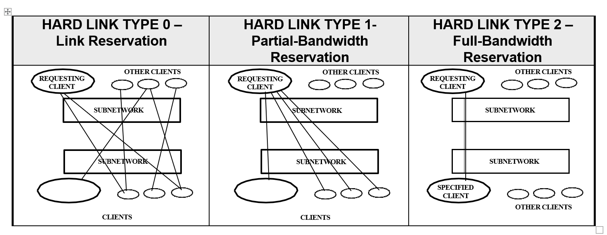Hard-Link Data-Exchange Session Types

1.  Type-0 Hard Link: Physical Link Reservation

> A Hard Link of Type-0, also called a Hard Link with Link Reservation, **shall** (1) maintain a physical link between two nodes.
>
> The Type-0 Hard Link capacity **shall** (2) not be reserved for any given client on the two nodes.
>
> Any client on nodes connected by a Hard Link of Type 0 **shall** (3) be permitted to exchange data over the Hard Link.
>
> Any client on either node other than the client that requested the Hard Link **shall** (4) gain access to the link only as a Soft-Link Data Exchange Session and may lose the link when the originating client terminates its Hard Link Data Exchange Session.

1.  Type-1 Hard Link: Partial-Bandwidth Reservation

> A Hard Link of Type 1, also called a Hard Link with Partial Bandwidth Reservation, **shall** (1) maintain a physical link between two nodes.
>
> The Type 1 Hard Link capacity **shall** (2) be reserved only for the client that requested the Type 1 Hard Link between the two nodes. The requesting client may send user data to any client on the remote node, and may receive user data from any client on the remote node only as a Soft-Link Data Exchange Session.
>
> Clients that are not sending data to or receiving data from the client that requested the Type 1 Hard Link **shall** (3) be unable to use the Hard Link. Any client using the link may lose the link when the originating client terminates its Hard Link Session.

1.  Type-2 Hard Link: Full-Bandwidth Reservation

> A Hard Link of Type 2, also called a Hard Link with Full Bandwidth Reservation, **shall** (1) maintain a physical link between two nodes.
>
> The Type 2 Hard Link capacity **shall** (2) be reserved only for the client that requested the Type 2 Hard Link and a specified remote client. No clients other than the requesting client and its specified remote client **shall** (3) exchange data on a Type-2 Hard Link.

1.  Broadcast Data Exchange Session

> The third type of data exchange session is the Broadcast Data Exchange Session. The subnetwork **shall** (1) service only clients with service requirements for non-ARQ U\_PDUs during a Broadcast Data Exchange Session. \[Note: Clients with service requirements for non-ARQ U\_PDUs may be serviced during other session types, however, in accordance with the session’s service characteristics.\] A Broadcast Data Exchange Session can be initiated and terminated by a management process, e.g., a local or network administrator management client.
>
> The procedures that initiate and terminate broadcast data exchange sessions **shall** (2) be as specified in Annex C.
>
> A node configured to be a broadcast-only node **shall** (3) use a “permanent” Broadcast Data Exchange Session during which the Subnetwork Interface Sublayer **shall** (4) service no hard link requests or ARQ Data U\_PDUs. Alternatively the Subnetwork Interface Sublayer can unilaterally initiate and terminate Broadcast Data Exchange Sessions.

1.  <u>Primitives Exchanged with Clients</u>

> Communication between the client and the Subnetwork Interface Sublayer uses the interface primitives listed in Table A-1 and defined in the following subsections. The names of these primitives are prefixed with an “S\_” to indicate that they are exchanged across the interface between the subnetwork interface sublayer and the subnetwork clients. This table is intended to provide a general guide and overview to the primitives. For detailed specification of the primitives, the later sections of this Annex **shall** (1) apply.

# Table A-1. Primitives Exchanged with Clients

<table>
<colgroup>
<col style="width: 51%" />
<col style="width: 48%" />
</colgroup>
<thead>
<tr class="header">
<th><blockquote>

<strong>CLIENT -&gt; SUBNETWORK INTERFACE</strong>

</blockquote></th>
<th><blockquote>

<strong>SUBNETWORK INTERFACE -&gt; CLIENT</strong>

</blockquote></th>
</tr>
</thead>
<tbody>
<tr class="odd">
<td><blockquote>

S_BIND_REQUEST (Service Type, Rank, SAP ID)

</blockquote></td>
<td><blockquote>

S_BIND_ACCEPTED (SAP ID, MTU)

</blockquote></td>
</tr>
<tr class="even">
<td></td>
<td><blockquote>

S_BIND_REJECTED (Reason)

</blockquote></td>
</tr>
<tr class="odd">
<td><blockquote>

S_UNBIND_REQUEST ( )

</blockquote></td>
<td><blockquote>

S_UNBIND_INDICATION (Reason)

</blockquote></td>
</tr>
<tr class="even">
<td></td>
<td></td>
</tr>
<tr class="odd">
<td><blockquote>

S_HARD_LINK_ESTABLISH (Link Priority, Link Type, Remote Node Address, Remote SAP ID)

</blockquote></td>
<td><blockquote>

S_HARD_LINK_ESTABLISHED (Remote Node Status, Link Priority, Link Type, Remote Node Address, Remote SAP ID)

</blockquote></td>
</tr>
<tr class="even">
<td></td>
<td><blockquote>

S_HARD_LINK_REJECTED (Reason, Link Priority, Link Type, Remote Node Address, Remote SAP ID)

</blockquote></td>
</tr>
<tr class="odd">
<td><blockquote>

S_HARD_LINK_ACCEPT (Link Priority, Link Type, Remote Node Address, Remote SAP ID)

</blockquote></td>
<td><blockquote>

S_HARD_LINK_INDICATION (Remote Node Status, Link Priority, Link Type, Remote Node Address, Remote SAP ID)

</blockquote></td>
</tr>
<tr class="even">
<td><blockquote>

S_HARD_LINK_REJECT (Reason, Link Priority, Link Type, Remote Node Address, Remote SAP ID)

</blockquote></td>
<td></td>
</tr>
<tr class="odd">
<td><blockquote>

S_HARD_LINK_TERMINATE (Remote Node Address)

</blockquote></td>
<td><blockquote>

S_HARD_LINK_TERMINATED (Reason, Link Priority, Link Type, Remote Node Address, Remote SAP ID)

</blockquote></td>
</tr>
<tr class="even">
<td></td>
<td></td>
</tr>
<tr class="odd">
<td></td>
<td><blockquote>

S_SUBNET_AVAILABILITY (Subnet Status, Reason)

</blockquote></td>
</tr>
<tr class="even">
<td></td>
<td></td>
</tr>
<tr class="odd">
<td><blockquote>

S_UNIDATA_REQUEST (Destination Node Address, Destination SAP ID, Priority, TimeToLive, Delivery Mode, U_PDU)

</blockquote></td>
<td><blockquote>

S_UNIDATA_REQUEST_CONFIRM (Destination Node

| Address, Destination SAP ID, Size of confirmed U_PDU, U_PDU)

</blockquote></td>
</tr>
<tr class="even">
<td></td>
<td><blockquote>

S_UNIDATA_REQUEST_REJECTED (Reason,

| Destination Node Address, Destination SAP ID, Size of

| Rejected U_PDU, U_PDU)

</blockquote></td>
</tr>
<tr class="odd">
<td></td>
<td><blockquote>

S_UNIDATA_INDICATION (Source Node Address, Source SAP ID, Destination Node Address, Destination

| SAP ID, Priority, Transmission Mode, <em>transmission-</em>

<em>| mode conditional parameters</em> , U_PDU)

</blockquote></td>
</tr>
<tr class="even">
<td></td>
<td></td>
</tr>
<tr class="odd">
<td><blockquote>

S_EXPEDITED_UNIDATA_REQUEST (Destination Node Address, Destination SAP ID, TimeToLive, Delivery Mode, U_PDU)

</blockquote></td>
<td><blockquote>

S_EXPEDITED_UNIDATA_REQUEST_CONFIRM

| (Destination Node Address, Destination SAP ID, Size of

| confirmed U_PDU, U_PDU)

</blockquote></td>
</tr>
<tr class="even">
<td></td>
<td><blockquote>

S_ EXPEDITED_UNIDATA_REQUEST_REJECTED

(Reason, Destination Node Address, Destination SAP ID,

| Size of Rejected U_PDU, U_PDU)

</blockquote></td>
</tr>
<tr class="odd">
<td></td>
<td><blockquote>

S_ EXPEDITED_UNIDATA_INDICATION (Source Node

Address, Source SAP ID, Destination Node Address, Destination SAP ID, Transmission Mode,

| <em>transmission-mode conditional parameters</em>, U_PDU)

</blockquote></td>
</tr>
<tr class="even">
<td></td>
<td></td>
</tr>
<tr class="odd">
<td></td>
<td><blockquote>

S_DATA_FLOW_ON( )

</blockquote></td>
</tr>
<tr class="even">
<td></td>
<td><blockquote>

S_DATA_FLOW_OFF ( )

</blockquote></td>
</tr>
<tr class="odd">
<td></td>
<td></td>
</tr>
<tr class="even">
<td><blockquote>

| S_MANAGEMNT _MSG_REQUEST (MSG TYPE,

| MSG BODY)

</blockquote></td>
<td><blockquote>

| S_MANAGEMENT_MSG_INDICATION (MSG

| TYPE, MSG BODY)

</blockquote></td>
</tr>
<tr class="odd">
<td></td>
<td></td>
</tr>
<tr class="even">
<td><blockquote>

S_KEEP_ALIVE ( )

</blockquote></td>
<td><blockquote>

S_KEEP_ALIVE ( )

</blockquote></td>
</tr>
</tbody>
</table>

1.  Content Specification and Use of Primitives

> The content specification and use of the Subnetwork Interface Sublayer primitives **shall** (1) be as specified in the following subsections.

1.  S\_BIND\_REQUEST Primitive

# Name :

> S\_BIND\_REQUEST ( )

# Arguments :

1.  SAP ID,

2.  RANK,

3.  Service Type

# Direction :

> Client -&gt; Subnetwork Interface

# Description :

> The S\_BIND\_REQUEST primitive **shall** (1) be issued by a new client when it first connects to the subnetwork. Unless this primitive is issued the client can not be serviced. With this primitive the client uniquely identifies and declares that it is “on-line” and ready to be serviced by the subnetwork.
>
> The first argument of this primitive **shall** (2) be the “*SAP ID”* which the client wishes to be assigned. The SAP ID **shall** (3) be node-level unique, i.e. not assigned to another client connected to the Subnetwork Interface Sublayer for a given node.
>
> The second argument of this primitive **shall** (4) be “*Rank*”. This is a measure of the importance of a client; the subnetwork uses a client’s rank to allocate resources. A description of the use of the Rank argument may be found in Annex H and \[1\]. The range of values for the rank argument **shall** (5) be from 0 to 15. Clients that are not authorised to make changes to a node or subnetwork configuration **shall** (6) not bind with rank of 15.
>
> The last argument of this primitive **shall** (7) be “*Service Type*” and identifies the default type of service requested by the client. The *Service Type* argument **shall** (8) apply to all data units submitted by the client unless explicitly overridden by client request when submitting a U\_PDU to the subnetwork. The “*Service Type*” argument is a complex argument and has a number of attributes that are encoded as specified in Section A.2.2.3.

1.  S\_UNBIND\_REQUEST Primitive

# Name :

> S\_UNBIND\_REQUEST ( )

# Arguments :

> NONE

# Direction :

> Client -&gt; Subnetwork Interface ( )

# Description :

> The S\_UNBIND\_REQUEST primitive **shall** (1) be issued by a client in order to declare itself “off-line”. The Subnetwork Interface Sublayer **shall** (2) release the SAP ID allocated to the client
>
> from which it receives the S\_UNBIND\_REQUEST and the SAP\_ID allocated to this client **shall**
>
> (3) then be available for allocation to another client that may request it.
>
> A client that went off-line by issuing the S\_UNBIND\_REQUEST primitive can come on-line again by issuing a new S\_BIND\_REQUEST.
>
> A client can also go off-line by physically disconnecting itself (e.g. powering down the computer which runs the client program) or disconnecting the physical cable (RS232, Ethernet, etc.) which may connect the client to the node.
>
> The Subnetwork Interface Sublayer can sense whether a client is physically disconnected in order to unilaterally declare this client as off-line; the S\_KEEP\_ALIVE primitive specified in Section A.2.1.17 provides this capability, though other implementation-dependent methods may be used in addition to this primitive.
>
> \[Note: The omission of SAP ID as an argument in this and other primitives implies a requirement on the stack supporting this connection to associate a SAP ID with a lower level connection (i.e., socket) and maintain this association.\]

1.  S\_BIND\_ACCEPTED Primitive

# Name :

> S\_BIND\_ACCEPTED ( )

# Arguments :

1.  SAP ID

2.  Maximum Transmission Unit (MTU)

# Direction :

> Subnetwork Interface -&gt; Client

# Description :

> The S\_BIND\_ACCEPTED primitive **shall** (1) be issued by the Subnetwork Interface Sublayer as a positive response to a client’s S\_BIND\_REQUEST.
>
> The *SAP ID* argument of the S\_BIND\_ACCEPTED primitive **shall** (2) be the SAP ID assigned to the client and **shall** (3) be equal to the *SAP ID* argument of the S\_BIND\_REQUEST to which this primitive is a response.
>
> The *MTU* argument **shall** (4) be used by the subnetwork interface sublayer to inform the client of the maximum size U\_PDU (in bytes or octets) which will be accepted as an argument of the S\_UNIDATA\_REQUEST primitive. S\_UNIDATA\_REQUEST primitives containing U\_PDUs larger than the MTU **shall** (5) be rejected by the subnetwork interface. Note that this restriction applies only to U\_PDUs received through the subnetwork interface. U\_PDUs which are received from the lower HF sublayers (i.e., received by radio) **shall** (6) be delivered to clients regardless of size.
>
> For general-purpose nodes, the MTU value **shall** (7) be 2048 bytes. For broadcast-only nodes, the MTU **shall** (8) be configurable by the implementation up to a maximum that **shall** (9) not exceed 4096 bytes.

1.  S\_BIND\_REJECTED Primitive

# Name :

> S\_BIND\_REJECTED ( )

# Arguments :

> 1\. Reason

# Direction :

> Subnetwork Interface -&gt; Client

# Description :

> The S\_BIND\_REJECTED primitive **shall** (1) be issued by the Subnetwork Interface Sublayer as a negative response to a client’s S\_BIND\_REQUEST. If certain conditions are not met then the Subnetwork Interface Sublayer rejects the client’s request.The *Reason* argument of the S\_BIND\_REJECTED primitive **shall** (2) specify the reason why the client’s request was rejected. Valid *Reason* values **shall** (3) be as specified in the table below.

<table>
<colgroup>
<col style="width: 64%" />
<col style="width: 35%" />
</colgroup>
<thead>
<tr class="header">
<th><blockquote>

Reason

</blockquote></th>
<th><blockquote>

Value

</blockquote></th>
</tr>
</thead>
<tbody>
<tr class="odd">
<td><blockquote>

Not Enough Resources

</blockquote></td>
<td><blockquote>

1

</blockquote></td>
</tr>
<tr class="even">
<td><blockquote>

Invalid SAP ID

</blockquote></td>
<td><blockquote>

2

</blockquote></td>
</tr>
<tr class="odd">
<td><blockquote>

SAP ID already allocated

</blockquote></td>
<td><blockquote>

3

</blockquote></td>
</tr>
<tr class="even">
<td><blockquote>

ARQ Mode unsupportable during Broadcast Session

</blockquote></td>
<td><blockquote>

4

</blockquote></td>
</tr>
</tbody>
</table>

> The binary representation of the value in the table **shall** (4) be encoded in the Reason field of the primitive by placing the LSB of the value into the LSB of the encoded field for the primitive as specified in Section A.2.2.

1.  S\_UNBIND\_INDICATION Primitive

# Name :

> S\_UNBIND\_INDICATION ( )

# Arguments :

> 1\. Reason

# Direction :

> Subnetwork Interface-&gt;Client

# Description :

> The S\_UNBIND\_INDICATION primitive **shall** (1) be issued by the Subnetwork Interface Sublayer to unilaterally declare a client as off-line. If the client wants to come on-line again, it must issue a new a S\_BIND\_REQUEST primitive as specified in Section A.2.1.1.
>
> The S\_UNBIND\_INDICATION primitive provides a means for the Subnetwork Interface Sublayer to manage the clients connected to it. As an implementation dependent example, if a new “High Ranked” client submits a S\_BIND\_REQUEST to come on-line but not enough resources are available, the Subnetwork Interface Sublayer may unilaterally declare a “Lower
>
> Ranked” client off-line. In such a case, the sublayer will send the lower-ranked client an S\_UNBIND\_INDICATION in order to release resources for the Higher-Ranked client.
>
> The *Reason* argument of the S\_UNBIND\_INDICATION primitive **shall** (2) specify why the client was declared off-line. The binary representation of the value in the table **shall**(3) be mapped into the Reason field of the primitive by placing the LSB of the value into the LSB of the encoded field for the primitive as specified in section A.2.2.

<table>
<colgroup>
<col style="width: 64%" />
<col style="width: 35%" />
</colgroup>
<thead>
<tr class="header">
<th><blockquote>

Reason

</blockquote></th>
<th><blockquote>

Value

</blockquote></th>
</tr>
</thead>
<tbody>
<tr class="odd">
<td><blockquote>

Connection pre-empted by higher ranked client

</blockquote></td>
<td><blockquote>

1

</blockquote></td>
</tr>
<tr class="even">
<td><blockquote>

Inactivity (failure to respond to “Keep alive”)

</blockquote></td>
<td><blockquote>

2

</blockquote></td>
</tr>
<tr class="odd">
<td><blockquote>

Too many invalid primitives

</blockquote></td>
<td><blockquote>

3

</blockquote></td>
</tr>
<tr class="even">
<td><blockquote>

Too many expedited data request primitives

</blockquote></td>
<td><blockquote>

4

</blockquote></td>
</tr>
<tr class="odd">
<td><blockquote>

ARQ Mode Unsupportable during

Broadcast Session

</blockquote></td>
<td><blockquote>

5

</blockquote></td>
</tr>
</tbody>
</table>

1.  S\_UNIDATA\_REQUEST Primitive

# Name :

> S\_UNIDATA\_REQUEST( )

# Arguments :

1.  Priority

2.  Destination SAP ID

3.  Destination Node Address

4.  Delivery Mode

5.  TimeToLive (TTL)

6.  Size of U\_PDU

7.  U\_PDU (User Protocol Data Unit)

# Direction :

> Client-&gt;Subnet Interface

# Description :

> The S\_UNIDATA\_REQUEST primitive **shall** (1) be used by connected clients to submit a U\_PDU to the HF subnetwork for delivery to a receiving client.
>
> The argument *Priority* **shall** (2) represent the priority of the U\_PDU. The U\_PDU priority **shall** (5) take a value in the range 0-15. The processing by HF protocol sublayers **shall** (6) make a “best effort” to give precedence to high priority U\_PDUs over lower priority U\_PDUs which are queued in the system.
>
> The argument *Destination SAP ID* **shall** (3) specify the SAP ID of the receiving client. Note that as all nodes will have uniquely specified SAP IDs for clients, the Destination SAP ID distinguishes the destination client from the other clients bound to the destination node.
>
> The argument *Destination Node Address* **shall** (4) specify the HF subnetwork address of the physical HF node to which the receiving client is bound.
>
> The argument *Delivery Mode* **shall** (5) be a complex argument with a number of attributes, as specified by the encoding rules of Section A.2.2.28.2. This argument can be given the value of “DEFAULT” which means that the delivery mode associated with the U\_PDU will be the delivery mode specified by the client during “binding” (i.e., the value DEFAULT is equal to the *Service Type* argument of client’s original S\_BIND\_REQUEST). Values other than DEFAULT for the *Delivery Mode* can be used to override the default delivery mode for this U\_PDU.
>
> The argument *TimeToLive (TTL)* **shall** (6) specify the maximum amount of time the submitted U\_PDU is allowed to stay in the HF Subnetwork before it is delivered to its destination. If the TTL is exceeded the U\_PDU **shall** (7) be discarded. A TTL value of 0 **shall** (8) define an infinite TTL**,** i.e. the subnetwork should try *forever* to deliver the U\_PDU.
>
> The subnetwork **shall** (9) have a default maximum TTL. The default maximum TTL **shall** (10) be configurable as an implementation-dependent value. As soon as the Subnetwork Interface Sublayer accepts a S\_UNIDATA\_REQUEST primitive, it **shall** (11) immediately calculate its *TimeToDie (TTD)* by adding the specified TTL (or the default maximum value if the specified TTL is equal to 0) to the current Time of Day, e.g. GMT. The TTD attribute of a U\_PDU **shall** (12) accompany it during its transit within the subnetwork. \[Note that the TTD is an absolute time while the TTL is a time interval relative to the instant of the U\_PDU submission.\]
>
> The *Size of U\_PDU* argument **shall** (13) be the size of the U\_PDU that is included in this S\_UNIDATA\_REQUEST Primitive.
>
> The final argument, *U\_PDU,* **shall** (14) be the actual Data Unit submitted by the client to the HF Subnetwork.

1.  S\_UNIDATA\_REQUEST\_CONFIRM Primitive

# Name :

> S\_UNIDATA\_REQUEST\_CONFIRM

# Arguments :

1.  Destination Node Address

2.  Destination SAP ID

3.  Size of Confirmed U\_PDU

4.  U\_PDU (User Protocol Data Unit or part of it)

# Direction :

> Subnetwork Interface-&gt;Client

# Description :

> The S\_UNIDATA\_REQUEST\_CONFIRM primitive **shall** (1) be issued by the Subnetwork Interface Sublayer to acknowledge the successful delivery of a S\_UNIDATA\_REQUEST submitted by the client.
>
> This primitive **shall** (2) be issued only if the client has requested Data Delivery Confirmation (either during binding or for this particular data unit).
>
> The *Destination Node Address* argument in the S\_UNIDATA\_REQUEST\_CONFIRM Primitive **shall** (3) have the same meaning and be equal in value to the *Destination Node Address* argument of the S\_UNIDATA\_REQUEST Primitive for which the S\_UNIDATA\_REQUEST\_ CONFIRM Primitive is the response.
>
> The *Destination SAP\_ID* argument in the S\_UNIDATA\_REQUEST\_ CONFIRM Primitive **shall**
>
> (4) have the same meaning and be equal in value to the *Destination SAP\_ID* argument of the S\_UNIDATA\_REQUEST Primitive for which the S\_UNIDATA\_REQUEST\_CONFIRM Primitive is the response.
>
> The *Size of Confirmed U\_PDU* argument **shall** (5) be the size of the U\_PDU or part that is included in this S\_UNIDATA\_REQUEST\_CONFIRM Primitive.
>
> The *U\_PDU* argument in the S\_UNIDATA\_REQUEST\_CONFIRM Primitive **shall** (6)
>
> be a copy of the whole or a fragment of the *U\_PDU* argument of the S\_UNIDATA\_REQUEST Primitive for which the S\_UNIDATA\_REQUEST\_CONFIRM Primitive is the response.
>
> Using these arguments, the client **shall** (7) be able to uniquely identify the U\_PDU that is being acknowledged. Depending on the implementation of the protocol, the last argument, *U\_PDU,* may not be a complete copy of the original U\_PDU but only a partial copy, i.e., only the first X bytes are copied for some value of *X*. If a partial U\_PDU is returned, *U\_PDU\_response\_frag\_size* bytes **shall** (9) be returned to the client starting with the first byte of the U\_PDU so that the client will have the U\_PDU segment information. The number of bytes returned, *U\_PDU\_response\_frag\_size*, **shall**(10) be a configurable parameter in the implementation.

1.  S\_UNIDATA\_REQUEST\_REJECTED Primitive

# Name :

> S\_UNIDATA\_REQUEST\_REJECTED

# Arguments :

1.  Reason

2.  Destination Node Address

3.  Destination SAP ID

4.  Size of Rejected U\_PDU (or part)

5.  U\_PDU (User Protocol Data Unit or part of it)

# Direction :

> Subnetwork Interface-&gt;Client

# Description :

> The S\_UNIDATA\_REQUEST\_REJECTED primitive **shall** (1) be issued by the Subnetwork Interface Sublayer to inform a client that a S\_UNIDATA\_REQUEST was not delivered successfully.
>
> This primitive **shall** (2) be issued if the client has requested Data Delivery Confirmation (either during Binding or for this particular U\_PDU) and the data was unsuccessfully delivered. This primitive also **shall** (3) be issued to a client if a U\_PDU larger than the MTU is submitted.
>
> The argument *Reason* **shall** (4) specify why the delivery failed, using the encoding given in the table below:

<table>
<colgroup>
<col style="width: 64%" />
<col style="width: 35%" />
</colgroup>
<thead>
<tr class="header">
<th><blockquote>

Reason

</blockquote></th>
<th><blockquote>

Value

</blockquote></th>
</tr>
</thead>
<tbody>
<tr class="odd">
<td><blockquote>

TTL Expired

</blockquote></td>
<td><blockquote>

1

</blockquote></td>
</tr>
<tr class="even">
<td><blockquote>

Destination SAP ID not bound

</blockquote></td>
<td><blockquote>

2

</blockquote></td>
</tr>
<tr class="odd">
<td><blockquote>

Destination node not

responding

</blockquote></td>
<td><blockquote>

3

</blockquote></td>
</tr>
<tr class="even">
<td><blockquote>

U_PDU larger than MTU

</blockquote></td>
<td><blockquote>

4

</blockquote></td>
</tr>
<tr class="odd">
<td><blockquote>

Tx Mode not specified

</blockquote></td>
<td><blockquote>

5

</blockquote></td>
</tr>
</tbody>
</table>

> The binary representation of the value in the table **shall** (5) be mapped into the Reason argument of the primitive by placing the LSB of the value into the LSB of the encoded argument for the primitive as specified in section A.2.2
>
> The *Destination Node Address* argument in the S\_UNIDATA\_REQUEST\_REJECTED Primitive **shall** (6) have the same meaning and be equal in value to the *Destination Node Address* argument of the S\_UNIDATA\_REQUEST Primitive for which the S\_UNIDATA\_REQUEST\_REJECTED Primitive is the response.
>
> The *Destination SAP\_ID* argument in the S\_UNIDATA\_REQUEST\_REJECTED Primitive **shall**
>
> (7) have the same meaning and be equal in value to the *Destination SAP\_ID* argument of the S\_UNIDATA\_REQUEST Primitive for which the S\_UNIDATA\_REQUEST\_REJECTED Primitive is the response.
>
> The *Size of Rejected U\_PDU* argument **shall** (8) be the size of the U\_PDU or part that is included in this S\_UNIDATA\_REQUEST\_REJECTED Primitive.
>
> Just as specified for the S\_UNIDATA\_REQUEST\_CONFIRM primitive, the *U\_PDU* argument in the S\_UNIDATA\_REQUEST\_REJECTED primitive may only be a partial copy of the original U\_PDU, depending on the implementation of the protocol. If a partial U\_PDU is returned, *U\_PDU\_response\_frag\_size* bytes **shall** (9) be returned to the client starting with the first byte of the U\_PDU so that the client will have the U\_PDU segment information. The number of bytes returned, *U\_PDU\_response\_frag\_size*, **shall**(10) be a configurable parameter in the implementation.

1.  S\_UNIDATA\_INDICATION Primitive

# Name :

> S\_UNIDATA\_INDICATION

# Arguments :

1.  Priority

2.  Destination SAP ID

3.  Destination Node Address

4.  Transmission Mode

5.  Source SAP ID

6.  Source Node Address

7.  Size of U\_PDU

8.  Number of Blocks in Error

9.  Array of Block-Error Pointers

10. Number of Non-Received Blocks

11. Array of Non-Received-Block Pointers

12. U\_PDU

# Direction :

> Subnetwork Interface-&gt;client

# Description :

> The S\_UNIDATA\_INDICATION primitive **shall** (1) be used by the Subnetwork Interface Sublayer to deliver a received U\_PDU to the client.
>
> The *Priority* argument **shall** (2) be the priority of the PDU.
>
> The *Destination SAP ID* argument **shall** (3) be the SAP ID of the client to which this primitive is delivered.
>
> The *Destination Node Address* argument **shall** (4) be the address assigned by the sending node to the U\_PDU contained within this primitive. This normally will be the address of the local (i.e., receiving) node. It may however be a “group” address to which the local node has subscribed (Group Addresses and their subscribers are defined during configuration) and to which the source node addressed the U\_PDU.
>
> The *Transmission Mode* argument **shall** (5) be the mode by which the U\_PDU was transmitted by the remote node and received by the local node; ie, ARQ, Non-ARQ
>
> (Broadcast) transmission, Non-ARQ w/ Errors, etc., encoded as per section A.2.2.28.3 The *Source SAP ID* **shall** (6) be SAP ID of the client that sent the U\_PDU.
>
> The *Source Node Address* **shall** (7) represent the node address of the client that sent the U\_PDU.
>
> The *Size of U\_PDU* argument **shall** (8) be the size of the U\_PDU that was sent and delivered in this S\_UNIDATA\_INDICATION S\_Primitive.
>
> The following four arguments **shall** (9) be present in the S\_UNIDATA\_INDICATION S\_Primitive if and only if the Transmission Mode for the U\_PDU is equal to Non-ARQ w/ Errors:

1.  The *Number of Blocks in Error* argument **shall** (10) equal the number of data blocks in the U\_PDU that were received in error by the lower layers of the subnetwork and that were passed on to the Subnetwork Interface Sublayer. This argument **shall** (11) specify the number of ordered pairs in the *Array of Block-Error Pointers* argument.

2.  The *Array of Block-Error Pointers* argument **shall** (12) consist of a an array of ordered pairs, the first element in the pair equal to the location within the U\_PDU of the data block with errors, and the second element equal to the size of the data block with errors.

3.  The *Number of Non-Received Blocks* argument **shall** (13) equal the number of data blocks missing from the U\_PDU because they were not received. This argument **shall**

> (14) specify the number of ordered pairs in the *Array of Non-Received-Block Pointers*
>
> argument.

1.  The *Array of Non-Received-Block Pointers* **shall** (15) consist of an array of ordered pairs, the first element in the pair equal to the location of the missing data block in the U\_PDU and the second element equal to the size of the missing data block.

> The final argument, *U\_PDU*, **shall** (16) contain the actual received user data for delivery to the client.

1.  S\_EXPEDITED\_UNIDATA\_REQUEST Primitive

# Name :

> S\_EXPEDITED\_UNIDATA\_REQUEST

# Arguments :

1.  Destination SAP ID

2.  Destination Node Address

3.  Delivery Mode

4.  TimeToLive (TTL)

5.  Size of U\_PDU

6.  U\_PDU (User Protocol Data Unit)

# Direction :

> Client-&gt;Subnet Interface

# Description :

> The S\_EXPEDITED\_UNIDATA\_REQUEST primitive **shall** (1) be used to submit a U\_PDU to the HF Subnetwork for Expedited Delivery to a receiving client.
>
> The argument *Destination SAP ID* **shall** (2) specify the SAP ID of the receiving client. Note that as all nodes will have uniquely specified SAP IDs for clients, the Destination SAP ID distinguishes the destination client from the other clients bound to the destination node.
>
> The argument *Destination Node Address* **shall** (3) specify the HF subnetwork address of the physical HF node to which the receiving client is bound.
>
> The argument *Delivery Mode* **shall** (4) be a complex argument with a number of attributes, as specified by the encoding rules of Section A.2.2.28.2. This argument can be given the value of “Default” which means that the delivery mode associated with the U\_PDU will be the delivery mode specified by the client during “binding” (*Service Type* argument of S\_BIND\_REQUEST). The other values of the *Delivery Mode* can be used to override the default delivery mode for this U\_PDU.
>
> The argument *TimeToLive (TTL)* **shall** (5) specify the maximum amount of time the submitted U\_PDU is allowed to stay in the HF Subnetwork before it is delivered to its final destination. If the TTL is exceeded the U\_PDU **shall** (6) be discarded. A TTL value of 0 **shall** (7) define an infinite TTL**,** i.e. the subnetwork should try *forever* to deliver the U\_PDU.
>
> As soon as the Subnetwork Interface Sublayer accepts a S\_EXPEDITED\_UNIDATA\_REQUEST primitive, it **shall** (8) immediately calculate its *TimeToDie (TTD)* by adding the specified TTL (or the default maximum TTL value if the specified TTL is equal to 0) to the current Time of Day, e.g. GMT. The TTD attribute of a U\_PDU **shall** (9) accompany it during its transit within the subnetwork. \[Note that the TTD is an absolute time while the TTL is a time interval relative to the instant of the U\_PDU submission.\]
>
> The *Size of U\_PDU* argument **shall** (10) be the size of the U\_PDU that is included in this S\_UNIDATA\_REQUEST Primitive.
>
> The final argument, *U\_PDU,* **shall** (11) be the actual User Data Unit (U\_PDU) submitted by the client to the HF Subnetwork for expedited delivery service.
>
> \[Note: There is no *Priority* argument in the S\_EXPEDITED\_UNIDATA\_REQUEST primitive. Although seemingly equivalent, there are a important differences between a S\_UNIDATA\_REQUEST primitive of the highest priority and a S\_EXPEDITED\_UNIDATA\_REQUEST primitive. S\_UNIDATA\_REQUEST primitives of all priority levels are processed according to a set of rules that apply to Normal Data.
>
> U\_PDUs submitted using S\_EXPEDITED\_UNIDATA\_REQUEST primitives are treated differently, e.g. expedited U\_PDUs should be queued separately from normal U\_PDUs. When an expedited U\_PDU is received, the transmission of normal data is halted and the expedited data is transmitted. When the expedited data has been sent the transmission of normal data is resumed again.\]
>
> The 5066 node management **shall** (3) track the number of S\_EXPEDITED\_UNIDATA\_REQUEST primitives submitted by various clients. If the number of S\_EXPEDITED\_UNIDATA\_REQUEST primitives for any client exceeds a configurable, implementation dependent parameter, node management **shall** (4) unilaterally disconnect the client using a S\_UNBIND\_INDICATION primitive with REASON = 4 = “Too many expedited-data request primitives”.

1.  S\_EXPEDITED\_UNIDATA\_REQUEST\_CONFIRM Primitive

# Name :

> S\_EXPEDITED\_UNIDATA\_REQUEST\_CONFIRM

# Arguments :

1.  Destination Node Address

2.  Destination SAP ID

3.  Size of Confirmed U\_PDU (or part)

4.  U\_PDU (User Protocol Data Unit or part of it)

# Direction :

> Subnetwork Interface-&gt;Client

# Description :

> The S\_EXPEDITED\_UNIDATA\_REQUEST\_CONFIRM primitive **shall** (1) be issued by the Subnetwork Interface Sublayer to acknowledge the successful delivery of a S\_EXPEDITED\_UNIDATA\_REQUEST primitive.
>
> This primitive **shall** (2) be issued only if the client has requested Data Delivery Confirmation (either during Binding or for this particular U\_PDU).
>
> The *Destination Node Address* argument in the S\_EXPEDITED\_UNIDATA\_REQUEST\_CONFIRM Primitive **shall** (3) have the same meaning and be equal in value to the *Destination Node Address* argument of the S\_EXPEDITED\_UNIDATA\_REQUEST Primitive for which the S\_EXPEDITED\_UNIDATA\_REQUEST\_CONFIRM Primitive is the response.
>
> The *Destination SAP\_ID* argument in the S\_EXPEDITED\_UNIDATA\_REQUEST\_CONFIRM Primitive **shall** (4) have the same meaning and be equal in value to the *Destination SAP\_ID* argument of the S\_EXPEDITED\_UNIDATA\_REQUEST Primitive for which the S\_EXPEDITED\_UNIDATA\_REQUEST\_CONFIRM Primitive is the response.
>
> The *Size of Confirmed U\_PDU* argument **shall** (5) be the size of the U\_PDU or part that is included in the S\_EXPEDITED\_UNIDATA\_REQUEST\_CONFIRM Primitive.
>
> Just as specified for the S\_UNIDATA\_REQUEST\_CONFIRM primitive, the *U\_PDU* argument in the S\_EXPEDITED\_UNIDATA\_REQUEST\_CONFIRM primitive may only be a partial copy of the original U\_PDU, depending on the implementation of the protocol. If a partial U\_PDU is returned, *U\_PDU\_response\_frag\_size* bytes **shall** (6) be returned to the client starting with the first byte of the U\_PDU so that the client will have the U\_PDU segment information. The number of bytes returned, *U\_PDU\_response\_frag\_size*, **shall** (7) be a configurable parameter in the implementation.

1.  S\_EXPEDITED\_UNIDATA\_REQUEST\_REJECTED Primitive

# Name :

> S\_EXPEDITED\_UNIDATA\_REQUEST\_REJECTED

# Arguments :

1.  Reason

2.  Destination Node Address

3.  Destination SAP ID

4.  Size of Rejected U\_PDU (or part)

5.  U\_PDU (User Protocol Data Unit or part of it)

# Direction :

> Subnetwork Interface-&gt;Client

# Description :

> The S\_EXPEDITED\_UNIDATA\_REQUEST\_REJECTED primitive **shall** (1) be issued by the Subnetwork Interface Sublayer to inform a client that a S\_EXPEDITED\_UNIDATA\_REQUEST was not delivered successfully.
>
> This primitive **shall** (2) be issued if the client has requested Data Delivery Confirmation (either during Binding or for this particular U\_PDU), or if a U\_PDU larger than the MTU is submitted.
>
> The argument *Reason* **shall** (3) specify why the delivery failed with values defined for this field as specified in the table below.

<table>
<colgroup>
<col style="width: 63%" />
<col style="width: 36%" />
</colgroup>
<thead>
<tr class="header">
<th><blockquote>

Reason

</blockquote></th>
<th><blockquote>

Value

</blockquote></th>
</tr>
</thead>
<tbody>
<tr class="odd">
<td><blockquote>

TTL Expired

</blockquote></td>
<td><blockquote>

1

</blockquote></td>
</tr>
<tr class="even">
<td><blockquote>

Destination SAP ID not bound

</blockquote></td>
<td><blockquote>

2

</blockquote></td>
</tr>
<tr class="odd">
<td><blockquote>

Destination node not

responding

</blockquote></td>
<td><blockquote>

3

</blockquote></td>
</tr>
<tr class="even">
<td><blockquote>

U_PDU larger than MTU

</blockquote></td>
<td><blockquote>

4

</blockquote></td>
</tr>
<tr class="odd">
<td><blockquote>

| Tx Mode not specified

</blockquote></td>
<td><blockquote>

| 5

</blockquote></td>
</tr>
</tbody>
</table>

> The binary representation of the value in the table **shall** (4) be mapped into the Reason field of the primitive by placing the LSB of the value into the LSB of the encoded field for the primitive as specified in section A.2.2.1.
>
> The *Destination Node Address* argument in the S\_EXPEDITED\_UNIDATA\_REQUEST\_REJECTED Primitive **shall** (5) have the same meaning and be equal in value to the *Destination Node Address* argument of the S\_EXPEDITED\_UNIDATA\_REQUEST Primitive for which the S\_EXPEDITED\_UNIDATA\_REQUEST\_REJECTED Primitive is the response.
>
> The *Destination SAP\_ID* argument in the S\_EXPEDITED\_UNIDATA\_REQUEST\_REJECTED Primitive **shall** (6) have the same meaning and be equal in value to the *Destination SAP\_ID* argument of the S\_EXPEDITED\_UNIDATA\_REQUEST Primitive for which the S\_EXPEDITED\_UNIDATA\_REQUEST\_REJECTED Primitive is the response.
>
> The *Size of Rejected U\_PDU* argument **shall** (7) be the size of the U\_PDU or part that is included in the S\_EXPEDITED\_UNIDATA\_REQUEST\_REJECTED Primitive.
>
> Just as specified for the S\_EXPEDITED UNIDATA\_REQUEST\_CONFIRM primitive,
>
> the *U\_PDU* argument in the S\_EXPEDITED\_UNIDATA\_REQUEST\_REJECTED primitive may only be a partial copy of the original U\_PDU, depending on the implementation of the protocol. If a partial U\_PDU is returned, *U\_PDU\_response\_frag\_size* bytes **shall** (8) be returned to the client starting with the first byte of the U\_PDU so that the client will have the U\_PDU segment information. The number of bytes returned, *U\_PDU\_response\_frag\_size*, **shall** (9) be a configurable parameter in the implementation.

1.  S\_EXPEDITED\_UNIDATA\_INDICATION Primitive

# Name :

> S\_EXPEDITED\_UNIDATA\_INDICATION

# Arguments :

1.  Destination SAP ID

2.  Destination Node Address

3.  Transmission Mode

4.  Source SAP ID

5.  Source Node Address

6.  Size of U\_PDU

7.  Number of Blocks in Error

8.  Array of Block-Error Pointers

9.  Number of Non-Received Blocks

10. Array of Non-Received-Block Pointers

11. U\_PDU

# Direction :

> Subnetwork Interface-&gt;Client

# Description :

> The S\_EXPEDITED\_UNIDATA\_INDICATION primitive **shall** (1) be used by the Subnetwork Interface Sublayer to deliver an Expedited U\_PDU to a client.
>
> The *Destination SAP ID* argument **shall** (2) be the SAP ID of the client to which this primitive is delivered.
>
> The *Destination Node Address* argument **shall** (3) be the address assigned by the sending node to the U\_PDU contained within this primitive. This normally will be the address of the local (i.e., receiving) node. It may however be a “group” address to which the local node has subscribed (Group Addresses and their subscribers are defined during configuration) and to which the source node addressed the U\_PDU.
>
> The *Transmission Mode* argument **shall** (4) be the mode by which the U\_PDU was transmitted by the remote node and received by the local node; ie, ARQ, Non-ARQ (Broadcast) transmission, Non-ARQ w/ Errors, etc.
>
> The *Source SAP ID* **shall** (5) be SAP ID of the client that sent the U\_PDU.
>
> The *Source Node Address* **shall** (6) represent the node address of the client that sent the U\_PDU.
>
> The *Size of U\_PDU* argument **shall** (7) be the size of the U\_PDU that was sent and delivered in this S\_EXPEDITED\_UNIDATA\_INDICATION S\_Primitive.
>
> The following four arguments **shall** (8) be present in the S\_EXPEDITED\_UNIDATA\_INDICATION S\_Primitive if and only if the Transmission Mode for the U\_PDU is equal to Non-ARQ w/ Errors:

1.  The *Number of Blocks in Error* argument **shall** (9) equal the number of data blocks in the U\_PDU that were received in error by the lower layers of the subnetwork and that were passed on to the Subnetwork Interface Sublayer. This argument **shall** (10) specify the number of ordered pairs in the *Array of Block-Error Pointers* argument.

2.  The *Array of Block-Error Pointers* argument **shall** (11) consist of a an array of ordered pairs, the first element in the pair equal to the location within the U\_PDU of the data block with errors, and the second element equal to the size of the data block with errors.

3.  The *Number of Non-Received Blocks* argument **shall** (12) equal the number of data blocks missing from the U\_PDU because they were not received. This argument **shall**

> (13) specify the number of ordered pairs in the *Array of Non-Received-Block Pointers*
>
> argument.

1.  The *Array of Non-Received-Block Pointers* **shall** (14) consist of an array of ordered pairs, the first element in the pair equal to the location of the missing data block in the U\_PDU and the second element equal to the size of the missing data block.

> The final argument, *U\_PDU*, **shall** (15) contain the actual received user data for delivery to the client.

1.  Interface Flow Control Primitives: S\_DATA\_FLOW\_ON and S\_DATA\_FLOW\_OFF

# Name :

> S\_DATA\_FLOW\_ON S\_DATA\_FLOW\_OFF

# Arguments :

> NONE

# Direction :

> Subnetwork Interface-&gt; Client

# Description :

> The S\_DATA\_FLOW\_ON and S\_DATA\_FLOW\_OFF primitives **shall** (1) be issued by the Subnetwork Interface Sublayer to control the transfer of U\_PDUs submitted by a client.
>
> On receipt of an \_DATA\_FLOW\_OFF primitive, the client **shall** (2) cease transferring U\_PDUs over the interface.
>
> Transfer over the interface of U\_PDUs by the client **shall** (3) be enabled following receipt of an S\_DATA\_FLOW\_ON primitive.
>
> Depending on the implementation, the physical connection between the client(s) and the Subnetwork Interface Sublayer may provide an implicit flow-control mechanism that would make the use of these primitives unnecessary. For example, if the connection is implemented as TCP/IP Berkeley Sockets, the implicit flow-control mechanism of the TCP protocol may be utilized in which case these two primitives are redundant.
>
> The Subnetwork Interface Sublayer can use these two primitives (or other mechanisms) to control the flow of data from locally attached clients. U\_PDUs from an attached client to which the S\_DATA\_FLOW\_OFF primitive has been sent may be discarded by the Subnetwork Interface Sublayer without acknowledgement, indication, or warning.
>
> A client **shall** (4) not control the flow of data *from* the subnetwork by any mechanism, explicit or implicit.
>
> All clients **shall** (5) be ready to accept at all times data received by the HF Node to which it is bound; clients not following this rule may be disconnected by the node.

1.  S\_MANAGEMENT\_MSG\_REQUEST Primitive

# Name :

> S\_MANAGEMENT\_MSG\_REQUEST

# Arguments :

1.  MSG TYPE

2.  MSG BODY

# Direction :

> Client-&gt; Subnet Interface

# Description :

> The S\_MANAGEMENT\_MSG\_REQUEST primitive **shall** (1) be issued by a client to submit a “Management” message to the Subnetwork.
>
> The complex argument MSG may be implementation dependent and is not specified in this version of STANAG 5066. At present, a minimally compliant HF subnetwork implementation **shall** (2) be capable of receiving this primitive, without further requirement to process its contents.
>
> The subnetwork **shall** (3) accept this primitive only from clients which have bound with a rank of 15.
>
> Depending on the value of the complex argument *MSG*, this primitive can take the form of a Command (e.g. Go-To-EMCON, Go-Off-Air, etc.) or of a Request (e.g. Request-For-Subnetwork-Statistics, Request-For-Connected-client-Information, etc.).
>
> Note that this primitive is not intended to allow for the transmission of management coordination messages over the air. This is an interaction between peer subnet management clients and as such shall be accomplished using the UNIDATA or EXPEDITED UNIDATA primitives defined elsewhere in this annex.

1.  S\_MANAGEMENT\_MSG\_INDICATION Primitive

# Name :

> S\_MANAGEMENT\_MSG\_INDICATION

# Arguments :

1.  MSG TYPE

2.  MSG BODY

# Direction :

> Subnetwork Interface-&gt; Client

# Description :

> The S\_MANAGEMENT\_MSG\_INDICATION primitive **shall** (1) be issued by the Subnetwork to send a “Management” message to a client.
>
> The complex argument MSG may be implementation dependent and is not specified in this version of STANAG 5066. At present, a minimally compliant client **shall** (2) be capable of receiving this primitive, without further requirement to process its contents.
>
> As implementation options, the complex argument *MSG* could take several values such as: Subnetwork-Statistics, Connected-client-Information, etc. This primitive could be issued either in response to a S\_MANAGEMENT\_MSG\_REQUEST or asynchronously by the Subnetwork.

1.  S\_KEEP\_ALIVE Primitive

# Name :

> S\_KEEP\_ALIVE

# Arguments :

> NONE

# Direction :

> Client-&gt; Subnetwork Interface Subnetwork Interface-&gt; Client

# Description :

> The S\_KEEP\_ALIVE primitive can be issued as required (e.g. during periods of inactivity) by the clients and/or the Subnetwork Interface to sense whether the physical connection between the client and the Subnetwork is alive or broken. This primitive may be redundant if the implementation of the physical connection provides an implicit mechanism for sensing the status of the connection.
>
> A minimally compliant implementation of a client or subnetwork interface is not required to generate the S\_KEEP\_ALIVE primitive except in response to the receipt of an S\_KEEP\_ALIVE primitive.
>
> When the S\_KEEP\_ALIVE Primitive is received, the recipient (i.e, client or Subnetwork Interface) **shall** (1) respond with the same primitive within 10 seconds.
>
> If a reply is not sent within 10 seconds, no reply **shall** (2) be sent.
>
> A client or Subnetwork Interface **shall** (3) not send the S\_KEEP\_ALIVE Primitive more frequently than once every 120 seconds to the same destination.

1.  S\_HARD\_LINK\_ESTABLISH Primitive

# Name :

> S\_HARD\_LINK\_ESTABLISH

# Arguments :

1.  Link Priority

2.  Link Type

3.  Remote Node Address

4.  Remote SAP ID

# Direction :

> Client-&gt; Subnetwork Interface

# Description :

> The S\_HARD\_LINK\_ESTABLISH primitive **shall** (1) be used by a client to request the establishment of a Hard Link between the local Node to which it is connected and a specified remote Node.
>
> \[Note: Physical Links between Nodes are normally made and broken unilaterally by the HF subnetwork according to the destinations of the queued U\_PDUs. Such links are classified as Soft Links. The S\_HARD\_LINK\_ESTABLISH primitive allows a client to override these procedures and request a Physical Link to be made to a specific Node and be maintained until the requesting client decides to break it.\]
>
> The argument *Link Priority* **shall** (2) define the priority of the Link. It **shall** (3) take a value in the range 0-3.
>
> An S\_HARD\_LINK\_ESTABLISH primitive with a higher Link Priority value **shall** (4) take precedence over a Hard Link established with a lower Link Priority value submitted by a client of the same Rank.
>
> Hard Link requests made by clients with higher Rank **shall** (5) take precedence over requests of lower-Ranked clients regardless of the value of the *Link Priority* argument, in accordance with the requirements of Section A.3.2.2.1.
>
> The *Link Type* argument **shall** (6) be used by the requesting client to fully or partially reserve the bandwidth of the Link. It **shall** (7) take a value in the range 0-2, as specified in Section A.1.1.2, specifying this primitive as one for a Type 0 Hard Link, Type 1 Hard Link, or Type 2 Hard Link, respectively.
>
> The *Remote Node Address* argument **shall** (8) specify the physical HF Node Address to which the connection must be established and maintained.
>
> The *Remote SAP ID* argument **shall** (9) identify the single client connected to the remote Node, to and from which traffic is allowed. This argument **shall** (10) be valid only if the *Link Type* argument has a value of 2 (i.e., only if the Hard Link request reserves the full bandwidth of the link for the local and remote client, as specified in section A.1.1.2.3).

1.  S\_HARD\_LINK\_TERMINATE Primitive

# Name :

> S\_HARD\_LINK\_TERMINATE

# Arguments :

> 1\. Remote Node Address

# Direction :

> Client-&gt; Subnetwork Interface

# Description :

> The S\_HARD\_LINK\_TERMINATE primitive **shall** (1) be issued by a client to terminate an existing Hard Link.
>
> The subnetwork **shall** (2) terminate an existing Hard Link on receipt of this primitive only if the primitive was generated by the client which requested the establishment of the Hard Link.
>
> The single argument *Remote Node Address* **shall** (3) specify the Address of the Node at the remote end of the Hard Link.
>
> \[Note: The *Remote Node Address* argument is redundant in that Hard Links can exist with only one remote node at any time. It may however be used by the subnetwork implementation receiving the primitive to check its validity.\]
>
> Upon receiving this primitive, the subnetwork **shall** (4) take all necessary steps to terminate the Hard Link, as specified in section A.3.2.2.32.
>
> \[Note: The HARD LINK TERMINATE primitive is always accepted, and the subnetwork will terminate the link whether or not the remote node responds to the termination protocol. As specified in section A.3.2.2.3, the subnetwork will issue a S\_HARD\_LINK\_TERMINATED primitive confirming the successful termination of the Link only if the termination protocol ends without confirmation from the remote note and the subnetwork was required to terminate the Hard Link unilaterally.\]

1.  S\_HARD\_LINK\_ESTABLISHED Primitive

# Name :

> S\_HARD\_LINK\_ESTABLISHED

# Arguments :

1.  Remote Node Status

2.  Link Priority

3.  Link Type

4.  Remote Node Address

5.  Remote SAP ID

# Direction :

> Subnetwork Interface-&gt; Client
>
> 2 The Link can be terminated immediately or in a “graceful” manner according to the requirements of a specific application and implementation. A graceful termination might, for example, allow completion of the current transmission interval before the link is broken and/or allow transmission of queued high priority U\_PDUs from other clients to the same destination to be transmitted before the link is terminated.

# Description:

> The S\_HARD\_LINK\_ESTABLISHED primitive **shall** (1) be issued by the Subnetwork Interface Sublayer as a positive response to a client’s S\_HARD\_LINK\_ESTABLISH primitive.
>
> This primitive **shall** (2) be issued only after all the negotiations and protocols between the appropriate peer sublayers of the local and remote nodes have been completed and the remote node has accepted the establishment of the Hard Link, in accordance with the protocol specified in Section A.3.2.2.2.
>
> The first argument, *Remote Node Status,* **shall** (3) inform the requesting client of any special status of the remote node, e.g. Remote Node in EMCON, etc. Valid arguments for *Remote Node Status* are given in the table below.

<table>
<colgroup>
<col style="width: 63%" />
<col style="width: 36%" />
</colgroup>
<thead>
<tr class="header">
<th><blockquote>

Remote Node Status

</blockquote></th>
<th><blockquote>

Value

</blockquote></th>
</tr>
</thead>
<tbody>
<tr class="odd">
<td><blockquote>

ERROR

</blockquote></td>
<td><blockquote>

0

</blockquote></td>
</tr>
<tr class="even">
<td><blockquote>

OK

</blockquote></td>
<td><blockquote>

&gt;=1

</blockquote></td>
</tr>
</tbody>
</table>

> Subsequent versions of this STANAG and implementation-dependent options may define additional values for the remote node status, for example, through use of the same set of local-node status codes defined for the S\_SUBNET\_AVAILABILITY primitive to report the status of a remote node. Successful establishment of a Hard Link **shall** (4) always imply a status of “OK” for the remote node; the value OK **shall** (5) be indicated by any positive non-zero value in the Remote Node Status field.
>
> The argument *Link Priority* **shall** (6) have the same meaning and be equal in value to the argument of the S\_HARD\_LINK\_ESTABLISH Primitive for which this S\_HARD\_LINK\_ESTABLISHED Primitive is the response.
>
> The *Link Type* argument **shall** (7) have the same meaning and be equal in value to the argument of the S\_HARD\_LINK\_ESTABLISH Primitive for which this S\_HARD\_LINK\_ESTABLISHED Primitive is the response.
>
> The *Remote Node Address* argument **shall** (8) have the same meaning and be equal in value to the argument of the S\_HARD\_LINK\_ESTABLISH Primitive for which this S\_HARD\_LINK\_ESTABLISHED Primitive is the response.
>
> The *Remote SAP ID* argument **shall** (9) have the same meaning and be equal in value to the argument of the S\_HARD\_LINK\_ESTABLISH Primitive for which this S\_HARD\_LINK\_ESTABLISHED Primitive is the response.

1.  S\_HARD\_LINK\_REJECTED Primitive

# Name :

> S\_HARD\_LINK\_REJECTED

# Arguments :

1.  Reason

2.  Link Priority

3.  Link Type

4.  Remote Node Address

5.  Remote SAP ID

# Direction :

> Subnetwork Interface-&gt; Client

# Description:

> The S\_HARD\_LINK\_REJECTED primitive **shall** (1) be issued by the Subnetwork Interface Sublayer as a negative response to a client’s S\_HARD\_LINK\_ESTABLISH primitive.
>
> The *Reason* argument **shall** (2) specify why the Hard Link Request was rejected, with values defined for this argument as specified in the table below:

<table>
<colgroup>
<col style="width: 64%" />
<col style="width: 35%" />
</colgroup>
<thead>
<tr class="header">
<th><blockquote>

Reason

</blockquote></th>
<th><blockquote>

Value

</blockquote></th>
</tr>
</thead>
<tbody>
<tr class="odd">
<td><blockquote>

Remote-Node-Busy

</blockquote></td>
<td><blockquote>

1

</blockquote></td>
</tr>
<tr class="even">
<td><blockquote>

Higher-Priority-Link-Existing

</blockquote></td>
<td><blockquote>

2

</blockquote></td>
</tr>
<tr class="odd">
<td><blockquote>

Remote-Node-Not-Responding

</blockquote></td>
<td><blockquote>

3

</blockquote></td>
</tr>
<tr class="even">
<td><blockquote>

Destination SAP ID not bound

</blockquote></td>
<td><blockquote>

4

</blockquote></td>
</tr>
<tr class="odd">
<td><blockquote>

Requested Type 0 Link Exists

</blockquote></td>
<td><blockquote>

5

</blockquote></td>
</tr>
</tbody>
</table>

> The argument *Link Priority* **shall** (3) have the same meaning and be equal in value to the argument of the S\_HARD\_LINK\_ESTABLISH Primitive for which this S\_HARD\_LINK\_ REJECTED Primitive is the response.
>
> The *Link Type* argument **shall** (4) have the same meaning and be equal in value to the argument of the S\_HARD\_LINK\_ESTABLISH Primitive for which this S\_HARD\_LINK\_ REJECTED Primitive is the response.
>
> The *Remote Node Address* argument **shall** (5) have the same meaning and be equal in value to the argument of the S\_HARD\_LINK\_ESTABLISH Primitive for which this S\_HARD\_LINK\_ REJECTED Primitive is the response.
>
> The *Remote SAP ID* argument **shall** (6) have the same meaning and be equal in value to the argument of the S\_HARD\_LINK\_ESTABLISH Primitive for which this S\_HARD\_LINK\_ REJECTED Primitive is the response.

1.  S\_HARD\_LINK\_TERMINATED Primitive

# Name :

> S\_HARD\_LINK\_TERMINATED

# Arguments :

1.  Reason

2.  Link Priority

3.  Link Type

4.  Remote Node Address

5.  Remote SAP ID

# Direction :

> Subnetwork Interface-&gt; Client

# Description:

> The S\_HARD\_LINK\_TERMINATED primitive **shall** (1) be issued by the Subnetwork Interface Sublayer to inform a client which has been granted a Hard Link that the Link has been terminated unilaterally by the Subnetwork.
>
> For Hard Link Types 0 and 1, only the client that originally requested the Hard Link **shall**(2) receive this primitive. Other clients sharing the link with Soft-Link Data Exchange Sessions may have the link broken without notification.
>
> For type 2 hard links, both called and calling clients **shall** (3) receive this primitive.
>
> The *Reason* argument **shall** (4) specify why the Hard Link was terminated, with values defined for this argument as specified in the table below:

<table>
<colgroup>
<col style="width: 64%" />
<col style="width: 35%" />
</colgroup>
<thead>
<tr class="header">
<th><blockquote>

Reason

</blockquote></th>
<th><blockquote>

Value

</blockquote></th>
</tr>
</thead>
<tbody>
<tr class="odd">
<td><blockquote>

Link terminated by remote node

</blockquote></td>
<td><blockquote>

1

</blockquote></td>
</tr>
<tr class="even">
<td><blockquote>

Higher priority link requested

</blockquote></td>
<td><blockquote>

2

</blockquote></td>
</tr>
<tr class="odd">
<td><blockquote>

Remote node not responding (time out)

</blockquote></td>
<td><blockquote>

3

</blockquote></td>
</tr>
<tr class="even">
<td><blockquote>

Destination SAP ID unbound

</blockquote></td>
<td><blockquote>

4

</blockquote></td>
</tr>
<tr class="odd">
<td><blockquote>

Physical Link Broken

</blockquote></td>
<td><blockquote>

5

</blockquote></td>
</tr>
</tbody>
</table>

> The argument *Link Priority* **shall** (5) have the same meaning and be equal in value to the argument of the S\_HARD\_LINK\_ESTABLISH Primitive for which this S\_HARD\_LINK\_ TERMINATED Primitive is the response.
>
> The *Link Type* argument **shall** (6) have the same meaning and be equal in value to the argument of the S\_HARD\_LINK\_ESTABLISH Primitive for which this S\_HARD\_LINK\_ TERMINATED Primitive is the response.
>
> The *Remote Node Address* argument **shall** (7) have the same meaning and be equal in value to the argument of the S\_HARD\_LINK\_ESTABLISH Primitive for which this S\_HARD\_LINK\_ TERMINATED Primitive is the response.
>
> The *Remote SAP ID* argument **shall** (8) have the same meaning and be equal in value to the argument of the S\_HARD\_LINK\_ESTABLISH Primitive for which this S\_HARD\_LINK\_ TERMINATED Primitive is the response.

1.  S\_HARD\_LINK\_INDICATION Primitive

# Name :

> S\_HARD\_LINK\_INDICATION

# Arguments :

1.  Remote Node Status

2.  Link Priority

3.  Link Type

4.  Remote Node Address

5.  Remote SAP ID

# Direction :

> Subnetwork Interface-&gt; Client

# Description:

> The S\_HARD\_LINK\_INDICATION primitive **shall** (1) be used only for Hard Link Type 2. With this primitive the Subnetwork Interface Sublayer **shall** (2) signal to one of its local clients that a client at a remote node requested a Hard Link of Type 2 to be established between them.
>
> The first argument, *Remote Node Status,* **shall** (3) inform the local client of any special status of the remote node, e.g. Remote Node in EMCON, etc. Valid arguments currently defined for *Remote Node Status* are given in the table below.

<table>
<colgroup>
<col style="width: 63%" />
<col style="width: 36%" />
</colgroup>
<thead>
<tr class="header">
<th><blockquote>

Remote Node Status

</blockquote></th>
<th><blockquote>

Value

</blockquote></th>
</tr>
</thead>
<tbody>
<tr class="odd">
<td><blockquote>

ERROR

</blockquote></td>
<td><blockquote>

0

</blockquote></td>
</tr>
<tr class="even">
<td><blockquote>

OK

</blockquote></td>
<td><blockquote>

&gt;=1

</blockquote></td>
</tr>
</tbody>
</table>

> Subsequent versions of this STANAG and implementation-dependent options may define additional values for the remote node status. At present, a minimally compliant client implementation may ignore this argument.
>
> The argument *Link Priority* **shall** (4) have the same meaning and be equal in value to the argument of the S\_HARD\_LINK\_ESTABLISH Primitive generated by the remote-client and for which this S\_HARD\_LINK\_ INDICATION Primitive is the result.
>
> The *Link Type* argument **shall** (5) have the same meaning and be equal in value to the argument of the S\_HARD\_LINK\_ESTABLISH Primitive generated by the remote-client and for which this S\_HARD\_LINK\_ INDICATION Primitive is the result.
>
> The *Remote Node Address* argument **shall** (6) be equal in value to the HF subnetwork address of the node to which the remote-client is bound and that originated the S\_HARD\_LINK\_ESTABLISH Primitive for which this S\_HARD\_LINK\_INDICATION Primitive is the result.
>
> The *Remote SAP ID* argument **shall** (7) be equal in value to the SAP\_ID that is bound to the remote client that originated the S\_HARD\_LINK\_ESTABLISH Primitive for which this S\_HARD\_LINK\_ INDICATION Primitive is the result.

1.  S\_HARD\_LINK\_ACCEPT Primitive

# Name :

> S\_HARD\_LINK\_ACCEPT

# Arguments :

1.  Link Priority

2.  Link Type

3.  Remote Node Address

4.  Remote SAP ID

# Direction :

> Client-&gt; Subnetwork Interface

# Description:

> The S\_HARD\_LINK\_ACCEPT primitive **shall** (1) be issued by a client as a positive response to a S\_HARD\_LINK\_INDICATION primitive. With this primitive the client tells the Subnetwork Interface Sublayer that it accepts the Hard Link of Type 2 requested by a client at a remote node.
>
> The argument *Link Priority* **shall** (2) have the same meaning and be equal in value to the *Link Priority* argument of the S\_HARD\_LINK\_ INDICATION Primitive received by the client from the Subnetwork for which this S\_HARD\_LINK\_ ACCEPT Primitive is the response.
>
> The *Link Type* argument **shall** (3) have the same meaning and be equal in value to the *Link Type* argument of the S\_HARD\_LINK\_ INDICATION Primitive received by the client from the Subnetwork for which this S\_HARD\_LINK\_ ACCEPT Primitive is the response.
>
> The *Remote Node Address* argument **shall** (4) have the same meaning and be equal in value to the *Remote Node Address* argument of the S\_HARD\_LINK\_ INDICATION Primitive received by the client from the Subnetwork for which this S\_HARD\_LINK\_ ACCEPT Primitive is the response.
>
> The *Remote SAP ID* argument **shall** (5) have the same meaning and be equal in value to the *Remote SAP ID* argument of the S\_HARD\_LINK\_ INDICATION Primitive received by the client from the Subnetwork for which this S\_HARD\_LINK\_ ACCEPT Primitive is the response.

1.  S\_HARD\_LINK\_REJECT Primitive

# Name :

> S\_HARD\_LINK\_REJECT

# Arguments :

1.  Reason

2.  Link Priority

3.  Link Type

4.  Remote Node Address

5.  Remote SAP ID

# Direction :

> Client-&gt; Subnetwork Interface

# Description:

> The S\_HARD\_LINK\_REJECT primitive **shall** (1) be issued by a client as a negative response to a S\_HARD\_LINK\_INDICATION primitive. With this primitive the client tells the Subnetwork Interface Sublayer that it rejects the Hard Link of Type 2 requested by a client at a remote node.
>
> The *Reason* argument **shall** (2) specify why the hard link is rejected. Possible values of this argument are Mode-Not-Supported (for Link Type 2), I-Have-Higher-Priority-Data, etc.
>
> The argument *Link Priority* **shall** (3) have the same meaning and be equal in value to the *Link Priority* argument of the S\_HARD\_LINK\_ INDICATION Primitive received by the client from the Subnetwork for which this S\_HARD\_LINK\_REJECT Primitive is the response.
>
> The *Link Type* argument **shall** (4) have the same meaning and be equal in value to the *Link Type* argument of the S\_HARD\_LINK\_ INDICATION Primitive received by the client from the Subnetwork for which this S\_HARD\_LINK\_REJECT Primitive is the response.
>
> The *Remote Node Address* argument **shall** (5) have the same meaning and be equal in value to the *Remote Node Address* argument of the S\_HARD\_LINK\_ INDICATION Primitive received by the client from the Subnetwork for which this S\_HARD\_LINK\_REJECT Primitive is the response.
>
> The *Remote SAP ID* argument **shall** (6) have the same meaning and be equal in value to the *Remote SAP ID* argument of the S\_HARD\_LINK\_ INDICATION Primitive received by the client from the Subnetwork for which this S\_HARD\_LINK\_ ACCEPT Primitive is the response.

1.  S\_SUBNET\_AVAILABILITY Primitive

# Name :

> S\_SUBNET\_AVAILABILITY

# Arguments :

1.  Node Status

2.  Reason

# Direction :

> Subnetwork Interface-&gt; Client

# Description:

> The S\_SUBNET\_AVAILABILITY primitive may be sent asynchronously to all or selected clients connected to the Subnetwork Interface Sublayer to inform them of changes in the status of the node to which they are attached. For example, clients can be informed using this primitive that available resources (e.g., bandwidth) have been temporarily reserved by a high ranked client. Alternatively, this primitive could be used to inform clients that the node has entered an EMCON state and as a result they should only expect to receive Data and will not be allowed to transmit data.
>
> The contents of this primitive are implementation dependent and not specified in this version of STANAG 5066. At present, a minimally compliant client implementation **shall** (1) be capable of receiving this primitive, without further requirement to process its contents.
>
> As implementation options, the *Node Status* argument could specify the new Status of the node. Possible values of this argument could be ON, OFF, Receive-Only, Transmit-Only-to-Specific-Destination-Node/SAP, etc.

<table>
<colgroup>
<col style="width: 59%" />
<col style="width: 40%" />
</colgroup>
<thead>
<tr class="header">
<th><blockquote>

<strong>Node Status</strong>

</blockquote></th>
<th><blockquote>

<strong>Value</strong>

</blockquote></th>
</tr>
</thead>
<tbody>
<tr class="odd">
<td><blockquote>

OFF

</blockquote></td>
<td><blockquote>

0

</blockquote></td>
</tr>
<tr class="even">
<td><blockquote>

ON

</blockquote></td>
<td><blockquote>

1

</blockquote></td>
</tr>
<tr class="odd">
<td><blockquote>

Receive-Only

</blockquote></td>
<td><blockquote>

2

</blockquote></td>
</tr>
<tr class="even">
<td><blockquote>

Half-Duplex

</blockquote></td>
<td><blockquote>

3

</blockquote></td>
</tr>
<tr class="odd">
<td><blockquote>

Full-Duplex

</blockquote></td>
<td><blockquote>

4

</blockquote></td>
</tr>
<tr class="even">
<td><blockquote>

Transmit-Only

</blockquote></td>
<td><blockquote>

| 5

</blockquote></td>
</tr>
</tbody>
</table>

> If the Subnetwork Status is other than ON, the *Reason* argument explains why. Values of this argument shall be as specified below.

<table>
<colgroup>
<col style="width: 71%" />
<col style="width: 28%" />
</colgroup>
<thead>
<tr class="header">
<th><blockquote>

<strong>Reason</strong>

</blockquote></th>
<th><blockquote>

<strong>Value</strong>

</blockquote></th>
</tr>
</thead>
<tbody>
<tr class="odd">
<td><blockquote>

unspecified

</blockquote></td>
<td><blockquote>

0

</blockquote></td>
</tr>
<tr class="even">
<td><blockquote>

Local Node in EMCON

</blockquote></td>
<td><blockquote>

1

</blockquote></td>
</tr>
<tr class="odd">
<td><blockquote>

Higher priority link requested

</blockquote></td>
<td><blockquote>

2

</blockquote></td>
</tr>
<tr class="even">
<td><blockquote>

...

</blockquote></td>
<td></td>
</tr>
</tbody>
</table>

1.  <u>Encoding of Primitives</u>

> The encoding of the S\_Primitives for communication across the Subnetwork Interface Sublayer **shall**
>
> (1) be in accordance with text and figures in the subsections below.

1.  Generic Field Encoding Requirements

> Unless noted otherwise, the bit representation for argument values in an S\_Primitive **shall** (1) be encoded into their corresponding fields in accordance with CCITT V.42, 8.1.2.3, which states that:

-   when a field is contained within a single octet (i.e, eight bit group), the lowest bit number of the field **shall** (2) represent the lowest-order (i.e., least-significant-bit) value;

-   | when a field spans more than one octet, the order of bit values within each octet **shall** (3) progressively decrease as the octet number increases. The lowest bit number associated with the field represents the lowest-order value.

> The 4-byte address field in the S\_primitives **shall** (4) carry the 3.5-byte address and address-size information defined in A.2.2.28.1. The lowest order bit of the address shall be placed in the lowest order bit position of the field (generally bit 0 of the highest byte number of the field), consistent with the mapping specified in Section C.3.2.6 for D\_PDUs.

1.  S\_Primitive Generic Elements and Format

> As shown in Figure A-1(a), all primitives **shall** (1) be encoded as the following sequence of elements:

-   a two-byte S\_Primitive preamble field, whose value is specified by the 16-bit Maury-Styles sequence below;

-   a one-byte version-number field;

-   a two-byte Size\_of\_Primitive field;

-   a multi-byte field that contains the encoded S\_Primitive.

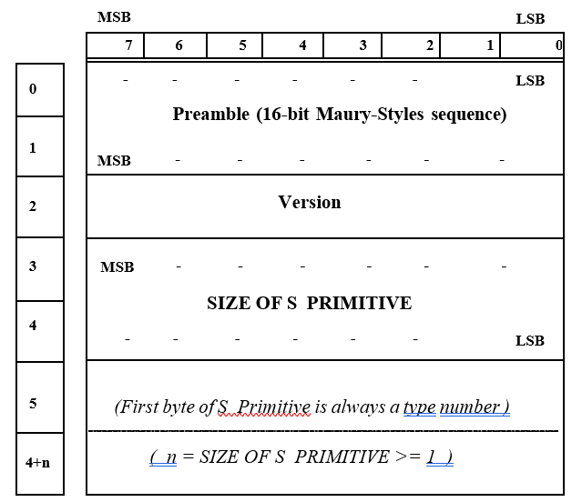

**Figure A-1(a): Element-Sequence Encoding of “S\_” Primitives**

> The S\_Primitive preamble field **shall** (2) be encoded as the 16-bit Maury-Styles sequence shown below, with the least significant bit (LSB) transmitted first over the interface:
>
> (MSB) 1 1 1 0 1 0 1 1 1 0 0 1 0 0 0 0 (LSB)
>
> i.e., with the multi-byte S\_Primitive field represented in hexadecimal form as 0xEB90, the least-significant bits of the sequence **shall** (3) be encoded in the first byte (i.e, byte number 0) of the preamble field and the most significant bits of the sequence **shall** (4) be encoded in the second byte (i.e, byte number 1) of the preamble field as follows:

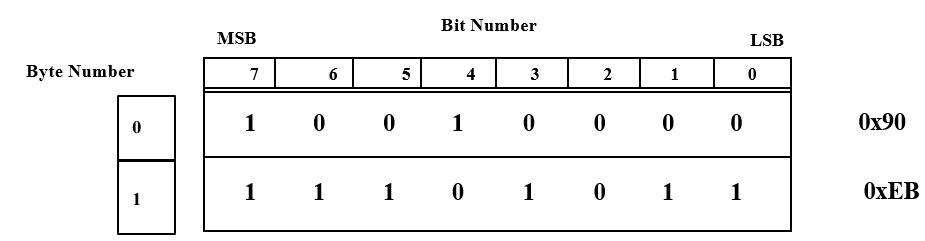

> **Figure A-1(b): Encoding of Maury-Styles Preamble-Sequence in “S\_” Primitives**
>
> \[***<u>Note</u>***: This encoding of the Maury-Styles preamble sequence is an exception to the general requirement of section 2.2.1 for field encoding.\]
>
> Following the Maury-Styles sequence, the next 8 bit (1-byte) field **shall** (5) encode the 5066 version number. For this version of STANAG 5066, the version number **shall** (6) be all zeros, i.e, the hexadecimal value 0x00, as follows:
>
> 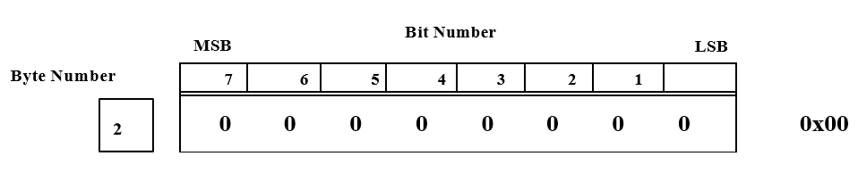
>
> **Figure A-1(c): Encoding of Version Number in “S\_” Primitives**
>
> The next 16 bit (two-byte) field **shall** (7) encode the size in bytes of the S\_primitive-dependent field to follow, exclusive of the Maury-Styles sequence, version field, and this size field. The LSB of the of the size value **shall** (8) be mapped into the low order bit of the low-order byte of the field, as follows:
>
> 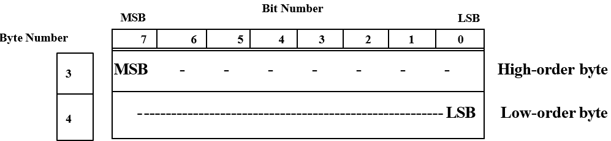
>
> **Figure A-1(d): Encoding of Size\_of\_S\_Primitive Element in “S\_” Primitives**
>
> Unless specified otherwise, the order of bit transmission for each byte in the encoded S\_Primitive **shall** (9) be as described in CCITT V.42 paragraph 8.1.2.2, which specifies the least significant bit (LSB, bit 0 in the figures below) of byte 0 **shall** (10) be transmitted first.
>
> The sixth byte (i.e., byte number 5) of the sequence **shall** (11) be the first byte of the encoded primitive and **shall** (12) be equal to the S\_Primitive type number, with values encoded in accordance with the respective section that follows for each S\_primitive
>
> The remaining bytes, if any, in the S\_Primitive **shall** (13) be transmitted sequentially, also beginning with the LSB of each byte, in accordance with the respective section that follows for each S\_primitive.
>
> In the subsections that follow, any bits in a S\_Primitive that are specified as NOT USED **shall** (13) be encoded with the value “0” unless specified otherwise for the specific S\_Primitive being defined.

1.  S\_BIND\_REQUEST Encoding

> The S\_BIND\_REQUEST primitive **shall** (1) be encoded as a four-byte field as follows:
>
> 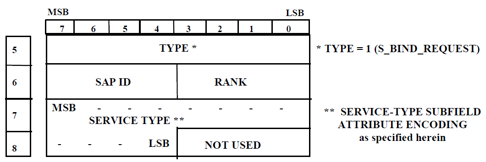
>
> **Figure A-2: Encoding of S\_BIND\_REQUEST Primitive**
>
> The S\_BIND\_REQUEST SERVICE-TYPE field **shall** (2) be encoded as five subfields as follows:
>
> 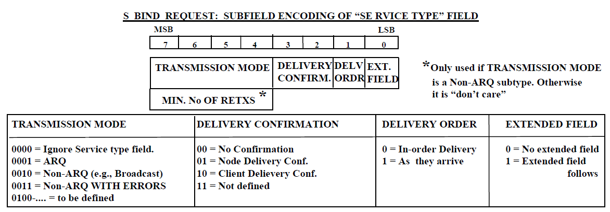
>
> **Figure A-3: Sub-field Attribute Encoding of S\_BIND\_REQUEST SERVICE-TYPE field.**
>
> Argument : SERVICE TYPE Primitive : S\_BIND\_REQUEST
>
> The SERVICE TYPE argument **shall** (3) specify the default type of service requested by the client. This type of service **shall** (4) apply to any U\_PDU submitted by the client until the client unbinds itself from the node, unless overridden by the DELIVERY MODE argument of the U\_PDU. A client **shall** (5) change the default service type only by unbinding and binding again with a new S\_BIND\_REQUEST.
>
> The SERVICE TYPE argument is complex, consisting of a number of attributes encoded as sub-fields. Although the exact number of attributes and their encoding is left for future definition and enhancement using the Extended Field attribute, the following attributes are mandatory:

1.  *Transmission Mode for the Service.* --- ARQ or Non-ARQ Transmission Mode **shall**(6) be specified, with one of the Non-ARQ submodes if Non-ARQ was requested. A value of “0” for this attribute **shall**(7) be invalid for the SERVICE TYPE argument when binding. Non-ARQ transmission can have submodes such as: *Error-Free-Only* delivery to destination client, delivery to destination client even with *some* errors.

2.  *Data Delivery Confirmation for the Service* --- The client **shall** (8) request one of the Data Delivery Confirmation modes for the service. There are three types of data delivery confirmation:

    -   None

    -   Node-to-Node Delivery Confirmation

    -   Client-to-Client Delivery Confirmation

> The client can request explicit confirmation, i.e, Node-to-Node or Client-to-Client, from the Subnetwork to provide indication that its U\_PDUs have been properly delivered to their destination. Explicit delivery confirmation **shall** (9) be requested only in combination with ARQ delivery.
>
> \[Note: The Node-to-Node Delivery Confirmation does not require any explicit peer-to-peer communication between the Subnetwork Interface Sublayers and hence it does not introduce extra overhead. It simply uses the ACK (ARQ) confirmation provided by the Data Transfer Sublayer. Client-to-Client Delivery Confirmation requires explicit peer-to-peer communication between the Sublayers and therefore introduces overhead. It should be used only when it is absolutely critical for the client to know whether or not its data was delivered to the destination client (which may, for instance, be disconnected).\]

1.  *Order of delivery of any U\_PDU to the receiving client.* --- A client **shall** (10) request that its U\_PDUs are delivered to the destination client “in-order” (as they are submitted) or in the order they are received by the destination node.

2.  *Extended Field* --- Denotes if additional fields in the SERVICE TYPE argument are following; at present this capability of the SERVICE TYPE is undefined, and the value of the Extended Field Attribute **shall** (11) be set to “0”.

3.  *Minimum Number of Retransmissions* --- This argument **shall** (12) be valid if and only if the Transmission Mode is a Non-ARQ type. If the Transmission Mode is a Non-ARQ type, then the subnetwork **shall** (13) retransmit each U\_PDU the number of times specified by this argument. This argument may be “0”, in which case the U\_PDU is sent only once.

> \[Note: In non-ARQ Mode, automatic retransmission a minimum number of times may be used to improve the reliability of broadcast transmissions where a return link from the receiver is unavailable for explicit retransmission requests.\]

1.  S\_UNBIND\_REQUEST Encoding

> The S\_UNBIND\_REQUEST primitive **shall** (1) be encoded as a one-byte field as follows:
>
> 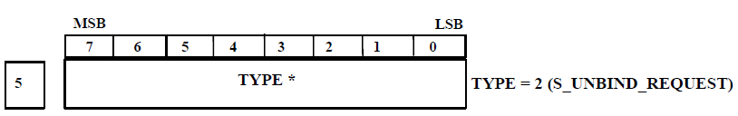
>
> **Figure A-4: Encoding of S\_UNBIND\_REQUEST Primitive**

1.  S\_BIND\_ACCEPTED Encoding

> The S\_BIND\_ACCEPTED primitive **shall** (1) be encoded as a four-byte field as follows:
>
> 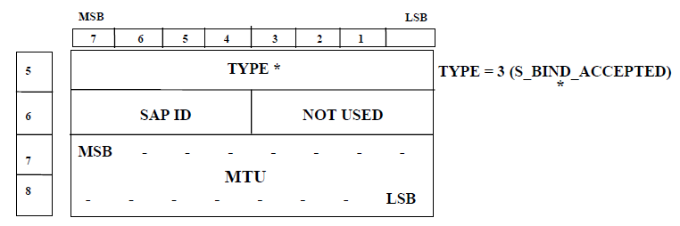
>
> **Figure A-5: Encoding of S\_BIND\_ACCEPTED Primitive**

1.  S\_BIND\_REJECTED Encoding

> The S\_BIND\_REJECTED primitive **shall** (1) be encoded as a two-byte field as follows:
>
> 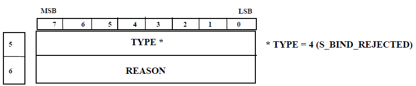
>
> **Figure A-6: Encoding of S\_BIND\_REJECTED Primitive**

1.  S\_UNBIND\_INDICATION Encoding

> The S\_UNBIND\_INDICATION primitive **shall** (1) be encoded as a two-byte field as follows:
>
> 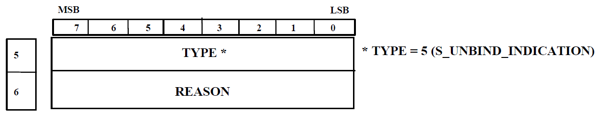
>
> **Figure A-7: Encoding of S\_UNBIND\_INDICATION Primitives**

1.  S\_HARD\_LINK\_ESTABLISH Encoding

> The S\_HARD\_LINK\_ESTABLISH primitive **shall** (1) be encoded as a six-byte field as follows:
>
> 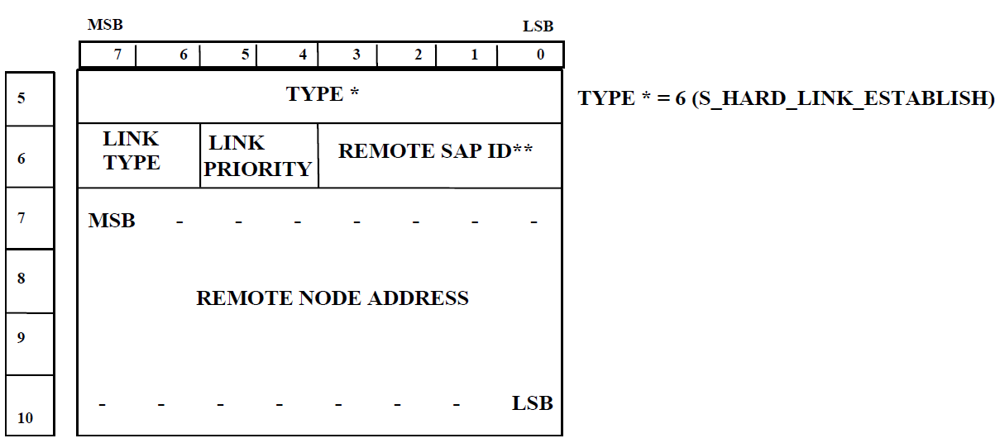
>
> **Figure A-8: Encoding of S\_HARD\_LINK\_ESTABLISH Primitives**
>
> The REMOTE NODE ADDRESS field **shall** (2) be encoded as specified in Section A.2.2.28.1. The LINK TYPE field **shall** (3) be encoded as specified in Section A.2.2.28.4.

1.  S\_HARD\_LINK\_TERMINATE Encoding

> The S\_HARD\_LINK\_TERMINATE primitive **shall** (1) be encoded as a five-byte field as follows:
>
> 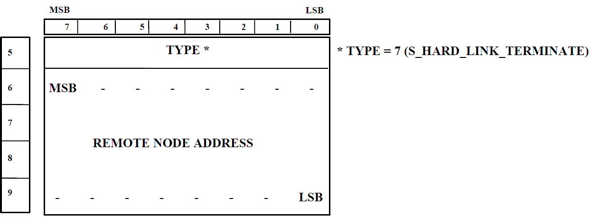
>
> **Figure A-9: Encoding of S\_HARD\_LINK\_TERMINATE Primitives**
>
> The REMOTE NODE ADDRESS field **shall** (2) be encoded as specified in Section A.2.2.28.1. The LINK TYPE field **shall** (3) be encoded as specified in Section A.2.2.28.4.

1.  S\_HARD\_LINK\_ESTABLISHED Encoding

> The S\_HARD\_LINK\_ESTABLISHED primitive **shall** (1) be encoded as a seven-byte field as follows:
>
> 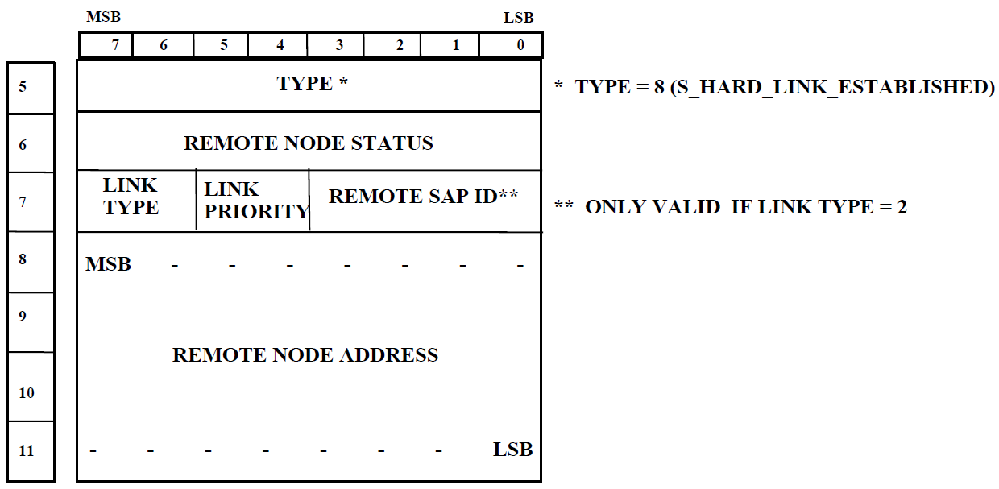
>
> **Figure A-10: Encoding of S\_HARD\_LINK\_ESTABLISHED Primitives.**
>
> The REMOTE NODE ADDRESS field **shall** (2) be encoded as specified in Section A.2.2.28.1. The LINK TYPE field **shall** (3) be encoded as specified in Section A.2.2.28.4.

1.  S\_HARD\_LINK\_REJECTED Encoding

> The S\_HARD\_LINK\_REJECTED primitive **shall** (1) be encoded as a seven-byte field as follows:
>
> 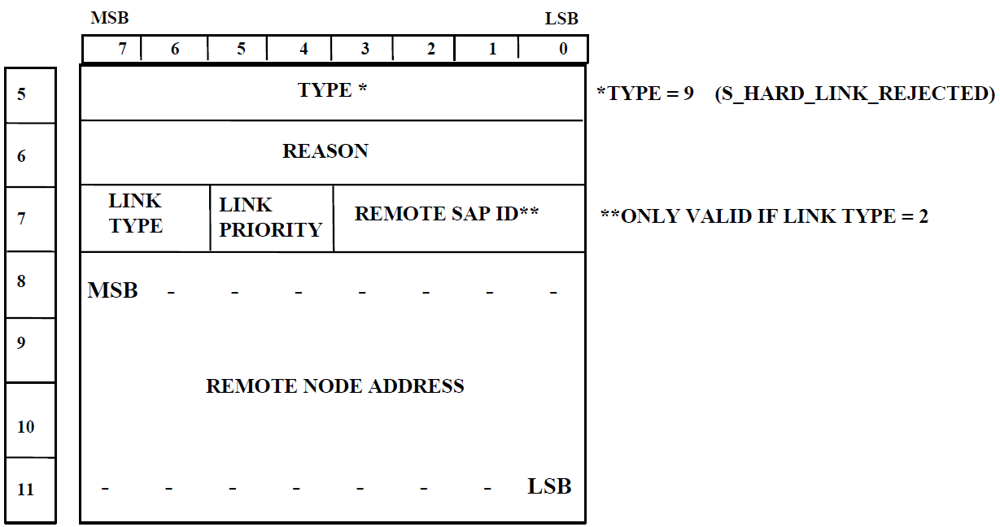
>
> **Figure A-11: Encoding of S\_HARD\_LINK\_REJECTED Primitives.**
>
> The REMOTE NODE ADDRESS field **shall** (2) be encoded as specified in Section A.2.2.28.1. The LINK TYPE field **shall** (3) be encoded as specified in Section A.2.2.28.4.

1.  S\_HARD\_LINK\_TERMINATED Encoding

> The S\_HARD\_LINK\_TERMINATED primitive **shall** (1) be encoded as a seven-byte field as follows:
>
> 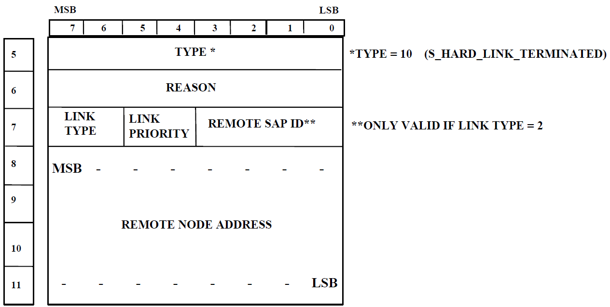
>
> **Figure A-12: Encoding of S\_HARD\_LINK\_TERMINATED Primitives.**
>
> The REMOTE NODE ADDRESS field **shall** (2) be encoded as specified in Section A.2.2.28.1. The LINK TYPE field **shall** (3) be encoded as specified in Section A.2.2.28.4.

1.  S\_HARD\_LINK\_INDICATION Encoding

> The S\_HARD\_LINK\_INDICATION primitive **shall** (1) be encoded as a seven-byte field as follows:
>
> 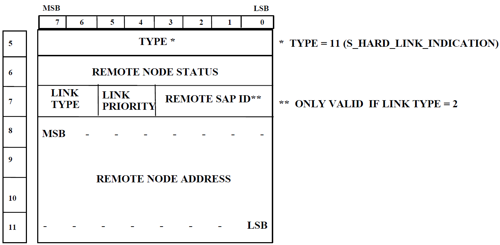
>
> **Figure A-13: Encoding of S\_HARD\_LINK\_INDICATION Primitives.**
>
> The REMOTE NODE ADDRESS field **shall** (2) be encoded as specified in Section A.2.2.28.1. The LINK TYPE field **shall** (3) be encoded as specified in Section A.2.2.28.4.

1.  S\_HARD\_LINK\_ACCEPT Encoding

> The S\_HARD\_LINK\_ACCEPT primitive **shall** (1) be encoded as a six-byte field as follows:
>
> 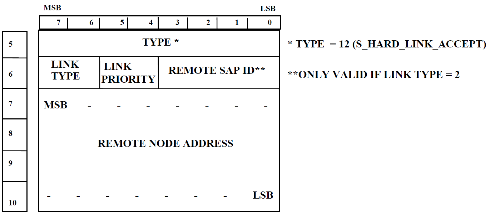
>
> **Figure A-14: Encoding of S\_HARD\_LINK\_ACCEPT Primitives**
>
> The REMOTE NODE ADDRESS field **shall** (2) be encoded as specified in Section A.2.2.28.1. The LINK TYPE field **shall** (3) be encoded as specified in Section A.2.2.28.4.

1.  S\_HARD\_LINK\_REJECT Encoding

> The S\_HARD\_LINK\_REJECT primitive **shall** (1) be encoded as a seven-byte field as follows:
>
> 
>
> **Figure A-15: Encoding of S\_HARD\_LINK\_REJECT Primitives.**
>
> The REMOTE NODE ADDRESS field **shall** (2) be encoded as specified in Section A.2.2.28.1. The LINK TYPE field **shall** (3) be encoded as specified in Section A.2.2.28.4.

1.  S\_SUBNET\_AVAILABILITY Encoding

> The S\_SUBNET\_AVAILABILITY primitive **shall** (1) be encoded as a three-byte field as follows:
>
> 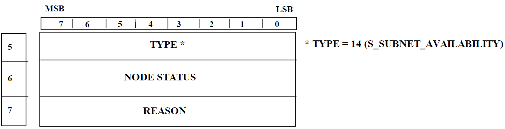
>
> **Figure A-16: Encoding of S\_SUBNET\_AVAILABILITY Primitives.**
>
> The encoding of the NODE STATUS and REASON fields is implementation dependent.

1.  S\_DATA\_FLOW\_ON and S\_DATA\_FLOW\_OFF Encoding

> The S\_DATA\_FLOW\_ON and S\_DATA\_FLOW\_OFF primitives **shall** (1) be encoded as one-byte fields as follows:
>
> 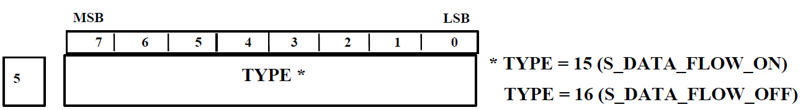
>
> **Figure A-17: Encoding of S\_DATA\_FLOW\_ON and S\_DATA\_FLOW\_OFF Primitives.**

1.  S\_KEEP\_ALIVE Encoding

> The S\_KEEP\_ALIVE primitive **shall** (1) be encoded as a one-byte field as follows:
>
> 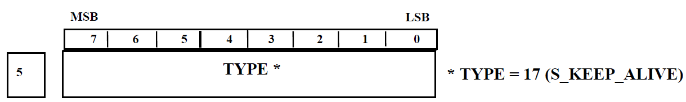
>
> **Figure A-18: Encoding of S\_DATA\_FLOW\_ON and S\_DATA\_FLOW\_OFF Primitives.**

1.  S\_MANAGEMENT\_MSG\_REQUEST and S\_MANAGEMENT\_ MSG\_INDICATION

> Encoding
>
> The S\_MANAGEMENT\_MSG\_REQUEST and S\_MANAGEMENT\_MSG\_ INDICATION primitives
>
> **shall** (1) be encoded as implementation-dependent variable-length fields as follows:
>
> 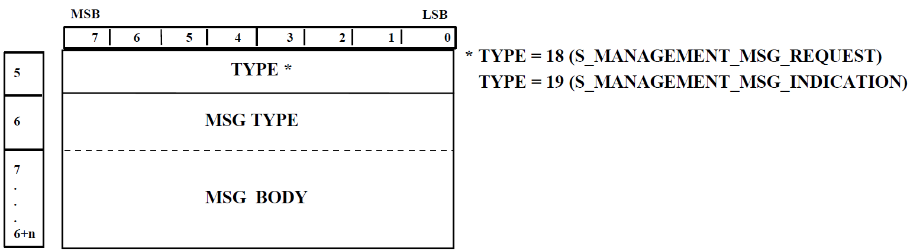
>
> **Figure A-19:: Encoding of S\_MANAGEMENT\_MSG\_REQUEST and S\_MANAGEMENT\_MSG\_INDICATION Primitives.**
>
> The encoding of the MSG TYPE and MSG BODY fields is implementation dependent.

1.  S\_UNIDATA\_REQUEST Encoding

> The S\_UNIDATA\_REQUEST primitive **shall** (1) be encoded as a variable-length field as follows:
>
> 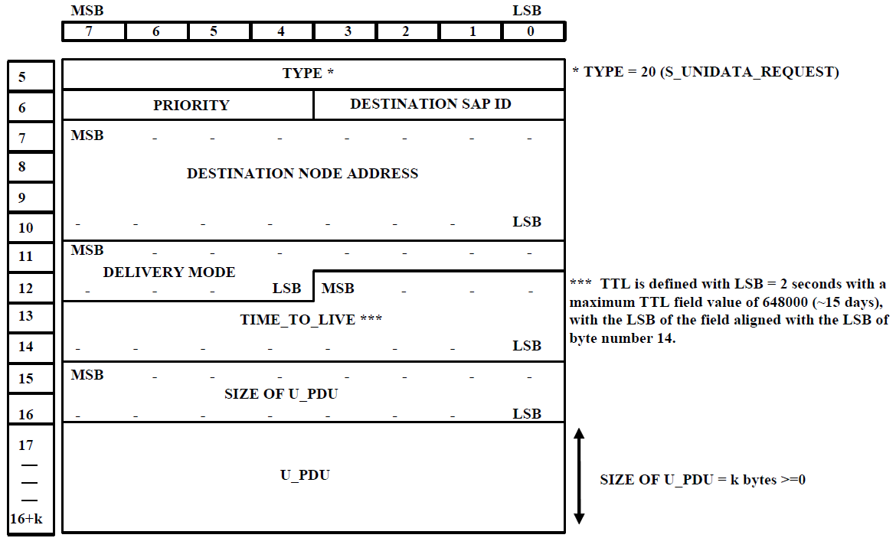
>
> **Figure A-20: Encoding of S\_UNIDATA\_REQUEST Primitives.**
>
> The SOURCE NODE ADDRESS and DESTINATION NODE ADDRESS fields **shall** (2) be encoded as specified in Section A.2.2.28.1.
>
> The DELIVERY MODE field **shall** (3) be encoded as specified in Section A.2.2.28.2.

1.  S\_UNIDATA\_INDICATION Encoding

> The S\_UNIDATA\_INDICATION primitive **shall** (1) be encoded as a variable-length field as follows:
>
> 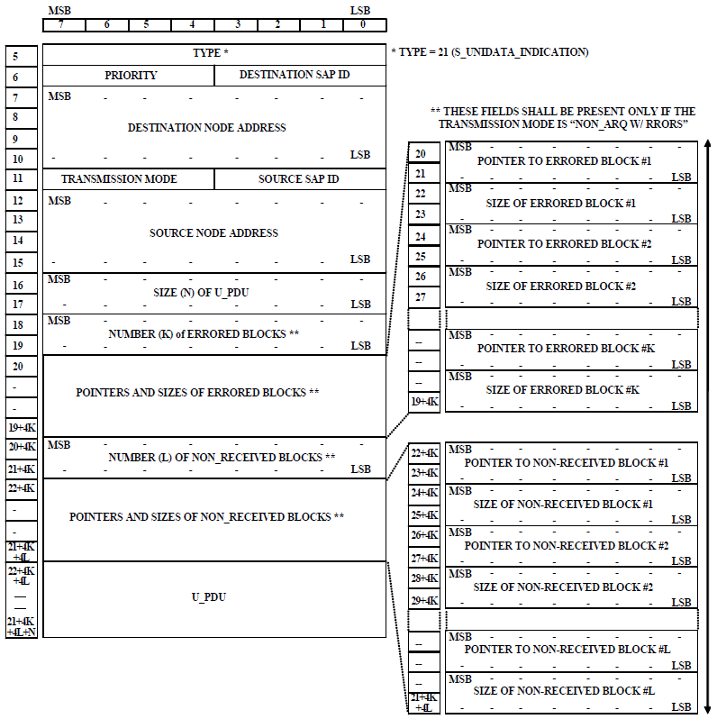
>
> **Figure A-21: Encoding of S\_UNIDATA\_INDICATION Primitives**
>
> The SOURCE NODE ADDRESS and DESTINATION NODE ADDRESS fields **shall** (2) be encoded as specified in Section A.2.2.28.1.
>
> The TRANSMISSION MODE field **shall** (3) be encoded as specified in Section A.2.2.28.3.S\_UNIDATA\_REQUEST\_CONFIRM Encoding
>
> The S\_UNIDATA\_REQUEST\_CONFIRM primitive **shall** (1) be encoded as a variable-length field as follows:
>
> 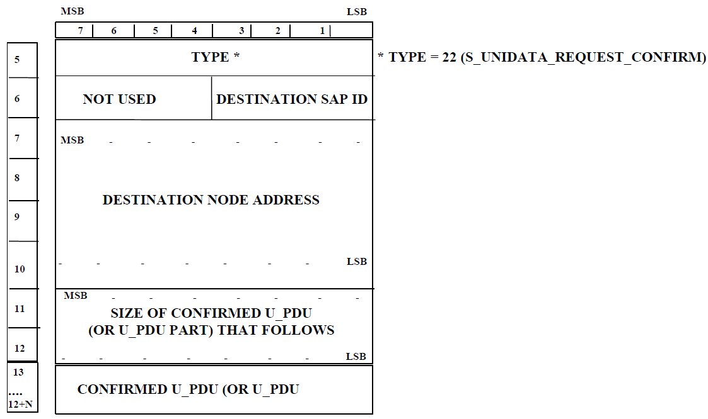
>
> **Figure A-22: Encoding of S\_UNIDATA\_REQUEST\_CONFIRM Primitives.**
>
> The DESTINATION NODE ADDRESS field **shall** (2) be encoded as specified in Section A.2.2.28.1.

1.  S\_UNIDATA\_REQUEST\_REJECTED Encoding

> The S\_UNIDATA\_REQUEST\_REJECTED primitive **shall** (1) be encoded as a variable-length field as follows:
>
> 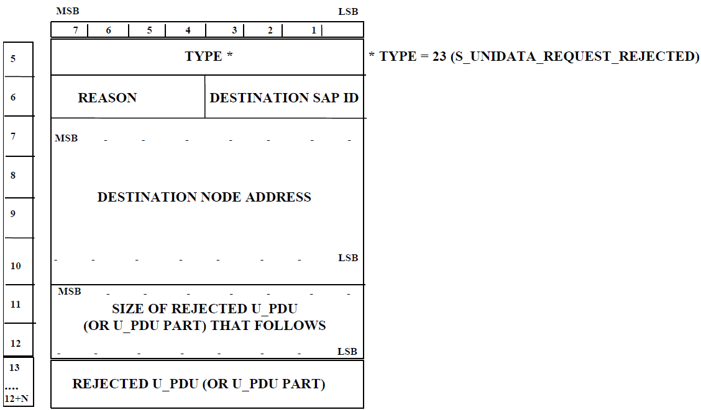
>
> **Figure A-23: Encoding of S\_UNIDATA\_REQUEST\_REJECTED Primitives.**
>
> The DESTINATION NODE ADDRESS field **shall** (2) be encoded as specified in Section A.2.2.28.1.

1.  S\_EXPEDITED\_UNIDATA\_REQUEST Encoding

> The S\_EXPEDITED\_UNIDATA\_REQUEST primitive **shall** (1) be encoded as a variable-length field as follows:
>
> 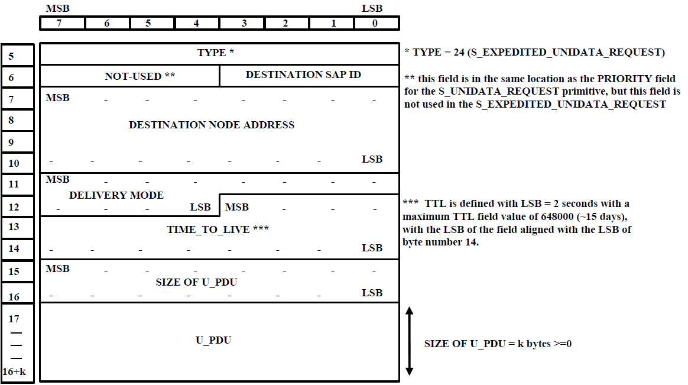
>
> **Figure A-24: Encoding of S\_EXPEDITED\_UNIDATA\_REQUEST Primitives.**
>
> The DESTINATION NODE ADDRESS field **shall** (2) be encoded as specified in Section A.2.2.28.1. The DELIVERY MODE field **shall** (3) be encoded as specified in Section A.2.2.28.2.

1.  S\_EXPEDITED\_UNIDATA\_INDICATION Encoding

> The S\_EXPEDITED\_UNIDATA\_INDICATION primitive **shall** (1) be encoded as a variable-length field as follows:

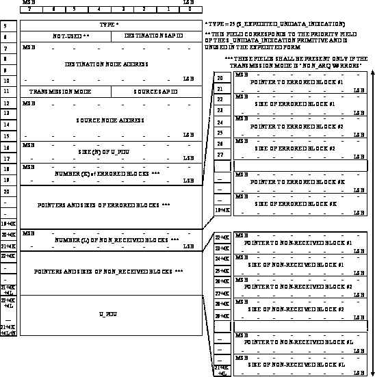

> **Figure A-25: Encoding of S\_EXPEDITED\_UNIDATA\_INDICATION Primitives**
>
> The SOURCE NODE ADDRESS and DESTINATION NODE ADDRESS fields **shall** (2) be encoded as specified in Section A.2.2.28.1.
>
> The TRANSMISSION MODE field **shall** (3) be encoded as specified in Section A.2.2.28.3.

1.  S\_EXPEDITED\_UNIDATA\_REQUEST\_CONFIRM Encoding

> The S\_EXPEDITED\_UNIDATA\_REQUEST\_CONFIRM primitive **shall** (1) be encoded as a variable-length field as follows:
>
> 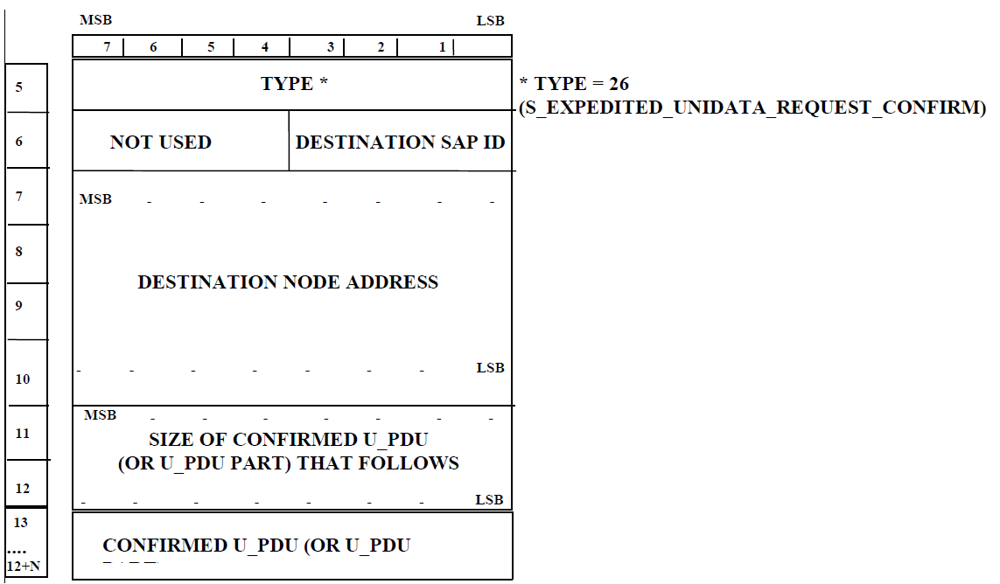
>
> **Figure A-26: Encoding of S\_EXPEDITED\_UNIDATA\_REQUEST\_CONFIRM Primitives.**
>
> The DESTINATION NODE ADDRESS field **shall** (2) be encoded as specified in Section A.2.2.28.1.

1.  S\_EXPEDITED\_UNIDATA\_REQUEST\_REJECTED Encoding

> The S\_EXPEDITED\_UNIDATA\_REQUEST\_REJECTED primitive **shall** (1) be encoded as a variable-length field as follows:
>
> 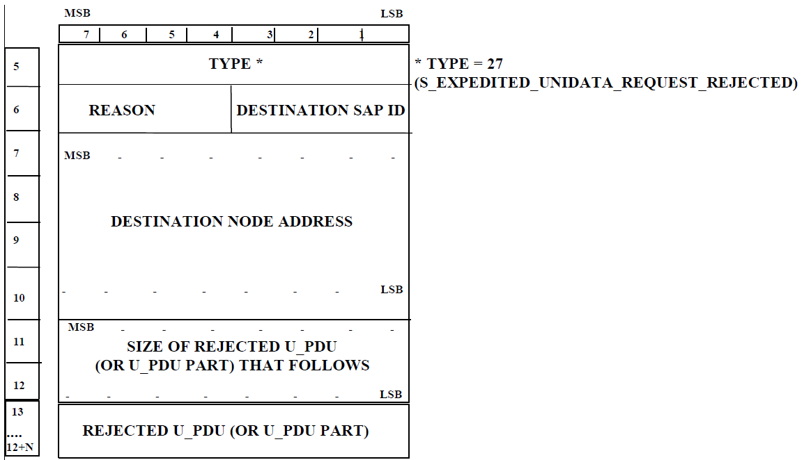
>
> **Figure A-27: Encoding of S\_EXPEDITED\_UNIDATA\_REQUEST\_REJECTED Primitives.**
>
> The DESTINATION NODE ADDRESS field **shall** (2) be encoded as specified in Section A.2.2.28.1.

1.  Additional S\_Primitive Encoding Requirements: Encoding of Common Fields

> In order to clarify some of the procedures and tasks executed by the sublayers, additional details concerning some of the arguments of the Primitives described in previous sections are provided below.

1.  Node ADDRESS Encoding for all Primitives

> Arguments : SOURCE NODE ADDRESS, DESTINATION NODE ADDRESS, or REMOTE NODE ADDRESS
>
> Primitives : ALL “UNIDATA” primitives and “S\_HARD\_LINK” primitives.
>
> For reduced overhead in transmission, node addresses **shall** (1) be encoded in one of several formats that are multiples of 4-bits (“half-bytes”) in length, as specified in Figure A-28.
>
> Addresses that are encoded as Group node addresses **shall** (2) only be specified as the Destination Node address of Non-ARQ PDUs.
>
> Destination SAP IDs and destination node addresses of ARQ PDUs and source SAP IDs and source node addresses of all PDUs **shall** (3) be individual SAP IDs and individual node addresses respectively.
>
> Remote node addresses and remote SAP IDs of all “S\_HARD\_LINK” primitives **shall** (3) be individual SAP IDs and individual node addresses respectively.
>
> 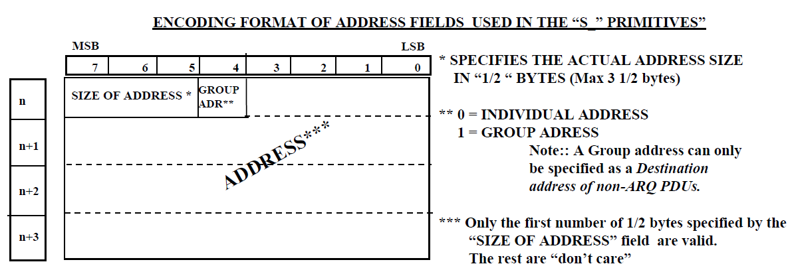
>
> **Figure A-28: Encoding of Address Fields in S\_Primitives.**

1.  Delivery-Mode Encoding for the S\_UNIDATA\_REQUEST and S\_EXPEDITED\_UNIDATA\_REQUEST Primitives

> Argument : DELIVERY MODE
>
> Primitive : S\_UNIDATA\_REQUEST , S\_EXPEDITED\_UNIDATA\_REQUEST
>
> The DELIVERY MODE is a complex argument consisting of a number of attributes, as specified here. The DELIVERY MODE argument **shall** (1) be encoded as shown in Figure A-29.
>
> The value of the DELIVERY MODE argument can be “DEFAULT”, as encoded by the Transmission Mode attribute. With a value of “DEFAULT”, the delivery mode for this U\_PDU **shall** (2) be the delivery mode specified in the *Service Type* argument of the S\_BIND\_REQUEST. A non-DEFAULT value **shall** (3) override the default settings of the Service Type for this U\_ PDU.
>
> The attributes of this argument are similar to those described in the *Service Type* argument of the S\_BIND\_REQUEST:

1.  *Transmission Mode of this U\_PDU.* --- ARQ or Non-ARQ Transmission can be requested. A value of “0” for this attribute **shall** (4) equal the value “DEFAULT” for the Delivery Mode. If the DELIVERY MODE is “DEFAULT”, all other attributes encoded in the argument **shall**

> (5) be ignored.

1.  *Data Delivery Confirmation for this PDU* --- None, node-to-node, or client-to-client.

2.  *Order of delivery of this PDU to the receiving client.* --- A client may request that its U\_PDUs are delivered to the destination client “in-order” (as they are submitted) or in the order they are received by the destination node.

3.  *Extended Field* --- Denotes if additional fields in the DELIVERY MODE argument are following; at present this capability of the DELIVERY MODE is undefined, and the value of the Extended Field Attribute **shall** (6) be set to “0”.

4.  *Minimum Number of Retransmissions* --- This argument **shall** (7) be valid if and only if the Transmission Mode is a Non-ARQ type or sub-type. If the Transmission Mode is a Non-ARQ type or subtype, then the subnetwork **shall** (8) retransmit each U\_PDU the number of times specified by this argument. This argument may be “0”, in which case the U\_PDU is sent only once.

> \[Note: In non-ARQ Mode, automatic retransmission a minimum number of times may be used to improve the reliability of broadcast transmissions where a return link from the receiver is unavailable for explicit retransmission requests.\]

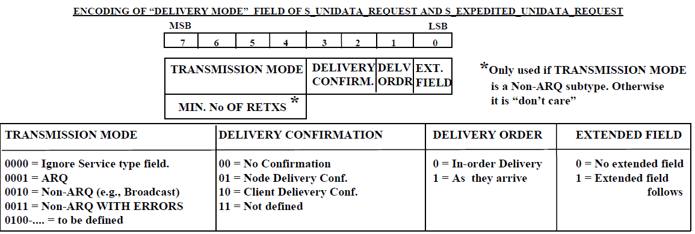

> **Figure A-29: Encoding of the Delivery Mode field in the S\_UNIDATA\_REQUEST and S\_EXPEDITED\_UNIDATA\_REQUEST primitives**

1.  TRANSMISSION-MODE Encoding for the S\_UNIDATA\_INDICATION and S\_EXPEDITED\_UNIDATA\_INDICATION Primitives

> Argument: TRANSMISSION-MODE
>
> 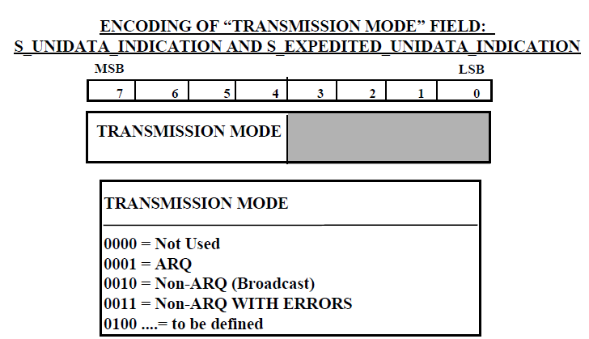S\_Primitives: S\_UNIDATA\_INDICATION, S\_EXPEDITED\_UNIDATA\_INDICATION
>
> **Figure A-30: Encoding of Transmission Mode Field in S\_UNIDATA\_INDICATION or S\_EXPEDITED\_UNIDATA\_INDICATION primitive.**
>
> The subnetwork notifies a client of the transmission-mode used to deliver a U\_PDU or Expedited U\_PDU Argument with the TRANSMISSION-MODE argument. The TRANSMISSION-MODE argument in the S\_UNIDATA\_INDICATION and S\_EXPEDITED\_UNIDATA\_INDICATION Primitives **shall** (1) be encoded as shown in Figure A-30.
>
> \[Note: The unused bits in this argument are allocated to the SOURCE SAP\_ID argument encoding for both the S\_UNIDATA\_INDICATION and S\_EXPEDITED\_UNIDATA\_INDICATION Primitives.\]

1.  Link-Type Encoding in S\_Primitives Argument: LINK TYPE

> S\_Primitives: S\_HARD\_LINK\_ESTABLISH, S\_HARD\_LINK\_ESTABLISHED, S\_HARD\_LINK\_REJECTED, S\_HARD\_LINK\_ACCEPT, S\_HARD\_LINK\_INDICATION, S\_HARD\_LINK\_REJECT, S\_HARD\_LINK\_TERMINATED
>
> A client uses the Link-Type argument to reserve partially or fully the capacity of the Hard Link. This argument can have three values:

-   A value of 0 **shall** (1) indicate that the physical link to the specified node address is a Type 0 Hard Link. The Type 0 Hard Link must be maintained, but all clients connected to the two nodes can make use of the link capacity according to normal procedures, i.e. there is no bandwidth reservation.

-   A value of 1 **shall** (2) indicate that the physical link to the specified node address is a Type 1 Hard Link. The Type 1 Hard Link must be maintained and traffic is only allowed between the requesting client and any of the clients on the remote Node, i.e., there is partial bandwidth reservation.

-   A value of 2 indicates that the physical link to the specified node address must be maintained and traffic is only allowed between the requesting Client and the specific Client on the remote node specified by the remote SAP ID argument, i.e. full bandwidth reservation.

1.  <u>Peer-to-Peer Communication Protocols and S\_PDUs</u>

> Peer Subnetwork Interface Sublayers, generally in different nodes, **shall** (1) communicate with each other by the exchange of Subnetwork Interface Sublayer Protocol Data Units (S\_PDUs).
>
> For the Subnetwork configurations currently defined in STANAG 5066, Peer-to-Peer Communication
>
> **shall** be (2) required for the:

1.  Establishment and Termination of Hard Link Data Exchange Sessions

2.  Exchange of Client Data

> Explicit Peer-to-Peer communication **shall** (3) not be required for the establishment or termination of Soft Link or Broadcast Data Exchange sessions.
>
> The Peer-to-Peer communication required for the exchange of Client Data is similar for all Data exchange sessions, using the facilities of lower sublayers in the protocol profile. The encoding of the S\_PDUs and the protocol governing the Peer-to-Peer Communication are described in the following sections.

1.  <u>Subnetwork Interface Sublayer Protocol Data Units (S\_PDUS) and Encoding Requirements</u>

> There are currently eight types of S\_PDUs. Additional S\_PDU types may be defined in the future. The generic encoding of the eight S\_PDU types showing the fields and subfields of the S\_PDUs is shown in Figure A-31.
>
> 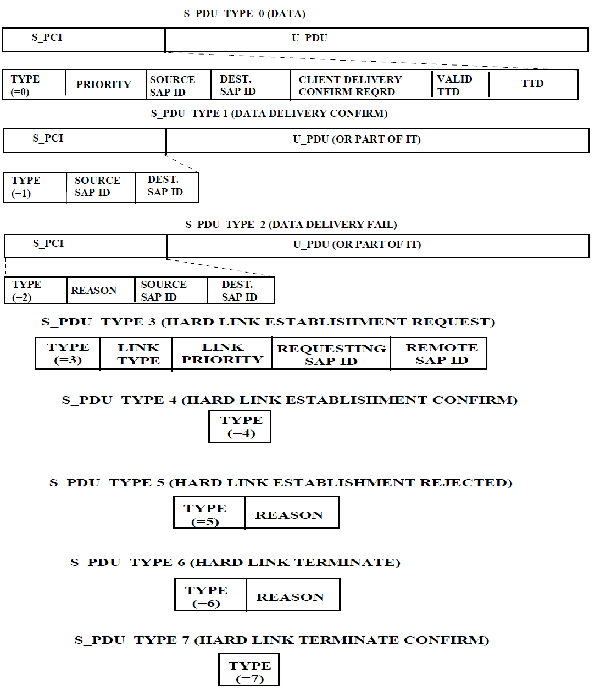

**Figure A-31: Generic Encoding of S\_PDUs**

> The first encoded field **shall** (1) be common to all S\_PDUs. It is called “TYPE” and **shall** (2) encode the type value of the S\_PDU as follows:

<table>
<colgroup>
<col style="width: 28%" />
<col style="width: 71%" />
</colgroup>
<thead>
<tr class="header">
<th><blockquote>

S_PDU TYPE

field value

</blockquote></th>
<th><blockquote>

S_PDU Name

</blockquote></th>
</tr>
</thead>
<tbody>
<tr class="odd">
<td><blockquote>

0

</blockquote></td>
<td><blockquote>

DATA

</blockquote></td>
</tr>
<tr class="even">
<td><blockquote>

1

</blockquote></td>
<td><blockquote>

DATA DELIVERY CONFIRM

</blockquote></td>
</tr>
<tr class="odd">
<td><blockquote>

2

</blockquote></td>
<td><blockquote>

DATA DELIVERY FAIL

</blockquote></td>
</tr>
<tr class="even">
<td><blockquote>

3

</blockquote></td>
<td><blockquote>

HARD LINK ESTABLISHMENT REQUEST

</blockquote></td>
</tr>
<tr class="odd">
<td><blockquote>

4

</blockquote></td>
<td><blockquote>

HARD LINK ESTABLISHMENT CONFIRM

</blockquote></td>
</tr>
<tr class="even">
<td><blockquote>

5

</blockquote></td>
<td><blockquote>

HARD LINK ESTABLISHMENT REJECTED

</blockquote></td>
</tr>
<tr class="odd">
<td><blockquote>

6

</blockquote></td>
<td><blockquote>

HARD LINK TERMINATE

</blockquote></td>
</tr>
<tr class="even">
<td><blockquote>

7

</blockquote></td>
<td><blockquote>

HARD LINK TERMINATE CONFIRM

</blockquote></td>
</tr>
</tbody>
</table>

> The meaning and encoding of the remaining fields, if any, in an S\_PDU **shall** (3) be as specified in the subsection below corresponding to the S\_PDU type.

1.  DATA S\_PDU

# Type :

> “0” = DATA S\_PDU

# 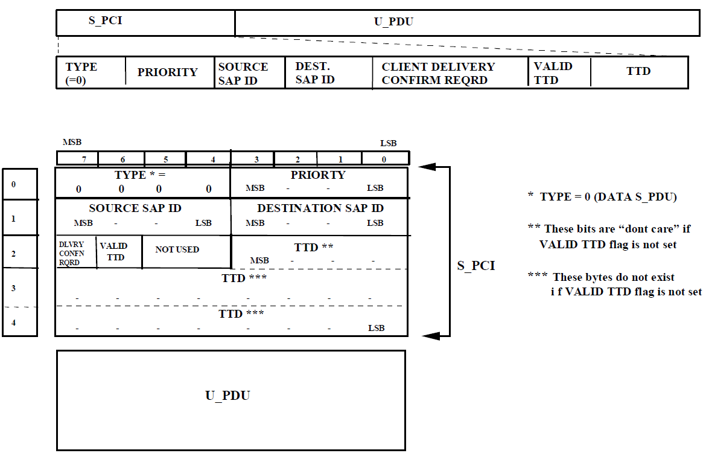Encoding :

# 

> **Figure A-32: Generic Encoding and Bit-Field Map of the DATA S\_PDU**

# 

# Description :

> The DATA S\_PDU **shall** (1) be transmitted by the Subnetwork Interface Sublayer in order to send client data to a remote peer sublayer.
>
> The DATA S\_PDU **shall** (2) be encoded as specified in Figure A-32 and in the paragraphs below.
>
> This S\_PDU **shall** (3) consist of two parts:

1.  the first part **shall** (4) be the S\_PCI (Subnetwork Interface Sublayer Protocol Control Information) and represents the overhead added by the sublayer;

2.  the second part **shall** (5) be the actual client data (U\_PDU).

> The first field of four bits the S\_PCI part **shall** (6) be “TYPE”. Its value **shall** (7) be equal to 0 and identifies the S\_PDU as being of type DATA.
>
> The second field of four bits **shall** (8) be “PRIORITY” and represents the priority of the client’s U\_PDU. The “PRIORITY” field **shall** (9) be equal in value to the corresponding argument of the S\_UNIDATA\_REQUEST primitive submitted by the client. For U\_PDUs submitted with an S\_EXPEDITED\_UNIDATA\_REQUEST, the PRIORITY field **should** be set to 0.
>
> The third field of four bits of the S\_PCI **shall** (10) be the “SOURCE SAP ID” and identifies the client of the transmitting peer which sent the data.
>
> The fourth field of four bits **shall** (11) be the “DESTINATION SAP ID” and identifies the client of the receiving peer which must take delivery of the data. There is no need to encode the source and destination node addresses in the S\_PDU as this information is relayed between the peers by the underlying sublayers. The “DESTINATION SAP ID” **shall** (12) be equal in value to the corresponding argument of the S\_UNIDATA\_REQUEST or S\_EXPEDITED\_UNIDATA\_REQUEST primitive
>
> submitted by the client
>
> The fifth field of the S\_PCI **shall** (13) be “CLIENT DELIVERY CONFIRM REQUIRED”, and is encoded as a single bit that can take the values “YES” (=1) or “NO” (=0). The value of this bit **shall** (14) be set according to the *Service Type* requested by the sending client during binding (see S\_BIND\_REQUEST primitive) or according to the *Delivery Mode* requested explicitly for this U\_PDU (see S\_UNIDATA\_REQUEST
>
> Primitive or S\_EXPEDITED\_UNIDATA\_REQUEST Primitive).
>
> The sixth field **shall** (15) be the VALID TTD field, and is encoded as a single bit that can take the values “YES” (=1) or “NO” (=0), indicating the presence of a valid TTD within the S\_PCI.
>
> The seven field of the S\_PCI **shall** (14) be two unused bits that are reserved for future use.
>
> The eighth and last field of the S\_PCI **shall** (15) be “TTD” and represents the TimeToDie for this U\_PDU. The first four bits of this field **shall** (16) have meaning if and only if the VALID TTD field equals “YES”, the remaining 16 bits of the field **shall** (17) be present in the S\_PCI if and only if the VALID TTD field equals “YES”.
>
> The TTD field encodes the Julian date3 modulo 16, and the GMT in seconds after which time the S\_PDU must be discarded if it has not yet been delivered to the client. The Julian date modulo 16 part of the TTD **shall** (18) be mapped into the first four bits of the TTD field (i.e., bits 0-3 of byte 2 of the S\_PDU).
>
> The 16 high bits of the GMT part of the TTD shall be mapped into the 2 remaining bytes of the TTD field; the LSB of the GMT shall be discarded. If the “VALID TTD” flag bit of a DATA S\_PDU is set (=1) then the complete TTD 20-bit field is present and its value must be used. If this flag bit is not set (=0), the last two bytes of the TTD field are not present (to conserve overhead) and the TTD must not be used. The “VALID TTD” flag bit allows the transmitting peer to specify whether the receiving peer should discard the S\_PDU by based on TTD or it delivered the U\_PDU to the client without consideration of the TTD.

1.  DATA DELIVERY CONFIRM S\_PDU

# Type :

> “1” = DATA DELIVERY CONFIRM

# Encoding :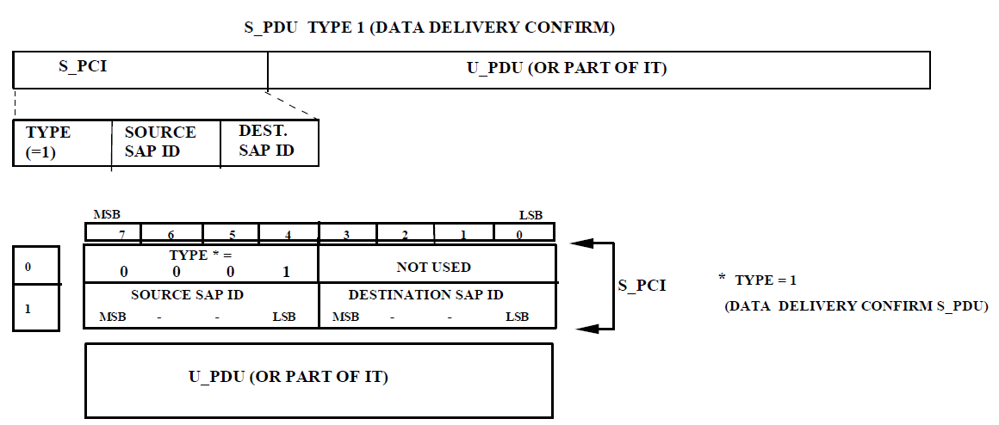

# Figure A-33: Generic Encoding and Bit-Field Maps of the DATA DELIVERY CONFIRM S\_PDU

# Description :

> The DATA DELIVERY CONFIRM S\_PDU **shall** be (1) transmitted in response to a successful delivery to a Client of a U\_PDU which was received in a DATA type S\_PDU in which the “CLIENT DELIVERY CONFIRM REQUIRED” field was set to “YES”. The DATA DELIVERY
>
> CONFIRM S\_PDU **shall** be (2) transmitted by the Subnetwork Interface Sublayer to the peer sublayer which originated the DATA type S\_PDU.
>
> The first part of the DATA DELIVERY CONFIRM S\_PDU **shall** (3) be the S\_PCI, while the second part **shall** (4) be a full or partial copy of the U\_PDU that was received and delivered to the destination Client.
>
> The first field of the S\_PCI part **shall** (5) be “TYPE” and its value **shall** (6) equal 1 to identify the S\_PDU as being of type DATA DELIVERY CONFIRM.
>
> The remaining fields and their values for the S\_PCI part of the DATA DELIVERY CONFIRM S\_PDU **shall** (7) be equal in value to the corresponding fields of the DATA S\_PDU for which this DATA DELIVERY CONFIRM S\_PDU is a response.
>
> The peer sublayer that receives the DATA DELIVERY CONFIRM **shall** (8) inform the client which originated the U\_PDU that its data has been successfully delivered to its Destination by issuing a S\_UNIDATA\_REQUEST\_CONFIRM or a S\_EXPEDITED\_UNIDATA\_REQUEST\_CONFIRM in accordance with the data exchange protocol of Section A.3.2.4.
>
> 3 The simple Julian date system, which numbers the days of the year consecutively starting with 001 on 1 January and ending with 365 on 31 December (or 366 on leap years).

1.  DATA DELIVERY FAIL S\_PDU

# Type :

> “2” = DATA DELIVERY FAIL

# 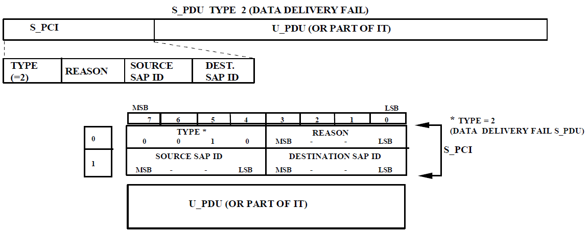Encoding :

> **Figure A-34: Generic Encoding and Bit-Field Map of the DATA DELIVERY FAIL S\_PDU**

# Description :

> The DATA DELIVERY FAIL S\_PDU **shall** (1) be transmitted in response to a failed delivery to a Client of a U\_PDU that was received in a DATA type S\_PDU with the “CLIENT DELIVERY CONFIRM REQUIRED” field set to “YES”.
>
> The first part of this S\_PDU **shall** (2) be the S\_PCI.
>
> The second part **shall** (3) be a full or partial copy of the U\_PDU that was received but not delivered to the destination Client.
>
> The first field of the S\_PCI **shall** (4) be “TYPE”. Its value **shall** (5) be equal to 2 and identifies the S\_PDU as being of type DATA DELIVERY FAIL.
>
> The second field **shall** (6) be “REASON” and explains why the U\_PDU failed to be delivered. It can take a value in the range 0-15; valid reasons are defined in the table below.

<table>
<colgroup>
<col style="width: 64%" />
<col style="width: 35%" />
</colgroup>
<thead>
<tr class="header">
<th><blockquote>

Reason

</blockquote></th>
<th><blockquote>

Value

</blockquote></th>
</tr>
</thead>
<tbody>
<tr class="odd">
<td><blockquote>

<em>Unassigned and reserved</em>

</blockquote></td>
<td><blockquote>

0

</blockquote></td>
</tr>
<tr class="even">
<td><blockquote>

Destination SAP ID not bound

</blockquote></td>
<td><blockquote>

1

</blockquote></td>
</tr>
<tr class="odd">
<td><blockquote>

<em>Unassigned and reserved</em>

</blockquote></td>
<td><blockquote>

2-15

</blockquote></td>
</tr>
</tbody>
</table>

> The SOURCE SAP\_ID and DESTINATION SAP\_ID fields of the S\_PCI **shall** (7) be equal in value to the corresponding fields of the DATA S\_PDU for which the DATA DELIVERY FAIL S\_PDU is a response.
>
> The peer sublayer that receives the DATA DELIVERY FAIL S\_PDU, **shall** (8) inform the client which originated the U\_PDU that its data was not delivered to the destination by issuing a S\_UNIDATA\_REQUEST\_REJECTED primitive or a S\_EXPEDITED\_UNIDATA\_REQUEST\_REJECTED primitive, in accordance with the data exchange protocol of Section A.3.2.4.

1.  HARD LINK ESTABLISHMENT REQUEST S\_PDU

# Type :

> “3” = HARD LINK ESTABLISHMENT REQUEST

# Encoding :

> 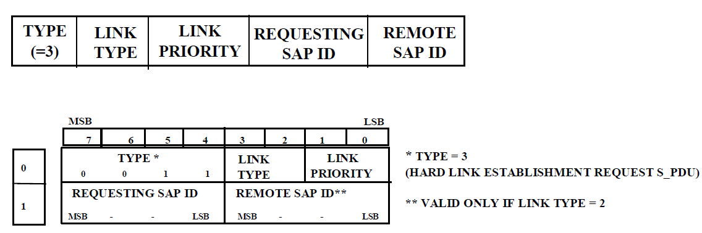
>
> **Figure A-35: Generic Encoding and Bit-Field Map of the HARD LINK ESTABLISHMENT REQUEST S\_PDU**

# Description :

> The HARD LINK ESTABLISHMENT REQUEST S\_PDU **shall** (1) be transmitted by a Peer in response to a Client’s request for a Hard Link. Since the establishment of a Hard Link overrides the normal procedures of making Links based on the destinations of the queued U\_PDUs (i.e., over Soft Link Data Exchange), it is important that both peers use a handshake procedure in order to confirm the successful Hard Link establishment
>
> The first field of the S\_PDU **shall** (2) be “TYPE”. It **shall** (3) be equal to 3 and identifies the S\_PDU as being of type HARD LINK ESTABLISHMENT REQUEST.
>
> The “LINK TYPE” and “LINK PRIORITY” fields **shall** (4) be equal in value to the corresponding arguments of the S\_HARD\_LINK\_ESTABLISH Primitive submitted by the client to request the link.
>
> The “REQUESTING SAP ID” field **shall** (5) be the SAP ID of the client that requested the Hard Link Establishment.
>
> This “REMOTE SAP ID” field **shall** (6) be valid if and only if the “LINK TYPE” field has a value of 2, denoting a Type 2 Hard Link w/ Full-Bandwidth Reservation. The “REMOTE SAP ID” field **shall** (7) identify the single client connected to the remote node to and from which traffic is allowed for Hard Links w/ Full-Bandwidth Reservation. The REMOTE SAP ID field may take any implementation-dependent default value for Hard Links without Full Bandwidth Reservation.

1.  HARD LINK ESTABLISHMENT CONFIRM S\_PDU

# Type :

> “4” = HARD LINK ESTABLISHMENT CONFIRM

# 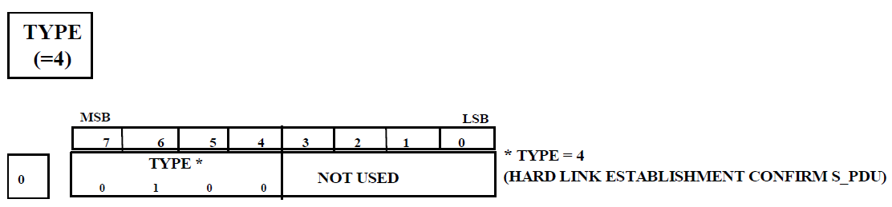Encoding :

> **Figure A-36: Generic Encoding and Bit-Field Map of the HARD LINK ESTABLISHMENT CONFIRM S\_PDU**

# Description :

> The HARD LINK ESTABLISHMENT CONFIRM S\_PDU **shall** (1) be transmitted as a positive response to the reception of a HARD LINK ESTABLISHMENT REQUEST S\_PDU.
>
> Its only field **shall** (2) be “TYPE”, which value **shall** (3) be equal to 4 and identifies the S\_PDU as being of type HARD LINK ESTABLISHMENT CONFIRM.
>
> The peer which receives this S\_PDU **shall** (4) inform its appropriate client accordingly with a S\_HARD\_LINK\_ESTABLISHED Primitive in accordance with the Hard Link Establishment Protocol specified in Section A.3.2.2.2.

1.  HARD LINK ESTABLISHMENT REJECTED S\_PDU

# Type :

> “5” = HARD LINK ESTABLISHMENT REJECTED

# 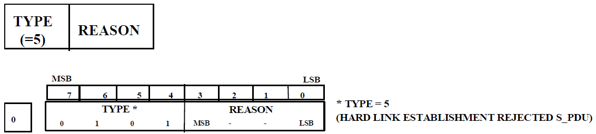Encoding :

> **A-37: Generic Encoding and Bit-Field Map of the HARD LINK ESTABLISHMENT REJECTED S\_PDU**

# Description :

> This S\_PDU **shall** (1) be transmitted as a negative response to the reception of a HARD LINK ESTABLISHMENT REQUEST S\_PDU.
>
> The first field **shall** (2) be “TYPE” and its value **shall** (3) be equal to 5 to identify the S\_PDU as being of type HARD LINK ESTABLISHMENT REJECTED.
>
> The second field **shall** (4) be “REASON” and explains why the Hard Link request was rejected. The sublayer that receives this S\_PDU should inform its appropriate client accordingly with a S\_HARD\_LINK\_REJECTED Primitive in accordance with the Hard Link Establishment Protocol specified in Section A.3.2.2.2. The “REASON” field **shall**(5) take a value in the range 0-15. Hard Link reject reasons and their corresponding values **shall** (6) be as defined in the following table.

<table>
<colgroup>
<col style="width: 64%" />
<col style="width: 35%" />
</colgroup>
<thead>
<tr class="header">
<th><blockquote>

REASON

</blockquote></th>
<th><blockquote>

Field Value

</blockquote></th>
</tr>
</thead>
<tbody>
<tr class="odd">
<td><blockquote>

<em>unassigned</em>

</blockquote></td>
<td><blockquote>

0

</blockquote></td>
</tr>
<tr class="even">
<td><blockquote>

Remote-Node-Busy

</blockquote></td>
<td><blockquote>

1

</blockquote></td>
</tr>
<tr class="odd">
<td><blockquote>

Higher-Priority-Link-Existing

</blockquote></td>
<td><blockquote>

2

</blockquote></td>
</tr>
<tr class="even">
<td><blockquote>

Remote-Node-Not-Responding

</blockquote></td>
<td><blockquote>

3

</blockquote></td>
</tr>
<tr class="odd">
<td><blockquote>

Destination SAP ID not bound

</blockquote></td>
<td><blockquote>

4

</blockquote></td>
</tr>
<tr class="even">
<td><blockquote>

<em>Reserved for future use</em>

</blockquote></td>
<td><blockquote>

5-15

</blockquote></td>
</tr>
</tbody>
</table>

1.  HARD LINK TERMINATE S\_PDU

# Type :

> “6” = HARD LINK TERMINATE

# Encoding :

# 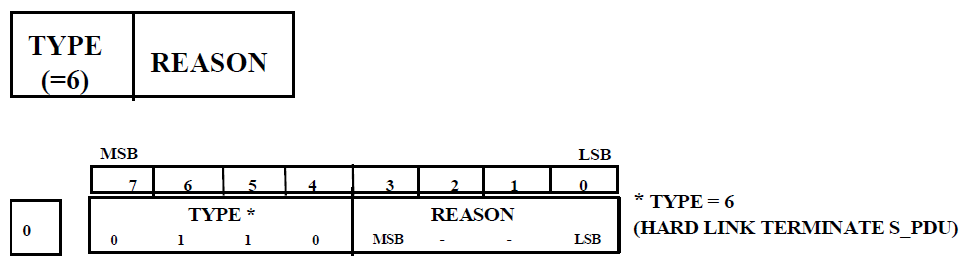

# Figure A-38: Generic Encoding and Bit-Field Map of the HARD LINK TERMINATE S\_PDU

# Description :

> Under normal circumstances a Hard Link is terminated at the request of the Client which originated it or as a result of a request by another Client to establish a higher priority Hard Link. Either of the two Peer sublayers involved in a Hard Link session and that wishes to terminate the Hard Link **shall** (1) transmit a HARD LINK TERMINATE S\_PDU to request termination of the Hard Link.
>
> The first four-bit field **shall** (2) be “TYPE” and its value **shall** (3) be set equal to 6 to identify the S\_PDU as being of type HARD LINK TERMINATE.
>
> The second four-bit field **shall** (4) be “REASON” and explains why the Hard Link is being terminated. Hard Link terminate reasons and their corresponding values **shall** (5) be as defined in the following table.

<table>
<colgroup>
<col style="width: 64%" />
<col style="width: 35%" />
</colgroup>
<thead>
<tr class="header">
<th><blockquote>

Reason

</blockquote></th>
<th><blockquote>

Value

</blockquote></th>
</tr>
</thead>
<tbody>
<tr class="odd">
<td><blockquote>

<em>unassigned</em>

</blockquote></td>
<td><blockquote>

0

</blockquote></td>
</tr>
<tr class="even">
<td><blockquote>

Client request

</blockquote></td>
<td><blockquote>

1

</blockquote></td>
</tr>
<tr class="odd">
<td><blockquote>

Higher priority link requested

</blockquote></td>
<td><blockquote>

2

</blockquote></td>
</tr>
<tr class="even">
<td><blockquote>

<em>reserved</em>

</blockquote></td>
<td><blockquote>

3

</blockquote></td>
</tr>
<tr class="odd">
<td><blockquote>

Destination SAP ID unbound

</blockquote></td>
<td><blockquote>

4

</blockquote></td>
</tr>
<tr class="even">
<td><blockquote>

<em>Reserved for future use</em>

</blockquote></td>
<td><blockquote>

5-15

</blockquote></td>
</tr>
</tbody>
</table>

> In order to ensure a graceful termination of the Hard Link, the Peer which sent the HARD LINK TERMINATE must await a TIMEOUT period for confirmation of its Peer before it declares the Link as terminated. This TIMEOUT period **shall** (6) be configurable by the protocol implementation.
>
> A.3.1.7 HARD LINK TERMINATE CONFIRM S\_PDU

# Type :

> “7” = HARD LINK TERMINATE CONFIRM

# 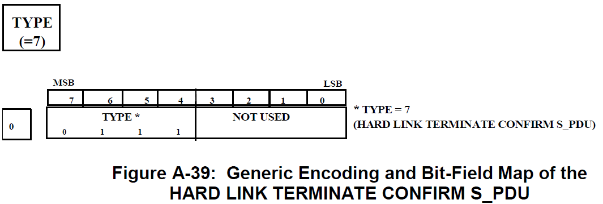Encoding :

# Figure A-39: Generic Encoding and Bit-Field Map of the HARD LINK TERMINATE CONFIRM S\_PDU

# Description :

> The HARD LINK TERMINATE CONFIRM S\_PDU **shall** (1) be transmitted in response to the reception of a HARD LINK TERMINATE S\_PDU.
>
> The first four-bit field of this S\_PDU **shall** (2) be “TYPE”. A value of 7 **shall** (3) identify that the S\_PDU is of type HARD LINK TERMINATE CONFIRM.
>
> The second four-bit field of this S\_PDU **shall** (3) be not used in this implementation of the protocol. The values of these bits may be implementation dependent.

1.  <u>Peer-to-Peer Communication Protocol</u>

> This section specifies the protocols governing the Peer-to-Peer communication for Establishing and Terminating Soft Link Data Exchange Sessions, Establishing and Terminating Hard Link Data Exchange Sessions, Establishing and Terminating Broadcast Data Exchange Sessions and Exchanging Client Data. In these specifications, the node whose local client or Subnetwork Interface Sublayer first requests a Data Exchange Session is denoted as the caller or calling node and the remote node is denoted as the called node.

1.  <u>Soft Link Data Exchange Session</u>

> In the absence of a hard link request by a client, the Subnetwork Interface Sublayer initiates Soft Link Data Exchange Sessions with remote peers based on the destinations of queued client U\_PDUs. In particular, sublayer management algorithms must be established to initiate the protocols for establishment or termination a Soft Link Data Exchange Session. This STANAG allows these sublayer management algorithms to be based on implementation dependent criteria and factors. The use of comparative U\_PDU queue-length for given clients, source-destination sets and priority levels for any implementation is allowed and expected (even if the algorithms are trivial) but remain beyond the scope of this STANAG.

1.  <u>Protocol for Establishing a Soft Link Data Exchange Session</u>

> In contrast with the establishment of a Hard Link Session, the establishment of Soft Link Data Exchange Sessions **shall** (1) not require explicit peer-to-peer handshaking within the Subnetwork Interface Sublayer.
>
> The calling peer **shall** (2) implicitly establish a Soft Link Data Exchange Session by requesting its Channel Access Sublayer to make a physical link to the required remote node, using the procedure for making physical links specified in Annex B. In accordance with these procedures, both peer Subnetwork Interface Sublayers (i.e., the calling and called sublayers) are informed about the successful making of a physical link between their nodes by their respective Channel Access Sublayers.
>
> After the physical link is made, both peer Subnetwork Interface Sublayers **shall** (3) declare that the Soft Link Data Exchange Session has been established between the respective source and destination nodes. Data may then be exchanged in accordance with the protocols specified in Section A.3.2.4.

1.  <u>Protocol for Terminating a Soft Link Data Exchange Session</u>

> No peer-to-peer communication by the Subnetwork Interface Sublayer **shall** (1) be required to terminate a Soft Link Data Exchange Session.
>
> A Soft Link Data Exchange Session **shall** (2) be terminated by either of the two peers by a request to its respective Channel Access Sublayer to break the Physical Link in accordance with the procedure specified in Annex B. Both Subnetwork Interface sublayers will be informed about the breaking of the Physical link by their respective Channel Access Sublayers.
>
> Since a called peer can terminate a Soft Link Data Exchange Session if it has higher priority data destined for a different Node, called peers **shall** (3) wait a configurable minimum time before unilaterally terminating sessions, to prevent unstable operation of the protocol.
>
> Note: The caller sublayer normally initiates the termination of the session (by breaking the physical link) based on the destinations of its queued U\_PDUs, and on any ongoing communication with the distant node. The inter-layer signaling for coordination would normally be carried out via the subnetwork management sublayer. The called sublayer can also terminate the session if it has high priority data destined for a different node. However, called sublayers should wait a configurable minimum time before unilaterally terminating sessions, otherwise an unstable condition may arise if all nodes in the network have data to transmit and called sublayers immediately close sessions in order to establish other sessions as callers. If such a situation arises, the efficiency of a subnetwork will deteriorate as a result of nodes continuously establishing and terminating sessions without actually transmitting data. The minimum amount of time that a called sublayer should wait before it attempts to terminate a Soft Link Session must be carefully chosen and will depend on a number of factors such as the subnetwork size and configuration. Specification of this and other parameters as a configurable but required value allows implementations of the STANAG to be tuned for specific network, with the values for these parameters distributed as part of the standard operating procedures for a given network.
>
> After the Subnetwork Interface Sublayer has been notified that the Physical Link has been broken, the Subnetwork Interface Sublayer **shall** (4) declare the Soft Link Exchange Session as terminated.

1.  <u>Hard Link Data Exchange Session</u>

> The rules governing establishment and termination of Hard Links are straightforward but complicated by the fact that new Hard Link requests could be satisfied (at least in part) by an existing Hard Link. Comparison and evaluation factors for Hard Links include the ranks of the clients, the link priorities, the sets of source and destination nodes, and the Hard-Link types. In particular, various service models could be specified in this STANAG for the management of multiple Hard Links of Types 0 or Type 1 simultaneously, but with different levels of protocol complexity to track the potentially overlapping and independent requests from multiple clients. Note that, since Type 2 Hard Links reserve the full bandwidth and use of a physical link for two specific bound clients, the subnetwork cannot support multiple Type 2 Hard Links with any assumed service model.
>
> This STANAG assumes a simple model for the management of Hard Links based on maintenance of at most a single Hard Link between nodes, while still allowing Type 0 and Type 1 Hard Links between the nodes to be shared by other clients using Soft Link Data Exchange. This management model satisfies the following requirements:

-   a node’s sublayer **shall** (1) maintain at most one Hard Link at any time;

-   a sublayer **shall** (2) accept a Hard Link request when no Hard Link currently exists;

-   the comparative precedence of new requests and any existing hard link **shall** (3) be evaluated in accordance with section A.3.2.2.1 to determine if the new request can be accepted or rejected by the sublayer;

-   requests of higher precedence **shall** (4) be accepted and will result in the termination of an existing Hard Link;

-   an existing Hard Link of higher precedence **shall** (5) result in the rejection of the request;

-   if an existing Type 0 Hard Link can satisfy a request that has been rejected, the sublayer **shall** (6) note this as the reason for rejecting the request.; the requesting client may then submit data for transmission using a Soft Link Data Exchange Session.

> \[Note: While this model has some limitations, notably that clients sharing a Hard Link with the originator will lose it when the originator terminates the link, it supports the essential service characteristics desired, and presents a simpler protocol than others that were considered.\]
>
> Unless noted otherwise, any data structures and variables used to manage Hard Link establishment and termination are implementation dependent and beyond the scope of this STANAG.
>
> Further requirements controlling the establishment and termination of Hard Links are specified below.

1.  Priority and Precedence Rules for Hard Links

> Establishment and Termination of Hard Links **shall** (1) be controlled in accordance with the following set of precedence rules:

1.  A Hard Link request for a client with greater rank **shall** (2) take precedence over an existing or requested Hard Link established for a client of lower rank, regardless of other factors.

2.  A Hard Link request of greater priority **shall** (3) take precedence over an existing or requested hard link of lower priority, regardless of other factors.

3.  For Hard Links of equal priority and rank, and with different sets of source and destination nodes, the Hard Link request processed first by the Subnetwork Interface Sublayer (i.e., the Hard Link currently established) **shall** (4) take precedence.

4.  For Hard Links (i.e., requests and existing hard links) from clients of equal priority and rank, and with equal sets of source and destination nodes:

    -   a Hard Link with greater Link Type value **shall** (5) take precedence over one with lower value;

    -   an existing Hard Link **shall** (6) take precedence over subsequent Hard Link requests of equal Link Type.

<!-- -->

1.  <u>Protocol for Establishing a Hard Link Data Exchange Session</u>

> Upon receiving a S\_HARD\_LINK\_ESTABLISH Primitive from a client, the Subnetwork Interface Sublayer **shall** (1) first check that it can accept the request from the client in accordance with the precedence and priority rules of Section A.3.2.2.1.
>
> If the Hard Link request is of lower precedence than any existing Hard Link, then the establishment protocol proceeds as follows:

-   the request **shall** (2) be denied by the Subnetwork Interface Sublayer,

-   the sublayer **shall** (3) issue a S\_HARD\_LINK\_REJECTED Primitive to the requesting client with REASON = “Higher-Priority-Link-Existing”, and

-   the sublayer **shall** (4) terminate the Hard Link establishment protocol.

> Otherwise, if a Type 0 Hard Link request is of the same priority, same client-rank, and with the same set of source and destination nodes as an existing Hard Link, then the establishment protocol proceeds as follows:

-   the Subnetwork Interface Sublayer **shall** (5) reject the Type 0 Hard Link request with the REASON = “Requested Type 0 Hard Link Exists”; a client receiving this rejection may submit data requests for transmission using a Soft-Link Data Exchange Session to the remote peer;

-   the sublayer **shall** (6) take no further action to establish or change the status of the existing Type 0 Hard Link (Note: since the sublayer has already determined that the existing link satisfies the requirements of the request), and; the sublayer **shall** (7) terminate the Hard Link establishment protocol.

> Otherwise, the establishment protocol proceeds in accordance with the following requirements.
>
> If the Subnetwork Interface Sublayer can accept the Hard Link request it **shall** (8) first terminate any existing Hard Link of lower precedence using the peer-to-peer communication protocol for terminating an existing hard link specified in Section A.3.2.2.3.
>
> The Subnetwork Interface Sublayer then **shall** (9) request the Channel Access Sublayer to make a physical link to the node specified by the client, following procedure for making the physical link specified in Annex B.
>
> After the physical link has been made, the caller’s Subnetwork Interface Sublayer **shall** (10) send a “HARD LINK ESTABLISHMENT REQUEST” (TYPE 3) S\_PDU to its called peer at the remote node. To ensure that the S\_PDU will overtake all routine DATA S\_PDUs which may be queued and in various stages of processing by the lower sublayers, the “HARD LINK ESTABLISHMENT REQUEST” S\_PDU **shall** (11) be sent to the Channel Access Sublayer using a C\_EXPEDITED\_UNIDATA\_REQUEST Primitive and use the subnetwork’s expedited data service.
>
> After it sends the “HARD LINK ESTABLISHMENT REQUEST” (TYPE 3) S\_PDU, the caller’s Subnetwork Interface Sublayer **shall** (12) wait a configurable time-out period for a response from the called peer, and proceed as follows:

-   during the waiting-period for the response,

    -   if the caller’s sublayer receives a HARD LINK ESTABLISHMENT REJECTED” (TYPE 5) S\_PDU from the called peer, the sublayer **shall** (13) notify the requesting client that the Hard Link request has failed by sending the client an S\_HARD\_LINK\_REJECTED Primitive to the requesting client with the REASON field of the Primitive set to the corresponding value received in the S\_PDU’s REASON field,

    -   if the caller’s sublayer receives a HARD LINK ESTABLISHMENT CONFIRM” (TYPE 4) S\_PDU from the called peer, the sublayer **shall** (14) notify the requesting client that the Hard Link request has succeeded by sending the client an S\_HARD\_LINK\_ESTABLISHED Primitive;

-   otherwise, if the waiting-period for the response expires without receipt of a valid response from called node, the caller’s sublayer **shall** (15) notify the requesting client that the Hard Link request has failed by sending the client an S\_HARD\_LINK\_REJECTED Primitive to the requesting client with REASON = “Remote-Node-Not Responding”.

> The caller’s establishment protocol **shall** (16) terminate on receipt during the waiting of a valid response from the called node and notification of the client, or on expiration of the waiting period.
>
> For the called Subnetwork Access Sublayer, the Hard Link establishment protocol **shall** (17) be initiated on receipt of a “HARD LINK ESTABLISHMENT REQUEST” (TYPE 3) S\_PDU, and proceeds as follows:

-   if no client is bound to the called SAP ID and the caller’s request is for a Type 2 Hard Link, then the called sublayer **shall** (18) reject the request, send a “HARD LINK ESTABLISHMENT REJECTED” (TYPE 5) S\_PDU with REASON = “Destination SAP ID

> not bound” to the caller, and terminate the establishment protocol;

-   otherwise, the called sublayer **shall** (19) evaluate the precedence of the caller’s request in accordance with the precedence and priority rules of Section A.3.2.2.1, using as the client rank either a configurable default rank for the called SAP\_ID for Type 0 and Type 1 Hard Link requests, or the actual rank of the bound client with the called SAP\_ID for Type 2 Hard Link requests.

-   If the caller’s request cannot be accepted by the called peer, a “HARD LINK ESTABLISHMENT REJECTED” (TYPE 5) S\_PDU **shall** (21) be sent to the calling peer, with the Reason field set as follows:

    -   REASON = “Remote-Node-Busy” if the reason for rejection was the existence of an existing Hard Link of equal rank and priority, or,

    -   REASON= “Higher-Priority Link Existing” if the reason for rejection was the existing of a Hard Link with higher priority or rank.

-   If the caller’s Hard Link request can be accepted and the request is not a Type 2 Hard Link request, the called sublayer **shall** (22) send a “HARD LINK ESTABLISHMENT CONFIRM” (TYPE 4) S\_PDU to the caller sublayer, and terminate the protocol;

-   otherwise, the request is for a Type 2 Hard Link and the called sublayer **shall** (23) send a S\_HARD\_LINK\_INDICATION Primitive to the requested client, and wait for a configurable maximum time-out period for a response:

    -   if the called sublayer receives a S\_HARD\_LINK\_ACCEPT Primitive from the requested client prior to the expiration of the timeout, then the called sublayer **shall** (24) send a “HARD LINK ESTABLISHMENT CONFIRM” (TYPE 4) S\_PDU to the calling sublayer, and terminate the protocol;

    -   otherwise, the called sublayer **shall** (24) send a “HARD LINK ESTABLISHMENT REJECTED” (TYPE 5) S\_PDU to the caller sublayer, and terminate the protocol.

-   Whenever sent, either the TYPE 4 (HARD LINK ESTABLISHMENT CONFIRM) S\_PDU or the TYPE 5 (HARD LINK ESTABLISHMENT REJECTED) S\_PDU **shall** (25) be sent to the calling sublayer using the Expedited Data Service provided by lower sublayers in the profile.

> The procedures for establishing a hard link from the perspective of both the calling and called peers are depicted in Figure A-40(a) and Figure A-40(b) as a possible implementation that meets the stated requirements. This STANAG acknowledges that other implementations may exist that also meet the stated requirements.

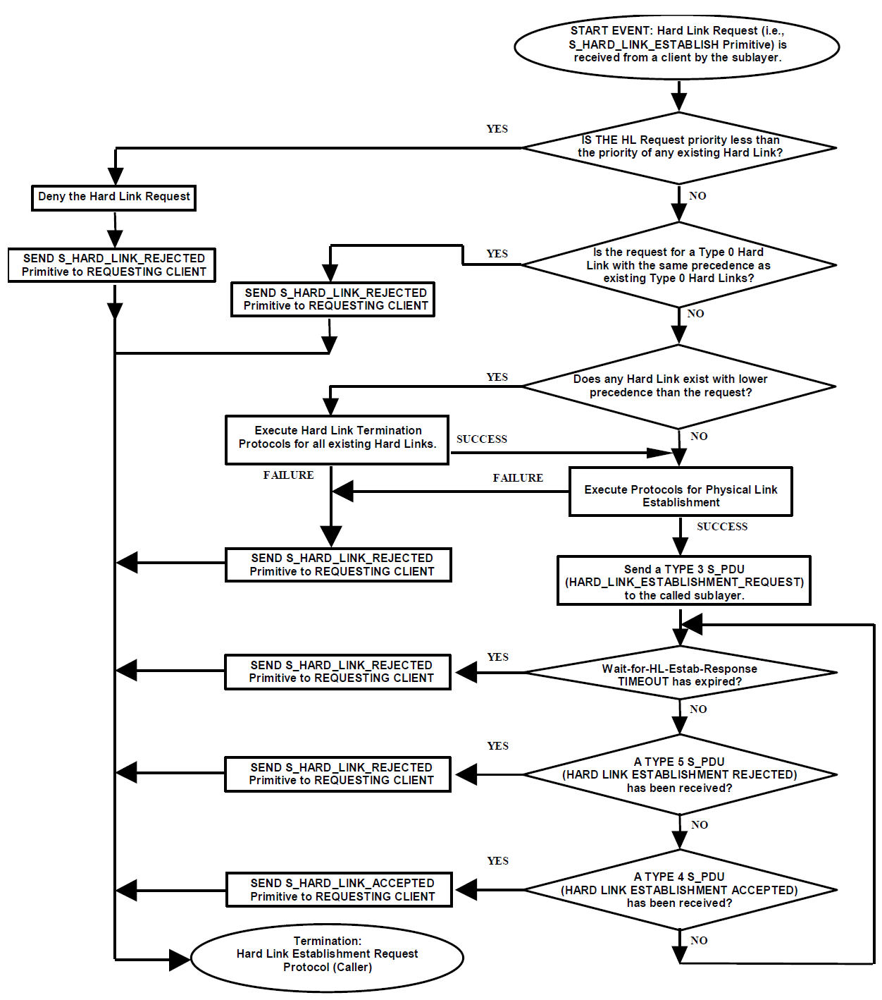

# Figure A-40 (a): Procedures for Establishing a Hard Link: CALLER PEER

# 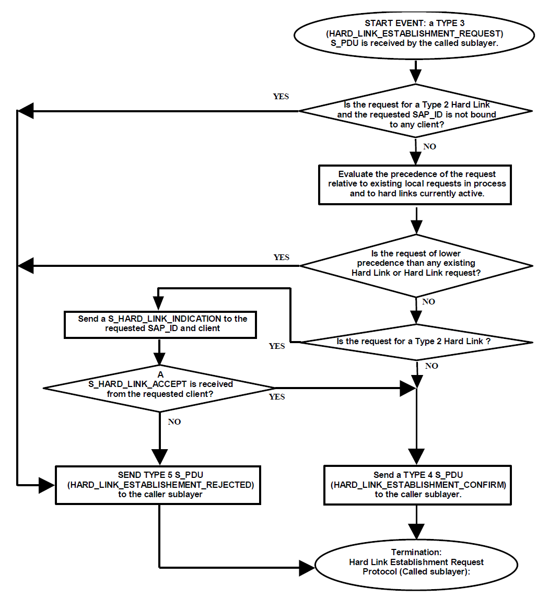

# Figure A-40 (b): Procedures for Establishing a Hard Link: CALLED PEER

1.  <u>Protocol for Terminating a Hard Link Data Exchange Session</u>

> The termination of an existing Hard Link can be initiated by either of the two peer sublayers connected by the link. Normally the Hard Link will be terminated by the calling sublayer at the request of the client who initiated it, or by either of the sublayers if it receives a Hard Link request of higher precedence from one of its other clients. Requirements for the Hard Link termination protocol are defined below.
>
> The Hard Link termination protocol **shall** (1) be initiated when any of the following conditions are met:

-   a calling sublayer receives a S\_HARD\_LINK\_TERMINATE Primitive from the client that originated an existing hard link of any type,

-   a called sublayer receives a S\_HARD\_LINK\_TERMINATE Primitive from its attached client involved in an existing Type 2 Hard Link,

-   either the calling or called sublayer receives from a client a S\_HARD\_LINK\_ESTABLISH Primitive that is of higher precedence than any existing Hard Link.

> Any sublayer that must terminate a Hard Link for any of the specified conditions **shall** (2) send a “HARD LINK TERMINATE” (TYPE 6) S\_PDU to its peer sublayer.
>
> A sublayer that receives a “HARD LINK TERMINATE” (TYPE 6) S\_PDU from its peer **shall** (3) immediately respond with a “HARD LINK TERMINATE CONFIRM” (TYPE 7) S\_PDU, declare the Hard Link as terminated, and send a S\_HARD\_LINK\_TERMINATED Primitive to all clients using the Hard Link.
>
> After sending the HARD LINK TERMINATE” (TYPE 6) S\_PDU, the initiating sublayer **shall** (4) wait for a response for a configurable maximum time-out period, and proceed.
>
> If the timeout-period expires without receipt by the initiating sublayer of a “HARD LINK TERMINATE CONFIRM” (TYPE 7) S\_PDU, the sublayer **shall** (5) send a S\_HARD\_LINK\_TERMINATED Primitive to all clients using the Hard Link, with the REASON field set equal to “Remote Node Not Responding (timeout)”.
>
> To ensure that any S\_PDU used for the termination protocol will overtake all routine DATA S\_PDUs that may be queued and in various stages of processing by the lower sublayers, the termination protocol uses the subnetworks’s Expedited Data Service. In particular, the “HARD LINK TERMINATE” (TYPE 6) S\_PDU and “HARD LINK TERMINATE CONFIRM” (TYPE 7) S\_PDU **shall** (6) be sent to the
>
> Channel Access Sublayer using a C\_EXPEDITED\_UNIDATA\_REQUEST Primitive.
>
> .
>
> After termination of the Hard Link with a subnetwork client, the Physical Link between the nodes may need to be broken. Normally the breaking of the Physical Link is left to the peer which requested the termination of the Hard Link session. The reason for this is that this peer may want to start another session using the existing Physical Link in which case breaking and making procedures may be avoided. The procedures for breaking a Physical Link are specified in Annex B.
>
> The nominal procedures for Terminating a Hard Link for both the Requesting and Responding Peers are shown in Figure A-41. This STANAG acknowledges that other implementations may exist that meet the requirements stated above.

# 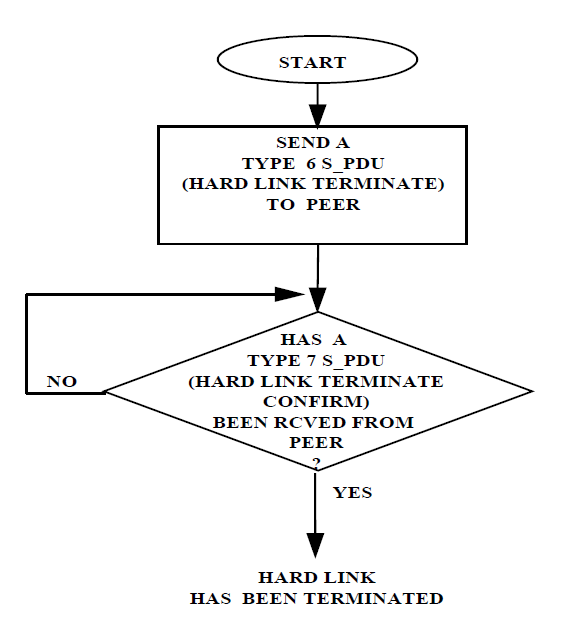

# Figure A-41 (a): Procedures for Terminating a Hard Link: REQUESTING PEER

> **HARD LINK TERMINATED**

# Figure A-42 (b): Procedures for Terminating a Hard Link: RESPONDING PEER

> Apart from the procedures above, a sublayer **shall** (7) unilaterally declare a Hard Link as terminated if at any time it is informed by the Channel Access Sublayer that the physical link has been permanently broken. In this case, the sublayer **shall** (8) send a S\_HARD\_LINK\_TERMINATED Primitive to all clients using the Hard Link, with the REASON field set equal to “Physical Link Broken”.

1.  <u>Protocol for Establishing and Terminating a Broadcast Data Exchange Session</u>

> No explicit peer-to-peer communication **shall** (1) be required to establish and terminate a Broadcast Data Exchange Session. A Broadcast Data Exchange Session is established and terminated either by a management process or unilaterally by the Subnetwork Interface Sublayer based on a number of criteria as explained in section A.1.1.3.
>
> As noted in section A.1.1, clients may interleave requests for data-exchange sessions. At some point, the subnetwork might also be configured to provide exclusive support for a Broadcast Data Exchange Session. In this case, when the subnetwork is first configured by the local (implementation-dependent) management function to provide exclusive support for a Broadcast Data Exchange Session the Subnetwork Interface Sublayer **shall** (2) send an S\_UNBIND\_INDICATION to any bound clients that had requested ARQ Delivery Service, with the REASON = “ARQ Mode Unsupportable during Broadcast Session”. Subsequent S\_BIND requests by clients requesting ARQ service (soft-link or hard-link sessions) **shall** (3) be rejected with the same reason.

1.  <u>Protocol for Exchanging Client Data</u>

> After a Data Exchange Session of any type has been established, sublayers with client data to exchange **shall** (1) exchange DATA (TYPE 0) S\_PDUs using the protocol specified below and in accordance with the service characteristics of the respective session.
>
> The sublayer **shall** (2) discard any U\_PDU submitted by a client where the U\_PDU is greater in size than the Maximum Transmission Unit (MTU) size assigned to the client by the S\_BIND\_ACCEPTED Primitive issued during the client-bind protocol.
>
> If a U\_PDU is discarded because it exceeded the MTU size limit and if the DELIVERY CONFIRMATION field for the U\_PDU specifies CLIENT DELIVERY CONFIRM or NODE DELIVERY CONFIRM, the sublayer **shall** (3) notify the client that submitted the U\_PDU as follows:

-   if the U\_PDU was submitted by a S\_UNIDATA\_REQUEST Primitive the sublayer

> | **shall** (4) send a S\_UNIDATA\_REQUEST\_REJECTED Primitive to the client;

-   otherwise, if the U\_PDU was submitted by a S\_EXPEDITED\_UNIDATA\_REQUEST Primitive, the sublayer **shall** (5) send a

> | S\_EXPEDITED\_UNIDATA\_REQUEST\_REJECTED Primitive to the client;

-   for either form of the reject primitive, the REASON field **shall** (6) be equal to “U\_PDU Larger than MTU”.

> For U\_PDUs that have been accepted for transmission, the sending sublayer retrieves client U\_PDUs and their associated implementation-dependent service attributes (such as the S\_Primitive that encapsulated the U\_PDU) from its queues (according to Priority and other implementation-dependent criteria), and proceeds as follows:

-   the sending sublayer **shall** (7) encode the retrieved U\_PDU into a DATA (TYPE 0) S\_PDU, transferring any service attributes associated with U\_PDU to the S\_PDU as required;

-   the sending sublayer **shall** (8) encode the resulting DATA (TYPE 0) S\_PDU in accordance with the C\_Primitive interface requirements of the Channel Access Sublayer as specified in Annex B, i.e,:

    -   if the encoded U\_PDU was submitted by a client using a S\_UNIDATA\_REQUEST Primitive, then the sublayer **shall** (9) encode the S\_PDU as a C\_UNIDATA\_REQUEST Primitive of the priority corresponding to that initially specified by the client in the S\_Primitive, otherwise;

    -   if the encoded U\_PDU was submitted by a client using a S\_EXPEDITED\_UNIDATA\_REQUEST Primitive, then the sublayer **shall** (10) encode the S\_PDU as a C\_EXPEDITED\_UNIDATA\_REQUEST Primitive;

-   the sending sublayer then **shall** (11) pass the resulting C\_primitive to the Channel Access Sublayer for further processing to send the DATA (TYPE 0) S\_PDU to its remote peer.

-   if the service attributes for the U\_PDU require NODE DELIVERY CONFIRMATION, the sublayer **shall** (12) wait for a configurable time for a response as follows:

    -   if the sublayer receives a C\_UNIDATA\_REQUEST\_CONFIRM Primitive or a C\_EXPEDITED\_UNIDATA\_REQUEST\_CONFIRM Primitive prior to the end of the waiting time, the sublayer **shall** (13) send to the client either a S\_UNIDATA\_REQUEST\_CONFIRM Primitive or S\_EXPEDITED\_UNIDATA\_REQUEST\_CONFIRM Primitive, respectively, where the type of C\_Primitive expected and S\_Primitive sent corresponds to the type of U\_PDU delivery service requested;

    -   otherwise, if the sublayer receives a C\_UNIDATA\_REQUEST\_REJECTED

> Primitive or a C\_EXPEDITED\_UNIDATA\_REQUEST\_REJECTED Primitive prior to the end of the waiting time, the sublayer **shall** (14) send to the client a
>
> either a S\_UNIDATA\_REQUEST\_REJECTED Primitive or S\_EXPEDITED\_UNIDATA\_REQUEST\_REJECTED, respectively, where the type of C\_Primitive expected and S\_Primitive sent corresponds to the type of U\_PDU delivery service requested;

-   otherwise, if the waiting time ends prior to receipt of any response indication from the Channel Access sublayer, the Subnetwork Interface sublayer **shall** (15)

> | send to the client either a S\_UNIDATA\_REQUEST\_REJECTED Primitive, if the U\_PDU was submitted by a S\_UNIDATA\_REQUEST Primitive, or a
>
> | S\_EXPEDITED\_UNIDATA\_REQUEST\_REJECTED Primitive, if the U\_PDU was submitted by a S\_EXPEDITED\_UNIDATA\_REQUEST Primitive; for either reject S\_Primitive, the REASON field shall be set equal to “Destination Node Not Responding”.

-   if the service attributes for the U\_PDU require CLIENT DELIVERY CONFIRMATION, the sending sublayer **shall** (16) wait for a configurable time for a response as follows:

    -   if the Subnetwork Interface sublayer receives a C\_Primitive confirming node-node delivery (i.e., either a C\_UNIDATA\_REQUEST\_CONFIRM Primitive or a C\_EXPEDITED\_UNIDATA\_REQUEST\_CONFIRM Primitive) and a “DATA DELIVERY

> CONFIRM” (TYPE 1) S\_PDU is received from the remote sublayer prior to the end of the waiting time, the Subnetwork Interface sublayer **shall** (17) send to the client either a S\_UNIDATA\_REQUEST\_CONFIRM Primitive, if the U\_PDU was submitted by a S\_UNIDATA\_REQUEST Primitive, or a S\_EXPEDITED\_UNIDATA\_REQUEST\_CONFIRM Primitive, if the U\_PDU was submitted by a S\_EXPEDITED\_UNIDATA\_REQUEST Primitive;

-   otherwise, if the Subnetwork Interface sublayer receives either a “reject” C\_Primitive from the Channel Access Sublayer or a “DATA DELIVERY FAIL” (TYPE 2) S\_PDU from the remote peer prior to the end of the waiting time, the Subnetwork Interface sublayer **shall** (18) send to the client either a

> S\_UNIDATA\_REQUEST\_REJECTED Primitive, if the U\_PDU was submitted by a S\_UNIDATA\_REQUEST Primitive or a S\_EXPEDITED\_UNIDATA\_REQUEST\_REJECTED Primitive, if the U\_PDU was submitted by a S\_EXPEDITED\_UNIDATA\_REQUEST Primitive; for
>
> | either form of the primitive, the REASON field **shall** (18.1) be derived from the “DATA DELIVERY FAIL” (TYPE 2) S\_PDU or the reject C\_Primitive that was received;

-   otherwise, if the waiting time ends prior to receipt of a response message, the sublayer **shall** (19) send to the client either a

> | S\_UNIDATA\_REQUEST\_REJECTED Primitive, if the U\_PDU was submitted by a S\_UNIDATA\_REQUEST Primitive, or a S\_EXPEDITED\_UNIDATA\_REQUEST\_REJECTED Primitive, if the U\_PDU was submitted by a S\_EXPEDITED\_UNIDATA\_REQUEST Primitive; for either Primitive, the REASON field shall be set equal to “Destination Node Not Responding”.

-   On completion of these actions by the sending sublayer the client data delivery protocol terminates for the given DATA (TYPE 0) S\_PDU.

> A receiving sublayer manages the client data exchange protocol as follows:

-   the receiving sublayer **shall** (20) accept encoded DATA (TYPE 0) S\_PDUs from the Channel Access Sublayer using C\_Primitives in accordance with the interface requirements specified in Annex B.

> \[Note: in accordance with the interface between the Subnetwork Interface and Channel Access sublayers, there is no explicit indication that the S\_PDU is a “normal” or an “expedited” one.
>
> Whether the S\_PDU is a “normal” or an “expedited” S\_PDU is determined by the whether the S\_PDU is encoded within a C\_UNIDATA\_INDICATION Primitives or a C\_EXPEDITED\_UNIDATA\_INDICATION Primitives, respectively.\]

-   the receiving sublayer **shall** (21) extract the U\_PDU, Destination SAP\_ID and the other associated service attributes from the DATA (TYPE 0) S\_PDUs as required;

-   if there is no client bound to the destination SAP\_ID, the receiving sublayer **shall** (22)

> discard the U\_PDU by; otherwise,

-   if the DATA (TYPE 0) S\_PDU was encoded within a C\_UNIDATA\_INDICATION Primitive, the sublayer **shall** (23) deliver the extracted U\_PDU to the destination client bound to Destination SAP\_ID using a S\_UNIDATA\_INDICATION Primitive;

-   if the DATA (TYPE 0) S\_PDU was encoded within a C\_EXPEDITED\_UNIDATA\_INDICATION Primitive, the sublayer **shall** (24) deliver the extracted U\_PDU to the destination client bound to Destination SAP\_ID using a S\_EXPEDITED\_UNIDATA\_INDICATION Primitive.

<!-- -->

-   if the received S\_PDU has the “CLIENT DELIVERY CONFIRM REQUIRED” field set equal to “YES”, then the sublayer **shall** (25) provide delivery confirmation as follows:

-   ​

    -   if a client was bound to the Destination SAP\_ID, the sublayer **shall** (26) encode as required and send a “DATA DELIVERY CONFIRM” (TYPE 1) S\_PDU to the sending sublayer; \[Note: implementation-dependent methods may be used to provide additional determination that the client data was successfully delivered prior to sending the “DATA DELIVERY CONFIRM” (TYPE 1) S\_PDU.\],

    -   if a client was not bound to the Destination SAP\_ID, the sublayer **shall** (27) encode as required and send a “DATA DELIVERY FAIL” (TYPE 2) S\_PDU to the sending sublayer. \[Note: implementation-dependent methods may be used to provide additional determination that the client data was unsuccessfully delivered

> | prior to sending the “DATA DELIVERY FAIL” (TYPE 2) S\_PDU.\]

-   On completion of these actions by the receiving sublayer the client data delivery protocol terminates for the given DATA (TYPE 0) S\_PDU.

> Implementation-dependent queuing disciplines, flow-control procedures, or other characteristics in the sublayer **shall** (28) not preclude the possibility of managing the data exchange protocol for more than one U\_PDU at a time. In particular, the Subnetwork Interface Sublayer **shall** (29) be capable of sending a U\_PDU, encapsulated in a DATA (TYPE 0) S\_PDU and C\_Primitive as required, to the Channel Access Sublayer prior to receipt of the data-delivery-confirm response for a U\_PDU sent earlier.
>
> \[Note: This requirement mitigates the reduction in link throughput that occurs when a subnetwork ceases transmission of any U\_PDUs while it awaits confirmation of their delivery. The performance degradation is typical of that which occurs when using a STOP-AND-WAIT form of ARQ protocol anywhere in a communication system.\]
>
> The nominal procedures for exchanging DATA S\_PDUs for both the Sending and Receiving Peers are shown in Figure A-43(a) and Figure A-43(b). This STANAG acknowledges that other implementations may satisfy the requirements stated above. It should be noted that, as shown in these figures, there is no explicit indication that the S\_PDU is a “normal” or an “expedited” one. The reason for this is that the underlying sublayers are expected to treat Expedited S\_PDUs differently and implicitly pass the information to the receiving peer by (for example) delivering Expedited S\_PDUs as C\_EXPEDITED\_UNIDATA\_INDICATION Primitives rather than normal C\_UNIDATA\_INDICATION Primitives.
>
> 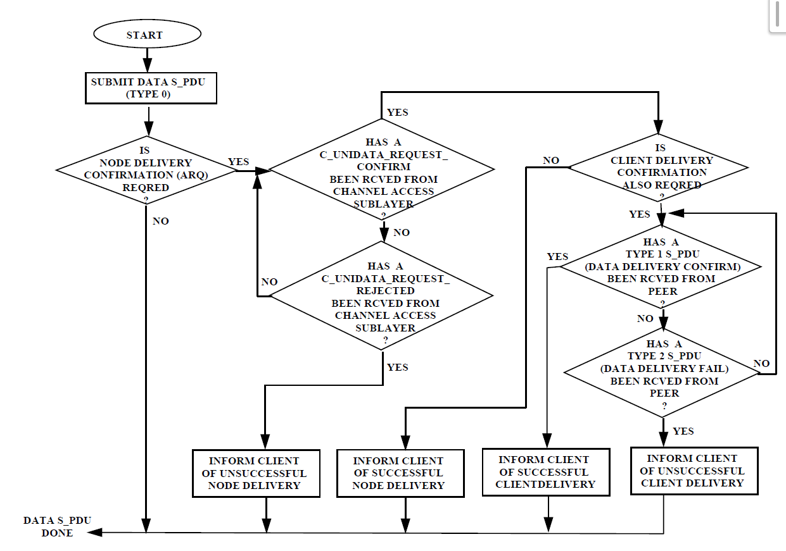

# Figure A-43 (a): Data Exchange Procedures: SENDING PEER

> 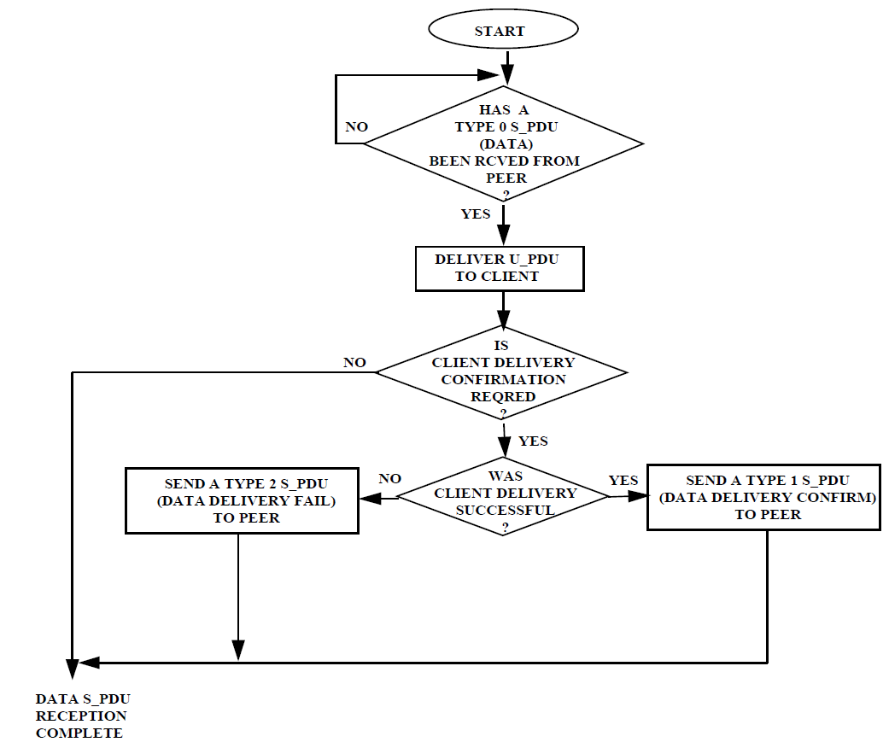
>
> **A-43 (b): Data Exchange Procedures: RECEIVING PEER**
