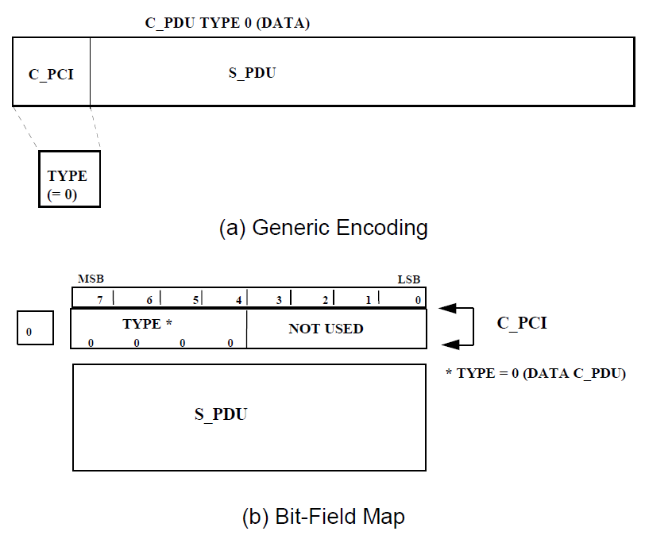
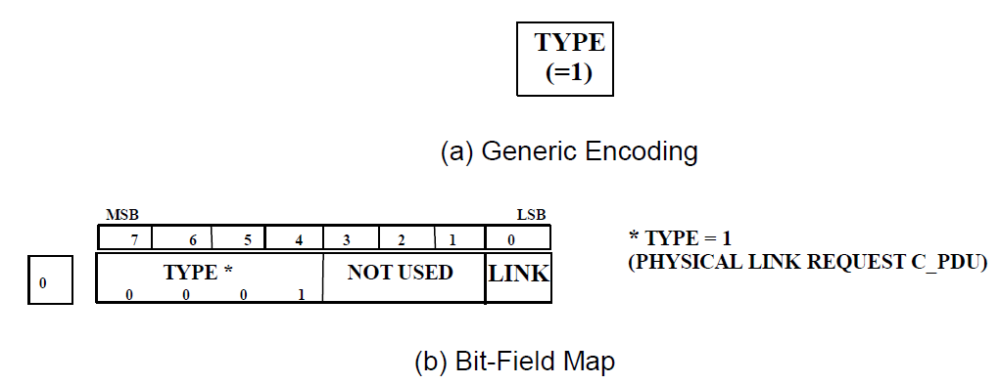
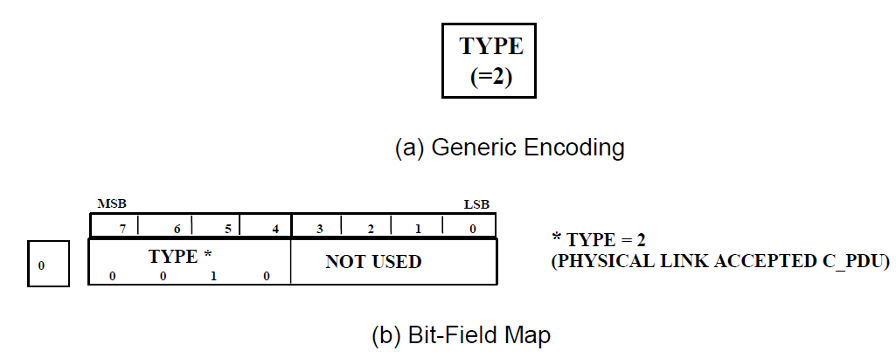
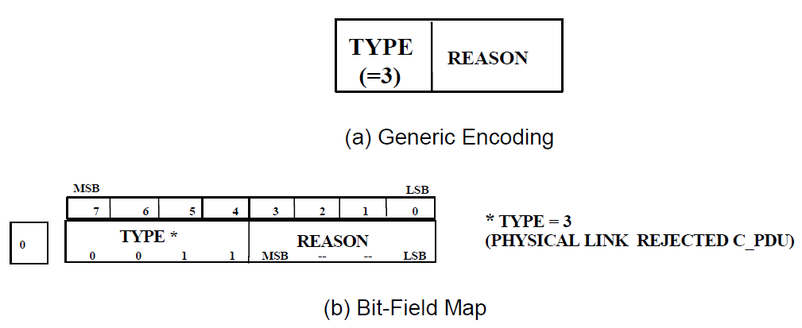
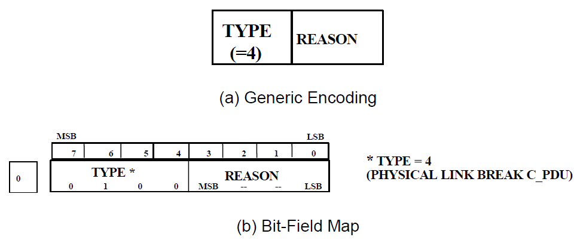
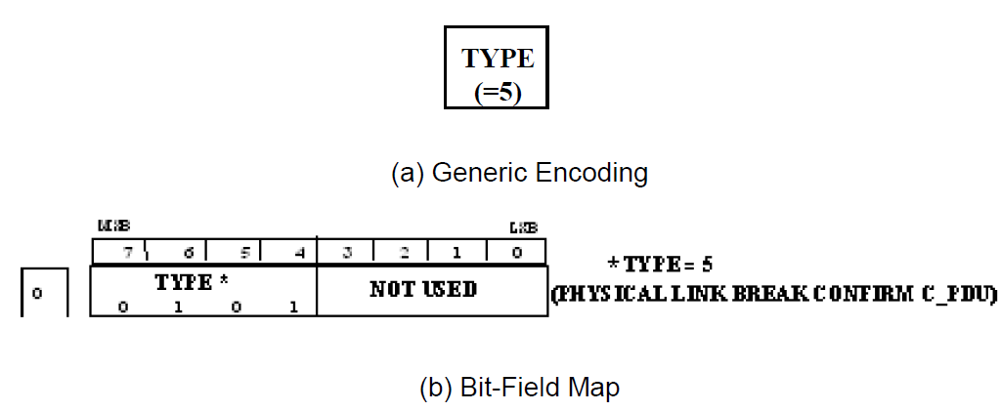
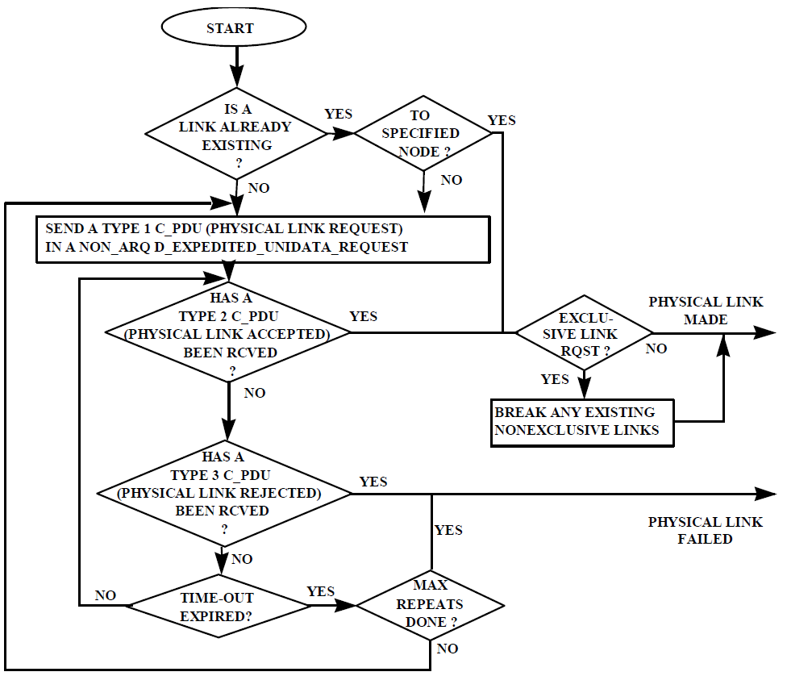
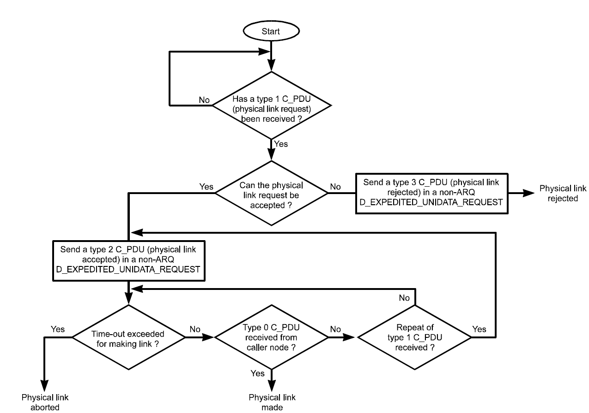
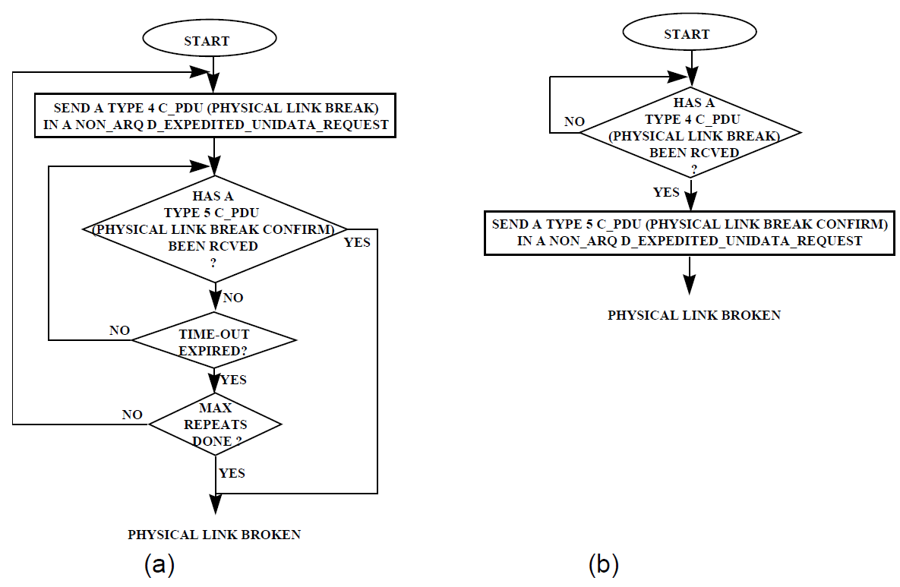

# Annex B: Channel Access Sublayer

> The functions required of the channel access sublayer are quite limited in the HF subnetwork.

1.  <u>Channel Access Sublayer Service Definition</u>

> The Channel Access Sublayer provides services to the Subnetwork Interface Sublayer. These services are:

1.  Execute requests by the Subnetwork Interface sublayer to “*Make”* and *“Break”*

> Physical Links

1.  Notify the Subnetwork Interface sublayer of changes in the state of a Physical Link.

2.  Accept S\_PDUs (encapsulated in the appropriate primitive) from the Subnetwork Interface sublayer for transmission on a Physical Link.

3.  Deliver S\_PDUs (encapsulated in the appropriate primitive) received on a Physical Link to the Subnetwork Interface sublayer.

> In order to provide these services, the Channel Access Sublayer implements a protocol that specifies the tasks that must be executed and the rules that must be obeyed by the sublayer. While a number of different channel-access protocols are possible, the one that is suitable for this document is referred to as the Type 1 protocol, and described herein.

1.  <u>Interface Primitives Exchanged with the Subnetwork Interface Sublayer</u>

> The implementation of the interface between the Channel Access Sublayer and the Subnetwork Interface sublayer is not mandated or specified by this STANAG. Since the interface is internal to the subnetwork architecture and may be implemented in a number of ways it is considered beyond the scope of STANAG 5066. A model of the interface has been assumed, however, for the purposes of discussion and specification of other sublayer functions. The STANAG’s presentation of the interface is modelled after that used in Reference 1 \[1\] to this STANAG, however, the interface defined in the reference is not mandated for use herein.
>
> Despite the advisory nature of the conceptual model of the internal interface between the Subnetwork Interface sublayer and the Channel Access Sublayer, there are some mandatory requirements that are placed on any interface implementation.
>
> The interface must support the service-definition for the Channel Access Sublayer, i.e.:

1.  the interface **shall** (1) enable the Subnetwork Interface sublayer to submit requests to change the state of a physical link, i.e., to make or break a physical link of a specified type (i.e., Exclusive or Nonexclusive, as specified in Section B. ) with a specified node address;

2.  the interface **shall** (2) enable the Channel Access sublayer to notify the Subnetwork Interface sublayer of changes in the status of the physical link;

> 1 Clark, D., and N. Karavassillis, “Open Systems for Radio Communications: A Subnet Architecture for Data Transmission over HF Radio”, TM-937, May 1998, pp. 72-80

1.  The interface **shall** (3) allow the Channel Access sublayer to accept S\_PDUs from the Subnetwork Interface sublayer

2.  The interface **shall** (4) allow the Channel Access sublayer to deliver S\_PDUs to the Subnetwork Interface sublayer.

3.  Since S\_PDUs have no explicit indication as to whether or not they use Expedited or Normal Data Delivery Service in the subnetwork, the interface **shall** (5) indicate the type of delivery service required by or given to the S\_PDUs exchanged across the interface.

> Additionally, the protocol-control information from the Subnetwork Interface sublayer that is required for the management of the Channel Access sublayer **shall** (6) not be derived from knowledge of the contents or format of any client data or U\_PDUs encapsulated within the S\_PDUs exchanged over the interface.
>
> \[Note: user’s that encrypt their traffic prior to submittal may use the subnetwork. Subnetwork operation must be possible with client data in arbitrary formats that are unknown to the subnetwork, therefore any service requirements or indications must be provided by interface control information provided explicitly with the user data.\]
>
> The interface may use knowledge of the contents of S\_PDUs (excluding the contents of any encapsulated U\_PDUs) to derive protocol control information for the Channel Access sublayer. This approach is highly discouraged, however. The recommended approach for implementation is that information required for protocol control within the Channel Access sublayer should be provided explicitly in appropriate interface primitives.
>
> In keeping with accepted practice in the definition of layered protocols, and as a means for specifying the operations of the sublayers that are mandated by this STANAG, the communication between the Channel Access Sublayer and the Subnetwork Interface sublayer is described herein with respect to a set of Primitives. The interface Primitives are a set of messages for communication and control of the interface and service requests made between the two layers.
>
> By analogy to the design of the client-subnetwork interface, the technical specification of the Channel Access Sublayer assumes communication with the Subnetwork Interface sublayer using primitives prefixed with a “C\_”. A minimal set of C\_Primitives has been assumed that meet the requirements stated above and the general function for each C\_Primitive is given in Table B-1.
>
> These C\_Primitives are given without benefit of a list of arguments or detailed description of their use. As noted initially, they are offered for information only as a means of describing the interaction between the Channel Access sublayer and the Subnetwork Interface sublayer, and as general guidance for a possible implementation.
>
> Table B-1- Nominal Definition of C\_Primitives for the Interface between the Channel Access sublayer and the Subnetwork Interface sublayer (non-mandatory, for information-only)

<table>
<colgroup>
<col style="width: 39%" />
<col style="width: 13%" />
<col style="width: 46%" />
</colgroup>
<thead>
<tr class="header">
<th><blockquote>

NAME OF PRIMITIVE

</blockquote></th>
<th><blockquote>

DIRECTIO

N (see Note)

</blockquote></th>
<th>COMMENTS</th>
</tr>
</thead>
<tbody>
<tr class="odd">
<td></td>
<td></td>
<td></td>
</tr>
<tr class="even">
<td>C_PHYSICAL_LINK_MAKE</td>
<td>SIS CAS</td>
<td>request to make a physical link of a specified type to a specified node</td>
</tr>
<tr class="odd">
<td>C_PHYSICAL_LINK_MADE</td>
<td><blockquote>

CASSIS

</blockquote></td>
<td>report that a physical link was made</td>
</tr>
<tr class="even">
<td>C_PHYSICAL_LINK_REJECTED</td>
<td><blockquote>

CASSIS

</blockquote></td>
<td>report that a physical link could not be made and that the initiating request is rejected</td>
</tr>
<tr class="odd">
<td></td>
<td></td>
<td></td>
</tr>
<tr class="even">
<td>C_PHYSICAL_LINK_BREAK</td>
<td><blockquote>

SISCAS

</blockquote></td>
<td>request to break a physical link</td>
</tr>
<tr class="odd">
<td>C_PHYSICAL_LINK_BROKEN</td>
<td><blockquote>

CASSIS

</blockquote></td>
<td>report that a physical has been broken (by request, or unilaterally)</td>
</tr>
<tr class="even">
<td>C_CHANNEL_AVAILABILITY</td>
<td><blockquote>

CASSIS

</blockquote></td>
<td>reports on the availability of a given channel and the underlying subnetwork</td>
</tr>
<tr class="odd">
<td></td>
<td></td>
<td></td>
</tr>
<tr class="even">
<td>C_UNIDATA_REQUEST</td>
<td><blockquote>

SISCAS

</blockquote></td>
<td>delivers an S_PDU to the Channel Access Sublayer, requesting normal data-delivery service</td>
</tr>
<tr class="odd">
<td>C_UNIDATA_REQUEST_CONFIRM</td>
<td><blockquote>

CASSIS

</blockquote></td>
<td>confirms S_PDU delivery to the remote node using the normal data-delivery service</td>
</tr>
<tr class="even">
<td>C_UNIDATA_REQUEST_REJECTED</td>
<td><blockquote>

CASSIS

</blockquote></td>
<td>notifies that an S_PDU could not be delivered to a remote node using the normal data-delivery service</td>
</tr>
<tr class="odd">
<td>C_UNIDATA_INDICATION</td>
<td><blockquote>

CASSIS

</blockquote></td>
<td>delivers an S_PDU that had been received using the normal delivery service to the Subnetwork Interface sublayer</td>
</tr>
<tr class="even">
<td></td>
<td></td>
<td></td>
</tr>
<tr class="odd">
<td>C_EXPEDITED_UNIDATA_REQUEST</td>
<td><blockquote>

SISCAS

</blockquote></td>
<td>delivers an S_PDU to the Channel Access Sublayer, requesting normal data-delivery service</td>
</tr>
<tr class="even">
<td>
C_EXPEDITED_UNIDATA_REQUEST

_ CONFIRM
</td>
<td><blockquote>

CASSIS

</blockquote></td>
<td>confirms S_PDU delivery to the remote node using the normal data-delivery service</td>
</tr>
<tr class="odd">
<td>
C_EXPEDITED_UNIDATA_REQUEST

_ REJECTED
</td>
<td><blockquote>

CASSIS

</blockquote></td>
<td>notifies that an S_PDU could not be delivered to a remote node using the normal data-delivery service</td>
</tr>
<tr class="even">
<td>C_EXPEDITED_UNIDATA_ INDICATION</td>
<td><blockquote>

CASSIS

</blockquote></td>
<td>delivers an S_PDU that had been received using the normal delivery service to the Subnetwork Interface sublayer</td>
</tr>
</tbody>
</table>

> \[Note: SIS = Subnetwork Interface Sublayer; CAS = Channel Access Sublayer;
>
>  = direction of message flow from source to destination sublayer\]

1.  <u>Channel Access Protocol Type 1 and C\_PDUs</u>

> The Type 1 Channel Access Protocol **shall** (1) support the following subnetwork configuration:

1.  Pairs of Nodes **shall** (2) be linked “point-to-point” on a “common” HF frequency channel or on dedicated frequency channels selected from a pool of assigned frequencies by an external process2 which is not under the control of any of the sublayers.

> (Note: an ALE sublayer is not present or not used in STANAG 5066).
>
> 1a. The co-ordination of the making and breaking of Physical Links (hereinafter referred to as 'CAS 1 Linking Protocol') between two nodes (after a common frequency has already been selected by an external process) **shall** (3) be performed solely by the Channel Access Sublayer. If it can be reasonably assured that both nodes in a pair of nodes linked "point-to-point" on a common frequency have already entered the "connected" state by virtue of their becoming linked on a common frequency and that they will exit the "connected" state when they are no longer linked on a common frequency, then the CAS 1 Linking Protocol **may** be omitted.
>
> If the CAS 1 Linking Protocol is omitted and the response to ARQ-data DPDUs is a Warning DPDU indicating that a connection is not made, then the CAS 1 Linking Protocol **shall** (3.1) be followed and the data resent.
>
> If a slave node (receiving station) links on a common frequency through an external process (e.g., an ALE protocol) and a CAS-1 Physical-Link Request C\_PDU is received, then the receiving node **shall** (3.2) respond in accordance with the requirements of the 'CAS 1 Linking Protocol', accepting or rejecting the request as is appropriate for its state.
>
> Physical links established by a process external to the CAS 1 linking protocol **shall** (3.3) be broken when the common frequency condition between the linked nodes no longer exists. Conversely, the common frequency condition between two nodes **shall** (3.4) be terminated when either node declares its logical physical link to be broken. In these cases, the physical link **shall** (3.5) be broken without using the CAS 1 linking protocol.
>
> Physical links established by a process external to the CAS 1 linking protocol **shall** (3.6) respond to the reception of a type 4 PHYSICAL\_LINK\_BREAK C\_PDU by sending a type 5 PHYSICAL\_LINK\_BREAK\_CONFIRM C\_PDU as specified in Section B.3.2.2. The external process that created the common frequency condition **shall** (3.7) terminate that condition and the physical link **shall** (3.8) be broken at that point.
>
> It is **strongly recommended** to use the CAS 1 linking protocol if three or more active nodes are on the same frequency. Any node omitting CAS 1 that detects a third node on the same channel **should** enable CAS 1.
>
> \[Note: It is possible for this case to occur in the presence of an external frequency coordination protocol (e.g., "NET", "ALL", or "ANY" calls in an ALE protocol). In this case, it is beneficial to arbitrate physical link establishment by using appropriate C\_PDU transfer. \]

1.  Physical Links **shall** (4) be of either of two types, Exclusive or Nonexclusive, with properties and service features defined as follows:

    1.  a Node **shall** (5) use an Exclusive Physical Link to support control and data exchange for Hard Link Data Exchange Sessions as requested by the Subnetwork Interface Sublayer;

    2.  A Node **shall** (6) use a Nonexclusive Physical Link to support control and data exchange for Soft-Link Data Exchange Sessions as requested by the Subnetwork Interface Sublayer.

> \[Note: the Channel Access sublayer is not explicitly aware of the existence of the Hard-Link or Soft-Link types of the Subnetwork Interface sublayer, nor need it be aware. In practice, and as specified in STANAG 5066 Annex A, the Subnetwork Interface Sublayer will request the making of an Exclusive Physical Link whenever it wishes to establish and use a Hard Link Data Exchange Session. Likewise, the Subnetwork Interface Sublayer will establish only Nonexclusive Physical Links to support Soft-Link Data Exchange Sessions.\]

1.  A Node **shall** (7) establish at most two Exclusive Physical Links with other nodes.

> \[Note: This requirement is *<u>not</u>* contradictory, though it may seem so with the nomenclature chosen. A node must accept a request for an Exclusive Physical Link in accordance with the requirements of Section B.3, even if another Exclusive Physical Link is active. The reason is that the newly requested link is required to support peer-to-peer communication at the higher layers where negotiation to establish Hard Link Data Exchange Sessions takes place. Priorities and ranks of clients are not manifest at the Channel Access Sublayer, but only at the Subnetwork Interface Sublayer. Therefore, a new request for an Exclusive Physical Link must be accepted long enough to allow the Subnetwork Interface sublayers of the local and remote nodes to establish the respective priorities of the existing and requested links. Thus, in practice, at most two Exclusive Physical Links can be active at any time, one to support an existing Hard-Link Data Exchange, and the other to support the peer-to-peer communication at the Subnetwork Interface sublayer for an incoming Hard Link Request from a remote node. Since the newly requested Exclusive Physical Link is for a Hard-Link Data Exchange Session, the Subnetwork Interface Sublayer will determine the respective priorities of the active and newly requested links. The Subnetwork Interface Sublayer will either terminate the active link or reject the request, which ever is the loser, and force closure of the corresponding Exclusive Physical Link.\]

1.  A Node may have Nonexclusive Physical Links with more than one other node at a

> time, one Nonexclusive Physical Link per remote node; i.e., a Node may “*Make*” a new Nonexclusive Physical Link with another node before it “*Breaks*” any Nonexclusive Physical links.

1.  There **shall** (8) be no explicit peer-to-peer communication required to switch from use of one Nonexclusive Physical Link to another.

> \[Note: A node uses an active Physical Link merely by exchanging data on the link with the other node. With respect to the Channel Access sublayer, this requires no explicit management; lower sublayers, however, may require explicit coordination to switch from use of one link to another based on the destination address of S\_PDUs submitted by the Subnetwork Interface Sublayer.\]

1.  The Nodes may or may not be within ground-wave distances or be able to receive the transmissions of other nodes sharing the channel.

> 2 An appropriate frequency may be simply selected by an external (semi-)automated process or manually by an operator
>
> e.g. “available” frequencies are negotiated between a node which needs to establish a link and a master station which “manages” the assigned frequency pool. Protocol type 1 provides no mechanism for automatic interaction between the external process and the Channel Access Sublayer. The Channel Access Sublayer “assumes” that a common frequency channel has already been found.
>
> The Type 1 Channel Access Sublayer **shall** (9) communicate with peer sublayers in other nodes using the protocols defined here in order to:

1.  Make and break physical links

2.  Deliver S\_PDUs between Subnetwork Interface Sublayers at the local node and remote node(s).

    1.  Type 1 Channel Access Sublayer Data Protocol Units (C\_PDUs)

> The following C\_PDUs **shall** (1) be used for peer-to-peer communication between Channel Access Sublayers in the local and remote node(s):

<table>
<colgroup>
<col style="width: 75%" />
<col style="width: 24%" />
</colgroup>
<thead>
<tr class="header">
<th><blockquote>

<em>C_PDU NAME</em>

</blockquote></th>
<th><blockquote>

<em>Type Code</em>

</blockquote></th>
</tr>
</thead>
<tbody>
<tr class="odd">
<td>DATA C_PDU</td>
<td>TYPE 0</td>
</tr>
<tr class="even">
<td>PHYSICAL LINK REQUEST</td>
<td>TYPE 1</td>
</tr>
<tr class="odd">
<td>PHYSICAL LINK ACCEPTED</td>
<td>TYPE 2</td>
</tr>
<tr class="even">
<td>PHYSICAL LINK REJECTED</td>
<td>TYPE 3</td>
</tr>
<tr class="odd">
<td>PHYSICAL LINK BREAK</td>
<td>TYPE 4</td>
</tr>
<tr class="even">
<td>PHYSICAL LINK BREAK CONFIRM</td>
<td>TYPE 5</td>
</tr>
</tbody>
</table>

> The first argument and encoded field of all C\_PDUs **shall** (2) be the C\_PDU Type
>
> The remaining format and content of these C\_PDUs **shall** (3) be as specified in the subsections that follow.
>
> Unless noted otherwise, argument values encoded in the C\_PDU bit-fields **shall** (4) be mapped into the fields in accordance with CCITT V.42, 8.1.2.3, i.e.:

1.  when a field is contained within a single octet, the lowest bit number of the field **shall** (5)

> represent the lowest-order (i.e., least-significant-bit) value;

1.  when a field spans more than one octet, the order of bit values within each octet **shall** (6) decrease progressively as the octet number increases. The lowest bit number associated with the field **shall** (7) represent the lowest-order (i.e., least significant bit) value.

> Unless noted otherwise, bit-fields specified as NOT USED **shall** (8) be encoded with the value ‘0’ (i.e., zero).

1.  DATA C\_PDU

# Type :

> “0” = DATA C\_PDU

# Encoding :

> 

> **Figure B-1. Generic Encoding and Bit-Field Map of the DATA C\_PDU Description :**
>
> The DATA (TYPE 0) C\_PDU **shall** (1) be used to send an encapsulated S\_PDU from the
>
> local node to a remote node.
>
> The *Type* argument **shall** (2) be encoded in the first four-bit field of the DATA C\_PDU as shown in Figure B-1. The value of the *Type* argument for the DATA C\_PDU **shall**(3) be zero.
>
> The remaining octets of the DATA C\_PDU **shall** (4) contain the encapsulated S\_PDU and only the encapsulated S\_PDU.
>
> For the Channel Access sublayer request to the lower layers of the subnetwork to deliver a C\_PDU, the delivery service requirements for a DATA C\_PDU **shall** (5) be the same as the S\_PDU that it contains, i.e.:

1.  C\_PDUs for which the Subnetwork Interface sublayer requested Expedited Data Delivery service for the encapsulated S\_PDU **shall** (6) be sent using the Expedited Data Delivery service provided by the lower sublayer, otherwise,

2.  C\_PDUs for which the Subnetwork Interface sublayer requested the normal Data Delivery service for the encapsulated S\_PDU **shall** (7) be sent using the normal Data Delivery service provided by the lower sublayer;

3.  the DELIVERY mode specified by the Subnetwork Interface Sublayer for the encapsulated S\_PDU (i.e., ARQ, non-ARQ, etc.) also **shall** (7) be assigned to the C\_PDU by the Channel Access sublayer as the delivery mode to be provided by the lower sublayer.

    1.  PHYSICAL LINK REQUEST C\_PDU

# Type :

> “1” = PHYSICAL LINK REQUEST

# Encoding :

> 

> **Figure B-2. Generic Encoding and Bit-Field Map of the PHYSICAL LINK REQUEST C\_PDU**

# Description :

> The PHYSICAL LINK REQUEST C\_PDU **shall** (1) be transmitted by a Channel Access sublayer to request the making of the Physical Link.
>
> The PHYSICAL LINK REQUEST C\_PDU **shall** (2) consist of the arguments *Type* and *Link*.
>
> The value of the *Type* argument for the PHYSICAL LINK REQUEST C\_PDU **shall**(3) be ‘1’ (i.e., one), encoded as a four-bit field as shown in Figure B-2.
>
> The three bits not used in the encoding of the PHYSICAL LINK REQUEST C\_PDU **shall** (4)
>
> be reserved for future use and not used by any implementation.
>
> The value of the *Link* argument for the PHYSICAL LINK REQUEST C\_PDU **shall** (5) be encoded as a one-bit field as shown in Figure B-2, with values as follows:

-   a request for a Nonexclusive Physical Link **shall** (6) be encoded with the value ‘0’ (i.e., zero);

-   a request for an Exclusive Physical Link **shall** (7) be encoded with the value ‘1’ (i.e., one).

> When a PHYSICAL LINK REQUEST C\_PDU is transmitted the local Node is not linked to another Node and therefore the ARQ transmission mode is not supportable by the Data Transfer Sublayer. Therefore, the PHYSICAL LINK REQUEST C\_PDU **shall** (8) be sent by the Channel Access Sublayer requesting the lower-layer Expedited Non-ARQ Data Service (i.e., transmission using Type 8 D\_PDUs) in accordance with the Annex C specification of the Data Transfer Sublayer.
>
> A Channel Access sublayer which receives a PHYSICAL LINK REQUEST C\_PDU **shall** (9) respond with either a PHYSICAL LINK ACCEPTED (TYPE 2) C\_PDU or a PHYSICAL LINK REJECTED (TYPE 3) C\_PDU, as appropriate.

1.  PHYSICAL LINK ACCEPTED C\_PDU

# Type :

> “2” = PHYSICAL LINK ACCEPTED

# Encoding :

> 

> **Figure B-3. Generic Encoding and Bit-Field Map of the PHYSICAL LINK ACCEPTED C\_PDU**

# Description :

> The PHYSICAL LINK ACCEPTED (TYPE 2) C\_PDU **shall** (1) be transmitted by a peer sublayer as a positive response to the reception of a TYPE 1 C\_PDU (PHYSICAL LINK REQUEST).
>
> PHYSICAL LINK ACCEPTED (TYPE 2) C\_PDU **shall** (2) consist only of the argument *Type*. \[Note: A Node can never request the establishment of more than one Physical Link with another given node, therefore, the request for which this message is a response is uniquely identified by the node address of the node to which the PHYSICAL LINK ACCEPTED C\_PDU is sent.\]
>
> The *Type* argument **shall** (3) be encoded as a four-bit field containing the binary value ‘two’ as shown in Figure B-3.
>
> When a PHYSICAL LINK ACCEPTED (TYPE 2) C\_PDU is transmitted the local Node is not linked to another Node and therefore the ARQ transmission mode is not supportable by the Data Transfer Sublayer. Therefore, the PHYSICAL LINK ACCEPTED C\_PDU **shall** (4) be sent by the Channel Access Sublayer requesting the lower-layer’s Expedited Non-ARQ Data Service (i.e., transmission using Type 8 D\_PDUs) in accordance with the Annex C specification of the Data Transfer Sublayer.

1.  PHYSICAL LINK REJECTED C\_PDU

# Type :

> “3” = PHYSICAL LINK REJECTED

# Encoding :

> 

> **Figure B-4. Generic Encoding and Bit-Field Map of the PHYSICAL LINK REJECTED C\_PDU**

# Description :

> The PHYSICAL LINK REJECTED (TYPE 3) C\_PDU **shall** (1) be transmitted by a peer sublayer as a negative response to the reception of a TYPE 1 C\_PDU (PHYSICAL LINK REQUEST).
>
> The PHYSICAL LINK REJECTED (TYPE 3) C\_PDU **shall** (2) consist of two arguments:
>
> *Type* and *Reason.*
>
> The *Type* argument **shall** (3) be encoded as a four-bit field containing the binary value ‘three’ as shown in Figure B-4.
>
> The *Reason* argument **shall** (4) be encoded in accordance with Figure B-4 and the following table3:

<table>
<colgroup>
<col style="width: 63%" />
<col style="width: 36%" />
</colgroup>
<thead>
<tr class="header">
<th>Reason</th>
<th>Value</th>
</tr>
</thead>
<tbody>
<tr class="odd">
<td>Reason Unknown</td>
<td>0</td>
</tr>
<tr class="even">
<td>Broadcast-Only-Node</td>
<td>1</td>
</tr>
<tr class="odd">
<td>Higher-Priority-Link-Request-Pending</td>
<td>2</td>
</tr>
<tr class="even">
<td><blockquote>

Supporting Exclusive-Link

</blockquote></td>
<td>3</td>
</tr>
<tr class="odd">
<td><blockquote>

<em>unspecified</em>

</blockquote></td>
<td>4-15</td>
</tr>
</tbody>
</table>

> The value 0, indicating an unknown reason for rejecting the Make request for the physical link, is always a valid reason for rejection. Reasons corresponding to values in the range 4-15 are currently unspecified and unused in the STANAG.
>
> When a PHYSICAL LINK REJECTED C\_PDU is transmitted the local Node is not linked to another Node and therefore the ARQ transmission mode is not supportable by the Data
>
> 3 “Link busy” is not included in the list of possible reasons for rejecting anode’s request to establish a link since this function is provided by the WARNING frame type of the Data Transfer Sublayer, as specified in Annex C.
>
> Transfer Sublayer. Therefore, the PHYSICAL LINK REJECTED C\_PDU **shall** (5) be sent by the Channel Access Sublayer requesting the lower-layer Expedited Non-ARQ Data Service (i.e., transmission using Type 8 D\_PDUs) in accordance with the Annex C specification of the Data Transfer Sublayer.

1.  PHYSICAL LINK BREAK C\_PDU

# Type :

> “4” = PHYSICAL LINK BREAK

# Encoding :

> 

> **Figure B-5. Generic Encoding and Bit-Field Map of the PHYSICAL LINK BREAK C\_PDU**

# Description :

> The PHYSICAL LINK BREAK C\_PDU **shall** (1) be transmitted by either of the peer Channel Access sublayers involved in an active Physical Link to request the breaking of the link.
>
> The PHYSICAL LINK BREAK C\_PDU **shall** (2) consists of two arguments: *Type and Reason.*
>
> The *Type* argument **shall** (3) be encoded as a four-bit field containing the binary value ‘four’ as shown in Figure B-5.
>
> The *Reason* argument **shall** (4) be encoded in accordance with Figure B-5 and the following table:

<table>
<colgroup>
<col style="width: 63%" />
<col style="width: 36%" />
</colgroup>
<thead>
<tr class="header">
<th>Reason</th>
<th>Value</th>
</tr>
</thead>
<tbody>
<tr class="odd">
<td>Reason Unknown</td>
<td>0</td>
</tr>
<tr class="even">
<td>Higher-Layer-Request</td>
<td>1</td>
</tr>
<tr class="odd">
<td>
Switching to Broadcast-Data-

Exchange Session
</td>
<td>2</td>
</tr>
<tr class="even">
<td>Higher-Priority-Link-Request-Pending</td>
<td>3</td>
</tr>
<tr class="odd">
<td>No More Data</td>
<td>4</td>
</tr>
<tr class="even">
<td><blockquote>

<em>unspecified</em>

</blockquote></td>
<td>4-15</td>
</tr>
</tbody>
</table>

> The value 0, indicating an unknown reason for requesting the breaking of a physical link, is always a valid reason. Reasons corresponding to values in the range 4-15 currently are not defined in this STANAG.
>
> A peer sublayer which receives the PHYSICAL LINK BREAK C\_PDU **shall** (5) immediately declare the Physical Link as broken and respond with a PHYSICAL LINK BREAK (TYPE 5) C\_PDU as specified in section B.3.1.6 below.
>
> The PHYSICAL LINK BREAK C\_PDU **shall** (6) be sent by the Channel Access Sublayer requesting the lower-layer Expedited Non-ARQ Data Service (i.e., transmission using Type 8 D\_PDUs) in accordance with the Annex C specification of the Data Transfer Sublayer. \[Note: The reason the PHYSICAL LINK BREAK C\_PDU is sent with the non-ARQ data service, even though a physical link exists at the time that it is sent, is because the receiving peer will immediately declare the Link as broken. The receiving peer will therefore not have time to send ARQ acknowledgements for the C\_PDU.\]

1.  PHYSICAL LINK BREAK CONFIRM C\_PDU

# Type :

> “5” = PHYSICAL LINK BREAK CONFIRM

# Encoding :

> 

> **Figure B-6. Generic Encoding and Bit-Field Map of the PHYSICAL LINK BREAK CONFIRM C\_PDU**

# Description :

> The PHYSICAL LINK BREAK CONFIRM (TYPE 5) C\_PDU **shall** (1) be transmitted by a Channel Access sublayer as a response to a TYPE 4 “PHYSICAL LINK BREAK” C\_PDU.
>
> The PHYSICAL LINK BREAK CONFIRM (TYPE 5) C\_PDU **shall** (2) consist of the single argument *Type*.
>
> The *Type* argument **shall** (3) be encoded as a four-bit field containing the binary value ‘five’ as shown in Figure B-6.
>
> The PHYSICAL LINK BREAK CONFIRM (TYPE 5) C\_PDU **shall** (4) be sent by the Channel Access Sublayer requesting the lower-layer Expedited Non-ARQ Data Service (i.e., transmission using Type 8 D\_PDUs) in accordance with the Annex C specification of the Data Transfer Sublayer.
>
> Upon receiving a PHYSICAL LINK BREAK CONFIRM (TYPE 5) C\_PDU, the peer which initiated the breaking of the Link **shall** (5) declare the Link as broken.

1.  <u>Type 1 Channel Access Sublayer Peer-to-Peer Communication Protocol</u>

> Requirements on the Type 1 Channel Access Sublayer Peer-to-Peer Communication Protocols are specified in this section and the subsections below.
>
> The Channel Access sublayer **shall** (1) perform all peer-to-peer communications for protocol control using the following C\_PDUs:

<table>
<colgroup>
<col style="width: 77%" />
<col style="width: 22%" />
</colgroup>
<thead>
<tr class="header">
<th><blockquote>

<em>C_PDUs for Peer-to-Peer Protocol Control</em>

</blockquote></th>
<th><blockquote>

<em>Type Code</em>

</blockquote></th>
</tr>
</thead>
<tbody>
<tr class="odd">
<td>PHYSICAL LINK REQUEST</td>
<td>TYPE 1</td>
</tr>
<tr class="even">
<td>PHYSICAL LINK ACCEPTED</td>
<td>TYPE 2</td>
</tr>
<tr class="odd">
<td>PHYSICAL LINK REJECTED</td>
<td>TYPE 3</td>
</tr>
<tr class="even">
<td>PHYSICAL LINK BREAK</td>
<td>TYPE 4</td>
</tr>
<tr class="odd">
<td>PHYSICAL LINK BREAK CONFIRM</td>
<td>TYPE 5</td>
</tr>
</tbody>
</table>

> All peer-to-peer communications **shall** (2) be done by the Channel Access sublayer requesting the lower-layer Expedited Non-ARQ Data Service (i.e., transmission using Type 8 D\_PDUs in accordance with the Annex C specification of the Data Transfer Sublayer).
>
> The criteria for accepting or rejecting Physical Links Requests **shall** (3) be as follows:

1.  A request to establish a Nonexclusive Physical Link **shall** (4) be accepted if there are no Exclusive Hard Links (active or with requests pending), and as long as the resulting total number of Nonexclusive Physical Links does not exceed the maximum number of Nonexclusive Physical Links allowed by the current subnetwork configuration.

2.  At most one new request to establish an Exclusive Physical Link **shall** (5) be accepted as so long as the resulting number of active Exclusive Physical Links is no greater than two.

> \[Note: As noted earlier in this STANAG, a node must accept a request for an Exclusive Physical Link is, even if another Exclusive Physical Link is active, to support peer-to-peer communication at the higher layers where negotiation to establish Hard Link Data Exchange Sessions takes place. A new request for an Exclusive Physical Link must be accepted long enough to allow the Subnetwork Interface sublayers of the local and remote nodes to establish the respective priorities of any existing and requested links\]

1.  <u>Protocol for Making a Physical Link</u>

> In the specification that follows of the protocol for making a physical link, the node which requests the physical link is referred to as the Caller or Calling node, while the node which receives the request will be referred to as the Called node.
>
> The protocol for making the physical link **shall** (1) consist of the following steps:
>
> <u>Step 1-Caller</u>:

1.  The Calling Node’s Channel Access Sublayer **shall** (2) send a PHYSICAL LINK REQUEST (TYPE 1) C\_PDU to initiate the protocol, with the request’s *Link* argument set equal to the type of link (i.e., Exclusive or Nonexclusive) requested by the higher sublayer,

2.  Upon sending the PHYSICAL LINK REQUEST (TYPE 1) C\_PDU the Channel Access Sublayer **shall** (3) start a timer which is set to a value greater than or equal to the maximum time required by the Called Node to send its response (this time depends on the modem parameters, number of re-transmissions, etc.),

3.  The maximum time to wait for a response to a PHYSICAL LINK REQUEST (TYPE 1) C\_PDU **shall** (4) be a configurable parameter in the implementation of the protocol.

> <u>Step 2-Called:</u>

1.  On receiving a PHYSICAL LINK REQUEST (TYPE 1) C\_PDU, a Called node **shall** (5)

> determine whether or not it can accept or reject the request as follows:

1.  if the request is for a Nonexclusive Physical Link and the Called node has an active Exclusive Physical Link, the Called node **shall** (6) reject the request,

2.  otherwise, if the request is for a Nonexclusive Physical Link and the Called node has the maximum number of active Nonexclusive Physical Links, the Called node **shall** (7) reject the request,

3.  otherwise, the Called node **shall** (8) accept the request for a Nonexclusive Physical Link.

4.  If the request is for an Exclusive Physical Link and the Called node has either one or no active Exclusive Physical Link, the Called node **shall** (9) accept the request,

5.  Otherwise, the Called node **shall** (10) reject the request for an Exclusive Physical Link.

<!-- -->

1.  After determining if it can accept or reject the PHYSICAL LINK REQUEST, a Called node **shall** (11) respond as follows:

    1.  if a Called node accepts the physical link request, it **shall** (12) respond with a PHYSICAL LINK ACCEPTED (TYPE 2) C\_PDU,

    2.  otherwise, when a Called node rejects the physical link request, it **shall** (13)

> respond with a PHYSICAL LINK REJECTED (TYPE 3) C\_PDU.

1.  After a PHYSICAL LINK ACCEPTED (TYPE 2) C\_PDU is sent, the called channel access sublayer **shall** (14) declare the physical link made and transition to a state in which it executes the protocol for data exchange using C\_PDUs.

2.  If further PHYSICAL LINK REQUEST (TYPE 1) C\_PDUs are received from the same address after the link is made, the Channel Access sublayer **shall** (15) again reply with a PHYSICAL LINK ACCEPTED (TYPE 2) C\_PDU.

3.  If at least one DATA (TYPE 0) C\_PDU is not received on a newly activated Physical Link after waiting for a specified maximum period of time, the Called Node **shall** (16) abort the Physical Link and declare it inactive.

4.  The maximum period of time to wait for the first DATA (TYPE 0) C\_PDU before aborting a newly activated Physical Link **shall** (17) be a configurable parameter in the implementation.

> <u>Step 3. Caller</u>
>
> There are two possible outcomes to the protocol for making a physical link: success or failure:

1.  Upon receiving a PHYSICAL LINK ACCEPTED (TYPE 2) C\_PDU, the calling Channel Access Sublayer **shall** (18) proceed as follows:

    1.  if the request made an Exclusive Physical Link, the Calling node **shall** (19) break any existing Nonexclusive Physical Links.

    2.  the Calling node **shall** (20) declare the Physical Link as *successfully Made*, otherwise,

2.  upon receiving a PHYSICAL LINK REJECTED (TYPE 3) C\_PDU, the Channel Access Sublayer **shall** (21) declare the Physical Link as *Failed,* otherwise,

3.  upon expiration of its timer without any response having been received from the remote node, the Channel Access Sublayer **shall** (22) repeat Step 1 (i.e. send a PHYSICAL LINK REQUEST (TYPE 1) C\_PDU and set a response time) and await again a response from the remote node.

> The maximum number of times the Caller sends the PHYSICAL LINK REQUEST (TYPE 1) C\_PDU without a response from the called node of either kind **shall** (23) be a configurable parameter in the implementation of the protocol.
>
> After having repeated Step 1 the configurable maximum number of times without any response having been received from the remote node, the Caller’s Channel Access Sublayer **shall** (24) declare the protocol to make the physical link as *Failed*.
>
> | Figure B-7 (a) and (b) show the nominal procedures followed by the Caller and Called Channel Access Sublayers for Making a Physical Link. This STANAG acknowledges that other implementations may meet the stated requirements.
>
> 

# Figure B-7 (a). Type 1 Channel Access Sublayer protocol for Making a Physical Link (Caller Peer)

> 

# Figure B-7 (b). Type 1 Channel Access Sublayer Protocol for Making a Physical Link (Called Peer)

> After having declared the Physical Link as successfully made, the peer Channel Access Sublayers do not carry out any further handshake in order to confirm the successful operation of the Link.
>
> B.3.2.2 <u>Protocol for Breaking a Physical Link</u>
>
> In the specification that follows of the protocol for breaking a physical link, the node which requests the breaking of the Physical Link will be referred to as the Initiator or initiating node, while the node which receives the request will be referred to as the Responder or responding node.
>
> The protocol for breaking the Physical Link **shall** (1) consists of the following steps: <u>Step 1: Initiator</u>

1.  To start the protocol, the Initiator’s Channel Access Sublayer **shall** (2) send a type 4 C\_PDU (PHYSICAL LINK BREAK).

2.  Upon sending this C\_PDU the Channel Access Sublayer **shall** (3) start a timer which is set to a value greater than or equal to the maximum time required by the Called Node to send its response (this time depends on the modem parameters, number of re-transmissions, etc.).

> <u>Step 2: Responder</u>

1.  Upon receiving the type 4 C\_PDU the Responder’s Channel Access Sublayer **shall** (4) declare the Physical link as *broken* and send a PHYSICAL LINK BREAK CONFIRM (TYPE 5) C\_PDU.

> <u>Step 3: Initiator</u>

1.  Upon receiving a PHYSICAL LINK BREAK CONFIRM (TYPE 5) C\_PDU, the Initiator’s Channel Access Sublayer **shall** (5) declares the Physical Link as *broken*.

2.  Upon expiration of its timer without any response having been received from the remote node, the Initiator’s Channel Access Sublayer **shall** (6) repeat step 1 and wait again for a response from the remote node.

3.  After having repeated Step 1 a maximum number of times (left as a configuration parameter) without any response having been received from the remote node, the Initiator’s Channel Access Sublayer **shall** (7) declare the Physical Link as *broken*.

> Figures B-8 (a) and (b) show the procedures followed by the Initiator and Responding Channel Access Sublayers for Breaking a Physical Link.
>
> 

# Figure B-8. Type 1 Channel Access Sublayer protocol for Breaking a Physical Link

> **(a) Initiator Peer. (b) Responding Peer.**
>
> B.3 <u>Protocol for Exchanging Data C\_PDUs.</u>
>
> The protocol for exchanging C\_PDUs between peers is simple and straightforward, since the Channel Access Sublayer relies entirely on its supporting (i.e, Data Transfer) sublayer to provide delivery services.
>
> The sending peer **shall** (1) accept S\_PDUs from the Subnetwork Interface Sublayer, envelop them in a “DATA” C\_PDU (by adding the C\_PCI) and send them to its receiving peer via its interface to the Data Transfer Sublayer.
>
> The receiving peer **shall** (2) receive DATA C\_PDUs from the Data Transfer Sublayer interface, check them for validity, strip off the C\_PCI, and deliver the enveloped S\_PDU to the Subnetwork Interface Sublayer.
