## Annex C: Data Transfer Sublayer

> The Data Transfer Sublayer is responsible for the efficient transfer across the radio link of protocol data units from the Management Sublayer (i.e., M\_PDUs) and Channel Access Sublayer (i.e., C\_PDUs) in the STANAG 5066 profile. Usually, but not always, this means the error free delivery of C\_PDUs to the Channel Access Sublayer. Efficient transmission over the radio channel of protocol data units of the Data Transfer Sublayer (i.e., D\_PDUs, which contain the C\_PDUs or M\_PDUs) is achieved principally by two mechanisms. The first is segmentation of the large C\_PDUs into smaller D\_PDUs if necessary and the second is the selective repetition (selective ARQ) by the sending node of D\_PDUs which were received in error. The other mode (non ARQ) of transmitting involves the segmentation of the large C\_PDUs into smaller D\_PDUs and combining the received D\_PDUs such that the segmented C\_PDU can be reconstructed in a “best-effort” attempt.

## Data Transfer Sublayer Service Definition

> Depending on the application and service-type requested by higher sublayers, the user service provided by the Data Transfer Sublayer **shall** (1) be either a simple **non ARQ service** - commonly known as broadcast mode - or a reliable **selective ARQ service**, as specified herein.
>
> The Data Transfer Sublayer **shall** (2) provide “sub-modes” for **non ARQ** and reliable **selective ARQ** delivery services, which influence the characteristics of the particular service, as specified below
>
> In addition to the Selective ARQ and Non-ARQ services provided to the upper sublayers, the Data Transfer Sublayer shall provide an Idle Repeat Request service for peer-to-peer communication with the Data Transfer Sublayer of other nodes.

## Non-ARQ Service

> In the **non ARQ service** error-check bits (i.e., cyclic-redundancy-check or CRC bits) applied to the D\_DPU **shall** (1) be used to detect errors, and any D\_PDUs that are found to contain transmission errors **shall** (2) be discarded by the data transfer sublayer protocol entity.
>
> A special mode of the non-ARQ service **shall** (3) be available to reconstruct C\_PDUs from D\_PDUs in error and deliver them to the Channel Access Sublayer.
>
> In the **non ARQ** mode, the following submodes may be specified:

-   regular data service.

-   expedited data service.

-   “in order” delivery of C\_PDUs is not guaranteed.

-   delivery of complete or error free C\_PDUs is not guaranteed.

## Selective ARQ Service

> The reliable **Selective ARQ service shall** (1) use CRC check bits and flow control procedures, such as requests for retransmission of D\_PDUs in which errors have been detected, to provide a reliable data transfer service.
>
> In the **Selective ARQ** service, the following submodes may be specified:

-   regular data service.

-   expedited data service.

-   node and client level delivery confirmation.

-   “in-order” or “out-of-order” deliver of C\_PDUs to the remote peer network layer.

-   Delivery of complete and error free C\_PDUs is guaranteed.

## Interface Primitives Exchanged with the Channel Access Sublayer

> The implementation of the interface between the Data Transfer Sublayer and the Channel Access Sublayer is not mandated or specified by this STANAG. Since the interface is internal to the subnetwork architecture and may be implemented in a number of ways it is considered beyond the scope of STANAG 5066. A model of the interface has been assumed, however, for the purposes of discussion and specification of other sublayer functions. The STANAG’s presentation of the interface is modelled after that used in Reference 1 \[1\] to this STANAG, however, the interface defined in the reference is not mandated for use herein.
>
> Despite the advisory nature of the conceptual model of the internal interface between the Data Transfer Sublayer and the Channel Access Sublayer, there are some mandatory requirements that are placed on any interface implementation.
>
> The interface must support the service-definition for the Data Transfer Sublayer, i.e.:

1.  The interface **shall** (1) allow the Channel Access Sublayer to submit protocol data units (i.e., C\_PDUs) for transmission using the regular and expedited delivery services provided by the Data Transfer Sublayer.

2.  The interface **shall** (2) allow the Data Transfer Sublayer to deliver C\_PDUs to the Channel Access Sublayer.

3.  The interface **shall** (3) permit the Channel Access Sublayer to specify the delivery services, priority, and time-to-die required by the C\_PDUs when it submits them to the Data Transfer Sublayer.

4.  The interface **shall** (4) permit the Data Transfer Sublayer to specify the delivery services that were used by received C\_PDUs when it submits them to the Channel Access Sublayer.

5.  The interface **shall** (5) permit the Channel Access Sublayer to specify the destination address to which C\_PDUs are to be sent.

6.  The interface **shall** (6) permit the Data Transfer Sublayer to specify the source address from which C\_PDUs are received, and the destination address to which they had been sent.

7.  The interface **shall** (7) permit the Data Transfer Sublayer to notify the Channel Access sublayer when a warning indication (i.e., a WARNING D\_PDU) has been received from a remote peer, the source and destination address associated with the warning, the reason for the warning, and the event (i.e., message type) that triggered the warning message.

8.  The interface **shall** (8) permit the Data Transfer Sublayer to notify the Channel Access sublayer that a warning indication (i.e., a WARNING D\_PDU) has been sent to a remote peer, the destination address associated with the warning, the reason for the warning, and the event (i.e., message type) that triggered the warning message.

9.  The interface **shall** (9) permit the Channel Access sublayer to notify the Data Transfer Sublayer that a Connection (i.e., either an Exclusive or Nonexclusive Link) has been established with a given node.

10. The interface **shall** (10) permit the Channel Access sublayer to notify the Data Transfer Sublayer that a Connection (i.e., either an Exclusive or Nonexclusive Link) has been terminated with a given node.

11. The interface **shall** (11) permit the Data Transfer Sublayer to notify the Channel Access sublayer that a Connection (i.e., either an Exclusive or Nonexclusive Link) has been lost with a given node.

1 Clark, D., and N. Karavassillis, “Open Systems for Radio Communications: A Subnet Architecture for Data Transmission over HF Radio”, TM-937, May 1998, pp. 109-115

> Additionally, the protocol-control information from the Channel Access sublayer that is required for the management of the Data Transfer Sublayer **shall** (12) not be derived from knowledge of the contents or format of any client data or U\_PDUs encapsulated within the C\_PDUs exchanged over the interface.
>
> \[Note: user’s that encrypt their traffic prior to submittal may use the subnetwork. Subnetwork operation must be possible with client data in arbitrary formats that are unknown to the subnetwork, therefore any service requirements or indications must be provided by interface control information provided explicitly with the user data.\]
>
> The interface may use knowledge of the contents of C\_PDUs (excluding the contents of any encapsulated U\_PDUs) to derive protocol control information for the Data Transfer sublayer. This approach is highly discouraged, however. The recommended approach for implementation is that information required for protocol control within the Data Transfer sublayer should be provided explicitly in appropriate interface primitives.
>
> In keeping with accepted practice in the definition of layered protocols, and as a means for specifying the operations of the sublayers that are mandated by this STANAG, the communication between the Data Transfer Sublayer and the Channel Access Sublayer is described herein with respect to a set of Primitives. The interface Primitives are a set of messages for communication and control of the interface and service requests made between the two layers.
>
> By analogy to the design of the client-subnetwork interface specified in Annex A, the technical specification of the Data Transfer Sublayer assumes communication with the Channel Access Sublayer using primitives prefixed with a “D\_”. A minimal set of D\_Primitives has been assumed that meet the requirements stated above and the general function for each D\_Primitive is given in Table C-1. These D\_Primitives are given without benefit of a list of arguments or detailed description of their use.
>
> **Table C-1 – Nominal Definition of D\_Primitives for the Interface between the Data Transfer Sublayer and the Channel Access sublayer**

## (non-mandatory, for information-only)

<table>
<colgroup>
<col style="width: 38%" />
<col style="width: 13%" />
<col style="width: 47%" />
</colgroup>
<thead>
<tr class="header">
<th><blockquote>

NAME OF PRIMITIVE

</blockquote></th>
<th><blockquote>

DIRECTIO

N (see Note)

</blockquote></th>
<th><blockquote>

COMMENTS

</blockquote></th>
</tr>
</thead>
<tbody>
<tr class="odd">
<td></td>
<td></td>
<td></td>
</tr>
<tr class="even">
<td><blockquote>

D_UNIDATA_REQUEST

</blockquote></td>
<td><blockquote>

CAS DTS

</blockquote></td>
<td><blockquote>

Request to send an encapsulated C_PDU using the regular delivery service to a specified destination node address with given priority, time-to-die, and delivery mode.

</blockquote></td>
</tr>
<tr class="odd">
<td><blockquote>

D_UNIDATA_REQUEST_CONFIRM

</blockquote></td>
<td><blockquote>

DTS CAS

</blockquote></td>
<td><blockquote>

Confirmation that a given C_PDU has been sent using the regular delivery service

</blockquote></td>
</tr>
<tr class="even">
<td><blockquote>

D_UNIDATA_REQUEST_REJECTE D

</blockquote></td>
<td><blockquote>

DTS CAS

</blockquote></td>
<td><blockquote>

Notification that a given C_PDU could not be sent using the regular delivery service and the reason why it was rejected by Data transfer

Sublayer.

</blockquote></td>
</tr>
<tr class="odd">
<td><blockquote>

D_UNIDATA_INDICATION

</blockquote></td>
<td><blockquote>

DTS CAS

</blockquote></td>
<td><blockquote>

Delivers a C_PDU that has been received using the regular delivery service from a remote node, with additional indications of the transmission service given to the C_PDU, the source node address, and the destination node address (e.g., if a group address is the destination).

</blockquote></td>
</tr>
<tr class="even">
<td></td>
<td></td>
<td></td>
</tr>
<tr class="odd">
<td><blockquote>

D_EXPEDITED_UNIDATA_REQUES T

</blockquote></td>
<td><blockquote>

CAS DTS

</blockquote></td>
<td><blockquote>

Request to send an encapsulated C_PDU using the expedited delivery service to a specified destination node address with a specified delivery mode.

</blockquote></td>
</tr>
<tr class="even">
<td><blockquote>

D_EXPEDITED_UNIDATA_

REQUEST_CONFIRM

</blockquote></td>
<td><blockquote>

DTS CAS

</blockquote></td>
<td><blockquote>

Confirmation that a given C_PDU has been sent using the expedited delivery service

</blockquote></td>
</tr>
<tr class="odd">
<td><blockquote>

D_ EXPEDITED_UNIDATA_

REQUEST_REJECTED

</blockquote></td>
<td><blockquote>

DTS CAS

</blockquote></td>
<td><blockquote>

Notification that a given C_PDU could not be sent using the expedited delivery service and the reason why it was rejected by Data transfer

Sublayer.

</blockquote></td>
</tr>
<tr class="even">
<td><blockquote>

D_EXPEDITED_UNIDATA_

INDICATION

</blockquote></td>
<td><blockquote>

DTS CAS

</blockquote></td>
<td><blockquote>

Delivers a C_PDU that has been received using the expedited delivery service from a remote node, with additional indications of the transmission service given to the C_PDU, the source node address, and the destination node address (e.g., if a group address is the destination).

</blockquote></td>
</tr>
<tr class="odd">
<td></td>
<td></td>
<td></td>
</tr>
<tr class="even">
<td><blockquote>

D_WARNING_RECEIVED

</blockquote></td>
<td><blockquote>

DTS CAS

</blockquote></td>
<td><blockquote>

Notifies the Channel Access sublayer that a WARNING D_PDU has been received from a remote node by the Data Transfer Sublayer, with the reason for sending the warning message

</blockquote></td>
</tr>
<tr class="odd">
<td><blockquote>

D_WARNING_TRANSMITTED

</blockquote></td>
<td><blockquote>

DTS CAS

</blockquote></td>
<td><blockquote>

Notifies the Channel Access sublayer that a WARNING D_PDU has been sent to a remote node by the Data Transfer Sublayer, with the

reason for sending the warning message

</blockquote></td>
</tr>
<tr class="even">
<td></td>
<td></td>
<td></td>
</tr>
<tr class="odd">
<td><blockquote>

D_CONNECTION_MADE

</blockquote></td>
<td><blockquote>

CAS DTS

</blockquote></td>
<td><blockquote>

Notifies the Data Transfer Sublayer that a connection has been made with a given remote node.

</blockquote></td>
</tr>
<tr class="even">
<td><blockquote>

D_CONNECTION_TERMINATED

</blockquote></td>
<td><blockquote>

CAS DTS

</blockquote></td>
<td><blockquote>

Notifies the Data Transfer Sublayer that a connection has been terminated with a given remote node.

</blockquote></td>
</tr>
<tr class="odd">
<td><blockquote>

D_CONNECTION_LOST

</blockquote></td>
<td><blockquote>

DTS CAS

</blockquote></td>
<td><blockquote>

Notifies the Channel Access Sublayer that a connection has been lost with a given remote node.

</blockquote></td>
</tr>
</tbody>
</table>

> Note: DTS = Data Transfer Sublayer; CAS = Channel Access Sublayer; &lt;from sublayer&gt;  &lt;to sublayer&gt;

1.  **Structure of Data Transfer Sublayer Protocol Data Units (D\_PDUs)**

> In order to provide the data transfer services specified herein, the Data Transfer Sublayer
>
> **shall** (1) exchange protocol data units (D\_PDUs) with its peer(s).
>
> The Data Transfer Sublayer **shall** (2) use the D\_PDU types displayed in Table C-2 to support the **Selective ARQ service** and **Non ARQ** service, including the several data transfer submodes defined herein.
>
> **Table C-2. D\_PDU Types**

<table>
<colgroup>
<col style="width: 26%" />
<col style="width: 9%" />
<col style="width: 44%" />
<col style="width: 10%" />
<col style="width: 9%" />
</colgroup>
<thead>
<tr class="header">
<th><blockquote>

<em><strong>D_PDU Frame Types</strong></em>

</blockquote></th>
<th><blockquote>

<em><strong>D_PD U</strong></em>

<em><strong>Type #.</strong></em>

</blockquote></th>
<th><blockquote>

<em><strong>Function</strong></em>

</blockquote></th>
<th><blockquote>

<em><strong>Protoco l Type</strong></em>

</blockquote></th>
<th><blockquote>

<em><strong>Frame Type</strong></em>

</blockquote></th>
</tr>
</thead>
<tbody>
<tr class="odd">
<td><blockquote>

<em>DATA-ONLY</em>

</blockquote></td>
<td><blockquote>

<em>0</em>

</blockquote></td>
<td><blockquote>

<em>Simplex data transfer</em>

</blockquote></td>
<td><blockquote>

<em>SRQ</em>

</blockquote></td>
<td><blockquote>

<em>I</em>

</blockquote></td>
</tr>
<tr class="even">
<td><blockquote>

<em>ACK-ONLY</em>

</blockquote></td>
<td><blockquote>

<em>1</em>

</blockquote></td>
<td><blockquote>

<em>Acknowledgement of type 0, 2 data transfer</em>

</blockquote></td>
<td><blockquote>

<em>-</em>

</blockquote></td>
<td><blockquote>

<em>C</em>

</blockquote></td>
</tr>
<tr class="odd">
<td><blockquote>

<em>DATA-ACK</em>

</blockquote></td>
<td><blockquote>

<em>2</em>

</blockquote></td>
<td><blockquote>

<em>Duplex data transfer</em>

</blockquote></td>
<td><blockquote>

<em>SRQ</em>

</blockquote></td>
<td><blockquote>

<em>I + C</em>

</blockquote></td>
</tr>
<tr class="even">
<td><blockquote>

<em>RESET/WIN-RESYNC</em>

</blockquote></td>
<td><blockquote>

<em>3</em>

</blockquote></td>
<td><blockquote>

<em>Reset/Re-synchronise peer protocol entities</em>

</blockquote></td>
<td><blockquote>

<em>IRQ</em>

</blockquote></td>
<td><blockquote>

<em>C</em>

</blockquote></td>
</tr>
<tr class="odd">
<td><blockquote>

<em>EXP-DATA-ONLY</em>

</blockquote></td>
<td><blockquote>

<em>4</em>

</blockquote></td>
<td><blockquote>

<em>Expedited simplex data transfer</em>

</blockquote></td>
<td><blockquote>

<em>SRQ</em>

</blockquote></td>
<td><blockquote>

<em>I</em>

</blockquote></td>
</tr>
<tr class="even">
<td><blockquote>

<em>EXP-ACK-ONLY</em>

</blockquote></td>
<td><blockquote>

<em>5</em>

</blockquote></td>
<td><blockquote>

<em>Acknowledgement of type 4 data transfer</em>

</blockquote></td>
<td><blockquote>

<em>-</em>

</blockquote></td>
<td><blockquote>

<em>C</em>

</blockquote></td>
</tr>
<tr class="odd">
<td><blockquote>

<em>MANANGEMENT</em>

</blockquote></td>
<td><blockquote>

<em>6</em>

</blockquote></td>
<td><blockquote>

<em>Management message transfer</em>

</blockquote></td>
<td><blockquote>

<em>IRQ</em>

</blockquote></td>
<td><blockquote>

<em>C</em>

</blockquote></td>
</tr>
<tr class="even">
<td><blockquote>

<em>NON-ARQ DATA</em>

</blockquote></td>
<td><blockquote>

<em>7</em>

</blockquote></td>
<td><blockquote>

<em>Non-ARQ data transfer</em>

</blockquote></td>
<td><blockquote>

<em>NRQ</em>

</blockquote></td>
<td><blockquote>

<em>I</em>

</blockquote></td>
</tr>
<tr class="odd">
<td><blockquote>

<em>EXP NON-ARQ DATA</em>

</blockquote></td>
<td><blockquote>

<em>8</em>

</blockquote></td>
<td><blockquote>

<em>Expedited non-ARQ data transfer</em>

</blockquote></td>
<td><blockquote>

<em>NRQ</em>

</blockquote></td>
<td><blockquote>

<em>I</em>

</blockquote></td>
</tr>
<tr class="even">
<td><blockquote>

<em>-</em>

</blockquote></td>
<td><blockquote>

<em>9-14</em>

</blockquote></td>
<td><blockquote>

<em>Reserved for future extensions</em>

</blockquote></td>
<td><blockquote>

<em>-</em>

</blockquote></td>
<td><blockquote>

<em>-</em>

</blockquote></td>
</tr>
<tr class="odd">
<td><blockquote>

<em>WARNING</em>

</blockquote></td>
<td><blockquote>

<em>15</em>

</blockquote></td>
<td><blockquote>

<em>Unexpected or unrecognised D_PDU type</em>

</blockquote></td>
<td><blockquote>

<em>-</em>

</blockquote></td>
<td><blockquote>

<em>C</em>

</blockquote></td>
</tr>
</tbody>
</table>

> *C-Frame = Control Frame. I-Frame = Information Frame. I+C-Frame = Information + Control Frame*.
>
> All D\_PDU types may be used to support half duplex and full duplex transmission modes, used by single and split-frequency operation. There are basically three different types of D\_PDUs, or frames, noted by the *Frame-Type* field in Table C-2:

1.  C (Control) Frames,

2.  I (Information) Frames,

3.  and a combined I+C Frame.

> The *Protocol Type* field in Table C –2 indicates the type of data-transfer-service protocol with which the D\_PDU frame **shall** (3) be used, as follows:

1.  NRQ No Repeat-Request.(i.e., Non-ARQ) Protocol

2.  SRQ Selective Repeat-Request Protocol

3.  IRQ Idle Repeat-Request Protocol

> The NRQ protocol **shall** (4) only operate in a simplex mode since the local node, after sending I-frames, does not wait for an indication from the remote node as to whether or not the I-frames were correctly received. Multiple repetitions of I-frames can be transmitted in order to increase the likelihood of reception under poor channel conditions, in accordance with the requested service characteristics.
>
> The Selective RQ protocol **shall** (5) operate in a half or full duplex mode since the local node, after sending I-frames, waits for an indication in the form of a selective acknowledgement from the remote node as to whether the I-frames were correctly received or not. The local node then either sends the next I-frame, if all the previous I-frames were correctly received, or retransmits copies of the previous I-frame that were not, in accordance with the requirements of Section C.6. The local node will retransmit copies of the previous I-frames if no indication is received after a predetermined time interval. A local node sending I-frames in full duplex mode also sends the indication in the form of a selective acknowledgement embedded in the I-frames as to whether the I-frames were correctly received or not.
>
> The Idle RQ protocol, also known as a stop and wait protocol, **shall** (6) operate in a half-duplex mode; the local node, after sending an I-frame, must wait until it receives an acknowledgement from the remote node as to whether or not the I-frame was correctly received. The local node then either sends the next I-frame, if the previous I-frame was correctly received, or retransmits a copy of the previous I-frame if it was not. The local node will retransmit a copy of the previous I-frame if no indication is received after a predetermined time interval.
>
> Different D\_PDU frame types may be combined in a transmission, subject to limitations imposed by the state of the Data Transfer Sublayer protocol. These states of the Data Transfer Sublayer protocol and their associated requirements are given in Section C.6.1

1.  **Generic simplified D\_PDU structure**

> All D\_PDU types that cannot carry segmented C\_PDUs **shall** (1) be of the structure shown in Figure C-1 (a).
>
> D\_PDU types that can carry segmented C\_PDUs **shall** (2) be structured according to Figure C-1 (b).
>
> 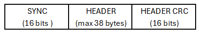
>
> **Figure C-1 (a). Format for D\_PDU C-Frame types (1, 3, 5, 6 and 15)**

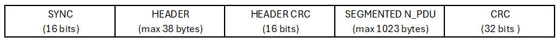

> **Figure C-1 (b). Format for D\_PDU I and I+C Frame types (0, 2, 4, 7 and 8)**

1.  **Generic detailed D\_PDU structure**

> The detailed structure of the generic D\_PDU C-Frame **shall** (1) be as shown in Figure C-2 (a) or Figure C-2(b)
>
> The D\_PDU types 1, 3, 5, 6 and 15 **shall** (2) use only the C-Frame structure defined in Figure C-2 (a).
>
> 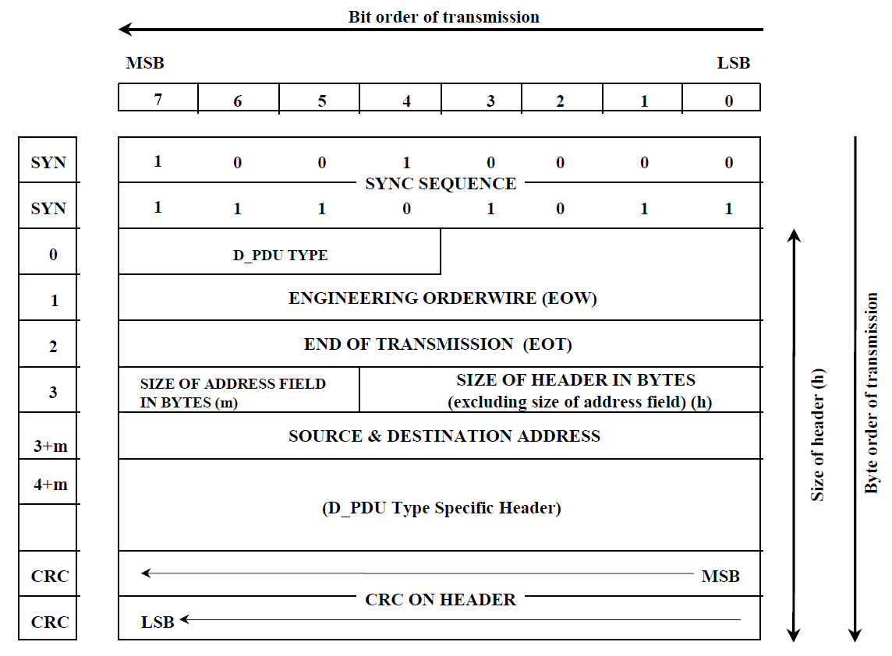
>
> **Figure C-2 (a). Generic D\_PDU C-Frame Structure.**
>
> The D\_PDU types 0, 2, 4, 7 and 8 **shall** (3) use the generic D\_PDU I and I+C Frame structure defined in Figure C-2 (b).
>
> 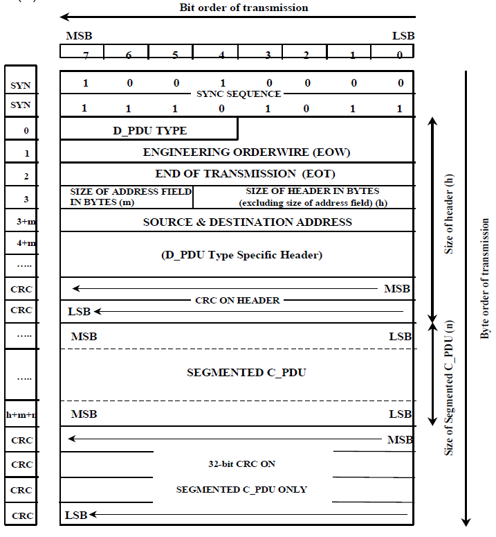
>
> **Bit order of transmission**
>
> **Figure C-2 (b). Generic D\_PDU I and I+C Frame Structure.**
>
> All D\_PDUs, regardless of type, **shall** (4) begin with the same 16-bit synchronisation (SYNC) sequence.
>
> The 16-bit sequence **shall** (5) be the 16-bit Maury-Styles (0xEB90) sequence shown below, with the least significant bit (LSB) transmitted first:
>
> (MSB) 1 1 1 0 1 0 1 1 1 0 0 1 0 0 0 0 (LSB)

## 16-bit Maury-Styles synchronisation sequence

> The first 4 bytes of all D\_PDU headers **shall** (6) contain the same fields:

1.  a 4 bit *D\_PDU Type* field that **shall** (7) identify the type of D\_PDU;

2.  a 12-bit field that **shall** (8) contain an engineering order wire (*EOW*) message;

3.  an 8-bit field that **shall** (9) contain the end of transmission (*EOT*) information; and

4.  a one byte field that **shall** (10) contain both a *Size-of-the-Address* field (3 bits) and a *Size-of-the-Header* (5 bits) field.

> The next 1 to 7 bytes of every header, as specified in the *Size-of-the-Address* field, **shall** (11)
>
> contain source and destination address information for the D\_PDU.
>
> The D\_PDU *Type-Specific-Header-Part* field **shall** (12) be as specified below in this STANAG, for each of the D\_PDU types.
>
> The last two bytes of every header **shall** (13) contain the Cyclic Redundancy Check (CRC) calculated in accordance with Section C.3.2.8.
>
> The bits in any field in a D\_PDU that is specified as NOT USED **shall** (14) contain the value zero (0).

1.  **D\_PDU type**

> The D\_PDU types **shall** (1) be as defined in Table C-2 and the D\_PDU figures below.
>
> The value of the D\_PDU type number **shall** (2) be used to indicate the D\_PDU type. The four bits available allow for 16 D\_PDU types. Ten are here defined, the rest **shall** (3) remain reserved for future extensions to the STANAG.

## Engineering Orderwire (EOW)

> The 12 bit EOW field **shall** (1) carry Management messages for the Engineering Orderwire (EOW). EOW messages may not be explicitly acknowledged although the D\_PDU of which they are a part may be. EOW messages can be explicitly acknowledged when they are contained in the MANAGEMENT Type 6 D\_PDU through which Management-level acknowledgement services are provided in the Data Transfer Sublayer.
>
> Figure C-3 (a) shows the generic 12-bit EOW structure. The first 4 bits of the EOW **shall** (2)
>
> contain the EOW-type field, which identifies the type of EOW message. The remaining 8-bits **shall**
>
> (3) contain the EOW-type-specific EOW data.
>
> The various EOW messages including their definitions and extensions are specified further in Section C.5.
>
> Figure C-3 (b) shows how the EOW message is mapped into the generic D\_PDU header.

## 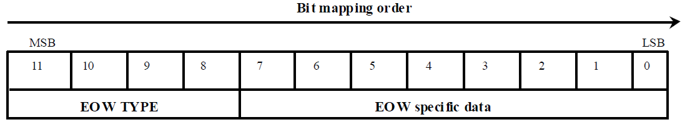

## Figure C-3 (a). Generic EOW message.

> 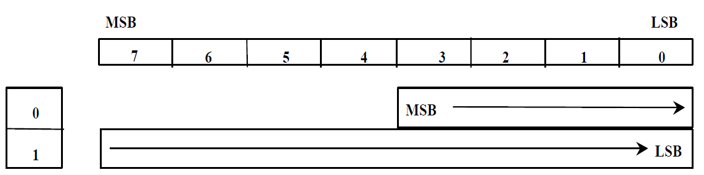
>
> **Figure C-3 (b). EOW mapping convention in D\_PDU header.**

## End Of Transmission (EOT)

> The 8-bit EOT field **shall** (1) provide an approximation of the time remaining in the current transmission interval specified by the transmitting node. This information is provided for the timing of exchanges between peer nodes to minimize collisions and the link turnaround time (time between the end of a transmission by one node and the start of a transmission by another node).
>
> The number in this field **shall** (2) be a binary number expressing the number of half (1/2) second intervals remaining in the current transmission from the beginning of the current D\_PDU including sync bytes.
>
> When operating in half duplex mode, a node **shall** (3) not make a transmission during a transmission by another node (i.e., before the EOT expires).
>
> Once an EOT is sent, the EOT in each subsequent D\_PDU in that transmission **shall** (4) contain a consistent calculation of the EOT, that is, monotonically decreasing in half-second (0.5 second) intervals.
>
> Calculations of the EOT by a transmitting node **shall** (5) be rounded up to the nearest half-second interval. \[Note: rounding-up the calculation of the EOT, rather than truncating it, ensures that the transmission will be completed by the time declared in the EOT field of the D\_PDU.\]
>
> A half-duplex node **shall** (6) stop transmitting and shift to receive mode when the EOT becomes zero.
>
> When a node is in broadcast mode, the EOT field **shall** (7) be filled with all zeros, unless the remaining broadcast transmission interval is within the maximum EOT value of 127.5 seconds. If a node is in broadcast mode and either the remaining broadcast transmission interval or the total broadcast transmission interval is within the maximum EOT value of 127.5 seconds, the EOT value **shall** (8) be computed and advertised as specified herein.
>
> When a node is configured for and operating in full duplex mode, the EOT field **shall** (9) be filled with all zeros.
>
> When D\_PDU types are combined in a single transmission by the sublayer, any previously advertised values of EOT **shall** (10) not be violated or contradicted.
>
> When D\_PDU types are combined in a single transmission by the sublayer, advertised values for EOT **shall** (11) refer to the end of the combined transmission and not to the end of transmission of the D\_PDU which contains the EOT field.

## Size of Address Field

> The Size-of-Address Field **shall** (1) specify the number of bytes in which the source and destination address are encoded (Note: this value is denoted by the integer value “m” in Figure C-2(a) and Figure C-2(b)). The address field may be from one (1) to seven (7) bytes in length, with the source and destination address of equal length.
>
> Since the D\_PDU header must be made up of an integer number of bytes, addresses **shall** (2) be available in 4-bit increments of size: 4 bits (or 0.5 bytes), 1 byte, 1.5 bytes, 2 bytes, 2.5 bytes, 3 bytes, and 3.5 bytes.

## Size of Header Field

> The Size-of-Header field **shall** (1) specify the number of bytes in which the D\_PDU is encoded. (Note: this value is denoted by the integer value “h”, Figure C-2(a) and Figure C-2(b)), and its value includes the sizes of the following fields and elements:

-   D\_PDU Type

-   EOW

-   EOT

-   Size of Address field

-   Size of Header field

-   D\_PDU-Type-specific header

-   CRC field

> The value of the Size-of-Header field **shall** (2) not include the size of the source and destination address field.

## Source & Destination Address

> Each D\_PDU transmitted by a node **shall** (1) contain the source and destination address. Half of the bits are assigned to the source and the other half to the destination.
>
> The first half **shall** (2) be the destination address and the second half **shall** (3) be the source address as displayed nominally in Figure C-4(a) (which assumes an odd-number as the address-field size) or Figure C-4(b) (which assumes an even-number as the address-field size).
>
> 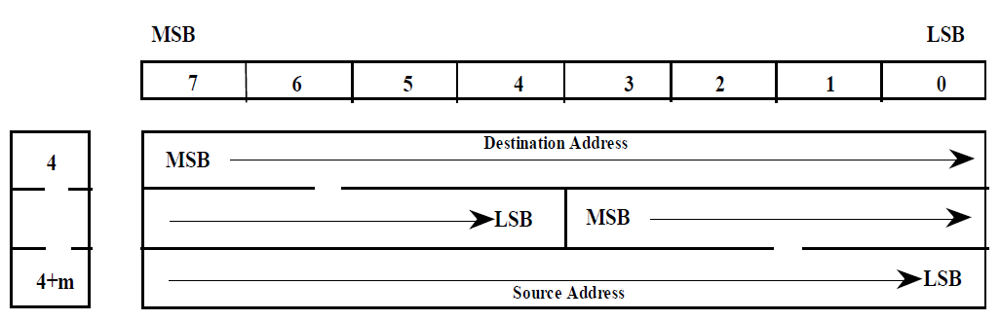
>
> **Figure C-4(a). Address mapping convention in D\_PDU header, assuming address-field size is odd.**

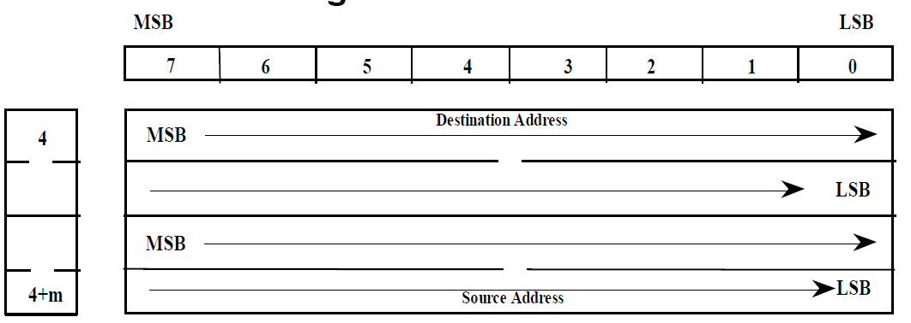

> **Figure C-4(a). Address mapping convention in D\_PDU header, assuming address-field size is even.**
>
> Addresses **shall** (4) be in the form of a binary number. With 7 bytes available for each of the user and the destination, the smallest possible address field is 4 bits, the largest possible is 3.5 bytes, or 28 bits.
>
> A decimal number **shall** (5) represent each byte or fractional byte of an address, and the binary equivalent **shall** (6) be mapped into the corresponding byte. Consequently, the decimal representation for node addresses (i.e., unicast addresses) lies in the range
>
> \[0.0.0.0 ... 15.255.255.255\] (this **may** be referred to as 'dotted-decimal address format').
>
> For DPDUs that support group addressing (e.g; THE Type 7/8 Non-ARQ DPDUs), the group-address flag
>
> **should** be considered the 29th-bit in the binary representation of the address. Consequently, the decimal
>
> representation for group addresses (i.e., multicast addresses) lies in the range \[16.0.0.0 ... 31.255.255.255\].
>
> The broadcast (all-stations) address in “dotted-decimal” address format is the group address 31.255.255.255.
>
> Any fractional-byte elements in the address **shall** (7) be mapped into the first (leftmost) non-zero number in the in the decimal representation of the address. The remaining numbers in the decimal representation of the address **shall** (8) refer to byte-sized elements in the address field. \[ Note: As an example, if 3.5 bytes are used, the address would be expressed as w.x.y.z, where w can be any value from 0 to 15, and x, y and z can be any value from 0 to 255. The value w will represent the most significant bits and z the least significant bits of the address. \]
>
> The address bits **shall** (9) be mapped into the address field by placing the MSB of the address into the MSB of the first byte of the address field, and the LSB into the LSB of the last byte of the field, in accordance with Figure C-4(a), for addresses with length of 0.5, 1.5, 2.5, or 3.5 bytes, and Figure C-4(b), for addresses with length of 1, 2, or 3 bytes.
>
> When a field spans more than one octet, the order of the bit values within each octet **shall** (10)
>
> decrease progressively as the octet number increases.
>
> The lowest bit number associated with the field represents the lowest-order value. Leading address bytes which are zero may be dropped from the address, consistent that the requirement that the source and destination address subfields must be of equal length. Trailing address bytes that are zero **shall** (11) be sent.

1.  **D\_PDU Type-Specific Header**

> The bytes immediately following the address field **shall** (1) encode the D\_PDU Type-Specific header, as specified in the corresponding section below from Sections C.3.3 through C.3.12.

## Cyclic Redundancy Check (CRC)

> The two-bytes following the D\_PDU Type-Specific header **shall** (1) contain a 16-bit Cyclic Redundancy Check (CRC) field.
>
> The header CRC error-check field **shall** (2) be calculated using the following polynomial: *x*16 + *x*15 + *x*12 + *x*11 + *x*8 + *x*6 + *x*3 + 1 , or in hexadecimal format 0x19949, using the shift-register method shown by the figures in Appendix I of CCITT Recommendation V.41 (or equivalent method in software; an example is given below).
>
> \[Note: This polynomial is not the same as that shown in the figure in V.41, Appendix I; the polynomial was chosen to provide a lower probability of undetected error (i.e., better performance) than that given by the polynomial specified in V.41. The polynomial specified here was analyzed and reported by Wolf in a paper in the 1988 IEEE Conference on Military Communications (MILCOM- paper 15.2). Note too that the taps in the figure are shown reversed from the order in which they occur in the polynomial defined in V.41. This reversal is accomodated by the remaining requirements specified below.\]
>
> When calculating the header CRC field, the shift registers **shall** (3) be initially set to all (0) zeros.
>
> The header CRC **shall** (4) be calculated over all bits in the header, excluding the Maury-Styles synchronisation sequence, and including the following fields and elements:

-   D\_PDU Type

-   EOW

-   EOT

-   Size of Address field

-   Size of Header field

-   Source and Destination Address

-   D\_PDU-Type-Specific header

> A node **shall** (5) process the information contained in a header with a valid CRC, regardless of the result of the CRC error check over any segmented C\_PDU that may be a part of the D\_PDU.
>
> The CRC bits **shall** (6) be mapped (see Figure C-5) into the CRC octets by placing the MSB of the CRC into the LSB of the first byte of the CRC field, and the LSB of the CRC into the MSB of the last byte of the CRC field. This will result in the MSB of the most significant byte of the CRC being sent first, followed by the remaining bits in descending order, which is consistent with the order of transmission for CRC bits, as specified in Recommendation V.42, section 8.1.2.3.
>
> 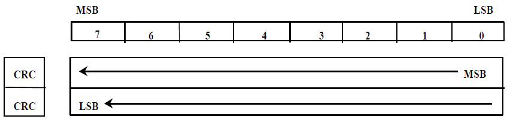
>
> **Figure C-5. CRC mapping convention in D\_PDU header.**
>
> *<u>The following C code can be used to calculate the CRC value using the specified polynomial.</u>*
>
> */\* Polynomial x*16 + *x*15 + *x*12 + *x*11 + *x*8 + *x*6 + *x*3 + 1 *\*/*
>
> **unsigned short** CRC\_16\_S5066(**unsigned char** DATA, **unsigned short** CRC)
>
> {
>
> **unsigned char** i, bit;
>
> **for** (i=0x01; i; i&lt;&lt;=1)
>
> {
>
> bit = (((CRC & 0x0001) ? 1:0)^((DATA&i) ? 1:0)); CRC&gt;&gt;=1;
>
> **if** (bit) CRC^=0x9299; /\* polynomial representation, bit \*/
>
> } /\* -reversed (read right-to-left), and \*/
>
> /\* with the initial *x*16 term implied. \*/
>
> **return** (CRC);
>
> }
>
> /\* example of usage: \*/
>
> **\#define** NUM\_OCTETS; /\* number of octets in the message data \*/
>
> **unsigned char** message\[NUM\_OCTETS\];
>
> **unsigned short** CRC\_result;

## unsigned int j;

> CRC\_result = 0x0000;
>
> for (j=0; j &lt; NUM\_OCTETS; j++){
>
> CRC\_result = CRC\_16\_S5066(message\[j\], CRC\_result);
>
> }
>
> /\* CRC\_result contains final CRC value when loop is completed \*/
>
> **NOTE:** *This code calculates the CRC bytes in the proper order for transmission as defined above; <u>no bit reversal is required with this code</u>.*
>
> **Code Example C-1. Calculation of the CRC-16-S5066 for D\_PDU Headers.**
>
> The function CRC\_16\_5066 in Code Example C-1 may be used to calculate the CRC for a data sequence of octets, and is called for each successive octet in the sequence. The function accepts as its first argument an octet in the data sequence, and as its second argument, the value of the CRC calculated for the previous octet in the sequence. The function returns the value of the CRC. When called for the first octet in the data sequence, the value of the CRC must be initialized to zero as required.
>
> The result of this code for the D\_PDU described below is 0x1E5F. The least significant byte of the computed CRC should be transmitted before the most significant byte; as noted, the algorithm already performs the requisite bit-level reversal. The receive processing should extract the CRC bytes and re-assemble into the correct order.
>
> D\_PDU used in above CRC calculation:
>
> D\_PDU Type: Warning
>
> EOW: Type 0 (i.e., all zeros)
>
> EOT: all zeros
>
> Address size: 2
>
> Destination address: 0.0.0.5 (leading zeros not encoded)
>
> Source address: 0.0.0.100 (leading zeros not encoded) Received D\_PDU type: 0
>
> Reason warning sent: 2
>
> CRC: 0x1E5F
>
> The full D\_PDU is then (including sync bytes and CRC-field, properly bit-reversed and in the order they should be transmitted):
>
> 0x90, 0xEB, 0xF0, 0x00, 0x00, 0x47, 0x05, 0x64, 0x02, 0x5F, 0x1E

1.  **Segmented C\_PDU**

> For the I and I+C D\_PDUs types, the octets of the segmented C\_PDUs **shall** (1) be transmitted in ascending numerical order, following the two-byte CRC on the D\_PDU header.
>
> Within an octet, the LSB **shall** (2) be the first bit to be transmitted as shown in Figure C-6.
>
> 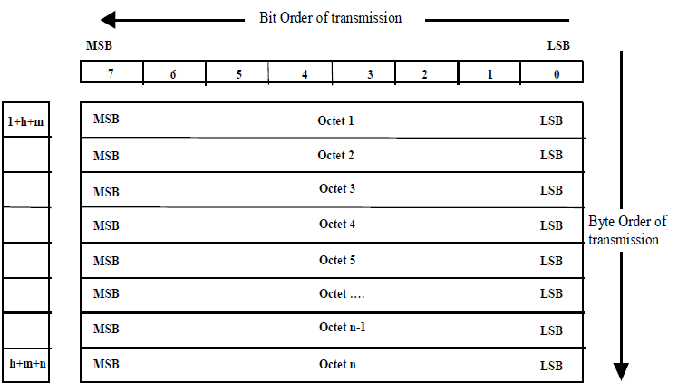
>
> **Figure C-6. Segmented C\_PDU mapping convention in D\_PDU structure**.

1.  **Size of Segmented C\_PDU**

> The SIZE OF SEGMENTED C\_PDU field **shall** (1) be used only with D\_PDUs that are I or I+C frame types, i.e, that have a Segmented C\_PDU field as shown in Figure C-2(b). (Note: The value of the SIZE OF SEGMENTED C\_PDU field is denoted by the integer value “n” in the Figure). This field actually is contained within the D\_PDU Type-Specific Header part, but since it is common to all I and I+C D\_PDUs the format is defined here.
>
> The bit-value of the SIZE OF SEGMENTED C\_PDU **shall** (2) be encoded as a ten-bit field as indicated by Figure C-7.
>
> 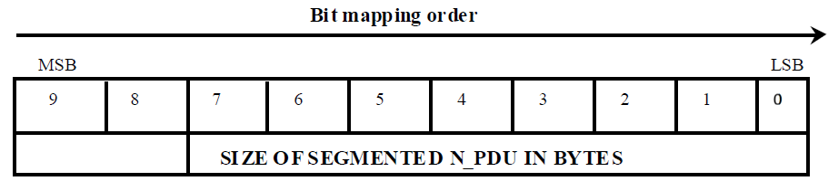
>
> **Figure C-7. SIZE OF SEGMENTED C\_PDU Field.**
>
> The value in the SIZE OF SEGMENTED C\_PDU field **shall** (3) not include the two-bytes for the CRC following the Segmented C\_PDU. The Segmented C\_PDU field can hold a maximum of 1023 bytes from the segmented C\_PDU.
>
> The SIZE OF SEGMENTED C\_PDU **shall** (4) be mapped into consecutive bytes of the D\_PDU as indicated in Figure C-8, in the byte locations specified for the applicable D\_PDU.
>
> 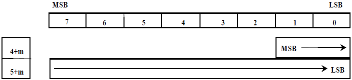
>
> **Figure C-8. Segmented C\_PDU Size mapping convention in all applicable D\_PDU header structures.**

1.  **CRC-ON-SEGMENTED-C\_PDU Field**

> The last four bytes of any I or I+C D\_PDU **shall** (1) contain a 32-bit Cyclic Redundancy Check (CRC) field.
>
> The CRC **shall** (2) be applied and computed on the contents of the Segmented C\_PDU using the following polynomial \[see footnote 2 below\]:
>
> x32 + x27 + x25 + x23 + x21 + x18 + x17 + x16 + x13 + x10 + x8 + x7 + x6 + x3 + x2 + x + 1
>
> or, in hexadecimal notation: 0x10AA725CF,
>
> using the shift-register method similar to that shown by the figures in Appendix I of CCITT Recommendation V.41, but using a longer shift register and appropriate changes to the tap configuration corresponding to the polynomial specified. Equivalent implementations in software may be used to compute the 32-bit CRC (an example is offered below).
>
> When calculating the header CRC field, the shift registers **shall** (4) be initially set to all (0) zeros.

2 This polynomial is constructed with a methodology similar to that used to construct the 16-bit polynomial on the header, and for the same reason. Using this methodology, the polynomial for the 32-bit CRC on the segmented C\_PDU is the generator polynomial for a two-error-correcting BCH code (65535,32), with a maximum information block length of 65503 bits. Only the error-detection properties of the code are used.

> *<u>The following C code can be used to calculate the CRC value using the specified polynomial.</u>*
>
> */\* Polynomial:*
>
> x32 + x27 + x25 + x23 + x21 + x18 + x17 + x16 + x13 + x10 + x8 + x7 + x6 + x3 + x2 + x + 1 *\*/*
>
> **unsigned int** CRC\_32\_S5066(**unsigned char** DATA, **unsigned int** CRC)
>
> {
>
> **unsigned char** i, bit;
>
> **for** (i=0x01; i; i&lt;&lt;=1)
>
> {
>
> bit = (((CRC & 0x0001) ? 1:0)^((DATA&i) ? 1:0)); CRC&gt;&gt;=1;
>
> **if** (bit) CRC^=0xF3A4E550; /\* polynomial representation, bit \*/
>
> } /\* -reversed (read right-to-left), and \*/
>
> /\* with the initial *x*32 term implied. \*/
>
> **return** (CRC);
>
> }
>
> /\* example of usage: \*/
>
> **\#define** NUM\_OCTETS; /\* number of octets in the message data \*/
>
> **unsigned char** message\[NUM\_OCTETS\];
>
> **unsigned int** CRC\_result;

## unsigned int j;

> CRC\_result = 0x00000000;
>
> for (j=0; j &lt; NUM\_OCTETS; j++){
>
> CRC\_result = CRC\_32\_S5066(message\[j\], CRC\_result);
>
> }
>
> /\* CRC\_result contains final CRC value when loop is completed \*/
>
> **NOTE:** *This code calculates the CRC bytes in the proper order for transmission as defined above; <u>no bit reversal is required with this code</u>.*
>
> **Code Example C-2. Calculation of the CRC-32-S5066 on Segmented C\_PDUs.**
>
> The function CRC\_32\_S5066 in Code Example C-2 may be used to calculate the CRC for a data sequence of octets, and is called for each successive octet in the sequence. It is initialized and used in the same manner as the example for the STANAG 5066 16-bit CRC.
>
> When applied to this short C\_PDU message data sequence:

message\[\] = {0xF0, 0x00, 0x00, 0x47, 0x05, 0x64, 0x02},

the result is the 32-bit value (in hexadecimal format): 0xF4178F95

> Just as for the 16-bit CRC computation, the algorithm that calculates the 32-bit CRC performs the bit-level reversal in place, and the resultant value must be transmitted least-significant byte first, in order to most-significant byte last. The full message data, with 32-bit CRC appended in proper position, is the following sequence:
>
> 0xF0, 0x00, 0x00, 0x47, 0x05, 0x64, 0x02, 0x95, 0x8F, 0x17, 0xF4

1.  **DATA-ONLY (TYPE 0) D\_PDU** (Simplex data transfer)

> 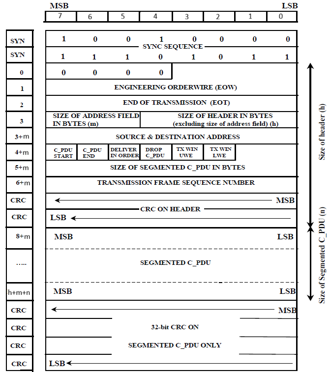
>
> **Figure C-9. Frame format for DATA-ONLY D\_PDU Type 0**
>
> The DATA-ONLY D\_PDU **shall** (1) be used to send segmented C\_PDUs when the transmitting node needs an explicit confirmation the data was received.
>
> The DATA-ONLY D\_PDU **shall** (2) be used in conjunction with a basic selective automatic repeat request type of protocol.
>
> A Data Transfer Sublayer entity that receives a DATA-ONLY D\_PDU **shall** (3) transmit an ACK-ONLY (TYPE 1) D\_PDU or a DATA-ACK (TYPE 2) D\_PDU as acknowledgement, where the type of D\_PDU sent depends on whether or not it has C\_PDUs of its own to send to the source of the DATA-ONLY D\_PDU.
>
> The DATA-ONLY D\_PDU **shall** (4) contain the following fields within its D\_PDU Type-Specific part, mapped and encoded in accordance with Figure C-9 and the paragraphs below:

-   C\_PDU START

-   C\_PDU END

-   DELIVER IN ORDER

-   DROP C\_PDU

-   TX WIN UWE

-   TX WIN LWE

-   SIZE OF SEGMENTED C\_PDU

-   TRANSMIT SEQUENCE NUMBER

> The C\_PDU START flag **shall** (5) be set to indicate the start of a newly segmented C\_PDU; the C\_PDU segment contained within this D\_PDU is the first segment of the C\_PDU, in accordance with the C\_PDU-segmentation process described in section C.4
>
> The C\_PDU END flag **shall** (6) be set to indicate the end of a segmented C\_PDU; when a D\_PDU is received with the C\_PDU END flag set it indicates the last D\_PDU that was segmented from the C\_PDU. Depending on the status of the DELIVER IN ORDER flag, the link layer will assemble and deliver the C\_PDU, if all D\_PDUs between and including the C\_PDU START and C\_PDU END are received completely error free. The re-assembly process of D\_PDUs into C\_PDUs is described in section C.4
>
> If the DELIVER IN ORDER flag is set on the D\_PDUs composing a C\_PDU, the C\_PDU **shall** (7)
>
> be delivered to the upper layer when both the following conditions are met:

1.  The C\_PDU is complete.

2.  All C\_PDUs received previously that also had the DELIVER IN ORDER flag set have been delivered.

> If the DELIVER IN ORDER flag is cleared on the D\_PDUs composing a C\_PDU, the C\_PDU **shall**
>
> (8) be delivered to the upper layer when the following condition is met:

1.  The C\_PDU is complete and error free.

> When the DROP C\_PDU flag is set by the D\_PDU source, the receiving Data Transfer Sublayer **shall** (9) discard the contents of the segmented C\_PDU field of the current D\_PDU and all other previously received segments of the C\_PDU of which the current D\_PDU is a part.
>
> No segmented C\_PDU data needs to be sent if the DROP C\_PDU flag is set and the SIZE OF SEGMENTED C\_PDU field **shall** (10) be zero in this case.
>
> The TX WIN UWE flag **shall** (11) be set when the TRANSMIT FRAME SEQUENCE NUMBER for the current D\_PDU is equal to the Transmit Window Upper Edge (TX UWE) of the transmit-flow-control window.
>
> Similarly, the TX WIN LWE flag **shall** (12) be set when the TRANSMIT FRAME SEQUENCE NUMBER for the current D\_PDU is equal to the Transmit Lower Window Edge (LWE) of the transmit flow control window.
>
> The SIZE OF SEGMENTED C\_PDU field **shall** (13) be encoded as specified in Section C.3.2.10.
>
> The TRANSMIT FRAME SEQUENCE NUMBER field **shall** (14) contain the sequence number of the current D\_PDU.
>
> The value of the TRANSMIT FRAME SEQUENCE NUMBER field **shall** (15) be a unique integer (modulo 256) assigned to the D\_PDU during the segmentation of the C\_PDU, and will not be released for reuse with another D\_PDU until the receiving node has acknowledged the D\_PDU.
>
> Values for the TRANSMIT FRAME SEQUENCE NUMBER field **shall** (16) be assigned in an ascending modulo 256 order during the segmentation of the C\_PDU.
>
> The SEGMENTED C\_PDU field **shall** (17) immediately follow the D\_PDU header as depicted in Figure C-7. Segmented C\_PDUs **shall** (18) be mapped according to the specification of Section C.3.2.9.

1.  **ACK\_ONLY (TYPE 1) D\_PDU** (Acknowledgement of type 0, 2 data transfer)

> 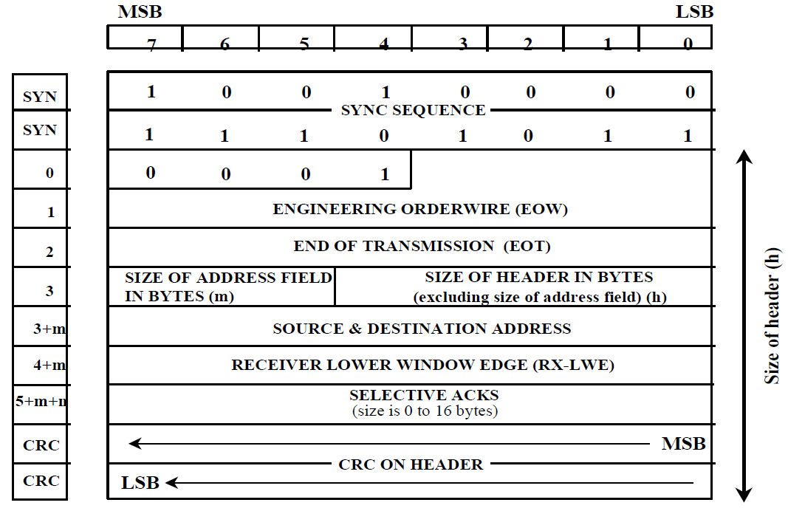
>
> **Figure C-10. Frame format for ACK-ONLY D\_PDU Type 1**
>
> The ACK-ONLY D\_PDU **shall** (1) be used to selectively acknowledge received DATA-ONLY or DATA-ACK D\_PDUs when the receiving Data Transfer Sublayer has no segmented C\_PDUs of its own to send.
>
> The ACK-ONLY D\_PDU **shall** (2) contain the following fields within its D\_PDU Type-Specific part, mapped and encoded in accordance with Figure C-10 and the paragraphs below:

-   RECEIVE LOWER WINDOW EDGE (LWE)

-   SELECTIVE ACKS

> The value of the RECEIVE LOWER WINDOW EDGE (RX LWE) field **shall** (3) equal the D\_PDU sequence number (modulo 256) of the RX LWE pointer associated with the node’s receive ARQ flow-control window**.**
>
> The SELECTIVE ACKS field can have a dynamic length of 0 to 16 bytes, and **shall** (4) contain a bit-mapped representation of the status of all received D\_PDUs with sequence numbers from the LWE to and including the UWE pointers of the receive flow-control window. The size of the SELECTIVE ACK field can be determined from knowledge of the structure of the ACK-ONLY D\_PDU and the value of the Size of Header field, and is not provided explicitly in the ACK-ONLY D\_PDU.
>
> A set (1) bit within the SELECTIVE ACKS field **shall** (5) indicate a positive acknowledgement (ACK), i.e., that the D\_PDU with the corresponding Frame Sequence Number was received correctly.
>
> Only D\_PDU frames with a correct segmented C\_PDU CRC **shall** (6) be acknowledged positively even if the header CRC is correct.
>
> Frames with the DROP C\_PDU flag set **shall** (7) be acknowledged positively regardless of the results of the CRC check on the segmented C\_PDU.
>
> A cleared (0) bit within the SELECTIVE ACKS field **shall** (8) indicate a negative acknowledgement (NACK), i.e., that the D\_PDU with the corresponding Frame Sequence Number was received incorrectly, or not at all.
>
> The construction of the SELECTIVE ACK field and the mapping of D\_PDU frame-sequence numbers to bits within the SELECTIVE ACK field **shall** (9) be in accordance with Figure C-11 and Figure C-12 and the paragraphs below.
>
> 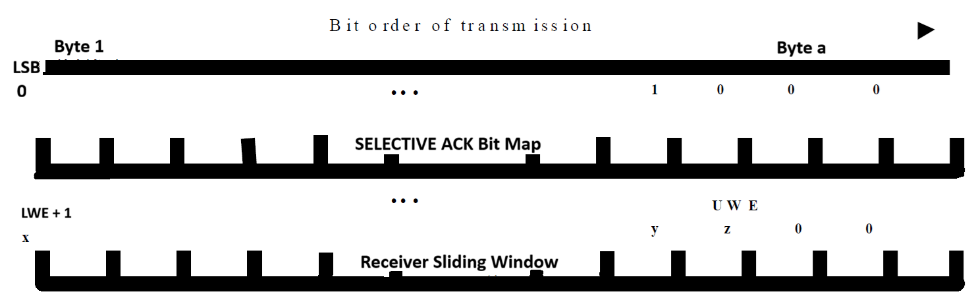

## Figure C-11. Constructing the SELECTIVE ACK Field

> (Note: the bits that are set (1) and cleared (0) are representing example bits.)
>
> 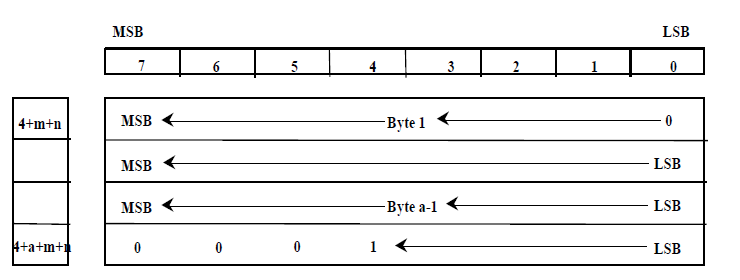

## Figure C-12. SELECTIVE ACK mapping convention

> (Note: the example bits that were shown in figure L-5 can been seen in this mapping example)
>
> The LSB of the first byte of the SELECTIVE ACK field **shall** (10) correspond to the D\_PDU whose frame sequence number is equal to 1 + the value in the RX LWE field of this ACK-ONLY D\_PDU \[the bit corresponding to the RX LWE is always zero, by definition, and is therefore not sent\].
>
> Each subsequent bit in the SELECTIVE ACK field **shall** (11) represent the frame sequence number of a subsequent D\_PDU in the receive flow-control sliding window, in ascending order of the respective frame-sequence numbers without omission of any values.
>
> The bit corresponding to the Receive Upper Window Edge (RX UWE) **shall** (12) be in the last byte of the SELECTIVE ACK field.
>
> If the bit representing the RX UWE is not the MSB of the last byte, the remaining bits in the byte (until and including the MSB) **shall** (13) be set to 0 as padding. No further SELECTIVE ACK bytes **shall** (14) be transmitted after such bits are required.

1.  **DATA-ACK (TYPE 2) D\_PDU** (Duplex data transfer)

> 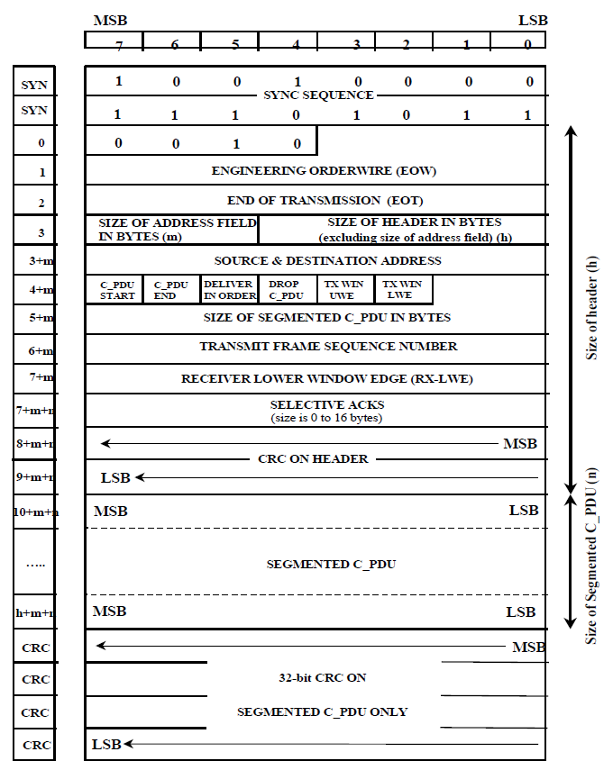
>
> **Figure C-13. Frame format for DATA-ACK D\_PDU Type 2**
>
> The DATA-ACK (TYPE 2) D\_PDU is a part of a basic selective automatic repeat request type of protocol. The DATA-ACK D\_PDU **shall** (1) be used to send segmented C\_PDUs when the transmitting node needs an explicit confirmation the data was received and has received D\_PDUs to selectively acknowledge.
>
> A Data Transfer Sublayer entity that receives a DATA-ACK D\_PDU **shall** (2) transmit an ACK-ONLY (TYPE 1) D\_PDU or a DATA-ACK (TYPE 2) D\_PDU as acknowledgement, where the type of D\_PDU sent depends on whether or not it has C\_PDUs of its own to send to the source of the DATA-ACK D\_PDU.
>
> The DATA-ACK D\_PDU is a combination of the DATA-ONLY and ACK-ONLY D\_PDU. All of the field specifications from the DATA-ONLY and ACK-ONLY D\_PDUs apply to this D\_PDU. The DATA-ACK D\_PDU **shall** (4) contain the following fields within its D\_PDU Type-Specific part, mapped and encoded in accordance with Figure C-13 and the referenced paragraphs:

-   C\_PDU START – **shall** (5) be as specified in Section 3.3 for the DATA-ONLY D\_DPU;

-   C\_PDU END– **shall** (6) be as specified in Section 3.3 for the DATA-ONLY D\_DPU;

-   DELIVER IN ORDER– **shall** (7) be as specified in Section 3.3 for the DATA-ONLY D\_DPU;

-   DROP C\_PDU– **shall** (8) be as specified in Section 3.3 for the DATA-ONLY D\_DPU;

-   TX WIN UWE– **shall** (9) be as specified in Section 3.3 for the DATA-ONLY D\_DPU;

-   TX WIN LWE– **shall** (10) be as specified in Section 3.3 for the DATA-ONLY D\_DPU;

-   SIZE OF SEGMENTED C\_PDU– **shall** (11) be as specified in Section 3.3 for the DATA-ONLY D\_DPU;

-   TRANSMIT SEQUENCE NUMBER– **shall** (12) be as specified in Section 3.3 for the DATA-ONLY D\_DPU;

-   RECEIVE LOWER WINDOW EDGE (RX LWE) – **shall** (13) be as specified in Section 3.4 for the ACK-ONLY D\_DPU;

-   SELECTIVE ACKS– **shall** (14) be as specified in Section 3.4 for the ACK-ONLY D\_DPU;

    1.  **RESET/WIN\_RESYNC (TYPE 3) D\_PDU** (Reset/Re-synchronise peer protocol entities)

> 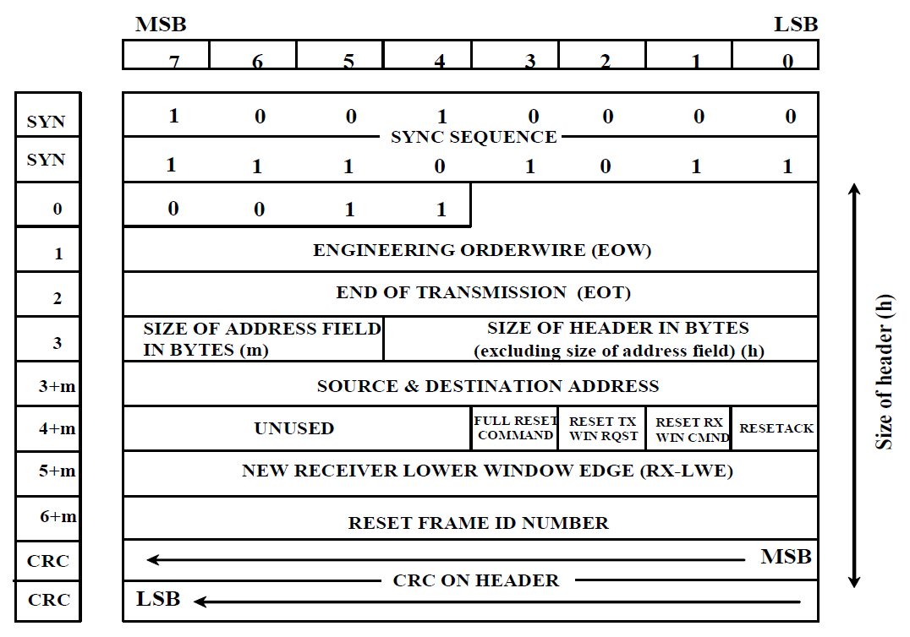
>
> **Figure C-14. Frame format for RESET/WIN RESYNC D\_PDU Type 3**
>
> The RESET/WIN RESYNC D\_PDU **shall** (1) be used to control the re-synchronisation or re-initialisation of the selective-repeat ARQ protocol operating on the link between the source and destination nodes.
>
> Reset and resynchronization operations **shall** (2) be performed with respect to the transmit lower-window edge (TX LWE) and the receive lower-window edge (RX LWE) for the flow-control sliding windows at the sending node and receiving node, as specified in Section C.6.2.
>
> The RESET/WIN RESYNC D\_PDU **shall** (3) use a basic stop and wait type of protocol (denoted as the IRQ protocol elsewhere in this STANAG) in which the reception of this D\_PDU **shall** (4) result in the transmission of an acknowledgement D\_PDU by the receiving node. For the IRQ protocol used with the RESET/WIN RESYNC D\_PDU, the RESET/WIN RESYNC D\_PDU is used for both data and acknowledgement, as specified below.
>
> Transmission of D\_PDUs supporting the regular-data service, i.e., of DATA (Type 0), ACK (Type 1), and DATA-ACK (Type 2) D\_PDUs, **shall** (5) be suspended pending completion of any stop-and-wait protocol using the RESET/WIN RESYNC D\_PDUs. \[Note: The ARQ windowing variables will be reset to zero or changed as a result of the use of the REST/WIN RESYNC D\_PDUs, and suspension of normal data transmission until these variables have been reset is required, lest the variables controlling the selective-repeat ARQ protocol become even further corrupted than the error-state that presumably triggered the reset or resynchronization protocol.\]
>
> The RESET/WIN RESYNC D\_PDU **shall** (6) contain the following fields within its D\_PDU Type-Specific part, mapped and encoded in accordance with Figure C-14 and the paragraphs below:

-   FULL RESET COMMAND

-   RESET TX WIN RQST

-   RESET RX WIN CMND

-   RESET ACK

-   NEW RECEIVE LOWER WINDOW EDGE (LWE)

-   RESET FRAME ID NUMBER

> The FULL RESET COMMAND flag **shall** (7) be set equal to one (1) to force a full reset of the ARQ machines at the transmitter and receiver to their initial values as specified in Sections C.6.2 and C.6.3.
>
> A Type 3 D\_PDU with the RESET TX WIN RQST flag set equal to one (1) **shall** (8) be used to request a resynchronisation of the TX-LWE and RX-LWE pointers used for DATA in the transmit and receive nodes.
>
> A node that receives a Type 3 D\_PDU with the RESET TX WIN RQST flag set equal to one **shall**
>
> (9) respond by forcing resynchronization of the windows using a RESET/WIN RESYNC D\_DPU and the RESET RX WIN CMND flag, as specified below.
>
> A RESET/WIN RESYNC TYPE 3 D\_PDU with the RESET RX WIN CMND flag set equal to one
>
> \(1\) **shall** (10) be used to force a resynchronisation of the TX-LWE pointer at the sending node and the RX-LWE pointer at the receiving node.
>
> A node that sends a Type 3 D\_PDU with the RESET RX WIN CMND flag set equal to one **shall** (11)
>
> proceed as follows:

-   The NEW RECEIVE LWE field **shall** (12) be set equal to the value of the sending node’s TX-LWE.

-   The sending node **shall** (13) wait for a RESET/WIN RESYNC Type 3 D\_PDU with the RESET ACK flag set equal to one as an acknowledgement that the resynchronization has been performed.

> A node that receives a Type 3 D\_PDU with the RESET RX WIN CMND flag set equal to one **shall**
>
> (14) proceed as follows:

-   The value of the node’s TX LWE **shall** (15) be set equal to the value of the NEW RECEIVE LWE field in the RESET/WIN RESYNC D\_PDU that was received;

-   The node **shall** (16) send a RESET/WIN RESYNC Type 3 D\_PDU with the RESET ACK flag set equal to one as an acknowledgement that the resynchronization has been performed.

> The RESET ACK flag **shall** (17) be set equal to one (1) to indicate an acknowledgement of the most recently received RESET/WIN RESYNC TYPE 3 D\_PDU.
>
> A node may use a RESET/WIN RESYNC acknowledgement transmission, i.e., a Type 3 D\_PDU with the RESET ACK flag set equal to one (1), to request/force a reset or resynchronization of its own ARQ flow control variables, e.g., if the link is supporting reliable duplex communication and the ARQ machines for both directions of data-flow must be reset or resynchronized.
>
> The NEW RECEIVE LWE field specifies the value of the new receiver ARQ RX-LWE, as noted above, and **shall** (18) be valid only when the value of the RESET RX WIN CMND flag equals one
>
> (1). The value of the NEW RECEIVE LWE field **shall** (19) be ignored in any other situation.
>
> The Data Transfer Sublayer **shall** (20) use the RESET FRAME ID NUMBER field to determine if a given RESET/WIN RESYNC D\_PDU received is a copy of one already received.
>
> The value of the RESET FRAME ID NUMBER field **shall** (21) be a unique integer (modulo 256) assigned in ascending order to RESET/WIN RESYNC D\_PDUs, and will not be released for reuse with another D\_PDU until the D\_PDU to which it was assigned has been acknowledged.
>
> \[Implementation Note: Due to the fact that C\_PDUs have a certain time-to-live (TTL) assigned to them it is possible that this time passes when the C\_PDU is partially transmitted and acknowledged by the transmitting node. Deleting such partially transferred C\_DPU can be performed by two methods:

1.  The first method makes use of a D\_DPU frame’s DROP C\_PDU flag, setting this flag will indicate to the receiving node that the current D\_PDU and all other previously received portions of the C\_PDU have to be discarded by the link layer. This method still requires the transmission and acknowledgement of all D\_PDU headers only until the dropped C\_PDU has been completely received and acknowledged.

2.  The second method makes use of the RESET/WIN RESYNC D\_PDU, sending this D\_PDU will enable the transmitter to skip the discarded C\_PDU or multiple C\_PDUs without the need of sending all D\_PDU headers. It is also possible to RESET the Selective ARQ machine by sending a FULL RESET COMMAND. This will put the ARQ machine back into its starting position upon the creation of a physical link. The FULL RESET COMMAND will not delete one or more selected C\_PDUs but will delete all partially received and acknowledged C\_PDUs still waiting to be completed. \]

    1.  **EXPEDITED DATA ONLY (TYPE 4) D\_PDU** (Simplex expedited data transfer)

> 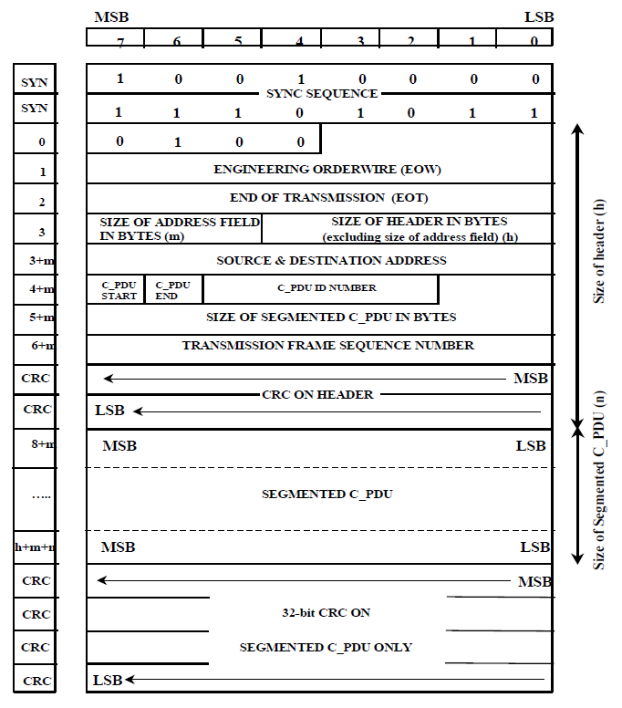
>
> **Figure C-15. Frame format for EXPEDITED DATA ONLY D\_PDU Type 4**
>
> The EXPEDITED DATA-ONLY (TYPE 4) D\_PDU **shall** (1) be used to send segmented C\_PDUs that require Expedited Delivery Service when the transmitting node needs an explicit confirmation the data was received.
>
> A Data Transfer Sublayer entity that receives EXPEDITED DATA-ONLY (TYPE 4) D\_PDU **shall** (2) send an EXPEDITED DATA-ONLY (TYPE 5) D\_PDU as a selective acknowledgement of all EXPEDITED DATA-ONLY (TYPE 4) D\_PDUs received from the source node.
>
> The EXPEDITED DATA-ONLY D\_PDU is similar in structure to the DATA-ONLY D\_PDU. The EXPEDITED DATA-ONLY D\_PDU **shall** (3) contain the following fields within its D\_PDU Type-Specific part, mapped and encoded in accordance with Figure C-15 and the paragraphs noted:

-   C\_PDU START – **shall** (4) be as specified for the DATA-ONLY D\_PDU in Section C.3.3

-   C\_PDU END – **shall** (5) be as specified for the DATA-ONLY D\_PDU in Section C.3.3

-   C\_PDU ID NUMBER – **shall** (6) be as specified in the paragraphs below.

-   SIZE OF SEGMENTED C\_PDU– **shall** (7) be as specified in Section

> C.3.2.10 for all D\_PDUs that have a Segmented C\_PDU field.

-   TRANSMIT SEQUENCE NUMBER– **shall** (8) be as specified for the DATA-ONLY D\_PDU in Section C.3.3, with additional requirements as noted below.

> The C\_PDU ID NUMBER field **shall** (6) specify the C\_PDU of which this Expedited D\_PDU is a part. The value of the C\_PDU ID NUMBER field **shall** (7) be an integer (modulo 16) assigned in an ascending modulo 16 order to the C\_PDU, and **shall** (8) not be released for reuse with another C\_PDU until the entire C\_PDU has been acknowledged.
>
> As noted above, the TRANSMIT SEQUENCE NUMBER field in the EXPEDITED DATA-ONLY D\_PDU is defined and used in the same manner as that specified for the DATA-ONLY D\_PDU. However, the EXPEDITED DATA-ONLY D\_PDUs **shall** (9) be assigned frame numbers from a frame sequence number pool (0, 1 ...255) that is reserved exclusively for the transmission of EXPEDITED DATA-ONLY and EXPEDITED ACK-ONLY D\_PDUs. The FRAME SEQUENCE
>
> NUMBER is used, in this D\_PDU, to sequence the D\_PDUs that make up a C\_PDU receiving expedited delivery service.
>
> (Note: the further implication of this requirement is that there are independent state machines and flow-control windows \[or different states and sets of variables within a single state-machine\] for the Expedited and Regular delivery services in the Data Transfer Sublayer).
>
> The SEGMENTED C\_PDU field is a field that is attached to the header structure defined in Figure C-15. The segmented PDU **shall** (10) immediately following the D\_PDU header. Segmented C\_PDUs **shall** (11) be mapped according to the convention described in C.3.2.9.
>
> The processing of EXPEDITED D\_PDUs in the EXPEDITED DATA state **shall** (11) differ from the processing of DATA-ONLY or DATA-ACK D\_PDUs in the DATA state in the following ways:

-   Data (i.e, C\_PDUs) using the Expedited Delivery Service **shall** (12) be transferred using EXPEDITED DATA-ONLY and EXPEDITED ACK-ONLY D\_PDUs. If duplex

> communication is required, EXPEDITED DATA-ONLY and EXPEDITED ACK-ONLY D\_PDUs may be placed together in a transmission interval.

-   C\_PDUs requiring Expedited Delivery Service and the associated EXPEDITED D\_PDUs **shall** (13) not be queued for processing within the Data Transfer Sublayer behind D\_PDUs containing non-expedited data (i.e., DATA\_ONLY or DATA-ACK D\_PDUs).

    1.  **EXPEDITED ACK ONLY (TYPE 5) D\_PDU** (Acknowledgement of simplex expedited data transfer)

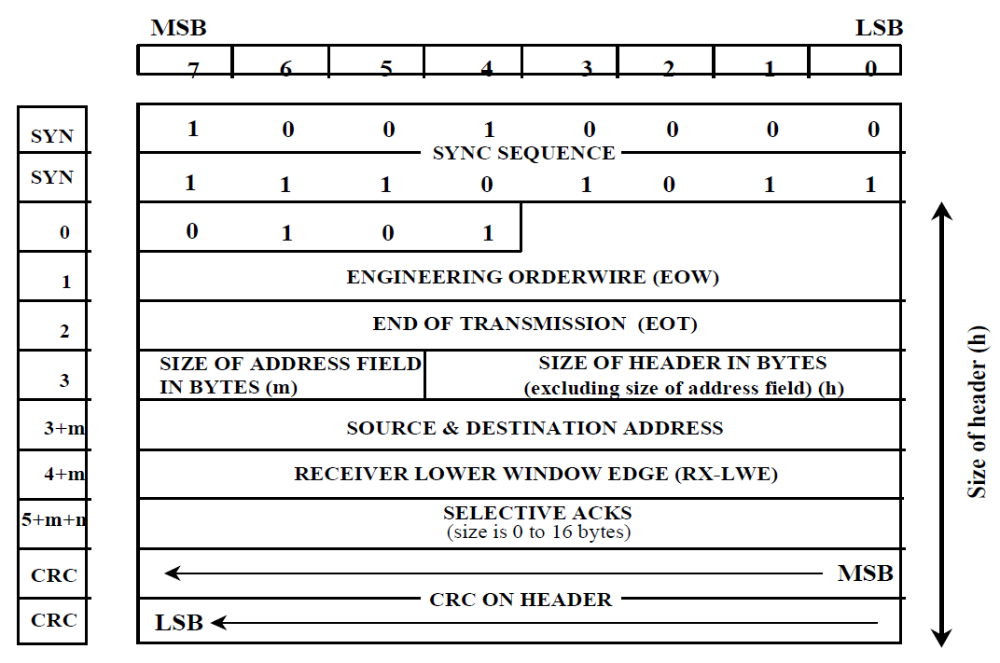

**Figure C-16. Frame format for EXPEDITED ACK ONLY D\_PDU Type 5**

> The EXPEDITED ACK-ONLY (TYPE 5) D\_PDU **shall** (1) be used to selectively acknowledge received EXPEDITED DATA-ONLY D\_PDUs.
>
> The EXPEDITED ACK-ONLY (TYPE 5) D\_PDU type **shall** (2) have the same format as the ACK-ONLY (TYPE 1) D\_PDU, differing only in the value of the D\_PDU Type field in byte 0, as specified in Figure C-16.

1.  **MANAGEMENT (TYPE 6) D\_PDU (Management message transfer)**

> 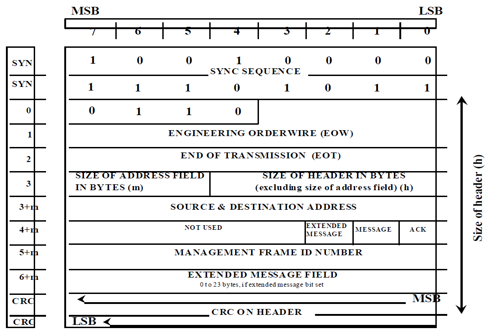
>
> **Figure C-17. Header format for MANAGEMENT D\_PDU TYPE 6**
>
> The MANAGEMENT (TYPE 6) D\_PDU **shall** (1) be used to send EOW Messages or Management Protocol Data Units (M\_PDUs) when the transmitting node needs an explicit Acknowledgement that they were received.
>
> A Data Transfer Sublayer entity **shall** (2) acknowledge receipt of a MANAGEMENT (TYPE 6) D\_PDU by sending a MANAGEMENT (TYPE 6) D\_PDU with the ACK flag set to the value one (1).
>
> The processing and transmission of MANAGEMENT (TYPE 6) D\_PDUs **shall** (3) take precedence over and bypass all other pending D\_PDU types in the Data Transfer Sublayer.
>
> The exchange of MANAGEMENT D\_PDUs is regulated by a stop-and-wait protocol, i.e., there
>
> **shall** (4) be only one unacknowledged MANAGEMENT D\_PDU at any time.
>
> The MANAGEMENT D\_PDU **shall** (5) contain the following fields within its D\_PDU Type-Specific part, mapped and encoded in accordance with Figure C-17 and the paragraphs below:

-   EXTENDED MESSAGE Flag

-   VALID MESSAGE

-   ACK

-   MANAGEMENT FRAME ID NUMBER

-   EXTENDED MANAGEMENT MESSAGE

> The VALID MESSAGE field **shall** (6) be set to the value one (1) if the EOW field of the D\_PDU contains a valid Management message or the initial segment of a valid Management message that is continued in the EXTENDED MANAGEMENT MESSAGE field.
>
> The VALID MESSAGE field **shall** (7) be set to the value zero (0) if the EOW field contains an Engineering Orderwire Message for which an acknowledgement message is not required.
>
> If the VALID MESSAGE field is set to zero, the MANAGEMENT D\_PDU **shall** (8) be used only to acknowledge receipt of another MANAGEMENT D\_PDU.
>
> The EXTENDED MESSAGE Flag **shall** (9) be set to the value one (1) if the D\_PDU contains a non-zero, non-null EXTENDED MANAGEMENT MESSAGE field.
>
> If the EXTENDED MESSAGE Flag is set to the value zero (0), the EXTENDED MANAGEMENT MESSAGE field **shall** (10) not be present in the MANAGEMENT D\_PDU.
>
> The MANAGEMENT FRAME ID NUMBER field **shall** (11) contain an integer in the range \[0,255\] with which MANAGEMENT D\_PDUs **shall** (12) be identified.
>
> The Data Transfer Sublayer **shall** (13) maintain variables to manage the frame ID numbers associated with this D\_PDU:

-   the TX MANAGEMENT FRAME ID NUMBER **shall** (14) maintain the value of the Frame ID Number for MANAGEMENT D\_PDUs that are transmitted;

-   the RX MANAGEMENT FRAME ID NUMBER **shall** (15) maintain the value of the Frame ID Number for the most recently received MANAGEMENT D\_PDUs.

> On initialisation (such as a new connection), a node’s Data Transfer Sublayer **shall** (16) set its current TX MANAGEMENT FRAME ID NUMBER to zero and **shall** (17) set its current RX MANAGEMENT FRAME ID NUMBER to an out-of-range value (i.e., a value greater than 255).
>
> The current value of the TX MANAGEMENT FRAME ID NUMBER **shall** (18) be placed in the appropriate field of each unique MANAGEMENT D\_PDU transmitted. The current value of the TX MANAGEMENT FRAME ID NUMBER **shall** (19) be incremented by one, modulo 256, after each use, unless transmission of repeated copies of the MANAGEMENT D\_PDU are specified for its use, e.g., as in Section C.6.4.2.
>
> Management D\_PDUs that have been repeated (e.g., in accordance Section C.6.4.2) **shall** (20)
>
> have the same MANAGEMENT FRAME ID NUMBER.
>
> The Data Transfer Sublayer **shall** (21) compare the MANAGEMENT FRAME ID NUMBER of received MANAGEMENT D\_PDUs to the current RX MANAGEMENT FRAME ID NUMBER, and process them as follows:

-   if the MANAGEMENT FRAME ID NUMBER in the received D\_PDU differs from the current RX MANAGEMENT FRAME ID NUMBER value, the D\_PDU **shall** (22) be treated as a new D\_PDU, and the Data Transfer Sublayer **shall** (23) set the current RX MANAGEMENT FRAME ID NUMBER value equal to the value of the received MANAGEMENT FRAME ID NUMBER.

-   if the value in the received D\_PDU is equal to the current RX MANAGEMENT FRAME ID NUMBER value, the node **shall** (24) assume that the frame is a repetition of a MANAGEMENT D\_PDU that has already been received, and the value of the current RX MANAGEMENT FRAME ID NUMBER **shall** (25) be left unchanged.

> There **shall** (26) be a one-to-one correspondence between MANAGEMENT messages and MANAGEMENT D\_PDUs; that is, each message is placed into a separate D\_PDU (which may be repeated a number of times as specified in Section C.6.4).
>
> The 12-bit EOW section of the D\_PDU **shall** (27) carry the EOW (non-extended) MANAGEMENT message, as specified in Section C.5.
>
> The EXTENDED MANAGEMENT MESSAGE field may be used to transmit other implementation-specific messages that are beyond the scope of this STANAG. When the EXTENDED MESSAGE field is present and in use, the EXTENDED MESSAGE Flag **shall** (28) be set to the value one (1).

1.  **NON-ARQ (TYPE 7) DATA D\_PDU** (Non-ARQ data transfer)

> 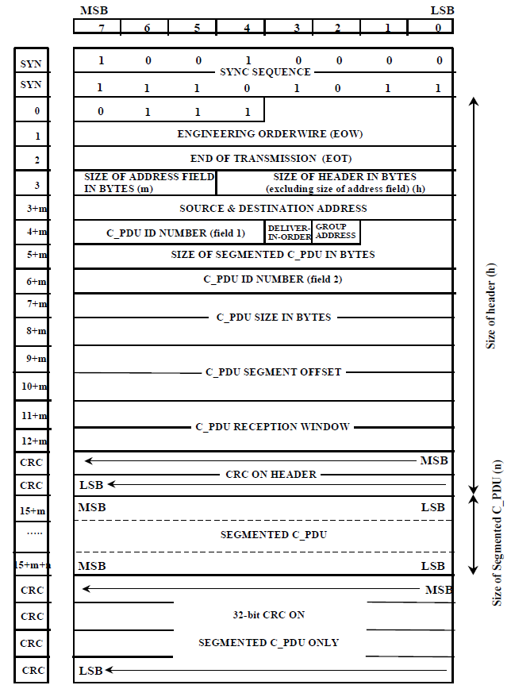
>
> **Figure C-18. Frame format for NON-ARQ DATA D\_PDU TYPE 7**
>
> The NON-ARQ DATA (TYPE 7) D\_PDU **shall** (1) be used to send segmented C\_PDUs when the transmitting node needs no explicit confirmation the data was received.
>
> The NON-ARQ DATA D\_PDU **shall** (2) contain the following fields within its D\_PDU Type-Specific part, mapped and encoded in accordance with Figure C-18 and the paragraphs below:

-   C\_PDU ID NUMBER (field 1)

-   DELIVER IN ORDER

-   GROUP ADDRESS

-   SIZE OF SEGMENTED C\_PDU

-   C\_PDU ID NUMBER (field 2)

-   C\_PDU SIZE

-   C\_PDU SEGMENT OFFSET

-   C\_PDU RECEPTION WINDOW

> The C\_PDU ID NUMBER field **shall** (3) identify the C\_PDU to which the C\_PDU segment encapsulated by the NON-ARQ DATA D\_PDU belongs.
>
> The value encoded in the C\_PDU ID NUMBER field **shall** (4) be a unique integer (modulo 4096) identifier assigned in an ascending order (also modulo 4096) to the C\_PDU during its segmentation and encapsulation into D\_PDUs.
>
> The value encoded in the C\_PDU ID NUMBER field **shall** (5) not be released for reuse and assignment to another C\_PDU until the time specified in the C\_PDU RECEPTION WINDOW expires, as noted below.
>
> The C\_PDU ID NUMBER space (i.e, the set of ID numbers in the range \[0..4095\]) for NON-ARQ DATA (TYPE 7) D\_PDUs **shall** (6) be different than the similarly-defined number space for EXPEDITED NON-ARQ DATA (TYPE 8) D\_PDUs.
>
> The value of the C\_PDU ID NUMBER **shall** (7) be encoded in a 12 bit field as specified in Figure C-19.
>
> 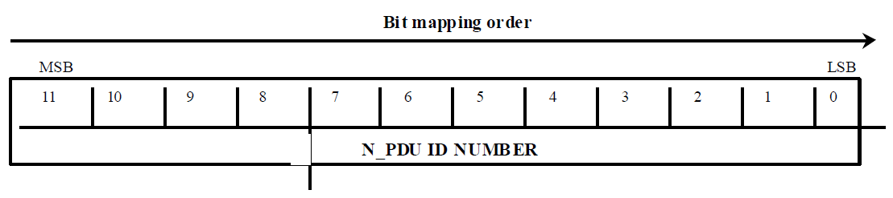
>
> **Figure C-19. C\_PDU ID NUMBER Field**
>
> The value of the C\_PDU ID NUMBER **shall** (8) be mapped into the NON-ARQ DATA D\_PDU into two split fields as follows, and as depicted in Figure C-20:

-   The four-most-significant bits of the value of the C\_PDU ID NUMBER **shall** (9) be mapped into C\_PDU ID NUMBER (field 1);

-   The eight least-significant bits of the value of the C\_PDU ID NUMBER **shall** (10) be mapped into C\_PDU ID NUMBER (field 2).

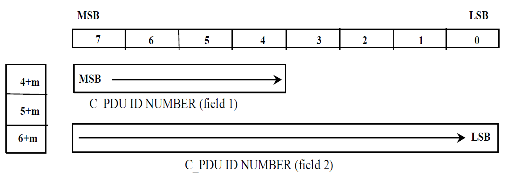

> **Figure C-20. C\_PDU ID NUMBER mapping convention in D\_PDU header**
>
> If the DELIVER IN ORDER flag is set (i.e., its value equals 1) on the D\_PDUs composing a C\_PDU, the C\_PDU **shall** (11) be delivered to the network layer when both the following conditions are met:

1.  C\_PDU is complete and error free or the C\_PDU RECEPTION WINDOW expires.

2.  Previous C\_PDUs that also had the DELIVER IN ORDER flag set have been delivered.

> If the DELIVER IN ORDER flag is cleared (0) on the D\_PDUs composing a C\_PDU, the C\_PDU
>
> **shall** (12) be delivered to the network layer when the following condition is met.

1.  C\_PDU is complete and error free or the C\_PDU RECEPTION WINDOW expires.

> The GROUP ADDRESS flag **shall** (13) indicate that the destination address should be interpreted as a group address rather than an individual address, as follows:

-   The destination address **shall** (14) be interpreted as a group address when the GROUP ADDRESS flag is set (1).

-   However when the GROUP ADDRESS flag is cleared (0) the destination address **shall** (15) be interpreted as an individual node address.

> Note: If a specific PDU is intended for only one node, the node’s normal address may also be used with the NON-ARQ DATA D\_PDU. Group addresses are intended to allow PDUs to be addressed to specific groups of nodes when using NON-ARQ DATA D\_PDUs. The use of a bit to designate a “group address” allows the same number (~268 million!) and structure of group addresses to be designated as for normal addresses, rather than requiring some portion of the total address space for group addresses. The management of group addresses is outside of the scope of this STANAG.
>
> The SIZE OF SEGMENTED C\_PDU field **shall** (16) specify the number of bytes contained in the SEGMENTED C\_PDU file in accordance with the requirements of Section C.2.10.
>
> The C\_PDU SIZE field **shall** (17) indicate the size in bytes of the C\_PDU of which the C\_PDU segment encapsulated in this D\_PDU is a part.
>
> The value of the C\_PDU SIZE field **shall** (18) be encoded in a 16 bit field, with the bits mapped as specified by Figure C-21. The number **shall** (19) be mapped into the D\_PDU by placing the MSB of the field into the MSB of the first byte in the D\_PDU as can be seen in Figure C-22.
>
> 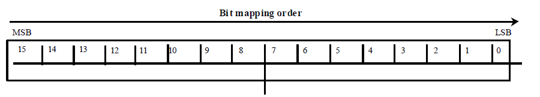
>
> **Figure C-21. C\_PDU SIZE Field**
>
> 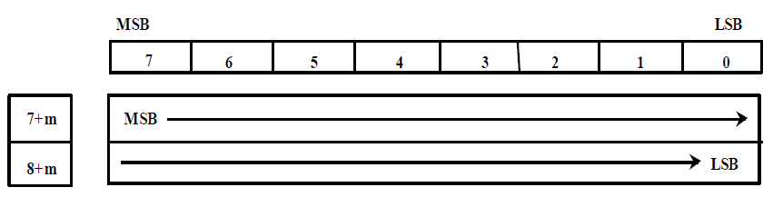
>
> **Figure C-22. C\_PDU SIZE mapping convention in D\_PDU header**
>
> The C\_PDU SEGMENT OFFSET field **shall** (20) indicates the location of the first byte of the SEGMENTED C\_PDU with respect to the start of the C\_PDU. For the purposes of this field, the bytes of the C\_PDU **shall** (21) be numbered consecutively starting with 0.
>
> The C\_PDU SEGMENT OFFSET field is a 16 bit field, the bits **shall** (22) be mapped as specified by Figure C-23. The number **shall** (23) be mapped into the D\_PDU by placing the MSB of the field into the MSB of the first byte in the D\_PDU as specified in Figure C-24.
>
> 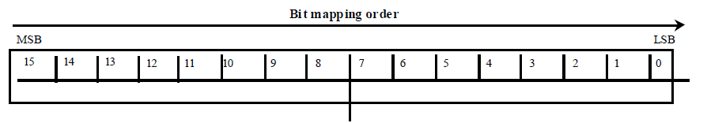
>
> **Figure C-23. C\_PDU SEGMENT OFFSET Field**
>
> 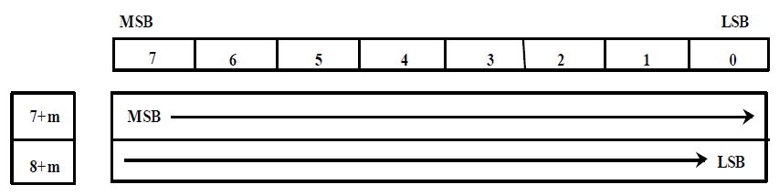
>
> **Figure C-24. C\_PDU SEGMENT OFFSET mapping convention in D\_PDU header**
>
> The C\_PDU RECEPTION WINDOW field **shall** (24) indicate the maximum remaining time in units of half (1/2) seconds relative to the start of the D\_PDU during which portions of the associated C\_PDU may be received.
>
> As in the case of the EOT field, the C\_PDU RECEPTION WINDOW **shall** (25) be updated just prior to transmitting each D\_PDU. The receiving node can use this information to determine when to release a partially received C\_PDU. (The transmitter is not allowed to transmit D\_PDUs that are a portion of a C\_PDU when the C\_PDU RECEPTION WINDOW has expired).
>
> The value of the C\_PDU RECEPTION WINDOW field **shall** (26) be encoded in a 16 bit field with the bits be mapped as specified by Figure C-25. The value **shall** (27) be mapped into the D\_PDU by placing the MSB of the field into the MSB of the first byte in the D\_PDU as specified in Figure C-26.
>
> 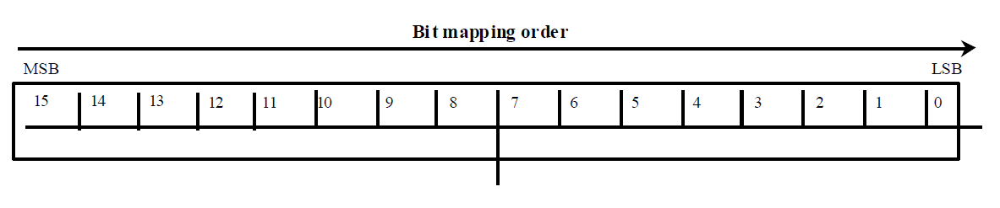
>
> **Figure C-25. C\_PDU RECEPTION WINDOW Field**
>
> 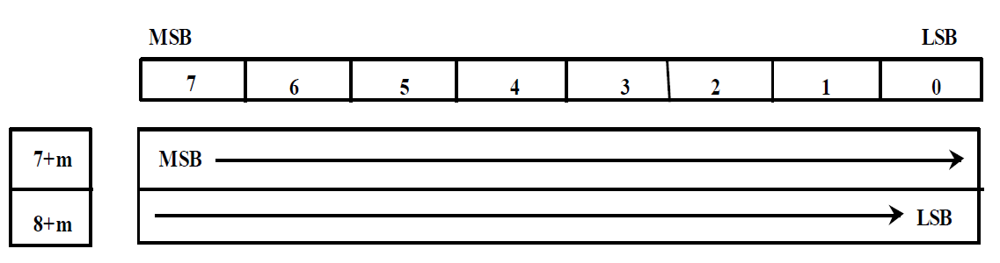
>
> **Figure C-26. C\_PDU RECEPTION WINDOW mapping convention in D\_PDU header**

1.  **EXPEDITED NON-ARQ DATA (TYPE 8) D\_PDU** (Expedited non-ARQ data transfer)

> 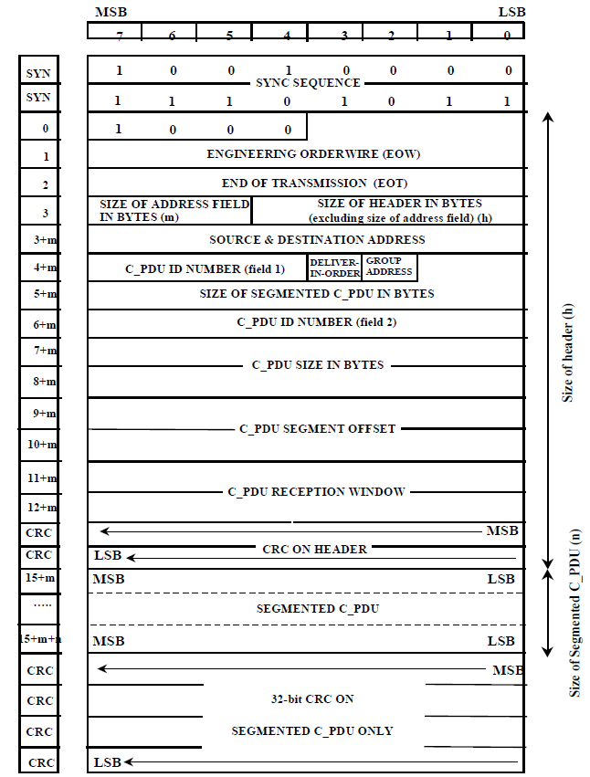
>
> **Figure C-27. Frame format for EXPEDITED NON-ARQ DATA D\_PDU Type 8**
>
> The frame format for EXPEDITED NON-ARQ DATA (TYPE 8) D\_PDUs **shall** (1) be identical to the NON\_ARQ DATA D\_PDU with the exception that the TYPE field has a value of 8, as specified in Figure C-27.
>
> The C\_PDU ID NUMBER space (i.e, the set of ID numbers in the range \[0..4095\]) for EXPEDITED NON-ARQ DATA (TYPE 8) D\_PDUs **shall** (2) be different than the similarly-defined number space for NON-ARQ DATA (TYPE 7) D\_PDUs.

1.  **WARNING (TYPE 15) D\_PDU**

> (in response to unexpected or unrecognised D\_PDU type)

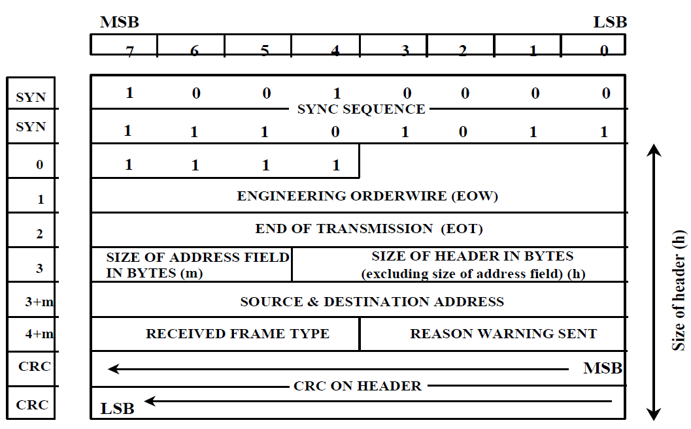

> **Figure C-28. Frame format for WARNING D\_PDU Type 15**
>
> A Data Transfer Sublayer **shall** (1) a WARNING D\_PDU to any remote node from which an unexpected or unknown D\_PDU type has been received.
>
> The WARNING D\_PDU **shall** (2) contain the following fields within its D\_PDU Type-Specific part, mapped and encoded in accordance with Figure C-28 and the paragraphs below:

-   RECEIVED FRAME TYPE

-   REASON WARNING SENT

> The RECEIVED FRAME TYPE field **shall** (3) indicate the frame type that caused the warning to be sent.
>
> The value of the RECEIVED FRAME TYPE field **shall** (4) be encoded in four bits, and located within the D\_PDU as specified in Figure C-29 and Figure C-30.
>
> 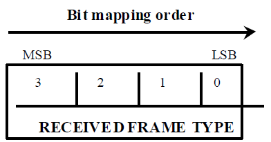

## Figure C-29. RECEIVED FRAME TYPE Field

> 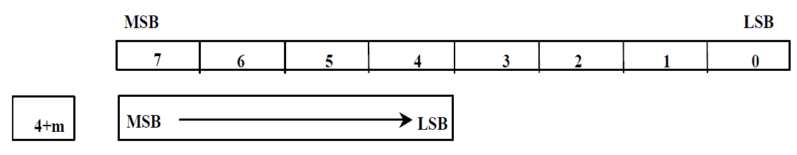

> **Figure C-30. RECEIVED FRAME TYPE mapping convention in D\_PDU header**
>
> The REASON WARNING SENT field **shall** (5) indicate the reason the frame type caused a warning, with values as Specified in Table C-3:
>
> **Table C-3: Encoding of WARNING D\_PDU Reason Field**

<table>
<colgroup>
<col style="width: 75%" />
<col style="width: 24%" />
</colgroup>
<thead>
<tr class="header">
<th><blockquote>

Reason

</blockquote></th>
<th><blockquote>

Field Value

</blockquote></th>
</tr>
</thead>
<tbody>
<tr class="odd">
<td><blockquote>

Unrecognised D_PDU type Received

</blockquote></td>
<td><blockquote>

0

</blockquote></td>
</tr>
<tr class="even">
<td><blockquote>

Connection-related D_PDU Received While Not Currently Connected

</blockquote></td>
<td><blockquote>

1

</blockquote></td>
</tr>
<tr class="odd">
<td><blockquote>

Invalid D_PDU Received

</blockquote></td>
<td><blockquote>

2

</blockquote></td>
</tr>
<tr class="even">
<td><blockquote>

Invalid D_PDU Received for Current State

</blockquote></td>
<td><blockquote>

3

</blockquote></td>
</tr>
<tr class="odd">
<td><blockquote>

<em>Unspecified/reserved</em>

</blockquote></td>
<td><blockquote>

4-15

</blockquote></td>
</tr>
</tbody>
</table>

> The value of the REASON WARNING SENT field **shall** (6) be encoded in four bits, and located within the D\_PDU as specified in Figure C-31 and Figure C-32.
>
> 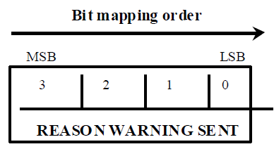

## Figure C-31. REASON WARNING SENT Field

> 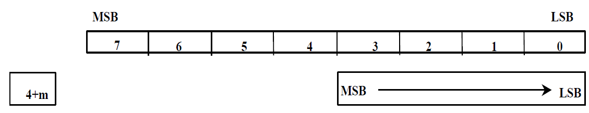

> **Figure C-32. REASON WARNING SENT mapping convention in D\_PDU header**
>
> The transmission of WARNING type D\_PDUs **shall** (7) be initiated independently by the Data Transfer Sublayer in response to certain D\_PDUs and **shall** (8) not be acknowledged explicitly.
>
> WARNING type D\_PDUs may be inserted into an ongoing transmission interval provided that the transmission interval period is not exceeded.
>
> A WARNING D\_PDU **shall** (9) be sent in the following conditions:

1.  A node receives a D\_PDU header addressed to itself with a valid CRC and an unrecognised D\_PDU type (value 0000)

2.  A node is not in the IDLE/BROADCAST state and it receives a D\_PDU header addressed to itself, from a node with which it is not currently connected. (value 0001)

3.  A node is in IDLE/BROADCAST state and it receives a D\_PDU header addressed to itself which is other than type 7 or type 8 D\_PDU (value 0010)

4.  A node receives any D\_PDU which is recognized but is not of the allowed type for the state which the receiving node is in (value 0011; this is the general case of the preceding)

> A WARNING D\_PDU **shall** (10) not be sent in response to receipt of a WARNING D\_PDU.

1.  **C\_PDU Segmentation and Re-assembly Processes**

> The process of C\_PDU segmentation and re-assembly **shall** (1) be as defined in the subsections that follow for ARQ and non-ARQ delivery services provided to regular and expedited C\_PDUs.

## ARQ Mode Segmentation and Re-assembly

> 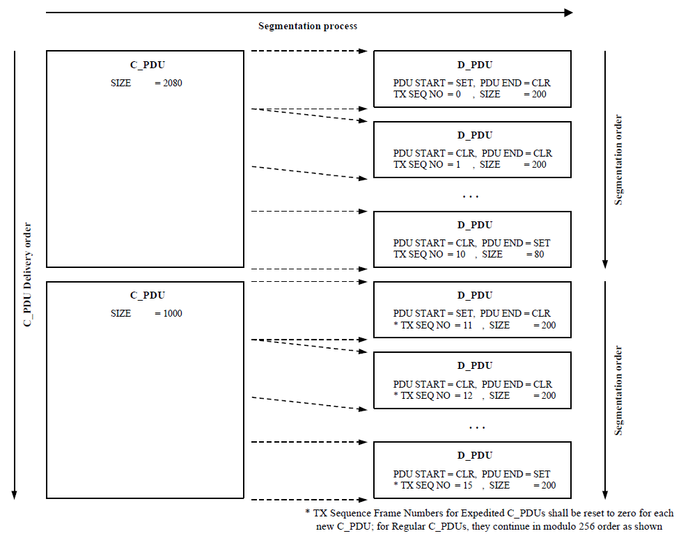

> **Figure C-33. C\_PDU Segmentation for ARQ Delivery Services (Regular and Expedited Service)**
>
> Segmentation of a C\_PDU into segments small enough to fit within a D\_PDU for ARQ-delivery (i.e, a DATA, DATA-ACK, or EXPEDITED-DATA D\_PDU) **shall** (1) be performed in accordance with the example shown in Figure C-33 and as follows:

1.  The Maximum C\_PDU-Segment Size within a D\_PDU for ARQ-Delivery services **shall**

> (2) be a configurable parameter no greater than 1023 bytes in any implementation compliant with this STANAG. An implementation may configure the Maximum C\_PDU-Segment Size to match the interleaver size for optimum channel efficiency or other reasons.

1.  An entire C\_PDU that is smaller than the Maximum C\_PDU-Segment Size **shall** (3) be placed in the C\_PDU segment of a single D\_PDU.

2.  A DATA or DATA-ACK, or EXPEDITED D\_PDU that contains an entire C\_DPU **shall** (4) be marked with the both C\_PDU START field and the C\_PDU END field set equal to the value “1”. \[Note: An ‘only’ C\_PDU segment is both the “first” and “last” segment of a sequence of one.\]

3.  The Data Transfer Sublayer **shall** (5) divide C\_PDUs larger than the Maximum C\_PDU-Segment Size into segments that are no larger than the Maximum C\_PDU Segment Size.

4.  Only the last segment or the only segment taken from a C\_PDU may be smaller than the Maximum C\_PDU-Segment size. A C\_PDU smaller than the Maximum C\_PDU-Segment size **shall** (6) be placed only in the D\_PDU that contains the last segment of the C\_PDU, i.e., only in a D\_PDU for which the C\_PDU END field is set equal to one.

5.  The bytes within a C\_PDU segment **shall** (7) be taken from the source as a contiguous sequence of bytes in the same order in which they occurred in the source C\_PDU.

6.  D\_PDUs containing C\_PDU segments taken in sequence from the source C\_PDU **shall** (8) have sequential Frame Sequence number fields, modulo 256. \[Note: With the first C\_PDU segment placed in a D\_PDU with Frame Sequence = P, the second would have Frame Sequence = P+1, the third P+2, and so on, with Frame-Sequence operations performed modulo-256.\]

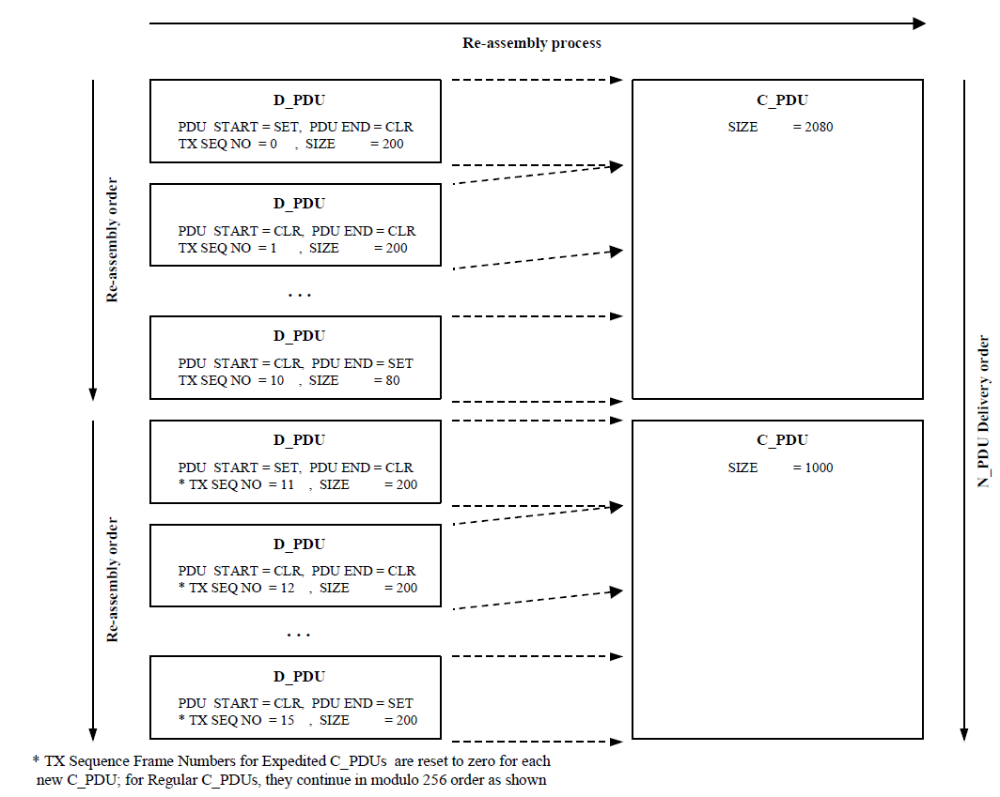

**Figure C-34. C\_PDU Re-assembly for ARQ Delivery Services (Regular and Expedited Service)**

> Re-assembly of a C\_PDU from its segments **shall** (9) be performed in accordance with the example shown in Figure C-34 and as follows (unless noted otherwise, C\_PDU segments that are reassembled are expected to have passed the CRC error-check and have no detectable errors):

1.  The re-assembly process for C\_PDUs receiving ARQ-service **shall** (9) use the Frame-Sequence-Number field, C\_PDU START flag, and C\_PDU END flag to determine when all segments of a C\_PDU have been received.

2.  A C\_PDU segment taken from a D\_PDU whose C\_PDU START and C\_PDU END flags are both set to the value “one” (1) **shall** (10) be taken as a single C\_PDU and processed as follows:

    1.  If the D\_PDU is for a regular (unexpedited) data type, the C\_PDU **shall**

> (11) be delivered to the Channel Access Sublayer using a D\_UNIDATA\_INDICATION primitive;

1.  If the D\_PDU is for an unexpedited data type, the C\_PDU **shall**(12) be delivered to the Channel Access Sublayer using a D\_EXPEDITED\_UNIDATA\_INDICATION primitive;

<!-- -->

1.  A segment from a C\_PDU larger than the Maximum C\_PDU Segment Size **shall** (13) be combined in modulo 256 order with other segments whose D\_PDU Frame Sequence Numbers lie in the range defined by the Frame Sequence Numbers of the C\_DPU START and C\_PDU END segments;

2.  A completely reassembled C\_PDU **shall** (14) be delivered to the Channel Access Sublayer using the appropriate D\_Primitive.

## NON-ARQ Mode Segmentation and Re-assembly

## 

## 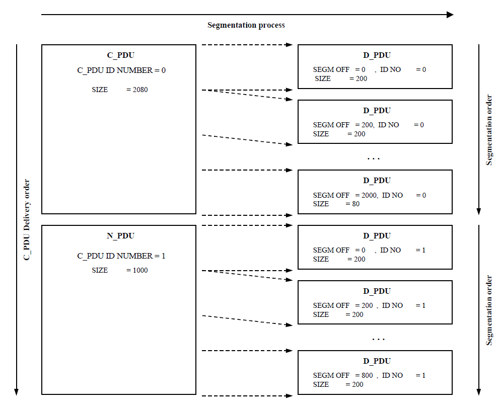

## Figure C-35. C\_PDU Segmentation for Non-ARQ Delivery Services (Regular and Expedited Service)

> Segmentation of a C\_PDU into segments small enough to fit within a D\_PDU for non-ARQ-delivery (i.e, a Non-ARQ DATA, or EXPEDITED-Non-ARQ-DATA D\_PDU) **shall** (1) be performed in accordance with the example shown in Figure C-35, and as follows:

1.  The Maximum C\_PDU-Segment Size within a D\_PDU for non-ARQ-Delivery services **shall** (2) be a configurable parameter no greater than 1023 bytes in any implementation compliant with this STANAG. An implementation may configure the Maximum C\_PDU-Segment Size to match the interleaver size for optimum channel efficiency or other reasons;

2.  An entire C\_PDU for non-ARQ delivery that is smaller than the Maximum C\_PDU-Segment Size **shall** (3) be placed in the C\_PDU segment of a single D\_PDU;

3.  A unique C\_PDU ID number **shall** (4) be assigned to the non-ARQ C\_PDU in accordance with the requirements of Section C.3.10;

4.  all D\_PDUs containing segments from the same C\_PDU **shall** (5) have the same C\_PDU ID number;

5.  The Segment Offset field of the D\_PDU containing the first segment from a C\_PDU

> **shall** (6) be equal to zero;

1.  The Segment Offset field of the D\_PDU containing any subsequent segment from a C\_PDU **shall** (7) be set equal to the number of bytes from the original C\_PDU that precede the first byte of the segment.

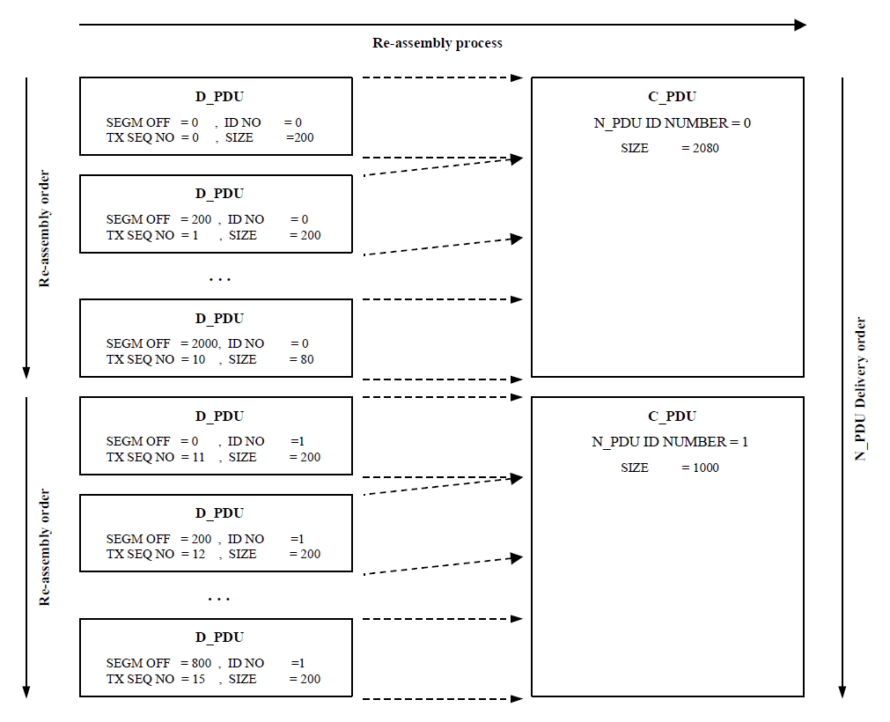

**Figure C-36. C\_PDU Re-assembly for Non-ARQ Delivery Services (Regular and Expedited Service)**

> For Non-ARQ services, re-assembly of a C\_PDU from its segments **shall** (8) be performed in accordance with the example shown in Figure C-36 and as follows (unless noted otherwise, C\_PDU segments that are reassembled are expected to have passed the CRC error-check and have no detectable errors):

1.  The re-assembly process for Non-ARQ C\_PDUs **shall** (9) use the C\_PDU ID Number, Segment-Offset field, C\_PDU-Segment-Size field, and C\_PDU-Size field to determine when all segments of a C\_PDU have been received.

2.  If the Error-Free Delivery Mode has been specified, a reassembled C\_PDU **shall**(10) be delivered if and only if all segments of the C\_PDU have been received without errors;

3.  If the Deliver-w/-Errors Mode has been specified, the re-assembly process **shall** (11)

> proceed as follows:

1.  C\_PDU segments received without detected errors **shall** (12) be collected as received in their D\_PDUs and placed in order within the reassembled C\_PDU;

2.  C\_PDU segments received with detected errors **shall** (13) be placed within the reassembled C\_PDU just as they are received in their D\_PDUs (i.e, with errors), with the size in bytes and the position of the first byte of the segment noted in the D\_Primitive used to deliver the C\_PDU to the Channel Access Sublayer;

3.  At the end of a specified and configurable timeout-interval the size in bytes and the position of the first byte of any C\_PDU segments that have been lost or still not received **shall** (14) be noted in the D\_Primitive that delivers the C\_PDU to the Channel Access Sublayer

<!-- -->

1.  If the Deliver-In-Order Mode has been specified (with or without the Deliver-with-Errors Mode specified), C\_PDUs **shall** (15) be delivered to the Channel Access Sublayer only if C\_PDUs with lower-numbered C\_PDU ID Numbers have already been delivered.

2.  If the Deliver-out-of-Order Mode has been specified, C\_PDUs **shall** (16) be delivered to the Channel Access Sublayer as soon as all segments have been received (in Error-Free Mode) or received and accounted for (in Deliver-with-Errors Mode).

3.  Delivery of the reassembled D\_PDU **shall** (17) be performed with the D\_Primitive appropriate for the type of data (i.e., regular or expedited) received.

## EOW and Management Message Types

> The basic set of EOW Messages may be placed in the 12-bit EOW section of any D\_PDU for which an explicit acknowledgement of the EOW Message is not required, and in the MANAGEMENT D\_PDU whenever an explicit acknowledgement of the EOW Message is required. The internal structure and use of these messages is specified in this section.
>
> In addition, Extended Management messages may be defined as implementation-specific extensions to the STANAG in accordance with the format and use of the MANAGEMENT D\_PDU. The specification and use of Extended Management messages is beyond the scope of this STANAG. Implementation-specific Extended Management messages **shall** (1) be identified and encoded through the use of the Extended Message Flag as specified in Section C.3.9 for the Management D\_DPU.
>
> The types of EOW messages **shall** (2) be as defined in the table below:

## Table C-4. EOW Message Types

<table>
<colgroup>
<col style="width: 14%" />
<col style="width: 36%" />
<col style="width: 49%" />
</colgroup>
<thead>
<tr class="header">
<th><blockquote>

<strong>Messag e Type</strong>

</blockquote></th>
<th><blockquote>

<strong>Function</strong>

</blockquote></th>
<th><blockquote>

<strong>Contents</strong>

</blockquote></th>
</tr>
</thead>
<tbody>
<tr class="odd">
<td><blockquote>

0

</blockquote></td>
<td><blockquote>

RESERVED

</blockquote></td>
<td><blockquote>

all bits reset to 0

</blockquote></td>
</tr>
<tr class="even">
<td><blockquote>

1

</blockquote></td>
<td><blockquote>

Data Rate Change Request (DRC_Req)

</blockquote></td>
<td><blockquote>

New HF modem transmit data rate and interleaving setting for DRC master

</blockquote></td>
</tr>
<tr class="odd">
<td><blockquote>

2

</blockquote></td>
<td><blockquote>

Data Rate Change Response (DRC_Resp)

</blockquote></td>
<td><blockquote>

Positive or negative response (including reason if negative)

</blockquote></td>
</tr>
<tr class="even">
<td><blockquote>

3

</blockquote></td>
<td><blockquote>

Unrecognized Type Error: user defined message type

</blockquote></td>
<td><blockquote>

message type field which is not recognized

</blockquote></td>
</tr>
<tr class="odd">
<td><blockquote>

4

</blockquote></td>
<td><blockquote>

Capability Advertisement

</blockquote></td>
<td><blockquote>

bit map describing capabilities of node

</blockquote></td>
</tr>
<tr class="even">
<td><blockquote>

5

</blockquote></td>
<td><blockquote>

Frequency Change/ ALM Request

</blockquote></td>
<td><blockquote>

As defined in Annex I – Messages and Procedures for Frequency Change

</blockquote></td>
</tr>
<tr class="odd">
<td><blockquote>

6

</blockquote></td>
<td><blockquote>

Frequency Change/ ALM Response

</blockquote></td>
<td><blockquote>

As defined in Annex I - Messages and Procedures for Frequency Change

</blockquote></td>
</tr>
<tr class="even">
<td><blockquote>

7

</blockquote></td>
<td><blockquote>

High Data Rate (HDR) Change Request (HDR_DRC_Req)

</blockquote></td>
<td><blockquote>

Management information for High-Data-Rate change: specifies waveform, number of channels, data-rate, and interleaver settings

</blockquote></td>
</tr>
<tr class="odd">
<td><blockquote>

8-15

</blockquote></td>
<td><blockquote>

<em>Unspecified/user-defined</em>

</blockquote></td>
<td></td>
</tr>
</tbody>
</table>

> The format of the EOW message types **shall** (3) be as shown in Figure C-37.
>
> 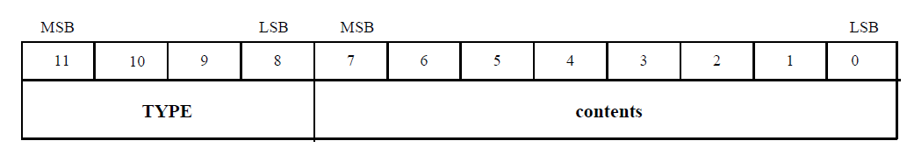

## Figure C-37. Generic Format of EOW Messages

> The TYPE field of the EOW message **shall** (4) be filled with the hexadecimal value of the appropriate message type (units only), with the LSB of the TYPE value placed in the LSB of the TYPE field.
>
> The Contents field **shall** (5) be EOW type-specific, in accordance with the subsections below.

## Data Rate Change Request (TYPE 1) EOW Message

## 

## 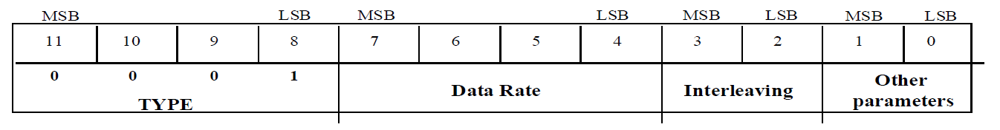

## Figure C-38. Format of Management Message Type 1.

> The Data Rate Change Request (TYPE 1) EOW Message **shall** (1) be used in conjunction with the Data Rate Change protocol, as specified in Section C.6.4.
>
> The Data Rate Change Request (TYPE 1) EOW Message may be used by a receiving node as an advisory message indicating the modem parameters to which the link may be changed to improve performance. Alternatively, a transmitter may use the Data Rate Change Request (TYPE 1) EOW Message to request a receiver to change to the indicated parameters.
>
> The Data Rate Change Request (TYPE 1) EOW Message **shall** (2) be formatted and encoded as specified in Figure C-38 and the paragraphs that follow, and includes the following type-specific subfields:

-   Data Rate

-   Interleaving

-   Other Parameters

> The Data Rate parameter **shall** (3) be the rate at which the node originating the message (i.e, either the DRC Master or Advisee, as noted in Section C.6.4 specifying Data Rate Change Procedures) wishes to transmit data, in accordance with the encoding defined in the following table:

## Table C-5. Data Rate Parameter Message Type 1

<table>
<colgroup>
<col style="width: 48%" />
<col style="width: 51%" />
</colgroup>
<thead>
<tr class="header">
<th><blockquote>

MSB - LSB

</blockquote></th>
<th><blockquote>

Interpretation

</blockquote></th>
</tr>
</thead>
<tbody>
<tr class="odd">
<td><blockquote>

0 0 0 0

</blockquote></td>
<td><blockquote>

75 bps

</blockquote></td>
</tr>
<tr class="even">
<td><blockquote>

0 0 0 1

</blockquote></td>
<td><blockquote>

150 bps

</blockquote></td>
</tr>
<tr class="odd">
<td><blockquote>

0 0 1 0

</blockquote></td>
<td><blockquote>

300 bps

</blockquote></td>
</tr>
<tr class="even">
<td><blockquote>

0 0 1 1

</blockquote></td>
<td><blockquote>

600 bps

</blockquote></td>
</tr>
<tr class="odd">
<td><blockquote>

0 1 0 0

</blockquote></td>
<td><blockquote>

1200 bps

</blockquote></td>
</tr>
<tr class="even">
<td><blockquote>

0 1 0 1

</blockquote></td>
<td><blockquote>

2400 bps

</blockquote></td>
</tr>
<tr class="odd">
<td><blockquote>

0 1 1 0

</blockquote></td>
<td><blockquote>

3200 bps

</blockquote></td>
</tr>
<tr class="even">
<td><blockquote>

0 1 1 1

</blockquote></td>
<td><blockquote>

3600 bps

</blockquote></td>
</tr>
<tr class="odd">
<td><blockquote>

1 0 0 0

</blockquote></td>
<td><blockquote>

4800 bps

</blockquote></td>
</tr>
<tr class="even">
<td><blockquote>

1 0 0 1

</blockquote></td>
<td><blockquote>

6400 bps

</blockquote></td>
</tr>
<tr class="odd">
<td><blockquote>

1 0 1 0

</blockquote></td>
<td><blockquote>

8000 bps

</blockquote></td>
</tr>
<tr class="even">
<td><blockquote>

1 0 1 1

</blockquote></td>
<td><blockquote>

9600 bps

</blockquote></td>
</tr>
<tr class="odd">
<td><blockquote>

others

</blockquote></td>
<td><blockquote>

reserved

</blockquote></td>
</tr>
</tbody>
</table>

> The Interleaver Parameter field **shall** (4) specify the interleaver requested for use by the node producing the message (for that link, if multiple links/modems are in use) with respect to transmit and receive operation, in accordance with the following table:

## Table C-6. Interleaver Parameter: Message Type 1

<table>
<colgroup>
<col style="width: 49%" />
<col style="width: 50%" />
</colgroup>
<thead>
<tr class="header">
<th><blockquote>

MSB - LSB

</blockquote></th>
<th><blockquote>

Interpretation

</blockquote></th>
</tr>
</thead>
<tbody>
<tr class="odd">
<td><blockquote>

0 0

</blockquote></td>
<td><blockquote>

no interleaving

</blockquote></td>
</tr>
<tr class="even">
<td><blockquote>

0 1

</blockquote></td>
<td><blockquote>

short interleaving

</blockquote></td>
</tr>
<tr class="odd">
<td><blockquote>

1 0

</blockquote></td>
<td><blockquote>

long interleaving

</blockquote></td>
</tr>
<tr class="even">
<td><blockquote>

1 1

</blockquote></td>
<td><blockquote>

reserved

</blockquote></td>
</tr>
</tbody>
</table>

> The Other Parameters field **shall** (5) specify the capabilities of the modem in use by the node producing the message (for that link, if multiple links/modems are in use) with respect to transmit and receive data rates, and whether the message is an advisory message or request message, in accordance with the following table:

## Table C-7. Contents for Type 1 Message (Other Parameters)

<table>
<colgroup>
<col style="width: 28%" />
<col style="width: 71%" />
</colgroup>
<thead>
<tr class="header">
<th><blockquote>

MSB - LSB

</blockquote></th>
<th><blockquote>

Interpretation

</blockquote></th>
</tr>
</thead>
<tbody>
<tr class="odd">
<td><blockquote>

0 0

</blockquote></td>
<td><blockquote>

DRC Request: master has independent data rate (change applies to Tx data rate only)

</blockquote></td>
</tr>
<tr class="even">
<td><blockquote>

0 1

</blockquote></td>
<td><blockquote>

DRC Request: Tx and Rx data rate at master must be equal (change will apply to both Tx and Rx data rates)

</blockquote></td>
</tr>
<tr class="odd">
<td><blockquote>

1 0

</blockquote></td>
<td><blockquote>

DRC Advisory: Advising node has independent data rate for Tx and Rx (change applies to Rx data rate only)

</blockquote></td>
</tr>
<tr class="even">
<td><blockquote>

1 1

</blockquote></td>
<td><blockquote>

DRC Advisory: Tx and Rx data rate at advising node must be equal

(change will apply to both Tx and Rx data rates)

</blockquote></td>
</tr>
</tbody>
</table>

1.  **Data Rate Change Response (TYPE 2) EOW Message**

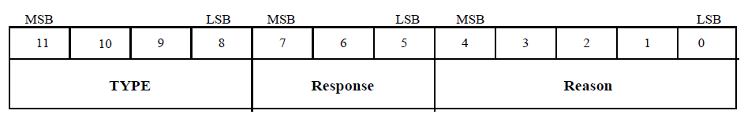

## Figure C-39. Format of Type 2 Message

> The Data Rate Change Response (TYPE 2) EOW Message **shall** (1) be used in conjunction with the Data Rate Change protocol, as specified in Section C.6.4.
>
> The Data Rate Change Response (TYPE 2) EOW Message **shall** (2) be encoded as shown in Figure C-39, and include the following fields:

-   Response

-   Reason

> The Response field **shall** (3) indicate the originator’s response to the last DRC-related message it received, with possible responses and their encoding as defined in the following table:

## Table C-7. Contents for Type 2 Message (Response)

<table>
<colgroup>
<col style="width: 35%" />
<col style="width: 64%" />
</colgroup>
<thead>
<tr class="header">
<th><blockquote>

MSB - LSB

</blockquote></th>
<th><blockquote>

Interpretation

</blockquote></th>
</tr>
</thead>
<tbody>
<tr class="odd">
<td><blockquote>

0 0 0

</blockquote></td>
<td><blockquote>

accept

</blockquote></td>
</tr>
<tr class="even">
<td><blockquote>

0 0 1

</blockquote></td>
<td><blockquote>

refuse

</blockquote></td>
</tr>
<tr class="odd">
<td><blockquote>

0 1 0

</blockquote></td>
<td><blockquote>

cancel

</blockquote></td>
</tr>
<tr class="even">
<td><blockquote>

0 1 1

</blockquote></td>
<td><blockquote>

confirm

</blockquote></td>
</tr>
</tbody>
</table>

> The Reason field **shall** (4) indicate the originator’s reason for its response, with possible reasons and their encoding as defined in the following table:

## Table C-8. Contents for Type 2 Message (Reason) provided in Response to a Type 1 Data-Rate Change message

<table>
<colgroup>
<col style="width: 35%" />
<col style="width: 64%" />
</colgroup>
<thead>
<tr class="header">
<th><blockquote>

MSB - LSB

</blockquote></th>
<th><blockquote>

Interpretation

</blockquote></th>
</tr>
</thead>
<tbody>
<tr class="odd">
<td><blockquote>

0 0 0 0 0

</blockquote></td>
<td><blockquote>

no reason (used to indicate

unconditional acceptance of DRC_Request)

</blockquote></td>
</tr>
<tr class="even">
<td><blockquote>

0 0 0 0 1

</blockquote></td>
<td><blockquote>

Tx and Rx parameters must be

the same (conditionally accept)

</blockquote></td>
</tr>
<tr class="odd">
<td><blockquote>

0 0 0 1 0

</blockquote></td>
<td><blockquote>

Not possible to change modem

data rate

</blockquote></td>
</tr>
<tr class="even">
<td><blockquote>

0 0 0 1 1

</blockquote></td>
<td><blockquote>

Not possible to change modem

interleaving

</blockquote></td>
</tr>
<tr class="odd">
<td><blockquote>

0 0 1 0 0

</blockquote></td>
<td><blockquote>

Not possible to change modem

data rate or interleaving

</blockquote></td>
</tr>
<tr class="even">
<td><blockquote>

0 0 1 0 1

</blockquote></td>
<td><blockquote>

Not consistent with local

conditions

</blockquote></td>
</tr>
</tbody>
</table>

> *\[N.B.: Reason-Field encoding differs when provided in Response to a Type 7 High-Data-Rate Change message, as specified in para. C.5.5\]*

## Unrecognised Type Error (TYPE 3) EOW Message

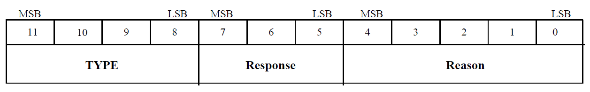

## Figure C-40. Format of Type 3 Message

> The UNRECOGNIZED-TYPE ERROR (Type 3) EOW Message **shall** (1) be used to declare an error related to receipt of an EOW message.
>
> \[N.B.: A node **should** send an UNRECOGNIZED-TYPE ERROR (Type 3) EOW Message to the originator of an unrecognised EOW message whenever the node receives one.\]
>
> The UNRECOGNIZED-TYPE ERROR (Type 3) EOW Message **shall** (2) be encoded as shown in Figure C.40 and include the following fields:

-   Response

-   Reason

> The type of the unrecognised EOW message or the message that triggered the error **shall** (3) be mapped into the four least-significant bits of the “reason” field.
>
> The unused MSB of the “reason” field, and all bits in the “response” field, **shall** (4) be reset to the value zero (0).

## Capability Advertisement (TYPE 4) EOW Message

## 

## 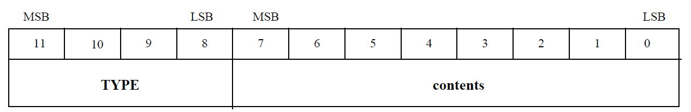

## Figure C-41. Format of Capabilities (Type 4) MANAGEMENT Messages

> The EOW Message Type 4 allows a node to inform another node of its capabilities related to modem parameters, waveform, and control.
>
> The EOW Message Type 4 **shall** (1) be encoded as shown in Figure C-41 and contains a single field, Content.
>
> The Content field **shall** (2) be encoded as the bit-mapped specification of capabilities defined in the following table:

## Table C-9. Contents of Message field for MANAGEMENT Message Type 4

<table>
<colgroup>
<col style="width: 15%" />
<col style="width: 84%" />
</colgroup>
<thead>
<tr class="header">
<th><blockquote>

bit

</blockquote></th>
<th><blockquote>

meaning

</blockquote></th>
</tr>
</thead>
<tbody>
<tr class="odd">
<td><blockquote>

7 (MSB)

</blockquote></td>
<td><blockquote>

Adaptive modem parameters (DRC) capable note 1 (0 = no, 1 = yes)

</blockquote></td>
</tr>
<tr class="even">
<td><blockquote>

6

</blockquote></td>
<td><blockquote>

STANAG 4529 available note 2 (0 = no, 1 = yes)

</blockquote></td>
</tr>
<tr class="odd">
<td><blockquote>

5

</blockquote></td>
<td><blockquote>

MIL-STD-188-110 75-2400 bps available note 2 (0 = no, 1 = yes)

</blockquote></td>
</tr>
<tr class="even">
<td><blockquote>

4

</blockquote></td>
<td><blockquote>

extended data rate capable note 3 (0 = no, 1 = yes)

</blockquote></td>
</tr>
<tr class="odd">
<td><blockquote>

3

</blockquote></td>
<td><blockquote>

full duplex supported note 4 (0 = no, 1 = yes)

</blockquote></td>
</tr>
<tr class="even">
<td><blockquote>

2

</blockquote></td>
<td><blockquote>

split frequency supported note 4 (0 = no, 1 = yes)

</blockquote></td>
</tr>
<tr class="odd">
<td><blockquote>

1

</blockquote></td>
<td><blockquote>

non-ARCS ALE capable note 5 (0 = no, 1 = yes)

</blockquote></td>
</tr>
<tr class="even">
<td><blockquote>

0 (LSB)

</blockquote></td>
<td><blockquote>

ARCS capable note 6 (0 = no, 1 = yes)

</blockquote></td>
</tr>
</tbody>
</table>

> Notes

1.  If a node is DRC capable, it must implement at minimum 75 bps through 2400 bps (1200 bps for STANAG 4529) with short and long interleaving in accordance with the relevant document.

2.  All nodes shall have, at minimum, the STANAG 4285 waveform available.

3.  Annex G describes waveforms for data rates above 2400 bps.

4.  A full duplex node must have split frequency operation available.

5.  non-ARCS ALE capability may imply MIL-STD-188-141 Appendix A or proprietary capabilities and any ambiguity must be resolved outside of STANAG 5066.

6.  ARCS –capable systems are those equipped with NATO’s Automatic Radio Control System for HF Links, STANAG 4538 (FLSU/RLSU) or MIL-STD-188-141B (RLSU); any ambiguity must be resolved outside of STANAG 5066.

## High Data Rate Change Request (TYPE 7) EOW Message

> The Type 7 Extended EOW Message **may** (1) be used to specify a High Data Rate (HDR) Change Request.
>
> The message allows specification of a wider range of waveform types than is supported by the Type 1 Data
>
> Rate Change Request EOW Message alone. The High Data Rate (HDR) Change Request Message is an Extended EOW format and **must** be embedded within a Type 6 Management DPDU messages as shown in the Figure below.
>
> 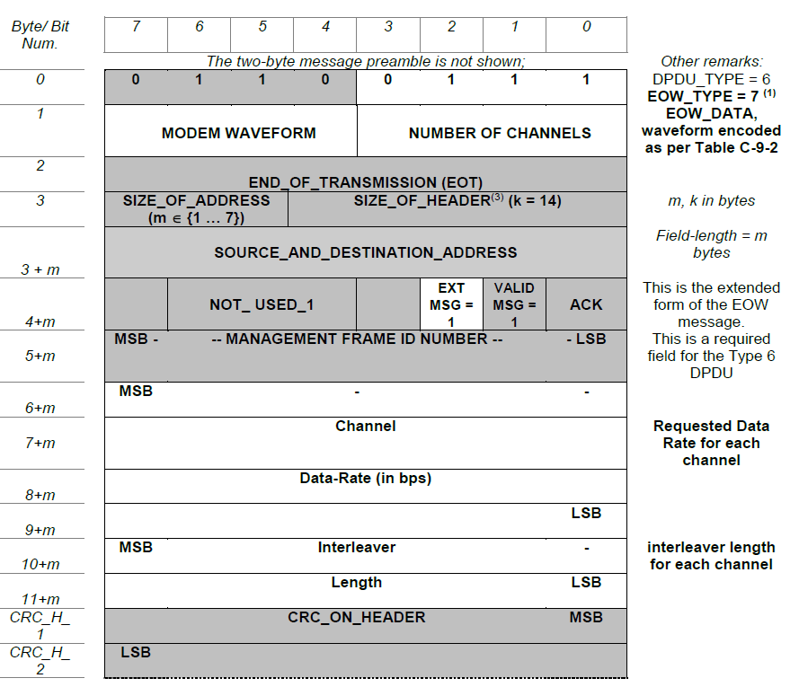

## Figure C-41.1 - Type 7 Extended EOW High-Data-Rate Change Request Message Format (all fields of the encapsulating Type 6 DPDU message are also shown)

> The format of the embedded Type 7 EOW message field **shall** (2) be as follows.

## Table C-9-1. Contents of the Type 7 EOW HDR Change Request Message

> MSB LSB MSB LSB MSB LSB

<table style="width:100%;">
<colgroup>
<col style="width: 8%" />
<col style="width: 7%" />
<col style="width: 8%" />
<col style="width: 7%" />
<col style="width: 8%" />
<col style="width: 7%" />
<col style="width: 7%" />
<col style="width: 8%" />
<col style="width: 8%" />
<col style="width: 9%" />
<col style="width: 8%" />
<col style="width: 8%" />
</colgroup>
<thead>
<tr class="header">
<th><blockquote>

11

</blockquote></th>
<th><blockquote>

10

</blockquote></th>
<th><blockquote>

9

</blockquote></th>
<th><blockquote>

8

</blockquote></th>
<th><blockquote>

7

</blockquote></th>
<th><blockquote>

6

</blockquote></th>
<th><blockquote>

5

</blockquote></th>
<th><blockquote>

4

</blockquote></th>
<th>3</th>
<th>2</th>
<th><blockquote>

1

</blockquote></th>
<th>0</th>
</tr>
</thead>
<tbody>
<tr class="odd">
<td><blockquote>

0

</blockquote></td>
<td><blockquote>

1

</blockquote></td>
<td><blockquote>

1

</blockquote></td>
<td><blockquote>

1

</blockquote></td>
<td></td>
<td></td>
<td></td>
<td></td>
<td></td>
<td></td>
<td></td>
<td></td>
</tr>
<tr class="even">
<td colspan="4"><blockquote>

TYPE

</blockquote></td>
<td colspan="5"><blockquote>

MODEM WAVEFORM

</blockquote></td>
<td colspan="3"><blockquote>

NUMBER OF CHANNELS

</blockquote></td>
</tr>
</tbody>
</table>

> The MODEM WAVEFORM field **shall** (3) contain an enumeration of the modem waveform requested as defined in the following table.

# Table C-9-2. Contents of the MODEM WAVEFORM field

<table>
<colgroup>
<col style="width: 65%" />
<col style="width: 34%" />
</colgroup>
<thead>
<tr class="header">
<th><blockquote>

WAVEFORM

</blockquote></th>
<th><blockquote>

ENUMERATION

</blockquote></th>
</tr>
</thead>
<tbody>
<tr class="odd">
<td><blockquote>

MS110A

</blockquote></td>
<td><blockquote>

0

</blockquote></td>
</tr>
<tr class="even">
<td><blockquote>

MS110B

</blockquote></td>
<td><blockquote>

1

</blockquote></td>
</tr>
<tr class="odd">
<td><blockquote>

STANAG_4285

</blockquote></td>
<td><blockquote>

2

</blockquote></td>
</tr>
<tr class="even">
<td><blockquote>

STANAG_4539

</blockquote></td>
<td><blockquote>

3

</blockquote></td>
</tr>
<tr class="odd">
<td><blockquote>

STANAG_4529

</blockquote></td>
<td><blockquote>

4

</blockquote></td>
</tr>
<tr class="even">
<td><blockquote>

STANAG_4415

</blockquote></td>
<td><blockquote>

5

</blockquote></td>
</tr>
<tr class="odd">
<td><blockquote>

STANAG_4481_FSK

</blockquote></td>
<td><blockquote>

6

</blockquote></td>
</tr>
<tr class="even">
<td><blockquote>

USER_CONFIGURATION_OPTION_ 1

</blockquote></td>
<td><blockquote>

7

</blockquote></td>
</tr>
<tr class="odd">
<td><blockquote>

USER_CONFIGURATION_OPTION_ 2

</blockquote></td>
<td><blockquote>

8

</blockquote></td>
</tr>
<tr class="even">
<td><blockquote>

USER_CONFIGURATION_OPTION_3

</blockquote></td>
<td><blockquote>

9

</blockquote></td>
</tr>
<tr class="odd">
<td><blockquote>

Unspecified

</blockquote></td>
<td><blockquote>

10 .. 31

</blockquote></td>
</tr>
</tbody>
</table>

> The NUMBER OF CHANNELS field **shall** (4) specify the number of channels being transmitted. The range **shall** (5) be from 1 …… 8, with binary 0 specifying 8 channels.
>
> The response to the Type 7 Extended EOW message **shall** (6) be an EOW Type 2 DRC Response, or an EOW Type 3 Unrecognised Type Error (or no response, as noted in the paragraph below).
>
> Both EOW types will be encoded as specified in paragraph C.5. If the DRC Response indicates “Refuse”, the Reason field **shall** (7) be encoded as specified in the following table.

## Table C-9-3. Contents for Type 2 Message (Reason Field) provided in Response to a Type 7 High Data-Rate Change message

<table>
<colgroup>
<col style="width: 22%" />
<col style="width: 77%" />
</colgroup>
<thead>
<tr class="header">
<th><blockquote>

MSB-LSB

</blockquote></th>
<th><blockquote>

Interpretation

</blockquote></th>
</tr>
</thead>
<tbody>
<tr class="odd">
<td><blockquote>

00000

</blockquote></td>
<td><blockquote>

As defined in paragraph C.5, Table C-8

</blockquote></td>
</tr>
<tr class="even">
<td><blockquote>

00001

</blockquote></td>
<td><blockquote>

Not used

</blockquote></td>
</tr>
<tr class="odd">
<td><blockquote>

00010

</blockquote></td>
<td><blockquote>

Not possible to change to specified waveform

</blockquote></td>
</tr>
<tr class="even">
<td><blockquote>

00011

</blockquote></td>
<td><blockquote>

Not possible to change to specified number of channels

</blockquote></td>
</tr>
<tr class="odd">
<td><blockquote>

00100

</blockquote></td>
<td><blockquote>

Not possible to change to specified interleaver length

</blockquote></td>
</tr>
<tr class="even">
<td><blockquote>

00101

</blockquote></td>
<td><blockquote>

As defined in paragraph C.5, Table C-8

</blockquote></td>
</tr>
</tbody>
</table>

> By definition, the HDR Change Request is a request and not an advisory.
>
> The procedure for using the Type 7 Extended EOW HDR Change Request message **shall** (7) be as
>
> Described in paragraph C.6.4. Specifically; the sender of the Type 7 message **shall** (8) be the HDRC master and the receiver will be the HDRC slave. The slave will respond with accept or refuse (EOW Type 2), unrecognised (EOW Type 3), or no response:

-   If the slave accepts the request (using the EOW Type 2), then the master will send an acknoledgement and both will change to the new mode. After the change, the slave will send a confirm and the master will acknowledge.

-   If the slave explicitly refuses the request using the EOW Type 2, the master may cease the request or send a new request with different parameters, depending on the reason given.

-   A slave that explicitely refuses the request by responding with an Unrecognised EOW (Type 3) message signals that it does not participate (or understand) the HDR Change protocol and the master **shall** (9) cease immediately.

-   If no response is received from the slave, the master may cease the request or may send the request again.

> The initial data rate and interleaver length **shall** (10) be provided by using the Extended Message field of the Type 6 D\_PDU, as shown in Figure C-41.1. This information **shall** (11) be included in the Type 7 EOW HDR Change Request and **may** be included in the Type 2 EOW Data Rate Change Response message. If contained in the Type 2 EOW Data Rate Change Response message, the initial data rate and interleaver length are recommended values. The data rate and interleaver length shall be encoded in the Extended Message field as follows.

## Table C-9-4. Contents of the Extended EOW Message field in a Type 7 EOW High Data-Rate Change message

<table>
<colgroup>
<col style="width: 17%" />
<col style="width: 82%" />
</colgroup>
<thead>
<tr class="header">
<th><blockquote>

<strong>Byte</strong>

<strong>OFFSET (1)</strong>

</blockquote></th>
<th><blockquote>

<strong>Description</strong>

</blockquote></th>
</tr>
</thead>
<tbody>
<tr class="odd">
<td><blockquote>

0 .. 3

</blockquote></td>
<td><blockquote>

Data rate (MSB at offset 0)

</blockquote></td>
</tr>
<tr class="even">
<td><blockquote>

4 .. 5

</blockquote></td>
<td><blockquote>

Interleaver length in hundredths of seconds (MSB at offset 4)

</blockquote></td>
</tr>
</tbody>
</table>

> \(1\) Note offset is with respect to the first byte of the extended message field.

## Peer-to-peer Communication Protocols

> This section discusses the interactions between the Data Transfer Sublayer entities at different nodes in terms of states, state-transition diagrams, and state tables for a hypothetical state machine. This STANAG does not mandate a state machine implementation. The requirement for interoperability is that the system act consistently with the state-transition and actions rules for message exchange and format presented in this STANAG.

## Data Transfer Sublayer States and Transitions

> The expected and allowed interactions of one node with another are described herein with respect to states of the node’s Data Transfer sublayer. Receiving certain PDUs (from the modem) or D\_Primitives (from the Channel Access Sublayer) will cause a node, depending on its state, to transmit certain PDUs and/or D\_Primitives, and/or change to another state.
>
> The Data Transfer Sublayer interactions with peers **shall** (1) be defined with respect to the states shown in Figure C-42 and as follows:

<table>
<colgroup>
<col style="width: 50%" />
<col style="width: 50%" />
</colgroup>
<thead>
<tr class="header">
<th><blockquote>

IDLE (UNCONNECTED)

</blockquote></th>
<th><blockquote>

IDLE (CONNECTED)

</blockquote></th>
</tr>
</thead>
<tbody>
<tr class="odd">
<td><blockquote>

DATA (UNCONNECTED)

</blockquote></td>
<td><blockquote>

DATA (CONNECTED)

</blockquote></td>
</tr>
<tr class="even">
<td><blockquote>

EXPEDITED-DATA (UNCONNECTED

</blockquote></td>
<td><blockquote>

EXPEDITED-DATA (CONNECTED)

</blockquote></td>
</tr>
<tr class="odd">
<td><blockquote>

MANAGEMENT (UNCONNECTED)

</blockquote></td>
<td><blockquote>

MANAGEMENT (CONNECTED)

</blockquote></td>
</tr>
</tbody>
</table>

## 

## 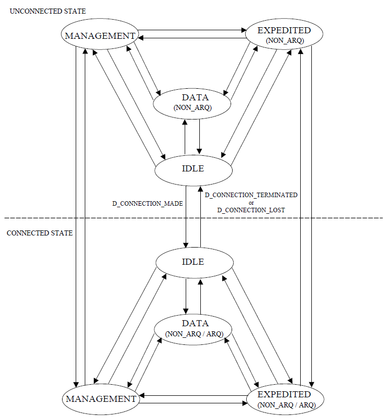

## Figure C-42. Nominal State and Transition Diagram (Data Transfer Sublayer)

1.  **State Transition Rules**

> The transitions between DTS States and the actions that arise from given events **shall** (1) be as defined in the tables presented in the subsections that follow.
>
> DTS states, transitions, and actions **shall** (2) be defined and maintained with respect to a specified remote node address.
>
> In all of the tables below, “PDU received” refers to a PDU received that is addressed to the node in question from the specified remote node for which the states are maintained. Action and transitions rules **shall** (3) not occur based on PDUs addressed to other nodes or from a node other than the specified remote node for which the states are maintained.
>
> Likewise, “D\_Primitive received” refers to a D\_Primitive received from the Channel Access sublayer that references the specified remote node. Action and transitions rules **shall** (4) not occur based on D\_Primitives that reference nodes other than the specified remote node.
>
> DTS states **shall** (5) be maintained for each specified node for which a connection or ARQ protocol must be maintained. \[Note: If multiple links, as defined by the Channel Access or Subnetwork Interface sublayers, must be maintained simultaneously, then a set of DTS State Variables must be maintained for each of the links. If links are not maintained simultaneously, DTS State variables may be reused for any node\]

## IDLE(UNCONNECTED) State Transition Rules

> When in the IDLE(UNCONNECTED) State, the Data Transfer Sublayer **shall** (1) respond to reception of a D\_Primitive from the Channel Access Sublayer as specified in the following Table:

## Table C-10. Event/Transition/Action Rules for IDLE (UNCONNECTED) State: CAS-Related Events

<table>
<colgroup>
<col style="width: 26%" />
<col style="width: 27%" />
<col style="width: 46%" />
</colgroup>
<thead>
<tr class="header">
<th><blockquote>

<strong>Received</strong>

<strong>D_Primitive/ Event</strong>

</blockquote></th>
<th><blockquote>

<strong>State Transition to:</strong>

</blockquote></th>
<th><blockquote>

<strong>Action &amp; Comments</strong>

</blockquote></th>
</tr>
</thead>
<tbody>
<tr class="odd">
<td><blockquote>

D_CONNECTION_MADE

</blockquote></td>
<td><blockquote>

IDLE(CONNECTED)

</blockquote></td>
<td><blockquote>

INITIALIZE State Variables for ARQ processing, in accordance with Section C.6.2

[Note: CAS has accepted a connection request

from the remote node.]

</blockquote></td>
</tr>
<tr class="even">
<td><blockquote>

D_CONNECTION_ TERMINATED

</blockquote></td>
<td><blockquote>

IDLE(UNCONNECTED) ,

i.e., No Change.

</blockquote></td>
<td><blockquote>

IGNORE [Note: this is an anomalous event, the DTS may notify the CAS that an attempt was made to terminate a connection that did not exist.]

</blockquote></td>
</tr>
<tr class="odd">
<td><blockquote>

D_UNIDATA_REQUEST (ARQ)

</blockquote></td>
<td><blockquote>

IDLE(UNCONNECTED) ,

i.e., No Change.

</blockquote></td>
<td><blockquote>

REPLY w/ D_UNIDATA_INDICATION (REJECT).

[Note: reliable data cannot be sent over a nonexistent connection.]

</blockquote></td>
</tr>
<tr class="even">
<td><blockquote>

D_EXPEDITED_UNIDATA

_ REQUEST (ARQ)

</blockquote></td>
<td><blockquote>

IDLE(UNCONNECTED) ,

i.e., No Change.

</blockquote></td>
<td><blockquote>

REPLY w/ D_EXPEDITED_UNIDATA_INDICATION

(REJECT). [Note: reliable data cannot be sent

over a nonexistent connection.]

</blockquote></td>
</tr>
<tr class="odd">
<td><blockquote>

D_UNIDATA_REQUEST (NON-ARQ)

</blockquote></td>
<td><blockquote>

DATA(UNCONNECTED)

</blockquote></td>
<td><blockquote>

SEGMENT C_PDU;

COMPOSE and SEND all resultant NON-ARQ DATA Type 7 D_PDUs

</blockquote></td>
</tr>
<tr class="even">
<td><blockquote>

D_EXPEDITED_UNIDATA

_ REQUEST (NON_ARQ)

</blockquote></td>
<td><blockquote>

EXPEDITED DATA (UNCONNECTED)

</blockquote></td>
<td><blockquote>

SEGMENT C_PDU;

COMPOSE and SEND all resultant EXPEDITED NON-ARQ DATA Type 8 D_PDUs

</blockquote></td>
</tr>
</tbody>
</table>

> When in the IDLE(UNCONNECTED) State, the Data Transfer Sublayer **shall** (2) respond to reception of a D\_PDU from the lower layers as specified in the following Table:
>
> **Table C-11. Event/Transition/Action Rules for**
>
> **IDLE (UNCONNECTED) State: Reception-Related Events**

<table>
<colgroup>
<col style="width: 23%" />
<col style="width: 24%" />
<col style="width: 52%" />
</colgroup>
<thead>
<tr class="header">
<th><blockquote>

<strong>Received D_PDU Event</strong>

</blockquote></th>
<th><blockquote>

<strong>State Transition to:</strong>

</blockquote></th>
<th><blockquote>

<strong>Action &amp; Comments</strong>

</blockquote></th>
</tr>
</thead>
<tbody>
<tr class="odd">
<td><blockquote>

DATA Type 0 D_PDU

</blockquote></td>
<td><blockquote>

IDLE(UNCONNECTED) ,

i.e., No Change.

</blockquote></td>
<td><blockquote>

COMPOSE and SEND WARNING Type 15 D_PDU, w/

Reason =1=“Connection-Related D_PDU but Unconnected”;

NOTIFY CAS using D_WARNING_TRANSMITTED

</blockquote></td>
</tr>
<tr class="even">
<td><blockquote>

ACK Type 1 D_PDU

</blockquote></td>
<td><blockquote>

IDLE(UNCONNECTED) ,

i.e., No Change.

</blockquote></td>
<td><blockquote>

COMPOSE and SEND WARNING Type 15 D_PDU, w/

Reason =1=“Connection-Related D_PDU but Unconnected”;

NOTIFY CAS using D_WARNING_TRANSMITTED

</blockquote></td>
</tr>
<tr class="odd">
<td><blockquote>

DATA-ACK Type 2 D_PDU

</blockquote></td>
<td><blockquote>

IDLE(UNCONNECTED) ,

i.e., No Change.

</blockquote></td>
<td><blockquote>

COMPOSE and SEND WARNING Type 15 D_PDU, w/

Reason =1=“Connection-Related D_PDU but Unconnected”;

NOTIFY CAS using D_WARNING_TRANSMITTED

</blockquote></td>
</tr>
<tr class="even">
<td><blockquote>

RESET/WIN RESYNC

Type 3 D_PDU

</blockquote></td>
<td><blockquote>

IDLE(UNCONNECTED) ,

i.e., No Change.

</blockquote></td>
<td><blockquote>

COMPOSE and SEND WARNING Type 15 D_PDU, w/

Reason =1=“Connection-Related D_PDU but Unconnected”;

NOTIFY CAS using D_WARNING_TRANSMITTED

</blockquote></td>
</tr>
<tr class="odd">
<td>
EXPEDITED-DATA

Type 4 D_PDU
</td>
<td><blockquote>

IDLE(UNCONNECTED) ,

i.e., No Change.

</blockquote></td>
<td><blockquote>

COMPOSE and SEND WARNING Type 15 D_PDU, w/

Reason =1=“Connection-Related D_PDU but Unconnected”;

NOTIFY CAS using D_WARNING_TRANSMITTED

</blockquote></td>
</tr>
<tr class="even">
<td><blockquote>

EXPEDITED-ACK

Type 5 D_PDU

</blockquote></td>
<td><blockquote>

IDLE(UNCONNECTED) ,

i.e., No Change.

</blockquote></td>
<td><blockquote>

COMPOSE and SEND WARNING Type 15 D_PDU, w/

Reason =1=“Connection-Related D_PDU but Unconnected”;

NOTIFY CAS using D_WARNING_TRANSMITTED

</blockquote></td>
</tr>
<tr class="odd">
<td><blockquote>

MANAGEMENT

Type 6 D_PDU

</blockquote></td>
<td><blockquote>

MANAGEMENT (UNCONNECTED)

</blockquote></td>
<td><blockquote>

PROCESS Type 6 D_PDU;

RESPOND if required.

</blockquote></td>
</tr>
<tr class="even">
<td><blockquote>

NON-ARQ DATA

Type 7 D_PDU

</blockquote></td>
<td><blockquote>

DATA(UNCONNECTED)

</blockquote></td>
<td><blockquote>

PROCESS the D_PDU and reassemble C_PDU segments;

DELIVER to CAS using D_UNIDATA_INDICATION if

received complete C_PDU

</blockquote></td>
</tr>
<tr class="odd">
<td><blockquote>

EXPEDITED

NON_ARQ

Type 8 D_PDU

</blockquote></td>
<td><blockquote>

EXPEDITED-DATA (UNCONNECTED)

</blockquote></td>
<td><blockquote>

PROCESS the D_PDU and reassemble C_PDU segments;

DELIVER to CAS using D_UNIDATA_INDICATION if the

DTS received a complete C_PDU

</blockquote></td>
</tr>
<tr class="even">
<td><blockquote>

WARNING Type 15 D_PDU

</blockquote></td>
<td><blockquote>

IDLE(UNCONNECTED) ,

i.e., No Change.

</blockquote></td>
<td><blockquote>

CEASE action indicated in warning;

NOTIFY CAS using D_WARNING_RECEIVED

</blockquote></td>
</tr>
</tbody>
</table>

1.  **DATA(UNCONNECTED) State Transition Rules**

> When in the DATA(UNCONNECTED) State, the Data Transfer Sublayer **shall** (1) respond to reception of a D\_Primitive from the Channel Access Sublayer as specified in the following Table:

## Table C-12. Event/Transition/Action Rules for DATA (UNCONNECTED) State: CAS-Related Events

<table>
<colgroup>
<col style="width: 26%" />
<col style="width: 27%" />
<col style="width: 46%" />
</colgroup>
<thead>
<tr class="header">
<th><blockquote>

<strong>Received D_Primitive Event</strong>

</blockquote></th>
<th><blockquote>

<strong>State Transition to:</strong>

</blockquote></th>
<th><blockquote>

<strong>Action &amp; Comments</strong>

</blockquote></th>
</tr>
</thead>
<tbody>
<tr class="odd">
<td><blockquote>

D_CONNECTION_MADE

</blockquote></td>
<td><blockquote>

IDLE(CONNECTED)

</blockquote></td>
<td><blockquote>

INITIALIZE State Variables for ARQ processing, in accordance with Section C.6.2

[Note: CAS has accepted a connection request

from the remote node.]

</blockquote></td>
</tr>
<tr class="even">
<td><blockquote>

D_CONNECTION_ TERMINATED

</blockquote></td>
<td><blockquote>

DATA (UNCONNECTED) ,

i.e., No Change.

</blockquote></td>
<td><blockquote>

IGNORE [Note: this is an anomalous event, the DTS may notify the CAS that an attempt was made to terminate a connection that did not exist.]

</blockquote></td>
</tr>
<tr class="odd">
<td><blockquote>

D_UNIDATA_REQUEST (ARQ)

</blockquote></td>
<td><blockquote>

DATA (UNCONNECTED) ,

i.e., No Change.

</blockquote></td>
<td><blockquote>

REPLY w/ D_UNIDATA_INDICATION (REJECT).

[Note: reliable data cannot be sent over a nonexistent connection.]

</blockquote></td>
</tr>
<tr class="even">
<td><blockquote>

D_EXPEDITED_UNIDATA

_ REQUEST (ARQ)

</blockquote></td>
<td><blockquote>

DATA(UNCONNECTED) ,

i.e., No Change.

</blockquote></td>
<td><blockquote>

REPLY w/ D_EXPEDITED_UNIDATA_INDICATION

(REJECT). [Note: reliable data cannot be sent

over a nonexistent connection.]

</blockquote></td>
</tr>
<tr class="odd">
<td><blockquote>

D_UNIDATA_REQUEST (NON-ARQ)

</blockquote></td>
<td><blockquote>

DATA(UNCONNECTED) ,

i.e., No Change.

</blockquote></td>
<td><blockquote>

SEGMENT C_PDU;

COMPOSE and SEND all resultant NON-ARQ DATA Type 7 D_PDUs

</blockquote></td>
</tr>
<tr class="even">
<td><blockquote>

D_EXPEDITED_UNIDATA

_ REQUEST (NON_ARQ)

</blockquote></td>
<td><blockquote>

EXPEDITED-DATA (UNCONNECTED)

</blockquote></td>
<td><blockquote>

SEGMENT C_PDU;

COMPOSE and SEND all resultant EXPEDITED NON-ARQ DATA Type 8 D_PDUs

</blockquote></td>
</tr>
</tbody>
</table>

> When in the DATA(UNCONNECTED) State, the Data Transfer Sublayer **shall** (2) respond to reception of a D\_PDU from the lower layers as specified in the following Table:

## Table C-13. Event/Transition/Action Rules for DATA (UNCONNECTED) State: Reception-Related Events

<table>
<colgroup>
<col style="width: 23%" />
<col style="width: 25%" />
<col style="width: 51%" />
</colgroup>
<thead>
<tr class="header">
<th><blockquote>

<strong>Received D_PDU Event</strong>

</blockquote></th>
<th><blockquote>

<strong>State Transition to:</strong>

</blockquote></th>
<th><blockquote>

<strong>Action &amp; Comments</strong>

</blockquote></th>
</tr>
</thead>
<tbody>
<tr class="odd">
<td><blockquote>

DATA Type 0 D_PDU

</blockquote></td>
<td><blockquote>

DATA(UNCONNECTED),

i.e., No Change.

</blockquote></td>
<td><blockquote>

COMPOSE and SEND WARNING Type 15 D_PDU, w/

Reason =1=“Connection-Related D_PDU but Unconnected”;

NOTIFY CAS using D_WARNING_TRANSMITTED

</blockquote></td>
</tr>
<tr class="even">
<td><blockquote>

ACK Type 1 D_PDU

</blockquote></td>
<td><blockquote>

DATA (UNCONNECTED),

i.e., No Change.

</blockquote></td>
<td><blockquote>

COMPOSE and SEND WARNING Type 15 D_PDU, w/

Reason =1=“Connection-Related D_PDU but Unconnected”;

NOTIFY CAS using D_WARNING_TRANSMITTED

</blockquote></td>
</tr>
<tr class="odd">
<td><blockquote>

DATA-ACK Type 2 D_PDU

</blockquote></td>
<td><blockquote>

DATA (UNCONNECTED),

i.e., No Change.

</blockquote></td>
<td><blockquote>

COMPOSE and SEND WARNING Type 15 D_PDU, w/

Reason =1=“Connection-Related D_PDU but Unconnected”;

NOTIFY CAS using D_WARNING_TRANSMITTED

</blockquote></td>
</tr>
<tr class="even">
<td><blockquote>

RESET/WIN RESYNC

Type 3 D_PDU

</blockquote></td>
<td><blockquote>

DATA (UNCONNECTED),

i.e., No Change.

</blockquote></td>
<td><blockquote>

COMPOSE and SEND WARNING Type 15 D_PDU, w/

Reason =1=“Connection-Related D_PDU but Unconnected”;

NOTIFY CAS using D_WARNING_TRANSMITTED

</blockquote></td>
</tr>
<tr class="odd">
<td>
EXPEDITED-DATA

Type 4 D_PDU
</td>
<td><blockquote>

DATA (UNCONNECTED),

i.e., No Change.

</blockquote></td>
<td><blockquote>

COMPOSE and SEND WARNING Type 15 D_PDU, w/

Reason =1=“Connection-Related D_PDU but Unconnected”;

NOTIFY CAS using D_WARNING_TRANSMITTED

</blockquote></td>
</tr>
<tr class="even">
<td><blockquote>

EXPEDITED-ACK

Type 5 D_PDU

</blockquote></td>
<td><blockquote>

DATA (UNCONNECTED),

i.e., No Change.

</blockquote></td>
<td><blockquote>

COMPOSE and SEND WARNING Type 15 D_PDU, w/

Reason =1=“Connection-Related D_PDU but Unconnected”;

NOTIFY CAS using D_WARNING_TRANSMITTED

</blockquote></td>
</tr>
<tr class="odd">
<td><blockquote>

MANAGEMENT

Type 6 D_PDU

</blockquote></td>
<td><blockquote>

MANAGEMENT (UNCONNECTED)

</blockquote></td>
<td><blockquote>

PROCESS Type 6 D_PDU;

RESPOND if required.

</blockquote></td>
</tr>
<tr class="even">
<td><blockquote>

NON-ARQ DATA

Type 7 D_PDU

</blockquote></td>
<td><blockquote>

DATA(UNCONNECTED),

i.e., No Change.

</blockquote></td>
<td><blockquote>

PROCESS the D_PDU and reassemble C_PDU segments;

DELIVER to CAS using D_UNIDATA_INDICATION if

received complete C_PDU

</blockquote></td>
</tr>
<tr class="odd">
<td><blockquote>

EXPEDITED

NON_ARQ

Type 8 D_PDU

</blockquote></td>
<td><blockquote>

DATA(UNCONNECTED),

i.e., No Change.

</blockquote></td>
<td><blockquote>

PROCESS the D_PDU and reassemble C_PDU segments;

DELIVER to CAS using D_EXPEDITED_UNIDATA_

INDICATION if the DTS received a complete C_PDU

</blockquote></td>
</tr>
<tr class="even">
<td><blockquote>

WARNING Type 15 D_PDU

</blockquote></td>
<td><blockquote>

DATA(UNCONNECTED),

i.e., No Change.

</blockquote></td>
<td><blockquote>

CEASE action indicated in warning;

NOTIFY CAS using D_WARNING_RECEIVED

</blockquote></td>
</tr>
</tbody>
</table>

1.  **EXPEDITED-DATA(UNCONNECTED) State Transition Rules**

> When in the EXPEDITED-DATA(UNCONNECTED) State, the Data Transfer Sublayer **shall**(1) respond to reception of a D\_Primitive from the Channel Access Sublayer as specified in the following Table:

## Table C-14. Event/Transition/Action Rules for EXPEDITED-DATA (UNCONNECTED) State: CAS-Related Event

<table>
<colgroup>
<col style="width: 26%" />
<col style="width: 27%" />
<col style="width: 46%" />
</colgroup>
<thead>
<tr class="header">
<th><blockquote>

<strong>Received D_Primitive Event</strong>

</blockquote></th>
<th><blockquote>

<strong>State Transition to:</strong>

</blockquote></th>
<th><blockquote>

<strong>Action &amp; Comments</strong>

</blockquote></th>
</tr>
</thead>
<tbody>
<tr class="odd">
<td><blockquote>

D_CONNECTION_MADE

</blockquote></td>
<td><blockquote>

IDLE(CONNECTED)

</blockquote></td>
<td><blockquote>

INITIALIZE State Variables for ARQ processing, in accordance with Section C.6.2

[Note: CAS has accepted a connection request

from the remote node.]

</blockquote></td>
</tr>
<tr class="even">
<td><blockquote>

D_CONNECTION_ TERMINATED

</blockquote></td>
<td><blockquote>

EXPEDITED-DATA (UNCONNECTED), i.e.,

No Change.

</blockquote></td>
<td><blockquote>

IGNORE [Note: this is an anomalous event, the DTS may notify the CAS that an attempt was made to terminate a connection that did not exist.]

</blockquote></td>
</tr>
<tr class="odd">
<td><blockquote>

D_UNIDATA_REQUEST (ARQ)

</blockquote></td>
<td><blockquote>

EXPEDITED-DATA (UNCONNECTED), i.e.,

No Change.

</blockquote></td>
<td><blockquote>

REPLY w/ D_UNIDATA_INDICATION (REJECT).

[Note: reliable data cannot be sent over a nonexistent connection.]

</blockquote></td>
</tr>
<tr class="even">
<td><blockquote>

D_EXPEDITED_UNIDATA

_ REQUEST (ARQ)

</blockquote></td>
<td><blockquote>

EXPEDITED-DATA (UNCONNECTED), i.e.,

No Change.

</blockquote></td>
<td><blockquote>

REPLY w/ D_EXPEDITED_UNIDATA_INDICATION

(REJECT). [Note: reliable data cannot be sent

over a nonexistent connection.]

</blockquote></td>
</tr>
<tr class="odd">
<td><blockquote>

D_UNIDATA_REQUEST (NON-ARQ)

</blockquote></td>
<td><blockquote>

IF completed transmitting all Expedited-Data, change to DATA(UNCONNECTED),

OTHERWISE, EXPEDITED-DATA (UNCONNECTED), i.e.,

No Change.

</blockquote></td>
<td><blockquote>

IF completed sending all Expedited-Data, SEGMENT C_PDU, then,

COMPOSE and SEND all resultant NON-ARQ DATA Type 7 D_PDUs;

OTHERWISE, QUEUE C_PDU Pending

completion of Expedited-Data transmission.

</blockquote></td>
</tr>
<tr class="even">
<td><blockquote>

D_EXPEDITED_UNIDATA

_ REQUEST (NON_ARQ)

</blockquote></td>
<td><blockquote>

EXPEDITED-DATA (UNCONNECTED), i.e.,

No Change.

</blockquote></td>
<td><blockquote>

SEGMENT C_PDU;

COMPOSE and SEND all resultant EXPEDITED NON-ARQ DATA Type 8 D_PDUs

</blockquote></td>
</tr>
</tbody>
</table>

> When in the EXPEDITED-DATA(UNCONNECTED) State, the Data Transfer Sublayer **shall**(2)
>
> respond to reception of a D\_PDU from the lower layers as specified in the following Table:

## Table C-15. Event/Transition/Action Rules for EXPEDITED-DATA (UNCONNECTED) State: Reception-Related Event

<table>
<colgroup>
<col style="width: 23%" />
<col style="width: 24%" />
<col style="width: 52%" />
</colgroup>
<thead>
<tr class="header">
<th><blockquote>

<strong>Received D_PDU/</strong>

<strong>Event</strong>

</blockquote></th>
<th><blockquote>

<strong>State Transition to:</strong>

</blockquote></th>
<th><blockquote>

<strong>Action &amp; Comments</strong>

</blockquote></th>
</tr>
</thead>
<tbody>
<tr class="odd">
<td><blockquote>

DATA Type 0 D_PDU

</blockquote></td>
<td><blockquote>

EXPEDITED-DATA (UNCONNECTED),

i.e., No Change.

</blockquote></td>
<td><blockquote>

COMPOSE and SEND WARNING Type 15 D_PDU, w/

Reason =1=“Connection-Related D_PDU but Unconnected”;

NOTIFY CAS using D_WARNING_TRANSMITTED

</blockquote></td>
</tr>
<tr class="even">
<td><blockquote>

ACK Type 1 D_PDU

</blockquote></td>
<td><blockquote>

EXPEDITED-DATA (UNCONNECTED),

i.e., No Change.

</blockquote></td>
<td><blockquote>

COMPOSE and SEND WARNING Type 15 D_PDU, w/

Reason =1=“Connection-Related D_PDU but Unconnected”;

NOTIFY CAS using D_WARNING_TRANSMITTED

</blockquote></td>
</tr>
<tr class="odd">
<td><blockquote>

DATA-ACK Type 2 D_PDU

</blockquote></td>
<td><blockquote>

EXPEDITED-DATA (UNCONNECTED),

i.e., No Change.

</blockquote></td>
<td><blockquote>

COMPOSE and SEND WARNING Type 15 D_PDU, w/

Reason =1=“Connection-Related D_PDU but Unconnected”;

NOTIFY CAS using D_WARNING_TRANSMITTED

</blockquote></td>
</tr>
<tr class="even">
<td><blockquote>

RESET/WIN RESYNC

Type 3 D_PDU

</blockquote></td>
<td><blockquote>

EXPEDITED-DATA (UNCONNECTED),

i.e., No Change.

</blockquote></td>
<td><blockquote>

COMPOSE and SEND WARNING Type 15 D_PDU, w/

Reason =1=“Connection-Related D_PDU but Unconnected”;

NOTIFY CAS using D_WARNING_TRANSMITTED

</blockquote></td>
</tr>
<tr class="odd">
<td>
EXPEDITED-DATA

Type 4 D_PDU
</td>
<td><blockquote>

EXPEDITED-DATA (UNCONNECTED),

i.e., No Change.

</blockquote></td>
<td><blockquote>

COMPOSE and SEND WARNING Type 15 D_PDU, w/

Reason =1=“Connection-Related D_PDU but Unconnected”;

NOTIFY CAS using D_WARNING_TRANSMITTED

</blockquote></td>
</tr>
<tr class="even">
<td><blockquote>

EXPEDITED-ACK

Type 5 D_PDU

</blockquote></td>
<td><blockquote>

EXPEDITED-DATA (UNCONNECTED),

i.e., No Change.

</blockquote></td>
<td><blockquote>

COMPOSE and SEND WARNING Type 15 D_PDU, w/

Reason =1=“Connection-Related D_PDU but Unconnected”;

NOTIFY CAS using D_WARNING_TRANSMITTED

</blockquote></td>
</tr>
<tr class="odd">
<td><blockquote>

MANAGEMENT

Type 6 D_PDU

</blockquote></td>
<td><blockquote>

MANAGEMENT (UNCONNECTED)

</blockquote></td>
<td><blockquote>

PROCESS Type 6 D_PDU;

RESPOND if required.

</blockquote></td>
</tr>
<tr class="even">
<td><blockquote>

NON-ARQ DATA

Type 7 D_PDU

</blockquote></td>
<td><blockquote>

EXPEDITED-DATA (UNCONNECTED),

i.e., No Change.

</blockquote></td>
<td><blockquote>

PROCESS the D_PDU and reassemble C_PDU segments;

DELIVER to CAS using D_UNIDATA_INDICATION if

received complete C_PDU

</blockquote></td>
</tr>
<tr class="odd">
<td><blockquote>

EXPEDITED

NON_ARQ

Type 8 D_PDU

</blockquote></td>
<td><blockquote>

EXPEDITED-DATA (UNCONNECTED),

i.e., No Change.

</blockquote></td>
<td><blockquote>

PROCESS the D_PDU and reassemble C_PDU segments;

DELIVER to CAS using D_UNIDATA_INDICATION if the

DTS received a complete C_PDU

</blockquote></td>
</tr>
<tr class="even">
<td><blockquote>

WARNING Type 15 D_PDU

</blockquote></td>
<td><blockquote>

EXPEDITED-DATA (UNCONNECTED),

i.e., No Change.

</blockquote></td>
<td><blockquote>

CEASE action indicated in warning;

NOTIFY CAS using D_WARNING_RECEIVED

</blockquote></td>
</tr>
</tbody>
</table>

1.  **MANAGEMENT(UNCONNECTED) State Transition Rules**

> When in the MANAGEMENT(UNCONNECTED) State, the Data Transfer Sublayer **shall** (1) respond to reception of a D\_Primitive from the Channel Access Sublayer as specified in the following Table:

## Table C-16. Event/Transition/Action Rules for MANAGEMENT (UNCONNECTED) State: CAS-Related Events

<table>
<colgroup>
<col style="width: 26%" />
<col style="width: 27%" />
<col style="width: 46%" />
</colgroup>
<thead>
<tr class="header">
<th><blockquote>

<strong>Received</strong>

<strong>D_Primitive/ Event</strong>

</blockquote></th>
<th><blockquote>

<strong>State Transition to:</strong>

</blockquote></th>
<th><blockquote>

<strong>Action &amp; Comments</strong>

</blockquote></th>
</tr>
</thead>
<tbody>
<tr class="odd">
<td><blockquote>

D_CONNECTION_MADE

</blockquote></td>
<td><blockquote>

MANAGEMENT (CONNECTED)

</blockquote></td>
<td><blockquote>

INITIALIZE State Variables for ARQ processing, in accordance with Section C.6.2

[Note: CAS has accepted a connection request

from the remote node.]

</blockquote></td>
</tr>
<tr class="even">
<td><blockquote>

D_CONNECTION_ TERMINATED

</blockquote></td>
<td><blockquote>

MANAGEMENT (UNCONNECTED) , i.e.,

No Change.

</blockquote></td>
<td><blockquote>

IGNORE [Note: this is an anomalous event, the DTS may notify the CAS that an attempt was made to terminate a connection that did not exist.]

</blockquote></td>
</tr>
<tr class="odd">
<td><blockquote>

D_UNIDATA_REQUEST (ARQ)

</blockquote></td>
<td><blockquote>

MANAGEMENT (UNCONNECTED) , i.e.,

No Change.

</blockquote></td>
<td><blockquote>

REPLY w/ D_UNIDATA_INDICATION (REJECT).

[Note: reliable data cannot be sent over a nonexistent connection.]

</blockquote></td>
</tr>
<tr class="even">
<td><blockquote>

D_EXPEDITED_UNIDATA

_ REQUEST (ARQ)

</blockquote></td>
<td><blockquote>

MANAGEMENT (UNCONNECTED) , i.e.,

No Change.

</blockquote></td>
<td><blockquote>

REPLY w/ D_EXPEDITED_UNIDATA_INDICATION

(REJECT). [Note: reliable data cannot be sent

over a nonexistent connection.]

</blockquote></td>
</tr>
<tr class="odd">
<td><blockquote>

D_UNIDATA_REQUEST (NON-ARQ)

</blockquote></td>
<td><blockquote>

IF Management Protocol completed, DATA(UNCONNECTED),

</blockquote></td>
<td rowspan="2"><blockquote>

IF Management Protocol completed, SEGMENT C_PDU;

COMPOSE and SEND all resultant NON-ARQ DATA Type 7 D_PDUs;

OTHERWISE

QUEUE C_PDU Pending completion of management protocol.

</blockquote></td>
</tr>
<tr class="even">
<td></td>
<td><blockquote>

OTHERWISE, MANAGEMENT (UNCONNECTED) , i.e.,

No Change.

</blockquote></td>
</tr>
<tr class="odd">
<td><blockquote>

D_EXPEDITED_UNIDATA

_ REQUEST (NON_ARQ)

</blockquote></td>
<td><blockquote>

IF Management Protocol completed, EXPEDITED DATA (UNCONNECTED),

</blockquote></td>
<td rowspan="2"><blockquote>

IF Management Protocol completed, SEGMENT C_PDU;

COMPOSE and SEND all resultant EXPEDITED NON-ARQ DATA Type 8 D_PDUs;

OTHERWISE

QUEUE C_PDU Pending completion of management protocol.

</blockquote></td>
</tr>
<tr class="even">
<td></td>
<td><blockquote>

OTHERWISE, MANAGEMENT (UNCONNECTED) , i.e.,

No Change.

</blockquote></td>
</tr>
</tbody>
</table>

> When in the MANAGEMENT(UNCONNECTED) State, the Data Transfer Sublayer **shall** (2)
>
> respond to reception of a D\_PDU from the lower layers as specified in the following Table:

## Table C-17. Event/Transition/Action Rules for MANAGEMENT (UNCONNECTED) State: Reception-Related Events

<table>
<colgroup>
<col style="width: 23%" />
<col style="width: 24%" />
<col style="width: 52%" />
</colgroup>
<thead>
<tr class="header">
<th><blockquote>

<strong>Received D_PDU</strong>

<strong>Event</strong>

</blockquote></th>
<th><blockquote>

<strong>State Transition to:</strong>

</blockquote></th>
<th><blockquote>

<strong>Action &amp; Comments</strong>

</blockquote></th>
</tr>
</thead>
<tbody>
<tr class="odd">
<td><blockquote>

DATA Type 0 D_PDU

</blockquote></td>
<td><blockquote>

MANAGEMENT (UNCONNECTED) ,

i.e., No Change.

</blockquote></td>
<td><blockquote>

COMPOSE and SEND WARNING Type 15 D_PDU, w/

Reason =1=“Connection-Related D_PDU but Unconnected”;

NOTIFY CAS using D_WARNING_TRANSMITTED

</blockquote></td>
</tr>
<tr class="even">
<td><blockquote>

ACK Type 1 D_PDU

</blockquote></td>
<td><blockquote>

MANAGEMENT (UNCONNECTED) ,

i.e., No Change.

</blockquote></td>
<td><blockquote>

COMPOSE and SEND WARNING Type 15 D_PDU, w/

Reason =1=“Connection-Related D_PDU but Unconnected”;

NOTIFY CAS using D_WARNING_TRANSMITTED

</blockquote></td>
</tr>
<tr class="odd">
<td><blockquote>

DATA-ACK Type 2 D_PDU

</blockquote></td>
<td><blockquote>

MANAGEMENT (UNCONNECTED) ,

i.e., No Change.

</blockquote></td>
<td><blockquote>

COMPOSE and SEND WARNING Type 15 D_PDU, w/

Reason =1=“Connection-Related D_PDU but Unconnected”;

NOTIFY CAS using D_WARNING_TRANSMITTED

</blockquote></td>
</tr>
<tr class="even">
<td><blockquote>

RESET/WIN RESYNC

Type 3 D_PDU

</blockquote></td>
<td><blockquote>

MANAGEMENT (UNCONNECTED) ,

i.e., No Change.

</blockquote></td>
<td><blockquote>

COMPOSE and SEND WARNING Type 15 D_PDU, w/

Reason =1=“Connection-Related D_PDU but Unconnected”;

NOTIFY CAS using D_WARNING_TRANSMITTED

</blockquote></td>
</tr>
<tr class="odd">
<td>
EXPEDITED-DATA

Type 4 D_PDU
</td>
<td><blockquote>

MANAGEMENT (UNCONNECTED) ,

i.e., No Change.

</blockquote></td>
<td><blockquote>

COMPOSE and SEND WARNING Type 15 D_PDU, w/

Reason =1=“Connection-Related D_PDU but Unconnected”;

NOTIFY CAS using D_WARNING_TRANSMITTED

</blockquote></td>
</tr>
<tr class="even">
<td><blockquote>

EXPEDITED-ACK

Type 5 D_PDU

</blockquote></td>
<td><blockquote>

MANAGEMENT (UNCONNECTED) ,

i.e., No Change.

</blockquote></td>
<td><blockquote>

COMPOSE and SEND WARNING Type 15 D_PDU, w/

Reason =1=“Connection-Related D_PDU but Unconnected”;

NOTIFY CAS using D_WARNING_TRANSMITTED

</blockquote></td>
</tr>
<tr class="odd">
<td><blockquote>

MANAGEMENT

Type 6 D_PDU

</blockquote></td>
<td><blockquote>

MANAGEMENT (UNCONNECTED) ,

i.e., No Change.

</blockquote></td>
<td><blockquote>

PROCESS Type 6 D_PDU;

RESPOND if required.

</blockquote></td>
</tr>
<tr class="even">
<td><blockquote>

NON-ARQ DATA

Type 7 D_PDU

</blockquote></td>
<td><blockquote>

MANAGEMENT (UNCONNECTED) ,

i.e., No Change.

</blockquote></td>
<td><blockquote>

PROCESS the D_PDU and reassemble C_PDU segments;

DELIVER to CAS using D_UNIDATA_INDICATION if

received complete C_PDU

</blockquote></td>
</tr>
<tr class="odd">
<td><blockquote>

EXPEDITED

NON_ARQ

Type 8 D_PDU

</blockquote></td>
<td><blockquote>

MANAGEMENT (UNCONNECTED) ,

i.e., No Change.

</blockquote></td>
<td><blockquote>

PROCESS the D_PDU and reassemble C_PDU segments;

DELIVER to CAS using D_UNIDATA_INDICATION if the

DTS received a complete C_PDU

</blockquote></td>
</tr>
<tr class="even">
<td><blockquote>

WARNING Type 15 D_PDU

</blockquote></td>
<td><blockquote>

MANAGEMENT (UNCONNECTED) ,

i.e., No Change.

</blockquote></td>
<td><blockquote>

CEASE action indicated in warning;

NOTIFY CAS using D_WARNING_RECEIVED

</blockquote></td>
</tr>
</tbody>
</table>

1.  **IDLE(CONNECTED) State Transition Rules**

> When in the IDLE(CONNECTED) State, the Data Transfer Sublayer **shall** (1) respond to reception of a D\_Primitive from the Channel Access Sublayer as specified in the following Table:

## Table C-18. Event/Transition/Action Rules for IDLE (CONNECTED) State: CAS-Related Event

<table>
<colgroup>
<col style="width: 26%" />
<col style="width: 27%" />
<col style="width: 46%" />
</colgroup>
<thead>
<tr class="header">
<th><blockquote>

<strong>Received D_Primitive Event</strong>

</blockquote></th>
<th><blockquote>

<strong>State Transition to:</strong>

</blockquote></th>
<th><blockquote>

<strong>Action &amp; Comments</strong>

</blockquote></th>
</tr>
</thead>
<tbody>
<tr class="odd">
<td><blockquote>

D_CONNECTION_MADE

</blockquote></td>
<td><blockquote>

IDLE(CONNECTED), i.e. No

Change

</blockquote></td>
<td><blockquote>

IGNORE [Note: this is an anomalous event, the DTS may notify the CAS that an attempt was made to make a connection that already exists.]

</blockquote></td>
</tr>
<tr class="even">
<td><blockquote>

D_CONNECTION_ TERMINATED

</blockquote></td>
<td><blockquote>

IDLE(UNCONNECTED)

</blockquote></td>
<td><blockquote>

TERMINATE ARQ processing; RESET State Variables.

</blockquote></td>
</tr>
<tr class="odd">
<td><blockquote>

D_UNIDATA_REQUEST (ARQ)

</blockquote></td>
<td><blockquote>

DATA(CONNECTED)

</blockquote></td>
<td><blockquote>

SEGMENT C_PDU;

COMPOSE and SEND all resultant ARQ DATA Type 0 D_PDUs;

</blockquote></td>
</tr>
<tr class="even">
<td><blockquote>

D_EXPEDITED_UNIDATA

_ REQUEST (ARQ)

</blockquote></td>
<td><blockquote>

EXPEDITED-DATA(CONNECTED)

</blockquote></td>
<td><blockquote>

SEGMENT C_PDU;

COMPOSE and SEND all resultant ARQ DATA Type 4 D_PDUs;

</blockquote></td>
</tr>
<tr class="odd">
<td><blockquote>

D_UNIDATA_REQUEST (NON-ARQ)

</blockquote></td>
<td><blockquote>

DATA(CONNECTED)

</blockquote></td>
<td><blockquote>

SEGMENT C_PDU;

COMPOSE and SEND all resultant NON-ARQ DATA Type 7 D_PDUs

</blockquote></td>
</tr>
<tr class="even">
<td><blockquote>

D_EXPEDITED_UNIDATA

_ REQUEST (NON_ARQ)

</blockquote></td>
<td><blockquote>

EXPEDITED DATA (CONNECTED)

</blockquote></td>
<td><blockquote>

SEGMENT C_PDU;

COMPOSE and SEND all resultant

EXPEDITED NON-ARQ DATA Type 8 D_PDUs

</blockquote></td>
</tr>
</tbody>
</table>

> When in the IDLE(CONNECTED) State, the Data Transfer Sublayer **shall** (2) respond to reception of a D\_PDU from the lower layers as specified in the following Table:

## Table C-19. Event/Transition/Action Rules for IDLE (CONNECTED) State: Reception-Related Event

<table>
<colgroup>
<col style="width: 23%" />
<col style="width: 24%" />
<col style="width: 52%" />
</colgroup>
<thead>
<tr class="header">
<th><blockquote>

<strong>Received D_PDU/</strong>

<strong>Event</strong>

</blockquote></th>
<th><blockquote>

<strong>State Transition to:</strong>

</blockquote></th>
<th><blockquote>

<strong>Action &amp; Comments</strong>

</blockquote></th>
</tr>
</thead>
<tbody>
<tr class="odd">
<td><blockquote>

DATA Type 0 D_PDU

</blockquote></td>
<td><blockquote>

DATA(CONNECTED)

</blockquote></td>
<td><blockquote>

PROCESS the D_PDU; REASSEMBLE C_PDU

segments; UPDATE ARQ State Variables; DELIVER received C_PDU to CAS using

D_UNIDATA_INDICATION if received complete C_PDU;

COMPOSE and SEND ACK Type 1 D_PDU or DATA-

ACK Type 2 D_PDU.

</blockquote></td>
</tr>
<tr class="even">
<td><blockquote>

ACK Type 1 D_PDU

</blockquote></td>
<td><blockquote>

DATA(CONNECTED)

</blockquote></td>
<td><blockquote>

COMPOSE and SEND WARNING Type 15 D_PDU, w/

Reason =3=“Invalid D_PDU for Current State”; NOTIFY CAS using D_WARNING_TRANSMITTED

</blockquote></td>
</tr>
<tr class="odd">
<td><blockquote>

DATA-ACK Type 2 D_PDU

</blockquote></td>
<td><blockquote>

DATA(CONNECTED)

</blockquote></td>
<td><blockquote>

PROCESS the D_PDU; REASSEMBLE C_PDU

segments; UPDATE ARQ State Variables; DELIVER received C_PDU to CAS using

D_UNIDATA_INDICATION if received complete C_PDU;

COMPOSE and SEND ACK Type 1 D_PDU or DATA-

ACK Type 2 D_PDU as appropriate; as appropriate, NOTIFY CAS using

D_UNIDATA_REQUEST_ CONFIRM or

D_UNIDATA_REQUEST_ REJECTED.

</blockquote></td>
</tr>
<tr class="even">
<td><blockquote>

RESET/WIN RESYNC

Type 3 D_PDU

</blockquote></td>
<td><blockquote>

IDLE(CONNECTED), i.e.

No Change

</blockquote></td>
<td><blockquote>

COMPOSE and SEND RESET/WIN RESYNC

Type 3 D_PDU as required;

EXECUTE FULL RESET/WIN RESYNC Protocol if

required.

</blockquote></td>
</tr>
<tr class="odd">
<td>
EXPEDITED-DATA

Type 4 D_PDU
</td>
<td><blockquote>

EXPEDITED-DATA (CONNECTED)

</blockquote></td>
<td><blockquote>

PROCESS the D_PDU; REASSEMBLE C_PDU

segments; DELIVER to CAS using D_EXPEDITED_UNIDATA_INDICATION if received complete C_PDU;

COMPOSE and SEND EXPEDITED ACK Type 5 D_PDU

</blockquote></td>
</tr>
<tr class="even">
<td><blockquote>

EXPEDITED-ACK

Type 5 D_PDU

</blockquote></td>
<td><blockquote>

EXPEDITED-DATA (CONNECTED)

</blockquote></td>
<td><blockquote>

COMPOSE and SEND WARNING Type 15 D_PDU, w/

Reason =3=“Invalid D_PDU for Current State”; NOTIFY CAS using D_WARNING_TRANSMITTED

</blockquote></td>
</tr>
<tr class="odd">
<td><blockquote>

MANAGEMENT

Type 6 D_PDU

</blockquote></td>
<td><blockquote>

MANAGEMENT (CONNECTED)

</blockquote></td>
<td><blockquote>

PROCESS Type 6 D_PDU;

RESPOND if required.

</blockquote></td>
</tr>
<tr class="even">
<td><blockquote>

NON-ARQ DATA

Type 7 D_PDU

</blockquote></td>
<td><blockquote>

DATA(CONNECTED)

</blockquote></td>
<td><blockquote>

PROCESS the D_PDU and reassemble C_PDU

segments; DELIVER to CAS using D_UNIDATA_ INDICATION if received complete C_PDU

</blockquote></td>
</tr>
<tr class="odd">
<td><blockquote>

EXPEDITED

NON_ARQ

Type 8 D_PDU

</blockquote></td>
<td><blockquote>

EXPEDITED-DATA (CONNECTED)

</blockquote></td>
<td><blockquote>

PROCESS the D_PDU and reassemble C_PDU segments; DELIVER to CAS using D_EXPEDITED_ UNIDATA_INDICATION if a complete C_PDU is received

</blockquote></td>
</tr>
<tr class="even">
<td><blockquote>

WARNING Type 15 D_PDU

</blockquote></td>
<td><blockquote>

IDLE(CONNECTED), i.e.

No Change

</blockquote></td>
<td><blockquote>

CEASE action indicated in warning;

NOTIFY CAS using D_WARNING_RECEIVED

</blockquote></td>
</tr>
</tbody>
</table>

1.  **DATA(CONNECTED) State Transition Rules**

> When in the DATA(CONNECTED) State, the Data Transfer Sublayer **shall** (1) respond to reception of a D\_Primitive from the Channel Access Sublayer as specified in the following Table:

## Table C-20. Event/Transition/Action Rules for DATA (CONNECTED) State: CAS-Related Events

<table>
<colgroup>
<col style="width: 26%" />
<col style="width: 27%" />
<col style="width: 46%" />
</colgroup>
<thead>
<tr class="header">
<th><blockquote>

<strong>Received D_Primitive Event</strong>

</blockquote></th>
<th><blockquote>

<strong>State Transition to:</strong>

</blockquote></th>
<th><blockquote>

<strong>Action &amp; Comments</strong>

</blockquote></th>
</tr>
</thead>
<tbody>
<tr class="odd">
<td><blockquote>

D_CONNECTION_MADE

</blockquote></td>
<td><blockquote>

DATA(CONNECTED)

</blockquote></td>
<td><blockquote>

IGNORE [Note: this is an anomalous event, the DTS may notify the CAS that an attempt was made to make a connection that already exists.]

</blockquote></td>
</tr>
<tr class="even">
<td><blockquote>

D_CONNECTION_ TERMINATED

</blockquote></td>
<td><blockquote>

IDLE(UNCONNECTED)

</blockquote></td>
<td><blockquote>

TERMINATE ARQ processing; RESET State Variables.

</blockquote></td>
</tr>
<tr class="odd">
<td><blockquote>

D_UNIDATA_REQUEST (ARQ)

</blockquote></td>
<td><blockquote>

DATA(CONNECTED)

</blockquote></td>
<td><blockquote>

SEGMENT C_PDU;

UPDATE State ARQ Variables;

COMPOSE and SEND all resultant DATA Type 0 D_PDUs;

</blockquote></td>
</tr>
<tr class="even">
<td><blockquote>

D_EXPEDITED_UNIDATA

_ REQUEST (ARQ)

</blockquote></td>
<td><blockquote>

EXPEDITED-DATA(CONNECTED)

</blockquote></td>
<td><blockquote>

SEGMENT C_PDU;

UPDATE State ARQ Variables; COMPOSE and SEND all resultant

EXPEDITED-DATA Type 4 D_PDUs;

</blockquote></td>
</tr>
<tr class="odd">
<td><blockquote>

D_UNIDATA_REQUEST (NON-ARQ)

</blockquote></td>
<td><blockquote>

DATA(CONNECTED)

</blockquote></td>
<td><blockquote>

SEGMENT C_PDU;

COMPOSE and SEND all resultant NON-ARQ DATA Type 7 D_PDUs

</blockquote></td>
</tr>
<tr class="even">
<td><blockquote>

D_EXPEDITED_UNIDATA

_ REQUEST (NON_ARQ)

</blockquote></td>
<td><blockquote>

EXPEDITED DATA (CONNECTED)

</blockquote></td>
<td><blockquote>

SEGMENT C_PDU;

COMPOSE and SEND all resultant

EXPEDITED NON-ARQ DATA Type 8 D_PDUs

</blockquote></td>
</tr>
</tbody>
</table>

> When in the DATA(CONNECTED) State, the Data Transfer Sublayer **shall** (2) respond to reception of a D\_PDU from the lower layers as specified in the following Table:

## Table C-21. Event/Transition/Action Rules for DATA (CONNECTED) State: Reception-Related Events

<table>
<colgroup>
<col style="width: 23%" />
<col style="width: 24%" />
<col style="width: 52%" />
</colgroup>
<thead>
<tr class="header">
<th><blockquote>

<strong>Received D_PDU</strong>

<strong>Event</strong>

</blockquote></th>
<th><blockquote>

<strong>State Transition to:</strong>

</blockquote></th>
<th><blockquote>

<strong>Action &amp; Comments</strong>

</blockquote></th>
</tr>
</thead>
<tbody>
<tr class="odd">
<td><blockquote>

DATA Type 0 D_PDU

</blockquote></td>
<td><blockquote>

DATA(CONNECTED) ,

i.e., No Change.

</blockquote></td>
<td><blockquote>

PROCESS the D_PDU; REASSEMBLE C_PDU

segments; UPDATE ARQ State Variables; DELIVER received C_PDU to CAS using

D_UNIDATA_INDICATION if a complete C_PDU received;

COMPOSE and SEND ACK Type 1 D_PDU or DATA-

ACK Type 2 D_PDU.

</blockquote></td>
</tr>
<tr class="even">
<td><blockquote>

ACK Type 1 D_PDU

</blockquote></td>
<td><blockquote>

DATA (CONNECTED) ,

i.e., No Change.

</blockquote></td>
<td><blockquote>

PROCESS the D_PDU; UPDATE ARQ State Variables; ADVANCE Flow-Control WINDOW;

SEND additional DATA Type 0 D_PDUs, if any and as able;

as appropriate, NOTIFY CAS using D_UNIDATA_REQUEST_ CONFIRM or

D_UNIDATA_REQUEST_ REJECTED.

</blockquote></td>
</tr>
<tr class="odd">
<td><blockquote>

DATA-ACK Type 2 D_PDU

</blockquote></td>
<td><blockquote>

DATA (CONNECTED) ,

i.e., No Change.

</blockquote></td>
<td><blockquote>

PROCESS the D_PDU; REASSEMBLE C_PDU

segments; UPDATE ARQ State Variables; DELIVER received C_PDU to CAS using

D_UNIDATA_INDICATION if received complete C_PDU;

COMPOSE and SEND ACK Type 1 D_PDU or DATA-

ACK Type 2 D_PDU as appropriate; as appropriate, NOTIFY CAS using

D_UNIDATA_REQUEST_ CONFIRM or

D_UNIDATA_REQUEST_ REJECTED.

</blockquote></td>
</tr>
<tr class="even">
<td><blockquote>

RESET/WIN RESYNC

Type 3 D_PDU

</blockquote></td>
<td><blockquote>

If FULL_RESET_CMD, IDLE(CONNECTED),

otherwise,

DATA(CONNECTED)

, i.e. No Change

</blockquote></td>
<td><blockquote>

COMPOSE and SEND RESET/WIN RESYNC

Type 3 D_PDU as required;

EXECUTE FULL RESET/WIN RESYNC Protocol if

required.

</blockquote></td>
</tr>
<tr class="odd">
<td>
EXPEDITED-DATA

Type 4 D_PDU
</td>
<td><blockquote>

EXPEDITED-DATA (CONNECTED)

</blockquote></td>
<td><blockquote>

PROCESS the D_PDU; REASSEMBLE C_PDU

segments; DELIVER to CAS using D_EXPEDITED_UNIDATA_ INDICATION if received complete C_PDU;

COMPOSE and SEND EXPEDITED ACK Type 5 D_PDU

</blockquote></td>
</tr>
<tr class="even">
<td><blockquote>

EXPEDITED-ACK

Type 5 D_PDU

</blockquote></td>
<td><blockquote>

EXPEDITED-DATA (CONNECTED)

</blockquote></td>
<td><blockquote>

COMPOSE and SEND WARNING Type 15 D_PDU, w/

Reason =3=“Invalid D_PDU for Current State”; NOTIFY CAS using D_WARNING_TRANSMITTED

</blockquote></td>
</tr>
<tr class="odd">
<td><blockquote>

MANAGEMENT

Type 6 D_PDU

</blockquote></td>
<td><blockquote>

MANAGEMENT (CONNECTED

</blockquote></td>
<td><blockquote>

PROCESS Type 6 D_PDU;

RESPOND if required.

</blockquote></td>
</tr>
<tr class="even">
<td><blockquote>

NON-ARQ DATA

Type 7 D_PDU

</blockquote></td>
<td><blockquote>

DATA(CONNECTED),

i.e. No Change

</blockquote></td>
<td><blockquote>

PROCESS the D_PDU and reassemble C_PDU segments; DELIVER to CAS using D_UNIDATA_

INDICATION if received complete C_PDU

</blockquote></td>
</tr>
<tr class="odd">
<td><blockquote>

EXPEDITED

NON_ARQ

Type 8 D_PDU

</blockquote></td>
<td><blockquote>

EXPEDITED-DATA (CONNECTED)

</blockquote></td>
<td><blockquote>

PROCESS the D_PDU and reassemble C_PDU segments; DELIVER to CAS using D_EXPEDITED_ UNIDATA_INDICATION if the DTS received a complete C_PDU

</blockquote></td>
</tr>
<tr class="even">
<td><blockquote>

WARNING Type 15 D_PDU

</blockquote></td>
<td><blockquote>

DATA(CONNECTED) ,

i.e., No Change.

</blockquote></td>
<td><blockquote>

CEASE action indicated in warning;

NOTIFY CAS using D_WARNING_RECEIVED

</blockquote></td>
</tr>
</tbody>
</table>

1.  **EXPEDITED-DATA (CONNECTED) State Transition Rules**

> When in the EXPEDITED-DATA(CONNECTED) State, the Data Transfer Sublayer **shall** (1) respond to reception of a D\_Primitive from the Channel Access Sublayer as specified in the following Table:

## Table C-22. Event/Transition/Action Rules for EXPEDITED-DATA (CONNECTED) State: CAS-Related Events

<table>
<colgroup>
<col style="width: 26%" />
<col style="width: 27%" />
<col style="width: 46%" />
</colgroup>
<thead>
<tr class="header">
<th><blockquote>

<strong>Received</strong>

<strong>D_Primitive Event</strong>

</blockquote></th>
<th><blockquote>

<strong>State Transition to:</strong>

</blockquote></th>
<th><blockquote>

<strong>Action &amp; Comments</strong>

</blockquote></th>
</tr>
</thead>
<tbody>
<tr class="odd">
<td><blockquote>

D_CONNECTION_MADE

</blockquote></td>
<td><blockquote>

EXPEDITED-DATA (CONNECTED), i.e. No

Change

</blockquote></td>
<td><blockquote>

IGNORE [Note: this is an anomalous event, the DTS may notify the CAS that an attempt was made to make a connection that already exists.]

</blockquote></td>
</tr>
<tr class="even">
<td><blockquote>

D_CONNECTION_ TERMINATED

</blockquote></td>
<td><blockquote>

IDLE(UNCONNECTED)

</blockquote></td>
<td><blockquote>

TERMINATE ARQ processing; RESET State Variables.

</blockquote></td>
</tr>
<tr class="odd">
<td><blockquote>

D_UNIDATA_REQUEST (ARQ)

</blockquote></td>
<td><blockquote>

in Accordance with Section C.6.1.3:

</blockquote></td>
<td rowspan="3"><blockquote>

in Accordance with Section C.6.1.3:

IF completed sending all Expedited-Data, SEGMENT C_PDU, UPDATE State Variables, then,

COMPOSE and SEND all resultant DATA Type 0 D_PDUs;

OTHERWISE, QUEUE C_PDU Pending

completion of Expedited-Data transmission.

</blockquote></td>
</tr>
<tr class="even">
<td></td>
<td><blockquote>

IF completed transmitting all Expedited-Data, change to DATA(CONNECTED),

</blockquote></td>
</tr>
<tr class="odd">
<td></td>
<td><blockquote>

OTHERWISE, EXPEDITED-DATA (CONNECTED), i.e., No

Change.

</blockquote></td>
</tr>
<tr class="even">
<td><blockquote>

D_EXPEDITED_UNIDATA

_ REQUEST (ARQ)

</blockquote></td>
<td><blockquote>

in Accordance with Section C.6.1.3:

EXPEDITED-DATA (CONNECTED), i.e. No

Change

</blockquote></td>
<td><blockquote>

in Accordance with Section C.6.1.3:

SEGMENT C_PDU;

UPDATE State ARQ Variables; COMPOSE and SEND all resultant

EXPEDITED-DATA Type 4 D_PDUs;

</blockquote></td>
</tr>
<tr class="odd">
<td><blockquote>

D_UNIDATA_REQUEST (NON-ARQ)

</blockquote></td>
<td><blockquote>

in Accordance with Section C.6.1.3:

IF completed transmitting all Expedited-Data, change to DATA(CONNECTED),

OTHERWISE, EXPEDITED-DATA (CONNECTED), i.e., No

Change.

</blockquote></td>
<td><blockquote>

in Accordance with Section C.6.1.3:

IF completed sending all Expedited-Data, SEGMENT C_PDU, then,

COMPOSE and SEND all resultant NON-ARQ DATA Type 7 D_PDUs;

OTHERWISE, QUEUE C_PDU Pending

completion of Expedited-Data transmission.

</blockquote></td>
</tr>
<tr class="even">
<td><blockquote>

D_EXPEDITED_UNIDATA

_ REQUEST (NON_ARQ)

</blockquote></td>
<td><blockquote>

EXPEDITED-DATA (CONNECTED), i.e. No

Change.

</blockquote></td>
<td><blockquote>

SEGMENT C_PDU;

COMPOSE and SEND all resultant

EXPEDITED NON-ARQ DATA Type 8 D_PDUs

</blockquote></td>
</tr>
</tbody>
</table>

> When in the EXPEDITED-DATA(CONNECTED) State, the Data Transfer Sublayer **shall** (2)
>
> respond to reception of a D\_PDU from the lower layers as specified in the following Table:

## Table C-23. Event/Transition/Action Rules for EXPEDITED-DATA (CONNECTED) State: Reception-Related Events

<table>
<colgroup>
<col style="width: 23%" />
<col style="width: 24%" />
<col style="width: 52%" />
</colgroup>
<thead>
<tr class="header">
<th><blockquote>

<strong>Received D_PDU</strong>

<strong>Event</strong>

</blockquote></th>
<th><blockquote>

<strong>State Transition to:</strong>

</blockquote></th>
<th><blockquote>

<strong>Action &amp; Comments</strong>

</blockquote></th>
</tr>
</thead>
<tbody>
<tr class="odd">
<td><blockquote>

DATA Type 0 D_PDU

</blockquote></td>
<td><blockquote>

EXPEDITED-DATA (CONNECTED) , i.e.,

No Change.

</blockquote></td>
<td><blockquote>

PROCESS the D_PDU; REASSEMBLE C_PDU

segments; UPDATE ARQ State Variables; DELIVER received C_PDU to CAS using

D_UNIDATA_INDICATION if received complete C_PDU;

COMPOSE and SEND ACK Type 1 D_PDU

</blockquote></td>
</tr>
<tr class="even">
<td><blockquote>

ACK Type 1 D_PDU

</blockquote></td>
<td><blockquote>

EXPEDITED-DATA (CONNECTED) , i.e.,

No Change.

</blockquote></td>
<td><blockquote>

PROCESS the D_PDU; UPDATE ARQ State Variables; ADVANCE Flow-Control WINDOW;

as appropriate, NOTIFY CAS using D_UNIDATA_REQUEST_ CONFIRM or

D_UNIDATA_REQUEST_ REJECTED.

</blockquote></td>
</tr>
<tr class="odd">
<td><blockquote>

DATA-ACK Type 2 D_PDU

</blockquote></td>
<td><blockquote>

EXPEDITED-DATA (CONNECTED) , i.e.,

No Change.

</blockquote></td>
<td><blockquote>

PROCESS the D_PDU; REASSEMBLE C_PDU

segments; UPDATE ARQ State Variables; DELIVER received C_PDU to CAS using

D_UNIDATA_INDICATION if received complete C_PDU;

COMPOSE and SEND ACK Type 1 D_PDU;

as appropriate, NOTIFY CAS using D_UNIDATA_REQUEST_ CONFIRM or D_UNIDATA_REQUEST_ REJECTED.

</blockquote></td>
</tr>
<tr class="even">
<td><blockquote>

RESET/WIN RESYNC

Type 3 D_PDU

</blockquote></td>
<td><blockquote>

If FULL_RESET_CMD, IDLE(CONNECTED),

otherwise,

DATA(CONNECTED)

</blockquote></td>
<td><blockquote>

COMPOSE and SEND RESET/WIN RESYNC

Type 3 D_PDU as required;

EXECUTE FULL RESET/WIN RESYNC Protocol if

required.

</blockquote></td>
</tr>
<tr class="odd">
<td>
EXPEDITED-DATA

Type 4 D_PDU
</td>
<td><blockquote>

EXPEDITED-DATA (CONNECTED), i.e.

No Change.

</blockquote></td>
<td><blockquote>

PROCESS the D_PDU; REASSEMBLE C_PDU

segments; DELIVER to CAS using D_EXPEDITED_UNIDATA_INDICATION if received complete C_PDU;

COMPOSE and SEND EXPEDITED ACK Type 5 D_PDU

</blockquote></td>
</tr>
<tr class="even">
<td><blockquote>

EXPEDITED-ACK

Type 5 D_PDU

</blockquote></td>
<td><blockquote>

EXPEDITED-DATA (CONNECTED), i.e.

No Change.

</blockquote></td>
<td><blockquote>

PROCESS the D_PDU; UPDATE ARQ State Variables; ADVANCE Flow-Control WINDOW;

SEND additional EXPEDITED-DATA D_PDUs, if any and as able;

as appropriate, NOTIFY CAS using D_EXPEDITED_ UNIDATA_REQUEST_ CONFIRM or

D_EXPEDITED_UNIDATA_REQUEST_ REJECTED.

</blockquote></td>
</tr>
<tr class="odd">
<td><blockquote>

MANAGEMENT

Type 6 D_PDU

</blockquote></td>
<td><blockquote>

MANAGEMENT (CONNECTED)

</blockquote></td>
<td><blockquote>

PROCESS Type 6 D_PDU;

RESPOND if required.

</blockquote></td>
</tr>
<tr class="even">
<td><blockquote>

NON-ARQ DATA

Type 7 D_PDU

</blockquote></td>
<td><blockquote>

EXPEDITED-DATA (CONNECTED), i.e.

No Change.

</blockquote></td>
<td><blockquote>

PROCESS the D_PDU and reassemble C_PDU segments; DELIVER to CAS using D_UNIDATA_ INDICATION if received complete C_PDU

</blockquote></td>
</tr>
<tr class="odd">
<td><blockquote>

EXPEDITED

NON_ARQ

Type 8 D_PDU

</blockquote></td>
<td><blockquote>

EXPEDITED-DATA (CONNECTED), i.e.

No Change

</blockquote></td>
<td><blockquote>

PROCESS the D_PDU and reassemble C_PDU segments; DELIVER to CAS using D_EXPEDITED_ UNIDATA_INDICATION if the DTS received a complete C_PDU

</blockquote></td>
</tr>
<tr class="even">
<td><blockquote>

WARNING Type 15 D_PDU

</blockquote></td>
<td><blockquote>

EXPEDITED-DATA (CONNECTED) , i.e.,

No Change.

</blockquote></td>
<td><blockquote>

CEASE action indicated in warning;

NOTIFY CAS using D_WARNING_RECEIVED

</blockquote></td>
</tr>
</tbody>
</table>

1.  **MANAGEMENT (CONNECTED) State Transition Rules**

> When in the MANAGEMENT(CONNECTED) State, the Data Transfer Sublayer **shall** (1) respond to reception of a D\_Primitive from the Channel Access Sublayer as specified in the following Table:

## Table C-24. Event/Transition/Action Rules for MANAGEMENT (CONNECTED) State: CAS-Related Events

<table>
<colgroup>
<col style="width: 26%" />
<col style="width: 27%" />
<col style="width: 46%" />
</colgroup>
<thead>
<tr class="header">
<th><blockquote>

<strong>Received D_Primitive/ Event</strong>

</blockquote></th>
<th><blockquote>

<strong>State Transition to:</strong>

</blockquote></th>
<th><blockquote>

<strong>Action &amp; Comments</strong>

</blockquote></th>
</tr>
</thead>
<tbody>
<tr class="odd">
<td><blockquote>

D_CONNECTION_MADE

</blockquote></td>
<td><blockquote>

MANAGEMENT (CONNECTED) , i.e., No

Change.

</blockquote></td>
<td><blockquote>

IGNORE [Note: this is an anomalous event, the DTS may notify the CAS that an attempt was made to make a connection that already exists.]

</blockquote></td>
</tr>
<tr class="even">
<td><blockquote>

D_CONNECTION_ TERMINATED

</blockquote></td>
<td><blockquote>

IDLE (UNCONNECTED)

</blockquote></td>
<td><blockquote>

TERMINATE ARQ processing; RESET State Variables.

</blockquote></td>
</tr>
<tr class="odd">
<td><blockquote>

D_UNIDATA_REQUEST (ARQ)

</blockquote></td>
<td><blockquote>

IF Management Protocol completed, DATA(CONNECTED),

</blockquote></td>
<td rowspan="2"><blockquote>

IF Management Protocol completed, SEGMENT C_PDU;

UPDATE State ARQ Variables;

COMPOSE and SEND all resultant DATA Type 0 D_PDUs;

OTHERWISE

QUEUE C_PDU Pending completion of management protocol.

</blockquote></td>
</tr>
<tr class="even">
<td></td>
<td><blockquote>

OTHERWISE, MANAGEMENT (CONNECTED) , i.e., No

Change.

</blockquote></td>
</tr>
<tr class="odd">
<td><blockquote>

D_EXPEDITED_UNIDATA

_ REQUEST (ARQ)

</blockquote></td>
<td><blockquote>

IF Management Protocol completed, EXPEDITED DATA (CONNECTED),

</blockquote></td>
<td rowspan="2"><blockquote>

IF Management Protocol completed, SEGMENT C_PDU;

UPDATE State ARQ Variables;

COMPOSE and SEND all resultant EXPEDITED-DATA Type 4 D_PDUs;

OTHERWISE

QUEUE C_PDU Pending completion of management protocol.

</blockquote></td>
</tr>
<tr class="even">
<td></td>
<td><blockquote>

OTHERWISE, MANAGEMENT (CONNECTED), i.e., No

Change.

</blockquote></td>
</tr>
<tr class="odd">
<td><blockquote>

D_UNIDATA_REQUEST (NON-ARQ)

</blockquote></td>
<td><blockquote>

IF Management Protocol completed, DATA(CONNECTED),

</blockquote></td>
<td rowspan="2"><blockquote>

IF Management Protocol completed, SEGMENT C_PDU;

COMPOSE and SEND all resultant NON-ARQ DATA Type 7 D_PDUs;

OTHERWISE

QUEUE C_PDU Pending completion of management protocol.

</blockquote></td>
</tr>
<tr class="even">
<td></td>
<td><blockquote>

OTHERWISE, MANAGEMENT (CONNECTED) , i.e., No

Change.

</blockquote></td>
</tr>
<tr class="odd">
<td><blockquote>

D_EXPEDITED_UNIDATA

_ REQUEST (NON_ARQ)

</blockquote></td>
<td><blockquote>

IF Management Protocol completed, EXPEDITED DATA (CONNECTED),

</blockquote></td>
<td rowspan="2"><blockquote>

IF Management Protocol completed, SEGMENT C_PDU;

COMPOSE and SEND all resultant EXPEDITED NON-ARQ DATA Type 8 D_PDUs;

OTHERWISE

QUEUE C_PDU Pending completion of management protocol.

</blockquote></td>
</tr>
<tr class="even">
<td></td>
<td><blockquote>

OTHERWISE, MANAGEMENT (CONNECTED) , i.e., No

Change.

</blockquote></td>
</tr>
</tbody>
</table>

> When in the MANAGEMENT(CONNECTED) State, the Data Transfer Sublayer **shall** (2) respond to reception of a D\_PDU from the lower layers as specified in the following Table:

## Table C-25. Event/Transition/Action Rules for MANAGEMENT (CONNECTED) State: Reception-Related Events

<table>
<colgroup>
<col style="width: 23%" />
<col style="width: 24%" />
<col style="width: 52%" />
</colgroup>
<thead>
<tr class="header">
<th><blockquote>

<strong>Received D_PDU</strong>

<strong>Event</strong>

</blockquote></th>
<th><blockquote>

<strong>State Transition to:</strong>

</blockquote></th>
<th><blockquote>

<strong>Action &amp; Comments</strong>

</blockquote></th>
</tr>
</thead>
<tbody>
<tr class="odd">
<td><blockquote>

DATA Type 0 D_PDU

</blockquote></td>
<td><blockquote>

MANAGEMENT (CONNECTED) , i.e.,

No Change.

</blockquote></td>
<td><blockquote>

PROCESS the D_PDU; REASSEMBLE C_PDU

segments; UPDATE ARQ State Variables; DELIVER received C_PDU to CAS using

D_UNIDATA_INDICATION if received complete C_PDU;

COMPOSE ACK Type 1 D_PDU for deferred transmission

on transition to an appropriate state.

</blockquote></td>
</tr>
<tr class="even">
<td><blockquote>

ACK Type 1 D_PDU

</blockquote></td>
<td><blockquote>

MANAGEMENT (CONNECTED) , i.e.,

No Change.

</blockquote></td>
<td><blockquote>

PROCESS the D_PDU; UPDATE ARQ State Variables; ADVANCE Flow-Control WINDOW;

as appropriate, NOTIFY CAS using D_UNIDATA_REQUEST_ CONFIRM or

D_UNIDATA_REQUEST_ REJECTED.

</blockquote></td>
</tr>
<tr class="odd">
<td><blockquote>

DATA-ACK Type 2 D_PDU

</blockquote></td>
<td><blockquote>

MANAGEMENT (CONNECTED) , i.e.,

No Change.

</blockquote></td>
<td><blockquote>

PROCESS the D_PDU; REASSEMBLE C_PDU

segments; UPDATE ARQ State Variables; DELIVER received C_PDU to CAS using

D_UNIDATA_INDICATION if received complete C_PDU;

COMPOSE ACK Type 1 D_PDU for deferred transmission on transition to an appropriate state;

as appropriate, NOTIFY CAS using D_UNIDATA_REQUEST_ CONFIRM or

D_UNIDATA_REQUEST_ REJECTED.

</blockquote></td>
</tr>
<tr class="even">
<td><blockquote>

RESET/WIN RESYNC

Type 3 D_PDU

</blockquote></td>
<td><blockquote>

MANAGEMENT (CONNECTED)

</blockquote></td>
<td><blockquote>

COMPOSE and SEND WARNING Type 15 D_PDU, w/

Reason =3=“Invalid D_PDU for Current State”; NOTIFY CAS using D_WARNING_TRANSMITTED;

CONTINUE w/ MANAGEMENT Protocol

</blockquote></td>
</tr>
<tr class="odd">
<td>
EXPEDITED-DATA

Type 4 D_PDU
</td>
<td><blockquote>

MANAGEMENT (CONNECTED) , i.e.,

No Change.

</blockquote></td>
<td><blockquote>

PROCESS the D_PDU; REASSEMBLE C_PDU

segments; DELIVER to CAS using D_EXPEDITED_UNIDATA_INDICATION if received complete C_PDU;

COMPOSE EXPEDITED ACK Type 5 D_PDU for deferred

transmission on transition to an appropriate state.

</blockquote></td>
</tr>
<tr class="even">
<td><blockquote>

EXPEDITED-ACK

Type 5 D_PDU

</blockquote></td>
<td><blockquote>

MANAGEMENT (CONNECTED) , i.e.,

No Change.

</blockquote></td>
<td><blockquote>

COMPOSE and SEND WARNING Type 15 D_PDU, w/

Reason =3=“Invalid D_PDU for Current State”; NOTIFY CAS using D_WARNING_TRANSMITTED

</blockquote></td>
</tr>
<tr class="odd">
<td><blockquote>

MANAGEMENT

Type 6 D_PDU

</blockquote></td>
<td><blockquote>

MANAGEMENT (CONNECTED) , i.e.,

No Change.

</blockquote></td>
<td><blockquote>

PROCESS Type 6 D_PDU;

RESPOND if required.

</blockquote></td>
</tr>
<tr class="even">
<td><blockquote>

NON-ARQ DATA

Type 7 D_PDU

</blockquote></td>
<td><blockquote>

MANAGEMENT (CONNECTED) , i.e.,

No Change.

</blockquote></td>
<td><blockquote>

PROCESS the D_PDU and reassemble C_PDU segments;

DELIVER to CAS using D_UNIDATA_INDICATION if

received complete C_PDU

</blockquote></td>
</tr>
<tr class="odd">
<td><blockquote>

EXPEDITED

NON_ARQ

Type 8 D_PDU

</blockquote></td>
<td><blockquote>

MANAGEMENT (CONNECTED) , i.e.,

No Change.

</blockquote></td>
<td><blockquote>

PROCESS the D_PDU and reassemble C_PDU segments;

DELIVER to CAS using D_UNIDATA_INDICATION if the

DTS received a complete C_PDU

</blockquote></td>
</tr>
<tr class="even">
<td><blockquote>

WARNING Type 15 D_PDU

</blockquote></td>
<td><blockquote>

MANAGEMENT (CONNECTED) , i.e.,

No Change.

</blockquote></td>
<td><blockquote>

CEASE action indicated in warning;

NOTIFY CAS using D_WARNING_RECEIVED

</blockquote></td>
</tr>
</tbody>
</table>

1.  **State Rules for Sending and Receiving D\_PDUs**

> A node **shall** (1) transmit only those D\_PDUs which are allowed for its current state as follows:

<table>
<colgroup>
<col style="width: 45%" />
<col style="width: 54%" />
</colgroup>
<thead>
<tr class="header">
<th><blockquote>

IDLE(UNCONNECTED)

</blockquote></th>
<th><blockquote>

type 15 D_PDUs

</blockquote></th>
</tr>
</thead>
<tbody>
<tr class="odd">
<td><blockquote>

DATA(UNCONNECTED)

</blockquote></td>
<td><blockquote>

type 7, or 15 D_PDUs

</blockquote></td>
</tr>
<tr class="even">
<td><blockquote>

EXPEDITED DATA(UNCONNECTED)

</blockquote></td>
<td><blockquote>

type 8, or 15 D_PDUs

</blockquote></td>
</tr>
<tr class="odd">
<td><blockquote>

MANAGEMENT(UNCONNECTED)

</blockquote></td>
<td><blockquote>

type 6, or 15 D_PDUs

</blockquote></td>
</tr>
<tr class="even">
<td><blockquote>

IDLE(CONNECTED)

</blockquote></td>
<td><blockquote>

type 15 D_PDUs

</blockquote></td>
</tr>
<tr class="odd">
<td><blockquote>

DATA(CONNECTED)

</blockquote></td>
<td><blockquote>

type 0, 1, 2, 3, 7, 8, or 15 D_PDUs

</blockquote></td>
</tr>
<tr class="even">
<td><blockquote>

EXPEDITED DATA(CONNECTED)

</blockquote></td>
<td><blockquote>

type 1, 4, 5, 8, or 15 D_PDUs

</blockquote></td>
</tr>
<tr class="odd">
<td><blockquote>

MANAGEMENT(CONNECTED)

</blockquote></td>
<td><blockquote>

type 6, 8, or 15 D_PDUs

</blockquote></td>
</tr>
</tbody>
</table>

> A node **shall** (2) receive and process all valid D\_PDUs regardless of its current state. Transmission of responses to a received D\_PDU may be immediate or deferred, as appropriate for the current state and as specified in Section 6.1.1.

1.  **D\_PDU Processing Rules: EXPEDITED-DATA (CONNECTED) State**

> A separate Frame Sequence Number counter **shall** (1) be maintained for the transmission of ARQ Expedited Data, distinct from the counter with the same name used for regular-delivery service with D\_PDU types 0 and 2.
>
> A separate C\_PDU ID counter **shall** (2) be maintained for the transmission of ARQ Expedited Data, distinct from the counter with the same name used for regular non-ARQ and expedited non-ARQ delivery services with D\_PDU types 7 and 8.
>
> Upon entering the EXPEDITED-DATA (CONNECTED) state, the EXPEDITED-DATA D\_PDU Frame Sequence Number counter **shall** (3) be set to the value zero (0).
>
> Starting or restarting another ARQ machine (i.e. establishing a link with a new node or re-establishing a link with a previously connected node) **shall** (4) reset the ARQ machine for the EXPEDITED DATA-state.
>
> The processing of D\_PDUs containing Expedited Data **shall** (5) proceed according to a *C\_PDU-level* stop-and-wait protocol, as follows:

1.  No new Expedited-C\_PDUs **shall** (6) be accepted for service until the last D\_PDU of a prior Expedited-C\_PDU has been acknowledged.

2.  Each time a D\_EXPEDITED\_UNIDATA\_REQUEST Primitive is accepted for service, the Expedited Data D\_PDU Frame Sequence Number counter **shall** (7) be reset to the value zero and the C\_PDU ID counter **shall** (8) be incremented modulo-16.

> Upon exiting the EXPEDITED DATA(CONNECTED) state to another state, all unsent EXPEDITED-DATA C\_PDUs (and portions of C\_PDUs) **shall** (9) be discarded.
>
> Similarly at a receiving node, transition from the EXPEDITED DATA(CONNECTED) state to another state **shall** (10) result in the deletion of a partially assembled C\_PDU. \[Note: The decision to delete partially processed C\_PDUs when a transition is made to another data transfer state reflects the primary usage of the expedited data transfer service, i.e. the transfer of short, high priority, upper layer peer-to-peer PDUs that require immediate acknowledgement.\]

1.  **D\_PDU Frame-Sequence Numbers and Flow-Control when in the DATA STATE**

> Because frame numbers are operated upon using modulo arithmetic, it is convenient to represent the ARQ sliding-window that controls D\_PDU flow as a segment of a circular buffer as shown in Figure C-43.
>
> 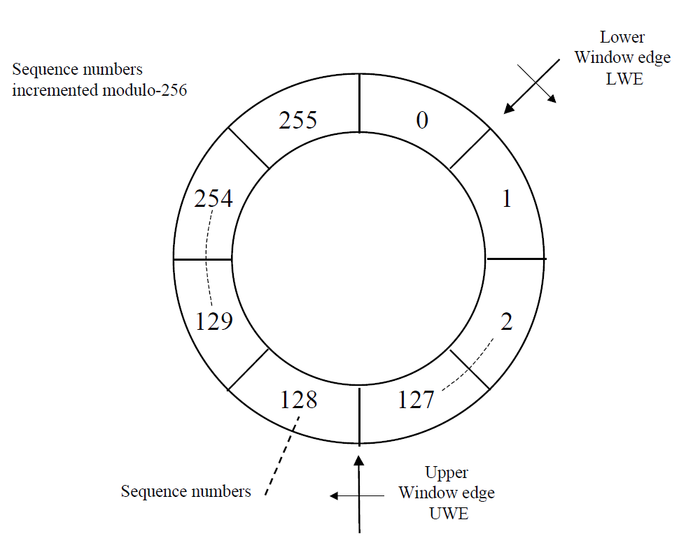

## 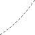Figure C-43. Sequence-number Space: Integers 0..255

> The Data Transfer Sublayer **shall** (1) satisfy the following requirements for D\_PDU flow control:

1.  Each node **shall** (2) maintain a transmit and a receive flow-control window buffer for each connection supported.

2.  The frame sequence numbers **shall** (3) be assigned uniquely and sequentially in an ascending modulo 256 order during the segmentation of the C\_PDU into D\_PDUs.

3.  The frame sequence numbers **shall** (4) not be released for reuse with another D\_PDU until the receiving node has acknowledged the D\_PDU to which the number is assigned.

4.  The transmit lower window edge (TX LWE) **shall** (5) indicate the lowest-numbered outstanding unacknowledged D\_PDU (lowest-numbered allowing for the modulo 256 operations).

5.  The transmit upper window edge (TX UWE) **shall** (6) be the number of the last new D\_PDU that was transmitted (highest D\_PDU number, allowing for the modulo 256 operation).

6.  The difference (as a modulo-256 arithmetic operator) between the TX UWE and TX LWE – 1 **shall** (7) be equal to the “current transmitter window size”.

7.  The “maximum window size” **shall** (8) equal 128.

8.  The “maximum allowable window size” may be a node-configurable parameter (this is recommended) and **shall** (9) not exceed the “maximum window size”.

9.  The “current transmitter window size” at any moment is variable as a function of the current TX UWE and TX LWE and **shall** (10) not exceed the “maximum allowable window size”.

> This allows for no more than 128 (“maximum window size”) outstanding unacknowledged D\_PDUs in any circumstance.

1.  If the “current transmitter window size” equals the “maximum allowable window size”, no additional new D\_PDUs **shall**(11) be transmitted until the TX LWE has been advanced and the newly computed difference (modulo 256) between the TX UWE and the TX LWE – 1 is less than the maximum allowable window size.

2.  The receive lower window edge (RX LWE) **shall** (12) indicate the oldest D\_PDU number that has not been received (lowest D\_PDU number, allowing for modulo 256 arithmetic operations).

3.  The receive lower window edge (RX LWE) **shall** (13) not be decreased when retransmitted D\_PDUs are received that are copies of D\_PDUs received previously.

4.  The receive upper window edge (RX UWE) **shall** (14) be the frame-sequence number of the last new D\_PDU received. \[Note: More explicitly, the RX UWE is the Frame Sequence Number of the received D\_PDU which is the greatest distance (modulo 256) from the RX LWE. The RX UWE increases monotonically as D\_PDUs with higher (mod 256) TX Frame Sequence Numbers are received; it does not move back when retransmitted D\_PDUs are received.\]

5.  D\_PDUs with TX FSN falling outside the maximum window size of 128 **shall** (14) not be accepted or acknowledged by the receiver node.

6.  If the value of the RX LWE field in any ACK Type 1 or DATA-ACK Type 2 D\_PDU is greater than the TX LWE, the Data Transfer Sublayer **shall** (16) declare all D\_PDUs with Frame Sequence Numbers between the TX LWE and the RX LWE value as acknowledged, and **shall** (17) advance the TX LWE by setting it equal to the value of the RX LWE.

7.  The initial condition of the window edge pointers (e.g., on the initialization of a new link)

> **shall** (18) be as follows:

-   TX LWE = 0

-   TX UWE = 255

-   RX LWE = 0

-   RX UWE = 255

> \[Note that, although the flow control limitations would allow as many as 128 D\_PDUs to be transmitted in one transmission, other protocol parameters will also effect this in an indirect way; the structure of the EOT parameter allows a maximum transmission interval of about 2 minutes. If a D\_PDU size of 200 bytes is used at 75 bps, only 5 D\_PDUs can be transmitted. However, even if a node receives no acknowledgements, it would be possible to transmit many more D\_PDUs before transmission would halt due to flow control restrictions.\]
>
> The nominal relationships between the ARQ Flow-Control variables specified above are shown in Figure C-44.
>
> 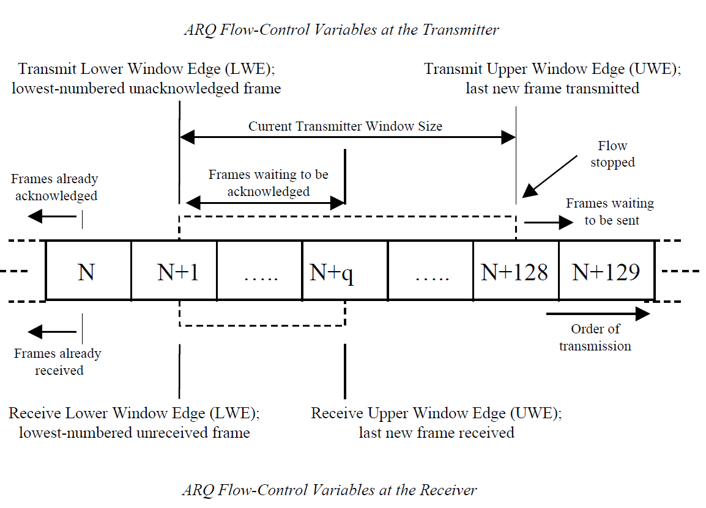

## Figure C-44. ARQ Flow Control Window Variables

1.  **Synchronisation of the ARQ Machine**

> Procedures for synchronizing the ARQ machine for a link are specified in the following paragraphs.

## Initial Synchronisation

> On starting an ARQ machine (i.e. establishing a link with a new node, or establishing a new link with a previously connected node ), the transmit and receive ARQ window-edge pointers **shall** (1) be set to the initial values (as defined in C.6.2).
>
> On an HF circuit, it may be desirable to revive a data state connection that has, for example, timed out partway through a file transmission due to a temporary worsening of the propagation conditions. In this case, the loss of data will be minimised if the ARQ machine associated with the connection is re-activated (i.e. the transmit and receive ARQ window-edge pointers are not re-initialised on re-establishing the link). However, this assumption may, for various reasons, *not* be valid (for example, because one of the nodes has experienced a power failure before re-activation) and so a synchronisation verification procedure **shall** (2) be executed whenever a link is re-established.

## Verification and Maintenance of Synchronisation

> The following synchronisation verification procedure **shall** (1) be used to verify on an *ongoing basis* if the peer ARQ processes are in synchronisation and, if required, to effect a reset or re-synchronisation of the peer ARQ window pointers.3

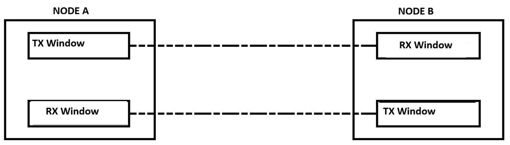

> This figure illustrates the fact that, at each end of the node, there is one transmit and one receive window. The dotted lines show which pairs of windows need to remain in synchronisation.

## Synchronisation Tests Performed at the Destination Node

> Synchronisation tests performed at the destination node make use of the TX lower window edge (LWE) and TX upper window edge (UWE) flags in conjunction with the TX FRAME SEQ \# contained in the header of DATA-ONLY and DATA-ACK frames. The appropriate flag is raised (value = 1) when the TX FRAME SEQ \# corresponds to the originating node’s transmit ARQ LWE or UWE pointers. The following tests **shall** (2) be used to detect *loss of synchronisation*.
>
> <u>Test 1 : Transmit Upper Window Edge</u>
>
> The purpose of this test is to ensure that the TX UWE of the originating node is within the valid range defined by the destination node window edge pointers. This test **shall** (3) be carried out whenever a D\_PDU is received with its TX UWE flag set. If the TX UWE passes this test then the two nodes are *in synchronisation*.

## Equation 1 :

> IN SYNC = (TX UWE &gt;= RX UWE) **AND** (TX UWE &lt;= MAX WIN SIZE –1 + RX LWE)
>
> If the peer ARQ machines are properly synchronised, the TX UWE cannot be less than the RX UWE (as this would indicate that a D\_PDU has been received which has not been transmitted). This condition is expressed by the first part of equation 1. It also cannot exceed the limits defined by the maximum window size of 128 and therefore cannot be greater than the
>
> {RX LWE + MAX WIN SIZE –1} (modulo 256) \[4\]. This condition is expressed by the second part
>
> 3 Verification of synchronisation on an ongoing basis and, if required, re-synchronisation is the responsibility of the Data Transfer Sublayer. However, under some circumstances a reset or re-synchronisation may be initiated by the Management Sublayer, e.g. following the (re)establishment of a link and as part of some link maintenance procedures.
>
> 4 All the synchronisation tests assume a fixed window size equivalent to the maximum window size of 128 frames. Although the STANAG permits the use of a variable transmit window size, this information is not transmitted over the air. The destination node therefore has no knowledge of the window size of the originating node and so cannot take it
>
> of equation 1. Equation 1 can therefore be used to establish whether the TX UWE is *in synchronisation* with the RX window edges and *loss of synchronisation* has occurred if this equation is not satisfied.
>
> The *in synchronisation* and *out of synchronisation* regions of the FSN circle described by equation 1 are illustrated graphically in Figure C-45.
>
> 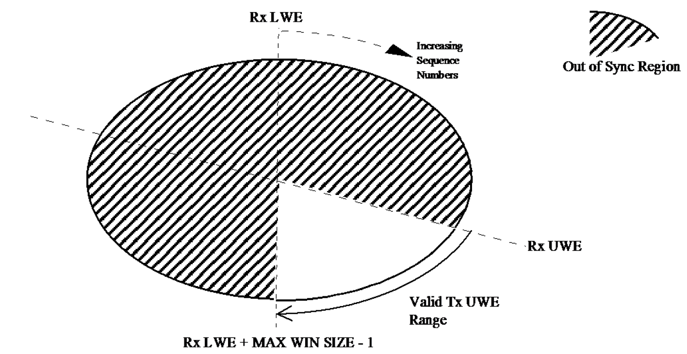

## Figure C-45. Showing IN-SYNC and OUT-OF-SYNC Regions of the FSN Circle (Equation 1)

> <u>Test 2 : Transmit Lower Window Edge</u>
>
> The purpose of this test is to ensure that the TX LWE of the originating node is within the valid range defined by the destination node window edge pointers. This test **shall** (4) be carried out whenever a D\_PDU is received with its TX LWE flag set. If the TX LWE passes this test then the two nodes are *in synchronisation*.

## Equation 2 :

> IN SYNC = (TX LWE &gt;= RX UWE – (MAX WIN SIZE –1)) **AND** (TX LWE &lt;= RX LWE)
>
> If the peer ARQ machines are properly synchronised, the TX LWE should not be outside the bounds defined by the maximum window size as seen from the perspective of the destination node. The TX LWE indicated by the incoming D\_PDU therefore cannot be less than the
>
> {RX UWE – (MAX WIN SIZE – 1)} (modulo 256). This condition is expressed by the first part of equation 2. The TX LWE also cannot be greater than the RX LWE (as this would indicate that the originating node has marked as acknowledged a frame that the destination node has not yet received). This condition is expressed by the second part of equation 2. Equation 2 can therefore be used to establish whether the TX LWE is *in synchronisation* with the RX window edges and l*oss of synchronisation* has occurred if this equation is not satisfied.
>
> The *in synchronisation* and *out of synchronisation* regions of the FSN circle described by equation 2 are illustrated graphically in Figure C-46.
>
> into account in the synchronisation tests. The tests should still be applied when the window size is varied but in this case some out-of-synchronisation conditions will not be detected.
>
> 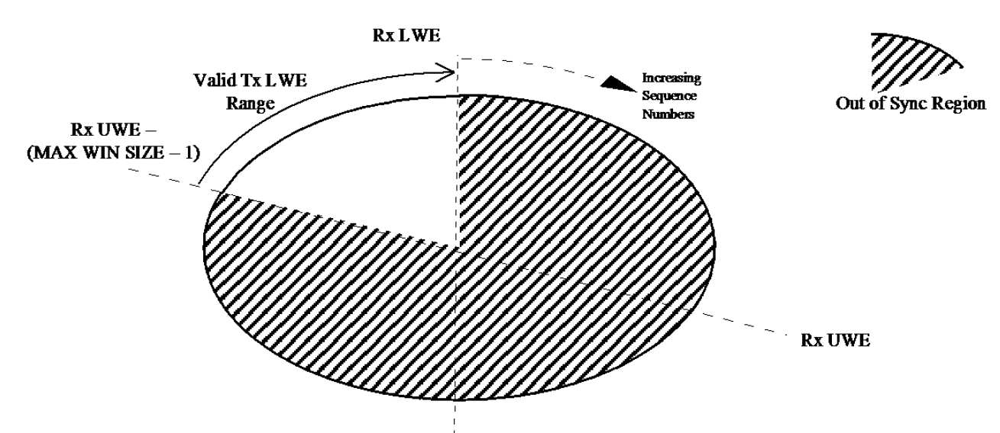

## Figure C-46. Showing IN-SYNC and OUT-OF-SYNC Regions of the FSN Circle (Equation 2)

> <u>Test 3 : All Received Frames</u>
>
> The purpose of this test is to ensure that the frame sequence number of a frame received from the originating node is within the valid range defined by the destination node window edge pointers.
>
> This test **shall** (5) be carried out on every DATA and DATA-ACK frame received. If the frame sequence number of the incoming frame passes this test then the two nodes are *in synchronisation*.

## Equation 3 :

> IN SYNC = (TX FSN &lt;= RX LWE + (MAX WIN SIZE – 1)) **AND**
>
> (TX FSN &gt;= RX UWE – (MAX WIN SIZE – 1))
>
> If either part of equation 3 is not true, then the frame sequence number falls outside the range defined by the maximum window size of 128 frames and *loss of synchronisation* between the two nodes has occurred.
>
> The *in synchronisation* and *out of synchronisation* regions defined by equation 3 are illustrated graphically in Figure C-47.

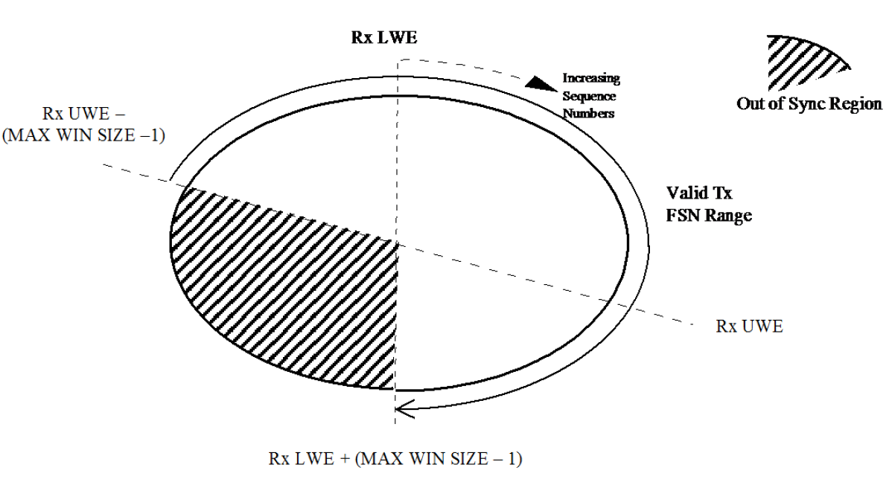

## Figure C-47. Showing IN-SYNC and OUT-OF-SYNC Regions of the FSN Circle (Equation 3)

1.  **Synchronisation Tests Performed at the Originating Node**

> The purpose of tests carried out at the originating node is to ensure that the frame sequence numbers of acknowledged frames are within the range defined by the transmit window edge pointers. These tests **shall** (6) be applied whenever a DATA-ACK or ACK-ONLY frame is received.
>
> <u>Test 4 : Receive Lower Window Edge</u>
>
> The value of the RX LWE is included in all DATA-ACK and ACK-ONLY frames. The following test is used to determine whether the RX LWE is within the range defined by the TX window edge pointers. If the RX LWE passes this test then the two nodes are *in synchronisation*.

## Equation 4 :

> IN SYNC = (RX LWE &gt;= TX LWE) **AND** (RX LWE &lt;= TX UWE +1)
>
> If equation 4 is not satisfied then *loss of synchronisation* has occurred.
>
> The *in synchronisation* and *out of synchronisation* regions defined by equation 4 are illustrated graphically in Figure C-48.
>
> 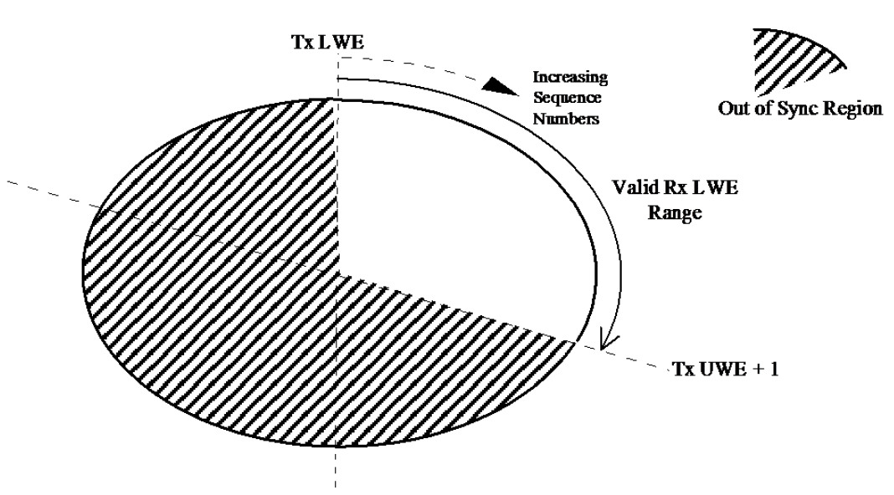

## Figure C-48. Showing IN-SYNC and OUT-OF-SYNC Regions of the FSN Circle (Equation 4)

> <u>Test 5 : Explicitly Acknowledged Frames</u>
>
> Individual frames may be acknowledged in a DATA-ACK or ACK-ONLY frame by setting bits in the selective ack header field. The frame sequence numbers (FSNs) corresponding to such bits must also fall within the range defined by the transmit window edges if the two nodes are in synchronisation. The following test **shall** (7) be used to determine whether acknowledged FSNs fall within the correct range.

## Equation 5 :

> IN SYNC = (Acknowledged FSN &gt; TX LWE) **AND** (Acknowledged FSN &lt;= TX UWE)
>
> If acknowledged FSNs do not satisfy the condition defined in equation 5 then *loss of synchronisation* has occurred.
>
> The *in synchronisation* and *out of synchronisation* regions of the frame sequence number circle of the originating node are illustrated graphically in Figure C-49.
>
> 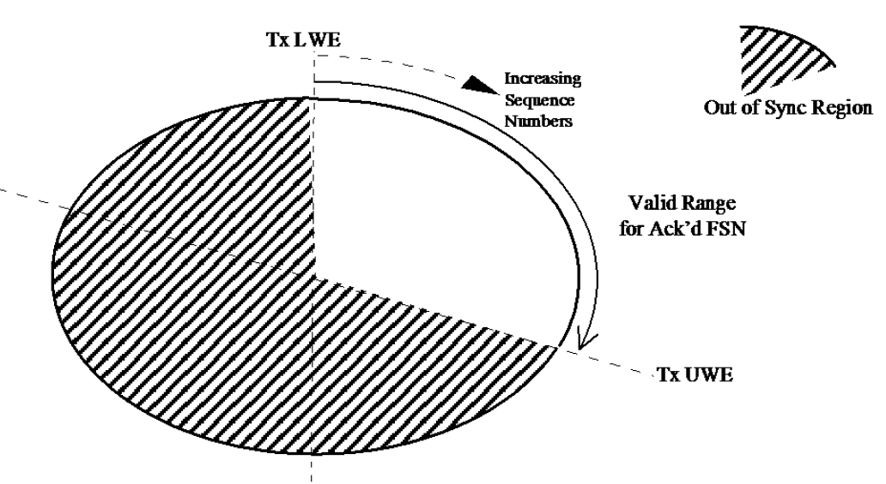

## Figure C-49. Showing IN-SYNC and OUT-OF-SYNC Regions of the FSN Circle (Equation 5)

1.  **Data Rate Control**

> Adaptive control of the transmission data-rate by the Data Transfer Sublayer is optional in STANAG 5066. Data Rate Control requires a modem-control interface (virtual or real) between the Data Transfer Sublayer and the attached modem through which changes in the modem data rate and other waveform parameters may be effected by the Data Transfer sublayer. In addition, the Data Transfer Sublayer should be capable of receiving modem-status reports over the modem-control interface. A minimum set of capabilities required and desirable of the modem-control interface are defined in Annex E for information for implementers of this STANAG.
>
> If Data Rate Control is implemented, it **shall** (1) be implemented as specified in the subsections below.
>
> Nodes that do not implement Data Rate Control **shall** (2) use the appropriate EOW and Management message types specified in Section 3.5 and the protocol defined below to signal this condition to other nodes.

## Initial (Default) Data Rate

> All connections on which the data rate or other modem parameters can be controlled **shall** (1) be initiated at 300 bps, using short interleaving. The waveform **shall** (2) be selected by the operator during node initialization.5

## Adaptive Data Rate Change Procedure

> The receiving node has available to it complete information on the signal it is receiving and is therefore best able to determine the optimum data rate at which data should be sent to it.
>
> The receiving node **may** use the EOW Type 1 message to advise the sending node of the optimum data rate, with the “Other parameters” field of the message set in accordance with Section C.5 to indicate that the message is for advisement, and not a request to change the data rate. The action and the final decision remain with the sending node. Mechanisms other than the Type 1 EOW (i.e., Data Rate Change) message **may** be used to arrive at a decision to change data rate; however, these other mechanisms are not defined here and will not be interoperable between vendors. Algorithms to determine when or if the data rate change capability would be exercised are beyond the scope of this STANAG. At a minimum, systems implementing STANAG 5066 **shall** (1) implement and support data rate changes in accordance with the procedures defined here.
>
> On receiving an EOW Type 1 Data Rate Change message with the “Other-parameters” field indicating that this is a request for a Data Rate Change, a node **shall** (2) comply with the parameters specified in the message unless some specific reason prevents it doing so. Generally this means that the node will initiate a data rate change (DRC) procedure.
>
> (Note: Reasons for failure to comply with the request include lack of remote modem control, or local conditions do not support a change if modem TX and RX data rate must be the same, and are specified for the EOW/Management messages in Section C.5).
>
> Following a decision to change data rate, a node **shall** (3) use TYPE 6 D\_PDUs (i.e., MANAGEMENT D\_PDUs) containing Type 1 and Type 2 EOW messages to implement and co-ordinate the change.
>
> The data-rate change procedure **shall** (4) be executed in the MANAGEMENT (CONNECTED) State in accordance with Section 6.1.
>
> If the waveform and modems used support automatic recognition of coding and interleaving parameters6 by the receiver, the data rate change procedures defined here may not be necessary. Following receipt of an EOW DRC advisory message, a system using such a waveform and modem can simply change the transmit data rate. Annex H provides more details on this subject as information for implementers.
>
> Data rate changes **shall** (5) be effective only for a single connection. If a node has a number of connections active with different nodes, the data rate change decisions and procedures **shall**(6) be executed independently for each connection.
>
> The node initiating the data rate change is referred to as the data rate change master (DRC master) for this DRC procedure. Figure C-50 shows a scenario of a successful DRC procedure. The numbers in brackets in the figure, i.e, message \[1\], are included for reference to the explanatory text.
>
> 5 If the waveform used supports automatic recognition of coding and interleaving parameters, defined initial settings are not necessary.
>
> 6 Examples of such waveforms include the waveforms defined in Annex G to this document, and the MIL-STD-188-110A single tone waveform.

## 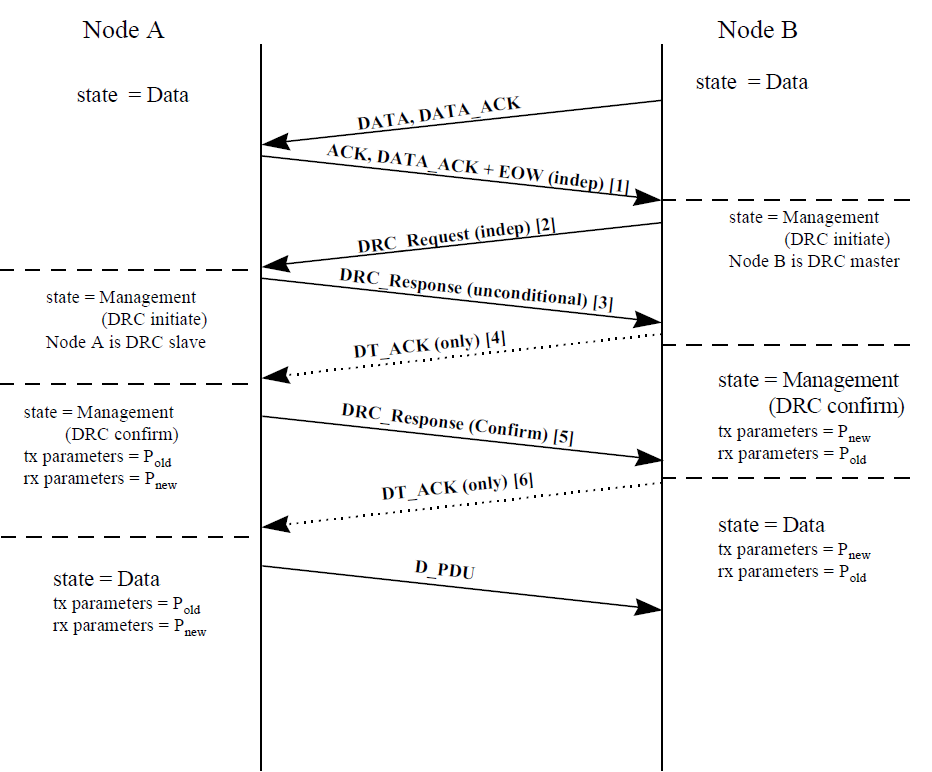

## Figure C-50. Data Rate Change Procedure (Scenario 1)

> The message numbered \[1\] in the figure indicates an EOW advisory message. The DRC master **shall** (7) send a DRC Request Message, i.e., a MANAGEMENT (TYPE 6) D\_PDU containing a DRC Request (Type 1) EOW Message \[2\], with the parameters equal to the intended new transmit data rate for the DRC master.
>
> The “Other Parameters” field of the Type 1 Management message **shall** (8) be set to indicate the data rate capabilities of the modem in use at the DRC master for this connection, and to indicate that this is a request for a change, and not an advisory message. In the scenario of Figure C-50, the modem at the DRC master has independent transmit and receive data rate.
>
> The only state transition allowed due to timeout during the Data-Rate-Change procedure **shall**(9) be to the IDLE(UNCONNECTED) state as specified in Section C.6.1, with a D\_CONNECTION\_LOST primitive sent to the Channel Access Sublayer.
>
> \[Note: The management message stop-and-wait protocol, with the repetitions required below, is extremely robust. If it is not possible to complete the procedure in the management state, it is unlikely that returning to another connected state will be productive.\]
>
> Timeouts **shall** (10) be set to allow a number of retransmissions before failure is declared and the D\_CONNECTION\_LOST primitive issued; the number of retransmissions before a timeout **shall**
>
> (11) be configurable in the implementation with a default value of 3.
>
> If this procedure was initiated in response to a DRC Request (Type 1) Advisory message, the modem data rate and interleaving parameters **shall** (12) be identical to the parameters in the EOW Type 1 DRC Advisory message, unless they specify a speed for which the DRC master is not equipped.
>
> D\_PDUs containing a DRC Request (Type 1) EOW message **should** be repeated depending on the data rate at which it is transmitted, as well as on the specific waveform and interleaver used. The number of DPDU transmissions **should** be specified to (nearly) fill the interleave buffer for the waveform in use.
>
> *\[N.B. Table C-26 from Edition 1, and the requirement for specific values for DRC Request repetitions, has been deleted in Amendment 1.\]*
>
> Repeated MANAGEMENT D\_PDUs containing a DRC Request (Type 1) Management message
>
> **shall**(15) have the same FRAME ID NUMBER in each of the copies.
>
> Valid EOT information **shall** (16) be supplied in each repeated D\_PDU containing a DRC Request (Type 1) Management message, updated as required to denote the end of transmission of all D\_PDU messages in the transmission interval (and not the end of the individual D\_PDU containing the EOT field).
>
> The same EOT value **shall** (17) not be transmitted in each repeated D\_PDU containing a DRC Request (Type 1) Management message unless necessary due to EOT resolution and round-up errors, i.e., because the D\_PDU duration is less than half the EOT resolution.
>
> A node (referred to as the DRC slave) that receives a MANAGEMENT D\_PDU addressed to it and containing a DRC\_Request Type 1 Management message **shall** (18) transition to the Management State as specified in Section C.6.1.
>
> The DRC slave **shall** (19) respond to the DRC\_Request D\_PDU with a DRC\_Response message, i.e., a TYPE 6 MANAGEMENT D\_PDU containing a Type 2 DRC Response EOW message, as follows:

-   The DRC Response message **shall** (20) indicate either “accept” or “refuse”, in accordance with the MANAGEMENT message specifications of Section 3.5, indicating the DRC Slave’s capability to change the modem parameters or not.

-   If the DRC slave accepts the DRC\_Request, the “reason” field **shall** (21) indicate either “unconditional acceptance” or “Tx and Rx parameters must be the same”.

-   If the DRC slave refuses the request, the reason field **shall** (22) indicate the reason for the refusal.

> \[Note: Only the reasons specified in the Section C.5.2 for the DRC Response message are valid reasons for refusing a DRC\_Request. The reasons that apply to modem capabilities imply that all attempts to change that modem parameter should stop (for the duration of the current link with the node that gives this reason for refusing a DRC).

-   The “Not consistent with local conditions” parameter **shall** (23) only be used to refuse a DRC\_Request which indicates a less robust mode (i.e., higher data rate or shorter interleaver) that cannot be supported with the node’s current local conditions for noise or error rate.

> \[Note: This response should only be used in the event that conditions have changed at the DRC slave between the time that the last EOW advisory message was sent and the DRC\_Request was received. Subsequent DRC procedures may be initiated after additional information on channel conditions is obtained and exchanged.\]
>
> \[Note: The DRC Slave’s response is shown as DRC\_Response \[3\] in the figure. The figure shows an example in which the modem at the DRC slave also has independent transmit and receive data rate. Multiple copies of this D\_PDU would be transmitted depending on the modem parameters in accordance with the specification; these repeated copies are not shown in the figure. *Reference to Table C-26 has been deleted* \]
>
> After receiving the DRC\_Response message the DRC master **shall** (24) review its contents and determine the appropriate response, e.g., the DT\_ACK(only) \[4\], in accordance with Table C-27, below.
>
> **Table C-27. DRC\_Responses and Allowed DRC Master Actions**

<table>
<colgroup>
<col style="width: 18%" />
<col style="width: 36%" />
<col style="width: 44%" />
</colgroup>
<thead>
<tr class="header">
<th><blockquote>

<em>DRC_Respon se</em>

</blockquote></th>
<th><blockquote>

<em>DRC_Response Reason</em>

</blockquote></th>
<th><blockquote>

<em>Action allowed by DRC master</em>

</blockquote></th>
</tr>
</thead>
<tbody>
<tr class="odd">
<td><blockquote>

accept

</blockquote></td>
<td><blockquote>

unconditional

</blockquote></td>
<td><ol type="a">
<li><blockquote>

Send DT_ACK

</blockquote></li>
</ol>
<blockquote>

[DT_ACK = TYPE 6 D_PDU w/ ACK field set]

</blockquote></td>
</tr>
<tr class="even">
<td><blockquote>

accept

</blockquote></td>
<td><blockquote>

transmit and receive parameters must be the same

</blockquote></td>
<td><ol type="a">
<li><blockquote>

Send DT_ACK , or

</blockquote></li>
<li>
Send DRC_Response (cancel), or
</li>
<li><blockquote>

Send new DRC Request note 1

</blockquote></li>
</ol></td>
</tr>
<tr class="odd">
<td><blockquote>

refuse

</blockquote></td>
<td><blockquote>

not possible to change modem data rate

</blockquote></td>
<td><ol type="a">
<li>
send DRC_Response (cancel)note 2, or
</li>
<li><blockquote>

send DRC_Request note 3

</blockquote></li>
</ol>
<blockquote>

(with DT_ACK)

</blockquote></td>
</tr>
<tr class="even">
<td><blockquote>

refuse

</blockquote></td>
<td><blockquote>

not possible to change modem interleave

</blockquote></td>
<td><ol type="a">
<li>
Send DRC_Response (cancel)note 2, or
</li>
<li><blockquote>

Send DRC_Request note 4

</blockquote></li>
</ol>
<blockquote>

(with DT_ACK)

</blockquote></td>
</tr>
<tr class="odd">
<td><blockquote>

refuse

</blockquote></td>
<td><blockquote>

not possible to change modem data rate or interleave

</blockquote></td>
<td><ol type="a">
<li><blockquote>

Send DRC_Response (cancel)note

</blockquote></li>
</ol>
<blockquote>

2

(with DT_ACK)

</blockquote></td>
</tr>
<tr class="even">
<td><blockquote>

refuse

</blockquote></td>
<td><blockquote>

not consistent with local conditions (note 5)

</blockquote></td>
<td><ol type="a">
<li>
Send DRC_Response (cancel)note 2, or
</li>
<li><blockquote>

Send DRC_Request note 6

</blockquote></li>
</ol>
<blockquote>

(with DT_ACK)

</blockquote></td>
</tr>
</tbody>
</table>

> Notes to Table C-27 and further DRC requirements are as follows:
>
> Note 1:If the procedure is initiated in response to EOW Type 1 message, the DRC master should already know that the DRC slave’s transmit and receive parameters must be the same. Therefore, the DRC master **shall** (25) reply with a DT\_ACK, i.e., a MANAGEMENT (TYPE 6) D\_PDU with the ACK field set equal to one, accepting that the new parameters will apply to both transmit and receive.
>
> Note 2:A DRC Slave that refused a change request **shall** (26) acknowledge the DRC Response (cancel) message with a DT\_ACK only and then terminate the DRC procedure.
>
> Note 3:If the DRC Slave refused the change request because it is not possible to change its modem data rate, a new DRC\_Request may be sent by the DRC Master to request a different interleave setting at the same data rate.
>
> Note 4:If the DRC Slave refused the change request because it is not possible to change its interleave setting, a new DRC\_Request may be sent by the DRC Master to request a different data rate setting at the same interleave setting.
>
> Note 5:As required by previous paragraphs, the DRC Slave may refuse the request with “Reason = not consistent with local conditions “ if an only if it is in response to a request for a less robust set of parameters. For example, a request for a higher data rate and/or shorter interleaver than currently in use would be rejected by the DRC Slave if it has determined that these cannot be supported by the current link conditions at the receiver.
>
> Note 6:If the nodes make use of the EOW Type 1 (Advisory) message to initiate the DRC procedure, the master **shall** (27) send the DRC\_Response (cancel), and await an updated EOW recommendation before initiating another DRC procedure. If EOW Type 1 messages are not used, DRC\_Request may be sent by master to request different modem parameters which may be consistent with the local conditions.
>
> In the table and notes in the preceding paragraphs, a DT\_ACK refers to a Data Transfer Sublayer acknowledgement of the preceding MANAGEMENT message (shown at \[4\] in Figure C-50). A DT\_ACK reply indicates that the node has nothing further to communicate with respect to the DRC procedure.
>
> If a DT\_ACK (with no further management message) is sent in reply to a DRC\_Response “accept” (as shown in Figure C-50), the nodes **shall** (28) change their respective modem parameters and proceed to the “confirmation” phase.
>
> The DRC slave **shall** (29) NOT change its modem parameters until it has received a DT\_ACK (with no further management message) from the DRC master.
>
> If a DT\_ACK (with no further management message) is sent by the DRC slave in reply to a DRC\_Response “cancel”, both nodes **shall** (30) abandon the procedure and return to the prior state without changing modem parameters.
>
> After abandoning a DRC procedure because of failure, if node A (formerly the DRC slave) has no queued data or acknowledgements to send to node B, it **shall** (31) send a data D\_PDU, expedited data D\_PDU, or non-ARQ D\_PDU, with zero data attached.
>
> \[Note: In the scenario given in Figure C-50, the slave’s DRC\_Response with an “accept/unconditional” message generates the allowed DT\_ACK from the DRC master. After sending the DT\_ACK \[4\], the master changes its modem parameters and waits to receive a DRC Confirm message (type 2 MANAGEMENT message with response set to “confirm” and reason set to “none”) from node A (“confirmation phase”). After receiving the DT\_ACK \[4\], the slave changes its modem parameters and transmits a DRC Confirm message \[5\] to the master.\]
>
> On receiving the DRC Confirm message, the DRC Master **shall** (32) respond with a DT\_ACK and then return to the processing state it was in before executing the DRC procedure.
>
> After sending the DRC Confirm message \[5\] to the master and receiving the DT\_ACK from the master, the slave **shall** (33) return to the processing state it was in before executing the DRC procedure and send any queued D\_PDUs to node B. If node A (formerly the DRC slave) has no queued data to send to node B, it **shall** (34) send a DATA\_ONLY D\_PDU, ACK\_ONLY D\_PDU, DATA\_ACK D\_PDU, EXPEDITED DATA-ONLY D\_PDU, EXPEDITED ACK-ONLY D\_PDU, NON-
>
> ARQ D\_PDU or EXPEDITED NON-ARQ D\_PDU with zero data attached, and the C\_PDU Segment Size field set equal to zero (0).

## Additional DRC Scenarios

> The following figures provide additional scenarios for the DRC procedure in different conditions, and are provided as implementation guidance only.
>
> Figure C-51 gives a scenario in which node B, due to HF modem limitations, must operate with the same HF modem transmit and receive parameters. The following numbered paragraphs correspond to the numbers in \[brackets\] in Figure C-51.

1.  In this transmission, the advisory message sent by A carries the recommended Tx speed for B (You should Tx at x bps) and also tells B about the capabilities of A’s modem (that A’s modem can operate at independent Tx and Rx data rates.

2.  The DRC\_Request message from B carries the requested new modem parameters for B: “I

> \(B\) will transmit at x bps with y interleaving”; these parameters will be as recommended by A, in accordance with Section C.6.4.2. The message also tells A about the capabilities of B’s modem, in this case, if I change my Tx parameters (and your Rx parameters), I will have to change my Rx parameters (and your Tx parameters) as well.)

1.  DRC\_Response message accepts the requested change.

2.  The DT\_ACK confirms that B received the prior message and triggers B to change its parameters.

3.  This DRC\_Response (confirm) is a confirmation that the link is up at the new parameters.

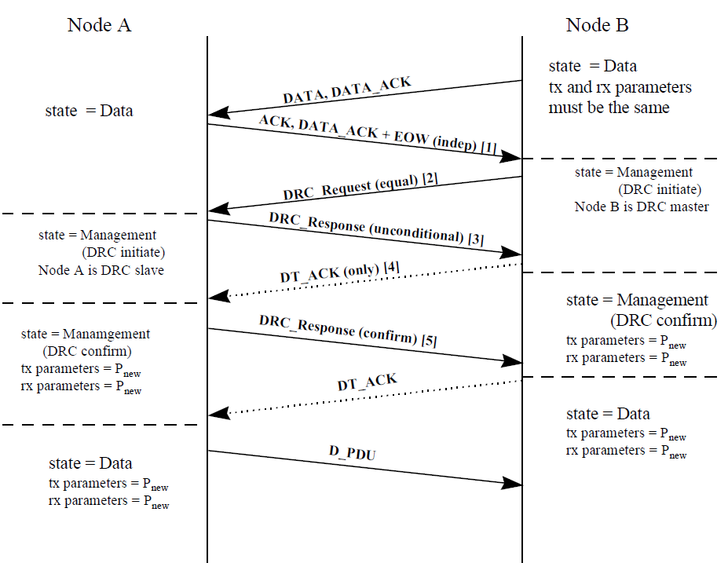

Figure C-51. Data Rate Change Procedure (Scenario 2)

> Figure C-52 shows a scenario in which the procedure is refused by the slave, and hence cancelled by the DRC master. In this example, node B has a modem which must have the same transmit and receive parameters. The requested new parameters would then apply to the transmit and receive parameters at both nodes. The following numbered paragraphs correspond to the numbers in \[brackets\] in Figure C-50.

1.  In this transmission, the EOW Type 1 advisory message sent by A carries the recommended Tx speed for B (You should Tx at x bps) and also tells B about the capabilities of A’s modem (that A’s modem can operate at independent Tx and Rx data rates.

2.  The DRC\_Request message from B carries the requested new modem parameters for B: “I

> \(B\) will transmit at x bps with y interleaving”; these parameters will be as recommended by A in accordance with Section C.6.4.2. The message also tells A about the capabilities of B’s modem, in this case, if I change my Tx parameters (and your Rx parameters), I will have to change my Rx parameters (and your Tx parameters) as well. The net result is that both nodes have the same Rx and Tx parameters.

1.  DRC\_Response message refuses the requested change; a likely reason would be that the local conditions at node A do not support use of the proposed parameters.

2.  The DRC master responds by cancelling the procedure.

3.  The DT\_ACK confirms that B received the prior message and terminates the procedure.

## 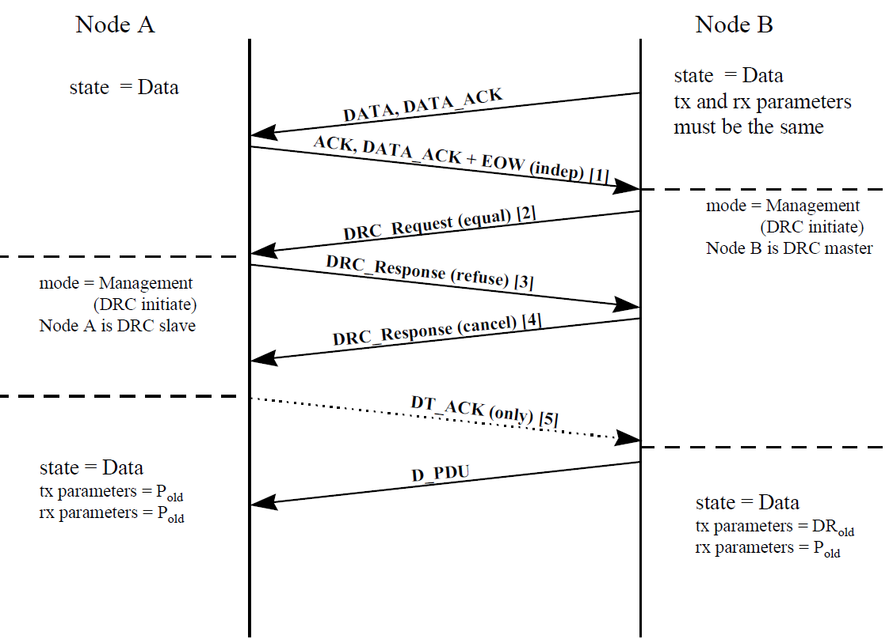

## 

## Figure C-52. Data Rate Change Procedure (Scenario 3)

1.  **Procedure for use of Type 3 RESET/WIN RESYNC D\_PDU**

> The Type 3 RESET/WIN RESYNC D\_PDU, specified in Section C.3.6, supports a number of different resynchronization functions. The procedure for the FULL RESET function is specified in this section.
>
> A FULL RESET procedure **shall** (1) initiated by a node sending a Type 3 RESET/WIN RESYNC D\_PDU with field values as follows:

-   The FULL RESET CMD flag **shall** (2) be set to 1;

-   The RESET FRAME ID NUMBER **shall** (3) be selected from RESET FRAME ID NUMBER sequence;

-   The NEW RECEIVE LWE field **shall** (3) be reset to zero;

-   The RESET TX WIN RQST flag **shall** (4) be reset to zero;

-   The RESET RX WIN CMD flag **shall** (5) be reset to zero.

> The Type 3 D\_PDU described immediately above is defined to be a FULL RESET CMD D\_PDU. A node receiving a FULL RESET CMD D\_PDU **shall** (6) proceed as follows:

-   The node **shall** (7) set the transmit and receive window pointers to initial values (as defined in Section C.6.2);

-   The node **shall** (8) discard from its transmit queue any partially completed C\_PDUs;

-   The node **shall** (9) flush its receive buffers;

-   The node **shall** (10) respond to the originator of the FULL-RESET-CMD D\_PDU by sending it a RESET/WIN RESYNC (Type 3) D\_PDU with field values set as follows:

    -   The RESET ACK flag **shall** (11) be set to 1;

    -   The NEW RECEIVE LWE and RESET FRAME ID NUMBER fields **shall**(12) be reset to zero;

    -   The RESET TX WIN RQST, FULL RESET CMD and RESET RX WIN CMD flags

> **shall** (13) be reset to zero.
>
> The D\_PDU described immediately above is defined to be a FULL-RESET-ACK D\_PDU. The FULL RESET ACK D\_PDU **shall** (14) be sent only in response to the FULL RESET CMD D\_PDU.
>
> On receiving the FULL-RESET-ACK D\_PDU, the node initiating the FULL RESET procedure **shall**
>
> (15) proceed as follows:

-   The node **shall** (16) set the transmit and receive window pointers to initial values (as defined in C.6.2)

-   The node **shall** (17) discard from its transmit queue any partially completed C\_PDUs

-   The node **shall** (18) flush its receive buffers This concludes the FULL RESET procedure.
