> \[N.B. This Amendment replaces Annex F Edition 1 in its entirety.\]
>
> This Annex specifies client interactions with the HF subnetwork defined in Annexes A, B, C, and D for a set of clients types (i.e., subnetwork clients) to which the HF subnetwork provides data transport service.
>
> Requirements for these client types are specified and cross-referenced in this Annex in order to provide end-to-end interoperability in an HF data communications subnetwork. Cross-references to other standards documents for client-requirement definition are made to the maximum extent possible.

# STANDARDIZED CLIENT REQUIREMENTS

> This annex is a minimum requirement. Unless otherwise noted, compliance with this annex does not prohibit the definition of additional client types or protocols that are not defined herein.
>
> Implementations of clients other than those defined herein **shall not** make assignments of Service Access Point Identifiers (SAP\_IDs) or Application Identifiers (APP\_IDs) in conflict with the requirements of this document. The SAP IDs and APP\_IDs provide the mechanism through which end-systems clients may share and attach to an HF subnetwork without conflict.

## Client Implementation for Protocol Conformance

> Implementations of STANAG 5066 **shall** provide the MANDATORY interface types and clients noted in the Protocol Implementation Conformance column of Table F-1.
>
> This annex standardizes the physical implementation of a Raw Subnetwork Interface Sublayer (SIS) Socket interface. Implementations of STANAG 5066 **shall** provide a TCP/IP socket-server interface as the physical channel for connecting a client to the HF subnetwork, in accordance with the requirements for the Raw SIS Socket interface defined elsewhere in this Annex.
>
> Another mandatory client provides an IP interface to the HF subnetwork, and transport of IP datagrams over the HF subnetwork.
>
> Implementation and performance requirements for these mandatory client interfaces are found elsewhere in this Annex in the sections cross-referenced by Table F-1.
>
> Implementations of STANAG 5066 additionally **may** provide any of the OPTIONAL client types noted in the Protocol Implementation Conformance column of Table F-1. If provided, however, optional clients **shall** conform to the requirements noted and cross-referenced herein to ensure end-to-end interoperability in the HF data communications profile.
>
> Table F-1: SAP ID Assignments

<table>
<colgroup>
<col style="width: 53%" />
<col style="width: 8%" />
<col style="width: 18%" />
<col style="width: 18%" />
</colgroup>
<thead>
<tr class="header">
<th><blockquote>

<strong>Client / Application Type</strong>

</blockquote></th>
<th><blockquote>

<strong>SAP ID</strong>

</blockquote></th>
<th><blockquote>

<strong>Protocol Implementation Conformance</strong>

</blockquote></th>
<th><blockquote>

<strong>Client Requirements</strong>

<strong>Defined in Annex</strong>

</blockquote></th>
</tr>
</thead>
<tbody>
<tr class="odd">
<td><blockquote>

<em><strong>Raw SIS Socket Server</strong></em>

</blockquote></td>
<td><blockquote>

<strong>all</strong>

</blockquote></td>
<td><blockquote>

<strong>MANDATORY</strong>

</blockquote></td>
<td><blockquote>

<strong>F.16</strong>

</blockquote></td>
</tr>
<tr class="even">
<td><blockquote>

Subnet management client

</blockquote></td>
<td><blockquote>

0

</blockquote></td>
<td><blockquote>

OPTIONAL

</blockquote></td>
<td><blockquote>

F.2

</blockquote></td>
</tr>
<tr class="odd">
<td><blockquote>

Character-Oriented Serial Stream (COSS) Client

</blockquote></td>
<td><blockquote>

1

</blockquote></td>
<td><blockquote>

OPTIONAL

</blockquote></td>
<td><blockquote>

F.3

</blockquote></td>
</tr>
<tr class="even">
<td><blockquote>

STANAG 4406 Annex E - Tactical Military Message Handling (T-MMHS) Client

</blockquote></td>
<td><blockquote>

2

</blockquote></td>
<td><blockquote>

OPTIONAL

</blockquote></td>
<td><blockquote>

F.4

</blockquote></td>
</tr>
<tr class="odd">
<td><blockquote>

HMTP (HF Mail Transfer Protocol)

</blockquote></td>
<td><blockquote>

3

</blockquote></td>
<td><blockquote>

OPTIONAL

</blockquote></td>
<td><blockquote>

F.5

</blockquote></td>
</tr>
<tr class="even">
<td><blockquote>

HFPOP (HF Post-Office Protocol)

</blockquote></td>
<td><blockquote>

4

</blockquote></td>
<td><blockquote>

OPTIONAL

</blockquote></td>
<td><blockquote>

F.6

</blockquote></td>
</tr>
<tr class="odd">
<td><blockquote>

Operator orderwire (HFCHAT)

</blockquote></td>
<td><blockquote>

5

</blockquote></td>
<td><blockquote>

OPTIONAL

</blockquote></td>
<td><blockquote>

F.7

</blockquote></td>
</tr>
<tr class="even">
<td><blockquote>

Reliable Connection-Oriented Protocol (RCOP) *

w/ Extended Client

</blockquote></td>
<td><blockquote>

6

</blockquote></td>
<td><blockquote>

OPTIONAL

</blockquote></td>
<td><blockquote>

F.8*

</blockquote></td>
</tr>
<tr class="odd">
<td><blockquote>

Unreliable Datagram Oriented Protocol (UDOP) *

w/ Extended Client

</blockquote></td>
<td><blockquote>

7

</blockquote></td>
<td><blockquote>

OPTIONAL

</blockquote></td>
<td><blockquote>

F.9*

</blockquote></td>
</tr>
<tr class="even">
<td><blockquote>

ETHER client

</blockquote></td>
<td><blockquote>

8

</blockquote></td>
<td><blockquote>

OPTIONAL

</blockquote></td>
<td><blockquote>

F.11

</blockquote></td>
</tr>
<tr class="odd">
<td><blockquote>

<strong>IP client</strong>

</blockquote></td>
<td><blockquote>

<strong>9</strong>

</blockquote></td>
<td><blockquote>

<strong>MANDATORY</strong>

</blockquote></td>
<td><blockquote>

<strong>F.12</strong>

</blockquote></td>
</tr>
<tr class="even">
<td><blockquote>

RESERVED - for future assignment

</blockquote></td>
<td><blockquote>

10-11

</blockquote></td>
<td><blockquote>

OPTIONAL

</blockquote></td>
<td><blockquote>

F.13

</blockquote></td>
</tr>
<tr class="odd">
<td><blockquote>

Compressed File Transport Protocol (CFTP)

</blockquote></td>
<td><blockquote>

12

</blockquote></td>
<td><blockquote>

OPTIONAL

</blockquote></td>
<td><blockquote>

F.14

</blockquote></td>
</tr>
<tr class="even">
<td><blockquote>

UNASSIGNED – available for arbitrary use

</blockquote></td>
<td><blockquote>

13-15

</blockquote></td>
<td><blockquote>

OPTIONAL

</blockquote></td>
<td><blockquote>

F.15

</blockquote></td>
</tr>
</tbody>
</table>

> \* NB: Other standardized clients and protocols will bind to the STANAG 5066 subnetwork using the RCOP or UDOP protocols and uniquely assigned Application Identifiers defined in Annex F.10

## Standardized Assignment of Service Access Point Identifiers

> Service Access Point Identifiers for all clients applications **shall** be assigned in accordance with Table F-1.
>
> <u>Implementation of client types or protocols that are not in Table F-1</u> **shall not** make use of field values for Service Access Point Identifiers identified in this Annex.
>
> As noted in Table F-1, other OPTIONAL clients that have not been assigned a SAP ID of their own **shall** bind to the STANAG 5066 subnetwork as an Extended Client type using the RCOP or UDOP protocols <u>and</u> uniquely assigned Application Identifiers defined in Annex F.10.
>
> Client standards and application identifiers for RCOP/UDOP defined in this Edition are cross-referenced in Table F-2. Additional clients **may** be added in future.
>
> Table F-2 Current RCOP/UDOP-based extended client specifications for use with the HF Subnetwork.

<table>
<colgroup>
<col style="width: 35%" />
<col style="width: 19%" />
<col style="width: 21%" />
<col style="width: 23%" />
</colgroup>
<thead>
<tr class="header">
<th><blockquote>

<strong>Client Name</strong>

</blockquote></th>
<th><blockquote>

<strong>Client Protocol Stack</strong>

</blockquote></th>
<th><blockquote>

<strong>Applicable Specifications</strong>

</blockquote></th>
<th><blockquote>

<strong>S'5066</strong>

<strong>Implementation Conformance</strong>

</blockquote></th>
</tr>
</thead>
<tbody>
<tr class="odd">
<td><blockquote>

Tactical Military Message Handling System (T-MMHS)

</blockquote></td>
<td><blockquote>

T-MMHS + RCOP/UDOP

</blockquote></td>
<td><blockquote>

S'4406 Annex E, S'5066 Annexes F.4, F.8, F.9,

F.10

</blockquote></td>
<td><blockquote>

OPTIONAL

</blockquote></td>
</tr>
<tr class="even">
<td><blockquote>

Basic File Transfer Protocol (BFTP)

</blockquote></td>
<td><blockquote>

BFTP + RCOP/UDOP

</blockquote></td>
<td><blockquote>

S'5066 Annexes F.8, F.9, F.10

</blockquote></td>
<td><blockquote>

OPTIONAL

</blockquote></td>
</tr>
<tr class="odd">
<td><blockquote>

File-Receipt Acknowledgement Protocol (FRAP)

</blockquote></td>
<td><blockquote>

FRAP + RCOP

</blockquote></td>
<td><blockquote>

S'5066 Annexes F.8, F.10

</blockquote></td>
<td><blockquote>

OPTIONAL

</blockquote></td>
</tr>
</tbody>
</table>

## Summary of Data Multiplexing Options within STANAG 5066

> The standardization of client types, SAP IDs, Application IDs, and the mandatory provision of an Internetwork Protocol (IP) client provides a variety of options for multiplexing traffic through the STANAG 5066 protocol stack. Multiplexing options are summarized below:

1.  By SAP\_ID - 'Base Clients' have their own uniquely assigned Service Access Point Identifier (SAP ID) and traffic flows are based uniquely on the SAP ID;

2.  By SAP\_ID, IP Address and Socket Number - 'IP clients' attach at a defined SAP ID, and their traffic traffic flows are further based on the socket numbers and IP addresses of the source and destination;

3.  By SAP\_ID and APP\_ID - 'Extended Clients' attach as either a RDOP or UDOP base client, and their traffic flows are further distinguished by their assigned Application Identifier (APP\_ID).

> The client and interface types are shown in F-1. There is no requirement, or expectation, that a STANAG 5066 implementation would provide all of these interfaces or clients. These multiplexing mechanisms have been defined to enable support for a broad base and diversity of client types in future while minimising conflict in their use of the protocol stack in actual operations.
>
> 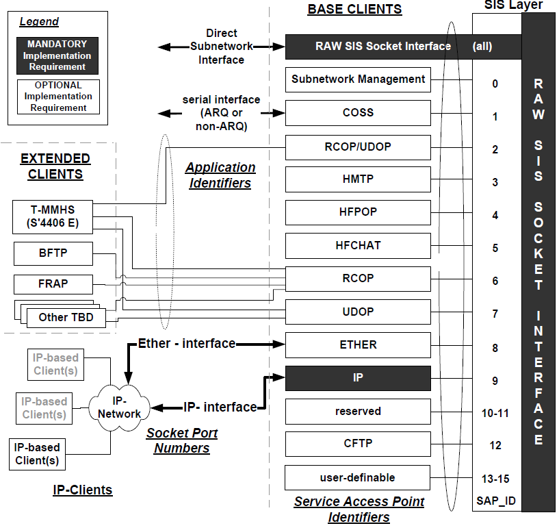

**Figure F-1 - Client / Interface types and their attachment points to STANAG 5066 Subnetwork.**

# SUBNET MANAGEMENT CLIENT/SERVER

> This section defines minimal requirements for control of the local node using the S\_MANAGEMENT\_MSG\_REQUEST, S\_MANAGEMENT\_MSG\_INDICATION, and
>
> S\_SUBNET\_AVAILABILITY primitives, and for coordination with distant subnet management clients or agents using the S\_UNIDATA primitives.
>
> Subnetwork management clients **shall** attach to the subnetwork using SAP ID 0. If the client is entitled to submit commands that will change the configuration of the node or subnetwork, the rank of the client **must** be 15.
>
> The nature and specification of peer-to-peer level communication between Subnetwork Management Clients is beyond the scope of this STANAG. Implementations **should** use existing standards for network management such as the Simple Network Management Protocol (SNMP), with peer-to-peer communication through the HF subnetwork via the IP client defined herein.
>
> The management information base (MIB) for STANAG 5066 is currently undefined.

# CHARACTER-ORIENTED SERIAL STREAM (COSS) CLIENT

> This section defines a character-oriented serial-transport service for the HF subnetwork. Reliable or unreliable modes of operation can be specified through appropriate selection of the service requirements for the client.
>
> The character-oriented serial stream (COSS) service **may** be used in place of other HF serial transport services, for example a simple modem. When high reliability and end-to-end assurance of data delivery is required, the COSS client **may** use the STANAG 5066 ARQ mode to provide higher data reliability than simple transmission over a conventional modem might afford. When multicast address modes are required, or when data reliability is not, the COSS client **may** use the STANAG 5066 non-ARQ modes. Detailed service requirement specifications are provided at section F.3.3.
>
> The interfaces for the Character-Oriented Serial Stream (COSS) Client are as shown in the Figure below.
>
> 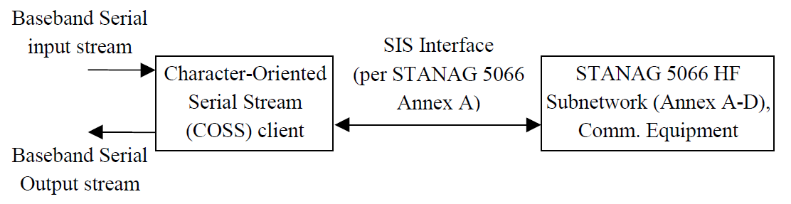
>
> Figure F-2 - COSS Client Interfaces
>
> Requirements for the COSS client are placed on its baseband serial interface, its interface to the HF Subnetwork Interface Sublayer (SIS), and its internal processing. Implementations of the STANAG 5066 **shall**(1) provide a COSS client with a baseband serial interface, and implementations **shall**(2) be in accordance with the requirements stated herein.

## Base-band Serial Interface

> The COSS client **shall** provide a baseband serial interface meeting the following requirements.

1.  *<u>Physical/Electrical</u>*: one of following physical interfaces **shall** be provided:

    1.  Signalling and connector conforming to EIA/RS-232, EIA//RS-530, configured as Data Communications Equipment (DCE);

    2.  Signalling and connector conforming to V.35 DCE.

2.  *<u>Serial Transmission Mode</u>*: all of the following transmission modes **shall** be supported (as configuration options):

    1.  Asynchronous: 1 Start Character, selectable 5, 6, 7, or 8 data bits, and 1 or 2 stop bits.

    2.  Synchronous: provide/accept clock at 1x Data Rate (other rate-multipliers **may** be supported);

> HDLC line control protocol (other synchronous line protocols **may** be supported in addition to HDLC)

1.  *<u>Flow-Control</u>*: all of the following flow-control disciplines **shall** be supported (as configuration options):

    1.  RTS/CTS, DTR/DTS hardware handshaking;

    2.  XON/XOFF software flow-control;

    3.  None.

## Character Sets Supported by COSS

> The character sets shown in the Table below **shall** be supported by a COSS client:
>
> Table F-3: Character Sets Supported by COSS

<table>
<colgroup>
<col style="width: 31%" />
<col style="width: 68%" />
</colgroup>
<thead>
<tr class="header">
<th><blockquote>

Character Set

</blockquote></th>
<th><blockquote>

Comments

</blockquote></th>
</tr>
</thead>
<tbody>
<tr class="odd">
<td><blockquote>

ITA-2 / Baudot

</blockquote></td>
<td><blockquote>

5-bit character sets:

w/ asynchronous protocol = ITA-2; w/ synchronous protocol = Baudot

</blockquote></td>
</tr>
<tr class="even">
<td><blockquote>

6-bit codes

</blockquote></td>
<td><blockquote>

6-bit character codes

</blockquote></td>
</tr>
<tr class="odd">
<td><blockquote>

ITA-5 / ASCII

</blockquote></td>
<td><blockquote>

~ASCII - 7-bit character set [NB: the 7.0-unit 64-ary ITA-2 code defined in STANAG 5030 is encoded in this form, in accordance with section F.3.4.4.1]

</blockquote></td>
</tr>
<tr class="even">
<td><blockquote>

Octet data

</blockquote></td>
<td><blockquote>

Any data presented in arbitrary 8-bit formats

</blockquote></td>
</tr>
</tbody>
</table>

## Subnetwork Service Requirements for COSS

> COSS clients **shall** bind to the HF Subnetwork at SAP ID 1.
>
> Client rank and priority are configuration-dependent and implementation-dependent parameters for this application. COSS clients **should not** bind using a Rank = 15.
>
> A COSS client **shall** submit its PDUs to the HF subnetwork using the S\_UNIDATA\_REQUEST Primitives defined in Annex A of this STANAG.
>
> The address in the primitive **shall** be a STANAG 5066 address corresponding to the HF subnetwork address of the host at which the destination COSS client(s) is/are located. For a COSS client using ARQ service modes, this address **shall** be a unicast (point-to-point) address. For non-ARQ service modes, the COSS client **may** specify either a unicast or a multicast (point-to-multipoint) STANAG 5066 address. \[NB: COSS clients using non-ARQ services could use multicast addresses for tailored stream-broadcast applications.\]
>
> Specification of the STANAG 5066 destination address for the character stream is outside of the scope of this STANAG. Manual and dynamic modes could be foreseen.
>
> \[NB: Manual address configuration requires that an operator establish the destination address for the serial stream data in conformance with a standard operating procedure. This method provides data transparency. It is expected to be the most frequently used approach.
>
> Dynamic address configuration presumes a separate process that scans the serial character stream to extract destination addresses, in some format, from the character stream and then map these addresses into a valid STANAG 5066 address. This method is not transparent to the character stream (it assumes a well-defined format for the addresses embedded in the character stream). Dynamic addressing could however be used with certain well-defined applications and character streams however, e.g., in the transmission of ACP-127 formatted messages.\]
>
> Selection of further service requirements for the S\_PRIMITIVE will be a function of STANAG 5066 address-type and the level of link reliability required.

1.  *Service Requirements for Reliable Serial-Stream Transmission and Point-to-Point Addressing*

> The default service requirements defined when the client binds to the subnetwork **shall** be as follows:

1.  Transmission Mode = ARQ

2.  Delivery Confirmation = NONE

3.  Deliver in Order = IN-ORDER DELIVERY

    1.  *Service Requirements for Non-ARQ Transmission or Point-to-Multi-Point Addressing*

> The default service requirements defined when the client binds to the subnetwork **shall** be as follows:

1.  Transmission Mode = non-ARQ

2.  Delivery Confirmation = NONE

3.  Deliver in Order = IN-ORDER DELIVERY

## Data Encapsulation Requirements

> The characters from the character stream **shall** be encapsulated within S\_PRIMITIVEs using any one of the modes described herein. Implementation of all modes is **mandatory** for a COSS client.
>
> Selection of any given mode for operation **shall** be a configuration parameter in a COSS client, and dependent on the character-set for which the COSS client is configured.
>
> Selection of any given mode **must** be coordinated at the sending and receiving node for use on a given link, through either standard operating procedure or out-of-band coordination channel.

1.  *Encapsulation of Arbitrary Octet Data*

> Octet data in any arbitrary format for the COSS client **shall** be byte-aligned with the octets in each U\_PDU encapsulated in the S\_UNIDATA\_PRIMITIVE.
>
> The least-significant bit (LSB) of each character received on the serial interface **shall** be aligned with the LSB of the octet.

1.  *Encapsulation of ITA-5*

> Characters in ITA-5 format (or other 7-bit character format such as ASCII) for the COSS client **shall** be aligned with the octets in each U\_PDU encapsulated in the S\_Primitive, one character per octet, as follows.
>
> 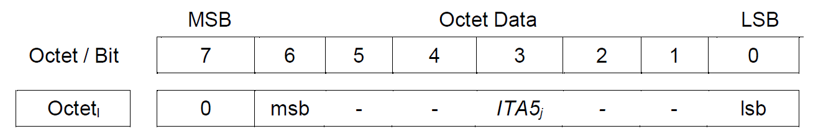
>
> The least-significant bit (LSB) of each 7-bit character received on the serial interface **shall** be aligned with the LSB of the octet.
>
> The value of the MSB bit of each octet **shall** be set to zero for ITA5 Encapsulation.

1.  *Encapsulation of ITA-2*

> Two methods of encapsulation of ITA-2 characters are defined:

1.  'Loose-Pack ITA2 Encapsulation' (LPI2E), and

2.  'Dense- Pack ITA2 Encapsulation' (DPI2E).

> A COSS client **shall** implement both methods of ITA2 encapsulation.
>
> Selection of either method **must** be coordinated by sending and receiving node for use on a given link, through either standard operating procedure or out-of-band coordination channel.

1.  'Loose-Pack Encapsulation of ITA-2 characters

> The Loose-Pack' ITA-2 Encapsulation (LPI2E) algorithm **may** be used for any character set represented as 5-bit symbols. It transports one 5-bit symbol in each octet within the U\_PDU field of S\_primitives, using the basic packing arrangement defined in the Figure below.
>
> 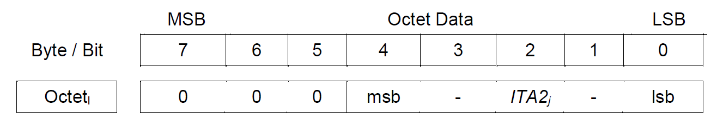
>
> Figure F-3 - Loose-Pack Encapsulation of ITA-2 Characters
>
> The least-significant bit (LSB) of each 5-bit character received on the serial interface **shall** be aligned with the LSB of the octet.
>
> The value of the three most-significant bits of each octet **shall** be set to zero for LPI2E.

1.  'Dense-Pack' Encapsulation of ITA-2 characters

> The 'Dense-Pack' ITA-2 Encapsulation (DPI2E) algorithm **may** be used for any character set represented as 5-bit symbols. It efficiently transports three 5-bit symbols in a pair of octets, called an Encapsulation Pair, within the U\_PDU field of S\_primitives, using the basic packing arrangement defined in the Figure below.
>
> 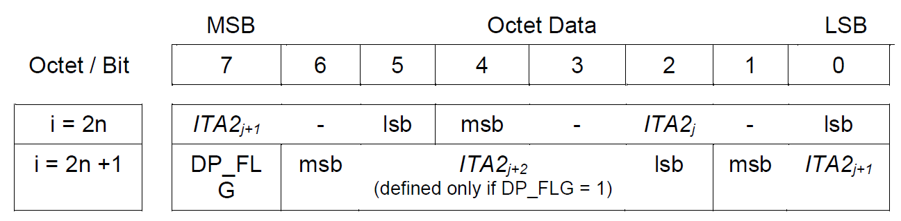
>
> Figure F-4 : Nominal Dense-Pack ITA-2 Encapsulation Pair

1.  *Encapsulation Pairs*

> The first octet of an Encapsulation Pair **shall** be an even-numbered octet in an S\_Primitive's U\_PDU field (i.e., i = {0,2,4,6, …} , with i = 0 the first octet in the U\_PDU ).
>
> The second octet of an Encapsulation Pair **shall** be an odd-numbered octet in an S\_Primitive's U\_PDU field (i.e., i = {1,3,5,7, …} , with i = 0 the first octet in the U\_PDU).
>
> The MSB of the second octet of an Encapsulation Pair **shall**(1) be the DP\_FLG ('dense-pack flag') that indicates whether the Encapsulation Pair contains three ITA-2 characters (DP\_FLG = 1) or two ITA-2 characters (DP\_FLG = 0). Encoding of these cases **shall**(2) be performed as follows:

-   The first case is defined to be a "Three-into-Two Encapsulation Pair", which **shall** be encoded in accordance with this figure

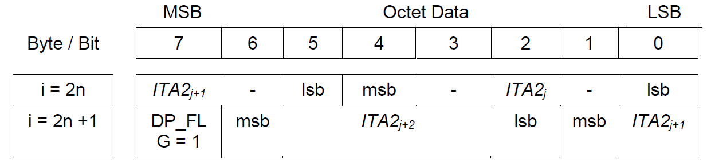

Figure F-5 : Three-Into-Two Encapsulation Pair

-   the second case is defined to be a "Two-into-Two Encapsulation Pair", which **shall** be encoded in accordance with this figure:

> 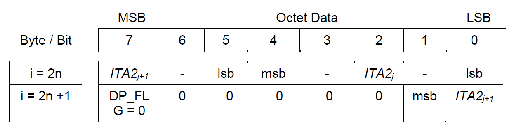
>
> Figure F-6 : Two-Into-Two Encapsulation Pair

1.  *Maintaining Character-Count Integrity with DPI2E*

> The 'Dense-Pack' ITA-2 Encapsulation (DPI2E) algorithm **shall not** add or delete ITA-2 characters from the character stream being transported. This property is denoted character-count integrity.
>
> To maintain character-count integrity, the DPI2E algorithm **shall** depend on the number of characters that remain after all initial characters have been encapsulated as 3-into-2 Encapsulation Pairs.
>
> For a buffer of size B characters encapsulated within a U\_PDU field of length L, the DPI2E packing algorithm is defined as follows:

1.  **Case R = (B modulo 3) = 0.** In this case, no characters remain after all initial characters are packed in Three-into-Two Encapsulation Pairs:

    -   all ITA-2 characters **shall**(1) be densely packed as Three-into-Two Encapsulation Pairs. \[i.e.,.: Each Encapsulation Pair will contain three ITA-2 characters, with DP\_FLG =1\].

    -   The U\_PDU length **shall**(2) be set to the value L = (2 \* B/3).

2.  **Case R = (B modulo 3) = 1.** In this case, one character remains after all initial characters are densely packed in Three-into-Two Encapsulation Pairs:

    -   the first (B-1) ITA-2 characters **shall**(1) be densely packed as 3-into-2 Encapsulation Pairs. \[i.e.: each of the Encapsulation Pair will contain three ITA-2 characters, with DP\_FLG =1\].

    -   The last remaining ITA-2 character **shall**(2) be loosely packed in the last octet of the

> U\_PDU in accordance with the 'Loose-Pack Encapsulation of ITA-2 characters specification' of section F.3.4.3.1.

-   The U\_PDU length **shall**(3) be set to the value L = (2 \* ((B-1)/3) + 1).

1.  **Case R = (B modulo 3) = 2.** In this case, two characters remain after all initial characters are densely packed in Three-into-Two Encapsulation Pairs:

    -   the first (B-2) ITA-2 characters **shall**(1) be densely packed as 3-into-2 Encapsulation Pairs. \[I.E.: Each Encapsulation Pair will contain three ITA-2 characters, with DP\_FLG =1\]

    -   the two remaining ITA-2 characters **shall**(2) be packed as a 2-into-2 Encapsulation Pair. \[I.E.:

> Each Encapsulation Pair will contain two ITA-2 characters, with DP\_FLG =0; the bit
>
> positions corresponding to the third ITA-2 character in the Encapsulation Pair will be set to zero.\].

-   the U\_PDU length **shall**(3) be set to the value L = (2 \* ((B-2)/3) + 2).

    1.  Character Unpacking Requirements for DPI2E

> In accordance with standard operation procedure or out-of-band coordination circuit, the receiver
>
> **must** be configured to perform Dense-Pack ITA-2 Encapsulation.
>
> The receiving client **shall** perform the inverse DPI2E algorithm to unpack the ITA2 characters the U\_PDUs contained within an S\_UNIDATA\_INDICATION primitive:
>
> For a U\_PDU of length L,

-   <u>If L = 1,</u> the receiving client **shall** unpack the single ITA2 character from the loosely packed octet and send it to the output serial stream;

-   <u>If L &gt; 1 and L even</u>, the receiving client **shall**(1) unpack the ITA2 characters in order from each Encapsulation Pair of octets, continuing in order for each successive Encapsulation Pair in the U\_PDU. Unpacked ITA2 characters **shall**(2) be sent in the order in which they are unpacked to the output serial stream. Receiving nodes **may** log a processing error if any Encapsulation Pair except the last has DP\_FLG = 0.

-   <u>If L &gt; 1 and L odd</u>, the receiving client **shall**(1) unpack the ITA2 characters in order from each Encapsulation Pair of octets, continuing in order for each successive Encapsulation Pair in the U\_PDU, and unpacking the last ITA2 character from the single octet (last, and not part of an Encapsulation Pair) in the U\_PDU. Unpacked ITA2 characters **shall**(2) be sent in the order in which they are unpacked to the output serial stream. Receiving nodes **may** log a processing error locally if any Encapsulation Pair has DP\_FLG = 0. Receiving nodes **may** log a processing error locally if the three most-significant bits of the octet are nonzero.

    1.  *Encapsulation of 6-bit Character Codes*

> Characters in 6-bit formats for the COSS client **shall** be aligned with the octets in each U\_PDU encapsulated in the S\_Primitive, one character per octet.
>
> 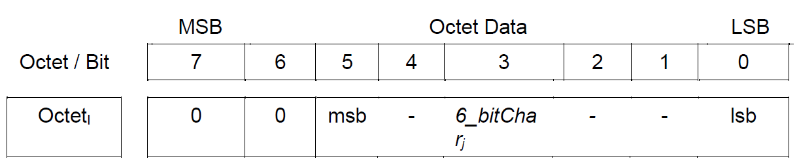
>
> The least-significant bit (LSB) of each 6-bit character received on the serial interface **shall** be aligned with the LSB of the octet.
>
> The value of the MSB bit of each octet **shall** be set to zero for 6-bit character encapsulation.
>
> The special case of the 64-ary ITA-2 character code defined for STANAG 5030 is specified below.

1.  Encapsulation of 64-ary ITA-2 (i.e., STANAG 5030) character codes

> The 64-ary ITA-2 code as defined in STANAG 5030 for Single and Multicahannel VLF/LF Broadcasts actually uses a 7-bit character. It consists of 6-bits for information plus a 7th bit (the Stop Bit) that does not change. This allows the possibility that some applications may choose a simple approach to shortening the STANAG 5030 64-ary ITA-2 code to a true six-bit code (i.e., by deleting the stop bit from the code, relying on other measures to provide character synchonization).
>
> In 7-bit format (i.e, unshortened), the 7.0 unit STANAG 5030 64-ary ITA-2 code **shall** be encapsulated as specified in section F.3.4.2.
>
> As a shortened 6-bit code (i.e, with the 7th/stop-bit removed, the STANAG 5030 64-ary ITA-2 code
>
> **shall** be encapsulated as specified in section F.3.4.4.
>
> As the overhead from both approaches is equivalent, there is no reason with respect to STANAG 5066 operation to shorten the code. Consequently, use of the unshortened 7.0 unit STANAG 5030 64-ary ITA-2 code is preferred. Other external considerations may apply however that would favor use of the shortened code.

1.  *Character-Flush Requirements*

> It is assumed that the COSS client will be implemented with an input buffer for temporary storage of characters from the stream prior to their encapsulation in S\_PRIMTIVES for transmission over the subnetwork. The events that trigger transfer of characters from this buffer to an S\_PRIMITIVE (i.e, that triggers a 'character-flush' operation) need to be specified for the client. Of concern are the performance tradeoffs that exist for various character-flush disciplines. For instance, frequent character-flush operations will reduce end-to-end latency and increase the overhead, while for infrequent character-flush operations, triggered only when the size of the input buffer is the subnetwork's Maximum Transmission Unit Size (MTU), the opposite is true. As this is a largely performance issue and not an interoperability issue, a number of different behaviours could be defined.
>
> The COSS client **shall** have a capability to configure the behaviour of its input-buffer character-flush discipline.
>
> Characters **shall** be flushed from the COSS input buffer and encapsulated in an S\_PRIMITIVE for transmission over the subnetwork when one or a combination of the following events occur:

1.  The number of characters in the input buffer exceeds a configurable threshold value, COSS\_BUF\_FLUSH\_THRESHOLD \[NB: if the specified threshold value is greater than the subnetwork MTU size, then COSS\_BUF\_FLUSH\_THRESHOLD shall equal the MTU value.\];

2.  A carriage-return/line-feed input character-pair is detected in the input character stream. \[NB: this behaviour provides line-by-line transmission of a character stream organised as lines of text.\]

3.  A configurable timeout interval has occurred following the arrival in the input buffer of the last received character. \[NB: this behaviour ensures that characters in the input buffer are eventually transmitted if one of the first two events has not occurred.\]

> Other behaviours for the character-flush disciplines **may** be defined as additional and configurable implementation options, e.g., triggering a character-flush operation on detection of a user-specifiable character sequence defined as an End-Of-Message (EOM) sequence. \[NB: such operation would be useful to support legacy systems such as the ACP-127 messaging systems, which use a defined character sequence as a message delimiter.\]

## TACTICAL MILITARY MESSAGE HANDLING SYSTEM (T-MMHS) CLIENT - Interfacing

> **STANAG-4406-Annex-E Compliant Systems w/ a STANAG 5066 Subnetwork**
>
> A Formal Military Message is different from an interpersonal message in that it is a message sent on behalf of an organization, in the name of that organization, that establishes a legal commitment on the part of that organization under military law, and has been released in accordance with the policies of the originating nation. Examples are military orders. Individuals may send organizational Messages to other individuals on behalf of their respective organizations. Formal Military Messages support the additional services associated with ACP 127, and is therefore interoperable with ACP 127 systems.
>
> Formal Military Messages are handled by Military Message Handling Systems (also called High Grade Messaging Service). An MMHS takes responsibility for the delivery, formal audit, archiving, numbering, release, emission and distribution of received formal messages on behalf of the originating organization. An MMHS is accountable under military law to provide a reliable, survivable and secure messaging service on behalf of the originating organization. The MMHS fulfills the military messaging service requirements of ACP-121 and ACP-127 NATO Supplement and offer high standards of messaging reliability and security. The formal messaging service is seen as the vehicle for secure mission critical, operational military applications.
>
> NATO support for the X.400 protocols in Military Message Handling Systems (MMHS), as defined by NATO STANAG 4406, is mandated in the NATO C3 Technical Architecture (NC3TA), Volume 4 - NATO Common Standards Profile (NCSP). STANAG 4406 Edition 1 Annex E (S'4406E) specifies an adaptation of the X.400/X.500 protocols in STANAG 4406 for Tactical Military Messaging Handling Systems (T-MMHS), with cross-references to STANAG 5066 as one example of a low-bandwidth bearer service to which it has interfaces. This section summarizes and specifies additional requirements for the interface between S'4406E-based T-MMHS and a STANAG 5066-compliant HF subnetwork.
>
> The classes of Tactical Messaging Interfaces (i.e., peer-to-peer interfaces between messaging systems) defined by S'4406E are summarized below and in the accompanying Figure (from S'4406E):

1.  TMI-1: the Tactical Messaging Interface between two Light Message Transfer Agents (LMTA) \[NB: requirements for LMTAs are defined in S'4406E.\]

2.  TMI-2: the Tactical Messaging Interface between an LMTA and a Light User Agent (LUA) \[NB: requirements for LUA are defined in S'4406E.\]

3.  TMI-3: the Tactical Messaging Interface between an LUA and a Light Message Store (LMS) \[NB: requirements for LMSs are defined in S'4406E.\]

4.  TMI-4: the Tactical Messaging Interface between two LUAs.

5.  TMI-5: the Tactical Messaging Interface between an ACP127 Access Unit (defined in STANAG 4406 Annex D) and a conventional ACP127 Military Messaging System.

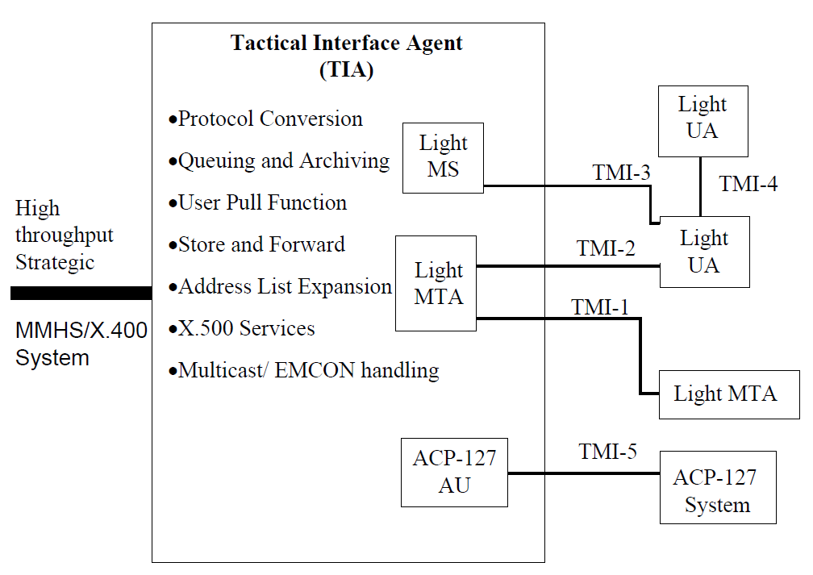

Figure F-7 - Tactical Messaging Interfaces in STANAG 4406 Annex E (from the STANAG).

> Base requirements for the Tactical Interface Agent (TIA) and 'Light' modifications to the peer-to-peer protocols and operation of X.400-derived mail-system objects (e.g., the Light Message Transfer Agent) are defined in S'4406E and summarised here only for context in defining the interface to STANAG 5066 subnetworks its requirements. The TIA constitutes an application-level gateway between the heavyweight protocols of STANAG 4406 used within strategic networks and the lightweight protocols specified for use within low-bandwidth, high-latency tactical subnetworks.
>
> The S'4406E protocol stack incorporates many techniques in the Tactical Adaptation Sublayer to reduce the overhead of the X.400/X.500 protocols. These techniques include the use of performance-enhancing proxies at the edges of a low-bandwidth high-latency communication system, and enforced compression of the message-object to reduce the offered traffic load to the subnetwork. The resulting protocol stack is shown in Figure F-8 and its requirements defined in detail in S'4406E.
>
> A WAP Transport layer within the T-MMHS S'4406E, Appendix A, defines use of two classes of interfaces to a STANAG 5066 subnetwork, depending on whether or not IP network services are required. Further requirements on these interfaces are specified in the subsections below.
>
> Implementations of STANAG 5066 **may** provide a T-MMHS client. If provided, the T-MMHS client
>
> **shall** conform to the requirements noted herein and STANAG 4406 Annex E.
>
> 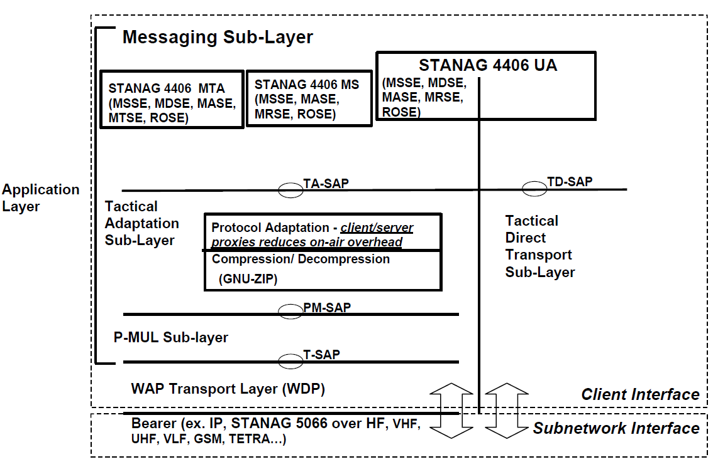
>
> Figure F-8 - STANAG 4406 Annex E - Protocol Stack, Proxy placement, and Interfaces

## General Interface Requirements

> S'4406 T-MMHS systems **should not** interface to the STANAG 5066 subnetwork via the T-MMHS client's Tactical Direct Transport Sublayer (TDTS). \[NB: there are no performance-enhancing proxies used in the TDTS, and the X.400 messaging protocols **should not** be used directly over the STANAG 5066 subnetwork.\]
>
> The provisions of this section **shall** apply only to S'4406E complaint T-MMHS clients when using tactical messaging interfaces TMI-1, TMI-2, TMI-3, or TMI-4 (i.e., when using X.400-based messaging and the Tactical Adaptation Sublayer interfaces).
>
> T-MMHS clients using TMI-5, i.e., T-MMHS clients that are interfacing to the STANAG 5066 subnetwork as an ACP-127 complaint messaging system in accordance with STANAG 4406 Annex D (DELTA), **shall** interface as a Character-Oriented Stream Service (COSS) client defined in Section F.3 of this Annex.
>
> When IP-network services are required, S'4406E T-MMHS systems **shall** interface to the STANAG 5066 subnetwork as an IP client, conforming to the requirements of Section F.12 of this Annex.
>
> When IP-network services are not required, S'4406 T-MMHS systems **shall** interface to the STANAG 5066 subnetwork using the reliable-connection-oriented services or unreliable datagram services as defined in Section F.4.2 below.

## Subnetwork Service Requirements for STANAG-4406-Annex-E Compliant T-MMHS.

> S'4406E-compliant T-MMHS clients **may** interface directly to the STANAG 5066 HF subnetwork as an Extended Client type using either a Reliable-Connection-Oriented Protocol (RCOP) or an Unreliable Datagram Oriented Protocol (UDOP), in accordance with the service and routing requirements of the T-MMHS system.
>
> S'4406E-compliant T-MMHS clients **may** bind to the HF Subnetwork at SAP ID 2, which is the SAP ID reserved for T-MMHS \[NB: Note that since it is a compliant RCOP or UDOP client, a T-MMHS client **may also** bind to the subnetwork at SAP IDs 6 or 7, respectively\]. Client rank and priority are configuration-dependent and implementation-dependent parameters. T-MMHS clients **should not** bind using a Rank = 15.
>
> The RCOP and UDOP protocol data units for T-MMHS clients **shall** conform to the requirements of Section F.8.1 and F.9.1 (for structure) and Section F.10 (for the assigned Application Identifier(s) (APP\_ID) assigned to T-MMHS systems). \[NB: For example, T-MMHS clients could use unique APP\_IDs to distinguish the type of Tactical Messaging Interface supported over the HF subnetwork. Such use would require registration of the assigned APP\_IDs by the T-MMHS peers\].
>
> Protocol data units from the T-MMHS Adaptation Sublayer **shall** be directly encapsulated within the Application Data Field of the RCOP or UDOP PDUs.
>
> Use of RDOP and UDOP **may** be mixed within a client attached at SAP ID 2. \[NB: note that the additional service markings of the S\_PRIMITIVES can distinguish between RDOP and UDOP operations, and separate SAP IDs are not strictly required for the T-MMHS client.\].
>
> Further specification of service requirements is left to definitions made within STANAG 4406 Annex E.

# HF MAIL TRANSFER PROTOCOL (HMTP): GUIDELINES FOR THE USE OF INTERNET SMTP OVER STANAG 5066 SUBNETWORKS

> NATO support for Internet Standard 10, the Simple Mail Transfer Protocol (SMTP) defined by RFC821, is mandated in the NATO C3 Technical Architecture (NC3TA), Volume 4 - NATO Common Standards Profile (NCSP). As noted in Internet Standard 60 for SMTP Service Extensions for Command Pipelining (defined in RFC 2920), SMTP's basic one-command, one-response model will introduce large delays when used over networks that have high latency. This section defines minimal requirements for an HF Mail Transfer Protocol (HMTP), based on the Internet Simple Mail Transfer Protocol (SMTP) with enforced Command Pipelining that operates efficiently and directly over a STANAG-5066-compliant HF transport service. While SMTP is most often used on TCP/IP networks, the SMTP standard notes in its Annexes to RFC 821 that use over other transport protocols is possible. Direct use of SMTP without the use of the TCP/IP protocols over the HF subnetwork reduces overhead and is suitable in a variety of scenarios; the HMTP client enforces the use of some optional provisions of the SMTP extensions to reduce overhead and delay even further when compared to the basic SMTP protocol. HMTP would be suitable, for example, to provide a communications service for SMTP E-mail over HF radio, allowing a client (i.e, user-agent) to submit mail to a server (i.e, mail transfer agent). Alternatively, HMTP is suitable as a mail-transfer service between two SMTP mail-systems connected by a S'5066 HF subnetwork.
>
> Implementations of STANAG 5066 **may** provide an HMTP client. If provided, the HMTP client
>
> **shall** conform to the requirements defined herein.

## General Requirements

> The HMTP protocol **may** be used by a mail client to submit a mail-object to a mail server using the HF transport profile defined in Annexes A-D of STANAG 5066. Alternatively, HMTP **may** be used as the protocol to transfer a mail object over the HF subnetwork from one mail server to another. In this latter case, the mail server that initiates the transfer assumes the role of a mail client in the HMTP protocol.
>
> The HMTP protocol **shall not** be used to send and receive Formal or High Grade Military Messages (i.a. military orders). For Formal or High Grade Military Messaging, STANAG 4406 Annex E **shall** be used (see section F.4). The HMTP protocol **may** be used for informal interpersonal e-mail only.
>
> An HMTP client or server **shall** use the HF subnetwork protocol stack directly, without intervening transport or network protocol, by encapsulating the SMTP commands, replies, and mail objects within the S\_Primitives defined in STANAG 5066 Annex A.
>
> \[NB: SMTP mail systems that incorporate TCP/IP protocols in their profile **may** interface to the HF subnetwork as a ETHER client (section F.11) client or as an IP client (section F.12) rather than as an HMTP client as described here. For efficiency in use of the HF subnetwork, SMTP mail systems that include TCP/IP in their transport protocol profile **should** follow the recommendations of RFC2821 and extended herein regarding use of the command pipelining and other extended-service capabilities defined for SMTP.\]
>
> The HMTP mail model and mail-objects, including the commands, responses, and semantics of the HMTP protocol, **shall** be defined by the following standards:

1.  the Internet Standard 10 for the Simple Mail Transfer Protocol \[RFC 821\],

2.  the proposed consolidated SMTP standard defined in RFC2821 (intended as the replacement for, and with precedence in requirements over, RFC821),

3.  the Internet Standard 60 defining the SMTP Service Extension for Command Pipelining \[RFC2920\], and

4.  the amendments defined herein that mandate certain SMTP options for efficiency in use over the HF channel.

> In particular:

1.  An HMTP client and server **shall** implement the minimal required set of SMTP Service Extensions defined in RFC2821.

2.  An HMTP server **shall** implement the SMTP PIPELINING Service, in accordance with RFC 2920.

3.  An HMTP client **should**(1) <u>enforce</u> use of the Internet Standard 60 for SMTP PIPELINING Extension defined in RFC2920, i.e., an HMTP client **should**(2) submit its commands and mail information immediately following the initial 'EHLO' command without waiting for a reply from the HMTP server. \[NB: this is an amendment of RFC2920, which states that an SMTP client continues "once \[it\] confirms that support exists for the pipelining extension", i.e., the standard implies that the client waits for a response. There is no effect on the SMTP server, which is prepared to accept the initial EHLO and commands as a block. See the comparison discussion in Section F.5.x\]

4.  HMTP clients and servers **should** implement the 8-BITMIME service extension, in accordance with the recommendations of RFC2821. \[NB: this promotes efficiency in the channel by matching the MIME content-type-encoding for binary data to the binary-transparent channel provoded by the STANAG 5066 subnetwork.\]

5.  Mail objects **may** be of any type recognized by the SMTP protocol (e.g., messages in RFC822 format), or with MIME Extensions for SMTP, as defined in RFCs 2045, 2046, 2047, and 2049, and S-MIME. In particular, mail-object data **must** observe the requirements of these standards as to line-length and data-transparency.

## Comparison of SMTP, SMTP w/ Command Pipelining, and HMTP (Informative)

> The original SMTP model was based on a one-command/one-response dialog, shown by example in Table F- 4. Each command or response in the dialog is a line of text encoded in ASCII format. The command/response dialog in the example requires fourteen steps to establish the connection. These steps designate the source and destination addresses for the mail, validate the source and destination addresses, transfer the mail message, acknowledge receipt of the mail, and close the connection. Definition of the commands and responses are from RFC821 and RFC2821.
>
> The SMTP Service Extensions for Pipelining defined in Internet Std 60 (i.e, in RFC2920) group the client-server messages in a way that significantly reduces the number of transactions. The grouping provides the same assurance of reliability in the protocol, albeit delayed until the server completes each response to a grouped set of client requests. A set of transactions for SMTP with Command Pipelining also is presented in Table F.2 , identical in function and result to that for the SMTP/Basic Service, but with fewer transactions required.
>
> In order to increase efficiency and reduce response time over high-latency channels, the enforced command pipelining of HMTP combines even more of the steps that are separate in the SMTP. Unlike SMTP w/Command-Pipelining which first checks for a valid response that confirms a peers capability to use the pipelined commands, HMTP proceeds under the assumption that the peer-level process is fully compliant with its pipelined/grouped SMTP commands. This streamlines the process to use the minimum number of transactions between the client and server, as shown in the final column of Table F.2 comparing the three approaches. The disadvantage is that if the peer-level mail process is not compliant with HMTP, then the transactions are lengthy to no purpose, since the mail will not be transferred correctly but the transmissions could take significant time on the channel before this is determined.
>
> Note that the enforced command pipelining defined here is an alternative to the use of performance-enhancing proxies (PEPs), e.g., such as those defined in the tactical adaptation sublayer of S'4406E, placed at the edges of the HF subnetwork. While the protocol overhead required by SMTP is still transmitted over the HF subnetwork, the command-pipelining requirement to match commands and responses in the dialog between mail client and server reduces end-to-end delays much in the way that PEPs do.
>
> Table F-4- Comparison of Basic SMTP, SMTP w/ Pipelining (per RFC-21920) and HMTP

<table>
<colgroup>
<col style="width: 13%" />
<col style="width: 24%" />
<col style="width: 29%" />
<col style="width: 32%" />
</colgroup>
<thead>
<tr class="header">
<th><blockquote>

Transaction Number:

Source (C/S)

</blockquote></th>
<th><blockquote>

SMTP (basic service, w/o Service Extensions)

</blockquote></th>
<th><blockquote>

SMTP w/ Command Pipelining

</blockquote></th>
<th><blockquote>

HMTP (SMTP w/ <strong>Enforced</strong> Command

Pipelining)

</blockquote></th>
</tr>
</thead>
<tbody>
<tr class="odd">
<td><blockquote>

1:C

</blockquote></td>
<td><blockquote>

HELO &lt;server_name&gt;

</blockquote></td>
<td><blockquote>

EHLO &lt;server_name&gt;

</blockquote></td>
<td><blockquote>

EHLO &lt;server_name&gt;

MAIL FROM: &lt;user@client_name&gt; RCPT TO: &lt;other@destination&gt; RCPT TO: &lt;another@destination&gt; DATA

Message blah, blah, blah More blah, blah, blah

. QUIT

</blockquote></td>
</tr>
<tr class="even">
<td><blockquote>

2:S

</blockquote></td>
<td><blockquote>

250 &lt;client_name&gt;

</blockquote></td>
<td><blockquote>

250-&lt;client_name&gt; 250-PIPELINING

250 8-BIT MIME

</blockquote></td>
<td><blockquote>

250-&lt;client_name&gt; 250-PIPELINING

250 8-BIT MIME

250 sender &lt;user@client_name&gt; OK 250 recipient &lt;other@destination&gt; OK 250 recipient &lt;another@destination&gt;

OK

354 enter mail, end with line containing only “.”

250 message sent

221 goodbye

</blockquote></td>
</tr>
<tr class="odd">
<td><blockquote>

3:C

</blockquote></td>
<td><blockquote>

MAIL FROM:

&lt;user@client_name&gt;

</blockquote></td>
<td><blockquote>

MAIL FROM: &lt;user@client_name&gt; RCPT TO: &lt;other@destination&gt; RCPT TO: &lt;another@destination&gt; DATA

Message blah, blah, blah More blah, blah, blah

.

</blockquote></td>
<td></td>
</tr>
<tr class="even">
<td><blockquote>

4:S

</blockquote></td>
<td><blockquote>

250 sender

&lt;user@client_name&gt; OK

</blockquote></td>
<td><blockquote>

250 sender &lt;user@client_name&gt; OK

250 recipient &lt;other@destination&gt; OK

250 recipient

&lt;another@destination&gt; OK 354 enter mail, end with line

containing only “.”

</blockquote></td>
<td></td>
</tr>
<tr class="odd">
<td><blockquote>

5:C

</blockquote></td>
<td><blockquote>

RCPT TO:

&lt;other@destination&gt;

</blockquote></td>
<td><blockquote>

QUIT

</blockquote></td>
<td></td>
</tr>
<tr class="even">
<td><blockquote>

6:S

</blockquote></td>
<td><blockquote>

250 OK

</blockquote></td>
<td><blockquote>

250 message sent

221 goodbye

</blockquote></td>
<td></td>
</tr>
<tr class="odd">
<td><blockquote>

7:C

</blockquote></td>
<td><blockquote>

RCPT TO:

&lt;another@destination&gt;

</blockquote></td>
<td></td>
<td></td>
</tr>
<tr class="even">
<td><blockquote>

8:S

</blockquote></td>
<td><blockquote>

250 OK

</blockquote></td>
<td></td>
<td></td>
</tr>
<tr class="odd">
<td><blockquote>

9:C

</blockquote></td>
<td><blockquote>

DATA

</blockquote></td>
<td></td>
<td></td>
</tr>
<tr class="even">
<td><blockquote>

10:S

</blockquote></td>
<td><blockquote>

354 &lt;enter full mail text,

ending with a line that contains only a “.”&gt;

</blockquote></td>
<td></td>
<td></td>
</tr>
<tr class="odd">
<td><blockquote>

11:C

</blockquote></td>
<td><blockquote>

Message blah, blah, blah More blah, blah, blah

.

</blockquote></td>
<td></td>
<td></td>
</tr>
<tr class="even">
<td><blockquote>

12:S

</blockquote></td>
<td><blockquote>

250 message sent

</blockquote></td>
<td></td>
<td></td>
</tr>
<tr class="odd">
<td><blockquote>

13:C

</blockquote></td>
<td><blockquote>

QUIT

</blockquote></td>
<td></td>
<td></td>
</tr>
<tr class="even">
<td><blockquote>

14:S

</blockquote></td>
<td><blockquote>

221 goodbye

</blockquote></td>
<td></td>
<td></td>
</tr>
</tbody>
</table>

## Subnetwork Service Requirements for HMTP

> Clients and Servers for the HF Mail Transfer Protocol **shall** bind to the HF Subnetwork at SAP ID
>
> 3\. Client rank and priority are configuration-dependent and implementation-dependent parameters for this application. HMTP clients **should not** bind using a Rank = 15.
>
> The commands, replies, and mail-object data associated with the HF Mail Transfer Protocol **shall** be submitted to the HF subnetwork using the S\_UNIDATA\_REQUEST Primitives, with the default service requirements defined as follows:

-   Transmission Mode = ARQ

-   Delivery Confirmation = NODE DELIVERY or CLIENT DELIVERY

-   Deliver in Order = IN-ORDER DELIVERY

> The address in the primitive will be an individual node address corresponding appropriately to the HF subnetwork address of the host on which the HMTP client (or server) is collocated.
>
> The encoded data for commands, replies, and mail-object data in HMTP **shall** be bit- and byte-aligned with the octets in an S\_Primitive's U\_PDU, with the least-significant bit (LSB) of each character aligned with the LSB of the octet.
>
> Message data encoded as seven-bit symbols (e.g., ITA5 or the ASCII character sets) **shall**(1) be bit-aligned, LSB to LSB, with the octets of the S\_Primitive. The unused eighth (i.e, MSB) of the octet **shall**(2) be set to zero in compliance with RFC2821.

## SMTP Support over Simplex Channels (w/ STANAG 5066Non-ARQ Service)

> For use over simplex channels with non-ARQ service modes in STANAG 5066, e.g., in an HF broadcast environment, SMTP support **may** be provided through the use of the Batch-SMTP Media Type defined in Internet RFC2442, using a UDOP client (defined in Section F.9) and suitable Application Identifier (defined in Section F.10).
>
> RFC2442 defines "a MIME content type suitable for tunnelling an ESMTP \[RFC-821, RFC-1869\] transaction through any MIME-capable transport." \[NB: the quoted statement predates RFC2821, which encompasses all of the requirements for Extended SMTP defined in RFC1869.\] The Batch-SMTP type allows grouping of SMTP-commands and mail objects within an "application/batch-SMTP" MIME type, and subsequent transmission over a simplex channel. The only requirements on the simplex channel are that it supports MIME data transfer. Consequently, it is a standards-based approach for broadcasting SMTP messages over a STANAG 5066 subnetwork.

# POP3 FOR USE OVER STANAG 5066 TRANSPORT (HFPOP)

> The Internetwork Standard 53, the Post-Office Protocol-Version 3 (POP3) defined in RFC1939, is a mandatory standard within the NATO Common Standards Profile (NCSP) of the NATO C3 Technical Architecture. While SMTP is used by a mail client to submit mail-objects to a server, POP3 is used to retrieve mail-objects from a server. This section provides minimal requirements for the efficient and direct support of the POP3 protocol using an HF subnetwork compliant with the requirements of STANAG 5066 Annexes A-D. The profile specified herein requires that certain optional features of the POP3 protocol be implemented for efficiency in operation over the HF channel. The resulting protocol is called the HF Post Office Protocol (HFPOP).
>
> Implementations of STANAG 5066 **may** provide an HFPOP client. If provided, the HFPOP client
>
> **shall** conform to the requirements defined herein.

## General Requirements

> The HFPOP protocol **may** be used by a mail client to retrieve a mail object from a mail server using the transport profile defined in Annexes A-D of STANAG 5066.
>
> The HFPOP protocol **shall not** be used for Formal or High Grade Military Messaging (i.a. military orders). For Formal or High Grade Military Messaging, STANAG 4406 Annex E **shall** be used (see section F.4). The HFPOP protocol **may** be used for informal interpersonal e-mail only.
>
> An HFPOP client and server **shall** use the HF protocol stack directly, without intervening transport or network protocol, by encapsulating the POP3 commands, replies, and mail objects within the S\_Primitives defined in STANAG 5066 Annex A.
>
> \[NB: POP3 mail clients/servers that incorporate TCP/IP protocols in their profile **may** interface to the HF subnetwork as a ETHER client (section F.11) client or as an IP client (section F.12) rather than as an HFPOP client as described here. POP3 mail clients and servers that include TCP/IP in their transport protocol profile **should** follow the recommendations of RFC2449 regarding use of the overlapping commands and other extended-service capabilities defined for POP3.\]
>
> The HFPOP mail model and mail-objects, including the commands, responses, and semantics of the HFPOP protocol, **shall** be defined by the following:

1.  the Internet Standard 53 for the Post Office Protocol Version 3 \[defined in RFC1939\],

2.  the Internet Standards-Track Service-Extensions model for the POP3 protocol defined in RFC2449, and

3.  the amendments defined herein which mandate certain optional features of RFC1939 and RFC2449 for efficiency in use over the HF channel.

> In particular:

1.  An HFPOP client and server **should** implement the set of POP3 Extension Mechanisms defined in RFC2449.

2.  An HFPOP server **shall** implement the POP3 PIPELINING Extension defined in RFC2449.

3.  HFPOP clients and servers **should** implement the 8-BITMIME service extension, in accordance with the recommendations of RFC2821.

## HFPOP Subnetwork Service Requirements

> Clients and Servers for the HF Post Office Protocol **shall** bind to the HF Subnetwork at SAP ID 4. Client rank and priority are configuration-dependent and implementation-dependent parameters for this application. HFPOP clients **should not** bind using a Rank = 15.
>
> The commands, replies, and mail-object data associated with the HF Post Office Protocol **shall** be submitted to the HF subnetwork using S\_UNIDATA\_REQUEST Primitives, with the default service requirements defined as follows:

-   Transmission Mode = ARQ

-   Delivery Confirmation = NODE DELIVERY or CLIENT DELIVERY

-   Deliver in Order = IN-ORDER DELIVERY

> The address in the primitive will be an individual node address corresponding appropriately to the HF subnetwork address of the host on which the HFPOP client or server is located.
>
> The encoded data for commands, replies, and mail-object data in HFPOP **shall** be bit- and byte-aligned with the octets in an S\_Primitive's U\_PDU, with the least-significant bit (LSB) of each character aligned with the LSB of the octet.
>
> Message data encoded as seven-bit symbols (e.g., ITA5 or the ASCII character sets) **shall**(1) be bit-aligned, LSB to LSB, with the octets of the S\_Primitive. The unused eighth (i.e, MSB) of the octet **shall**(2) be set to zero.

# OPERATOR ORDERWIRE CLIENT (HFCHAT)

> A STANAG 5066 implementation **may** provide an Operator Orderwire Client for short text-message exchange (referred to as HFCHAT) between HF subnetwork operators. If provided, the HF CHAT client **shall** conform to the minimal requirements defined herein. The HFCHAT client is intended as a simple orderwire to allow subnetwork operators to test and coordinate their system configurations.

## General Requirements for HFCHAT

> HFCHAT clients **shall** use the ITA5 / ASCII character set to exchange short orderwire messages between subnetwork operators.
>
> Orderwire messages **shall** consist of sequences of characters terminated by a carriage-return/line-feed pair (i.e., terminated by the octet-pair 0x0D, 0x0A).
>
> The orderwire messages length, i.e., the number of octets in the character sequence and including terminating carriage-return/line-feed pair, **shall** not exceed the subnetwork MTU size.
>
> In general, methods of presentation and display to the operator of orderwire messages, as well as methods for orderwire-message entry, are beyond the scope of this STANAG and left as implementation options. The following implementation guidelines are recommended, however:

-   HFCHAT clients **should** provide a common entry and display area for orderwire messages.

-   HFCHAT clients **should** provide a short, viewable history of previous messages sent and received (e.g., of the last N messages, N a value (configurable or not) in the range \[10,100\]).

-   HFCHAT clients **should** provide an indication of the source of any orderwire messages that it receives (e.g., by displaying the STANAG 5066 address of the originator of the orderwire message)

-   HFCHAT clients **should** provide an indication of the time-of-receipt of any orderwire messages that it receives.

-   HFCHAT clients **should** provide confirmation-of-delivery indications for orderwire messages it sends when they are sent using ARQ delivery service.

-   HFCHAT clients **should** provide additional status indications of the state of its interface to the subnetwork, including summary display of S\_PRIMITIVES as they are received from the subnetwork that would indicate the health of the interface; these include but are not limited to S\_BIND\_ACCEPT, S\_BIND\_REJECT S\_UNIDATA\_REQUEST\_ CONFIRM,

> S\_UNIDATA\_REQUEST\_CONFIRM, etc. Key parameters (e.g., reject reasons) from these messages **should** also be displayed.

## Subnetwork Service Requirements

> An HFCHAT client **shall** bind to the HF Subnetwork at SAP ID 5. Client rank and priority are configuration-dependent and implementation-dependent parameters for this application. HFCHAT clients **may** bind using a Rank = 15.
>
> HFCHAT clients **may** use either point-to-point or point-to-multi-point addressing modes to send orderwire messages.
>
> The default subnetwork-service requirements when using the point-to-point addressing mode **shall**
>
> be as follows:

-   Transmission Mode = ARQ

-   Delivery Confirmation = NODE DELIVERY

-   Deliver in Order = IN-ORDER DELIVERY

> For point-to-point operation, the address in the primitive will be an individual node address corresponding appropriately to the HF subnetwork address of the remote HFCHAT client to which the orderwire message is addressed.
>
> The default subnetwork-service requirements when using the point-to-multipoint addressing mode
>
> **shall** be as follows:

-   Transmission Mode = non-ARQ; number of repeats (configurable)

-   Delivery Confirmation = NONE

-   Deliver in Order = IN-ORDER DELIVERY

> For point-to-multipoint operation, the address in the primitive will be a multicast-address corresponding to the group of remote HFCHAT clients to which the orderwire message is addressed. Establishment of the multicast address for the group may be done through standard operating procedure or out-of-band channel.
>
> The orderwire-message's sequence of characters **shall**(1) be bit- and byte-aligned with the octets in an S\_Primitive's U\_PDU, with the least-significant bit (LSB) of each character aligned with the LSB of the octet. The unused eighth (i.e, MSB) of the octet **shall**(2) be set to zero.
>
> Orderwire messages **shall** be encapsulated and sent within S\_PRIMITIVES, one message per S\_PRIMITIVE, with the message-terminating carriage-return/line-feed pair encapsulated in the S\_PRIMITIVE as the last two octets of the U\_PDU field.

# RELIABLE CONNECTION-ORIENTED PROTOCOL

> This subsection specifies a simple Reliable Connection-Oriented Protocol (RCOP) for reliable data connections between applications using the ARQ services of the HF subnetwork. RCOP provides a minimal header to support multiplexed connections between a pair of nodes through a single hard or soft link. Applications using an RCOP connection are identified uniquely by a field in the header of the RCOP PDU.

1.  **RCOP Protocol Data Unit (RCOP\_PDU)**

> The format of all RCOP U\_PDUs **shall** be as shown in the Figure below.
>
> 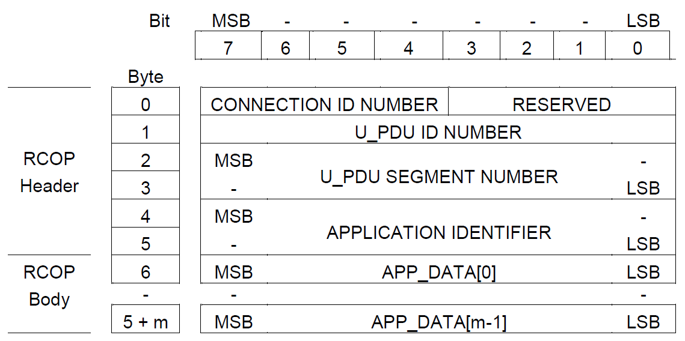
>
> Figure F-9. Format for Reliable Connection-Oriented Protocol Data Units The following are required for RCOP PDUs:

1.  RCOP clients may provide multiplexed transport service for more than one application simultaneously by establishing multiple connections, each identified by its CONNECTION\_ID\_NUMBER field. The CONNECTION\_ID\_NUMBER field **shall** be a value from 0-15.

2.  New values for the CONNECTION\_ID\_NUMBER field **shall** be dynamically assigned as new connections are established. Further details regarding assignment and co-ordination of connection ID numbers are not specified here.

3.  Connection ID number 0 **shall** be reserved for non-multiplexed connections or the first multiplexed connection.

4.  The reserved bits **shall** be set to 0.

5.  U\_PDU ID numbers **shall** be assigned consecutively to user PDUs (U\_PDUs) serviced by the connection.

6.  The U\_PDU segment number **shall**(1) be assigned consecutively to segments within a single U\_PDU. The first segment transmitted **shall**(2) be assigned segment number 0. If a U\_PDU is not segmented, the single segment that is transmitted **shall**(3) be assigned number 0.

7.  The APPLICATION\_IDENTIFIER **shall** be assigned in accordance with the requirements of section F.10 of this Annex. This field serves to identify the application (i.e., higher-level protocol) using the connection. End-to-end interoperability can be achieved only if this is a unique value for any given end-user application, otherwise there is the (likely) chance that the applications connected by the RCOP client and subnetwork will be incompatible.

8.  The APP\_DATA\[\] field **shall** contain the m-bytes of application data sent over the connection. Segmentation and reassembly rules for mapping the application's data into the APP\_DATA\[\] field are in general outside of the scope of this STANAG, and are application dependent.

## RCOP Subnetwork Service Requirements

> RCOP clients **shall** bind to the HF Subnetwork at SAP ID 6. Client rank and priority are configuration-dependent and implementation-dependent parameters. RCOP clients **should not** bind using a Rank = 15.
>
> Each RCOP\_PDU sent over the subnetwork **shall** be embedded in an S\_UNIDATA\_REQUEST primitive, each byte of the RCOP\_PDU corresponding to a byte in the U\_PDU field of the S\_Primitive (see Figure). RCOP\_PDUs will be encapsulated in like manner when delivered by the subnetwork to the destination client in an S\_UNIDATA\_INDICATION.
>
> 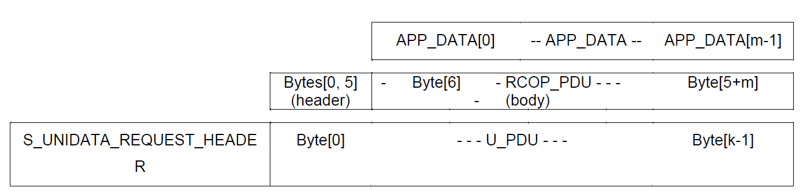
>
> Figure F-10 - Mapping of RCOP\_PDU into an S\_UNIDATA\_REQUEST Primitive for transmission.
>
> The encoded data for the RCOP client **shall** be bit-/byte-aligned with the octets in each U\_PDU encapsulated in the S\_UNIDATA\_PRIMITIVE, with the least-significant bit (LSB) of each character aligned with the LSB of the octet.
>
> Note that, in accordance with the provisions of Annex A of this STANAG, if the subnetwork interface sublayer receives a S\_UNIDATA\_REQUEST primitive with an RCOP Protocol Data Unit larger than the maximum MTU size, the S\_UNIDATA\_REQUEST will be rejected.
>
> An RCOP client **shall** set the default service requirements for S\_UNIDATA\_REQUEST primitives as follows:

-   Transmission Mode = ARQ

-   Delivery Confirmation = NODE DELIVERY or CLIENT DELIVERY

-   Deliver in Order = IN-ORDER DELIVERY or AS\_THEY\_ARRIVE

> The address in the primitive will be an individual node address corresponding to the HF subnetwork address of the host at which the destination RCOP client is located.

## RCOP Segmentation and Reassembly Requirements

> . Note that, in accordance with the provisions of Annex A of this STANAG, if the subnetwork interface sublayer receives a S\_UNIDATA\_REQUEST primitive with an RCOP Protocol Data Unit larger than the maximum MTU size, the S\_UNIDATA\_REQUEST will be rejected. RCOP clients **must** segment their data and place it into the APP\_DATA\[\] field of the PDU accordingly.
>
> If IN\_ORDER delivery-order is specified, an RCOP client **shall** simply take the U\_PDU segments in the sequence in which they arrive to construct a copy of the original U\_PDU sent by the source. If AS\_THEY\_ARRIVE delivery-order is specified, an RCOP client **shall** be responsible for reassembling the U\_PDU segments it receives in proper sequence order.
>
> RCOP clients **may** devise any algorithm of their own choice for segmentation and reassembly, but the RCOP\_PDU fields for CONNECTION\_ID\_NUMBER, U\_PDU\_ID NUMBER, U\_PDU SEGMENT
>
> NUMBER are available for such use. Segmentation and reassembly algorithms **shall** not use the APPLICATION IDENTIFIER field.
>
> Note that, in general, a local RCOP client could be receiving data on two different connections, each established by another remote RCOP client as the remote client's sole connection. In this case, the remote clients would each have specified a connection ID number of zero. As an alternate but similar scenario, two RCOP clients on the same remote node but attached to different SAP IDs could connect to the local RCOP client. In this case also, data could be received with the same connection ID number. Other scenarios in which the same connection ID has been assigned to data received by an RCOP client might also occur, as dynamic connections are made and broken with different nodes. Thus, to reassemble segmented application data without ambiguity, an RCOP client **must** distinguish U\_PDU segments for its receive connections using the unique combination of (SOURCE\_ADDRESS, SOURCE\_SAP\_ID, CONNECTION\_ID\_NUMBER). The SOURCE\_ADDRESS is the address of the originator of the RCOP\_PDU, and the SOURCE\_SAPID is the SAP\_ID to which the remote RCOP client is attached. All three parameters the can be obtained unambiguously from the S\_UNIDATA\_INDICATION primitive in which the RCOP\_PDU is delivered to the client, as can the CONNECTION\_ID\_NUMBER, U\_PDU\_ID NUMBER, U\_PDU SEGMENT NUMBER.

# UNRELIABLE DATAGRAM-ORIENTED PROTOCOL (UDOP)

> This section defines a simple Unreliable Datagram-Oriented Protocol (UDOP) using the non-ARQ services of the HF subnetwork, with a minimal header to support multiplexed datagram delivery. Since non-ARQ services are used, the UDOP may support a multicast service through the use of group addresses within the HF Subnetwork. Applications using a UDOP non-ARQ delivery service are identified uniquely by a field in the header of the UDOP PDU.

## UDOP Data Unit

> UDOP Protocol Data Units **shall** be defined and used identically to those defined for the Reliable Connection-Oriented Protocol in section F.8.1.

## UDOP Subnetwork Service Requirements

> UDOP clients **shall** bind to the HF Subnetwork at SAP ID 7. Client rank and priority are configuration-dependent and implementation-dependent parameters for this application. Use of Rank = 15 is discouraged.
>
> A UDOP client **shall** submit its U\_PDUs to the HF subnetwork using the normal S\_UNIDATA\_REQUEST Primitives, with the default service requirements defined as follows:

-   Transmission Mode = non-ARQ

-   Delivery Confirmation = none

-   Deliver in Order = IN-ORDER DELIVERY or AS\_THEY\_ARRIVE

> The address in the primitive will be an individual node address corresponding to the HF subnetwork address of the host on which the destination message stores are located. If AS\_THEY\_ARRIVE delivery-order is specified, the UDOP client at the destination **may** be responsible for reassembling the U\_PDU segments in proper sequence order.
>
> The encoded data for the UDOP client **shall** be bit-/byte-aligned with the octets in each U\_PDU encapsulated in the S\_UNIDATA\_PRIMITIVE, with the least-significant bit (LSB) of each character aligned with the LSB of the octet.

# EXTENDED CLIENT DEFINITION USING RCOP/UDOP APPLICATION IDENTIFIERS

> The APPLICATION\_IDENTIFIER field **may** be used in the definition of so-called 'Extended Clients', all of which use the RCOP or UDOP protocol as their base client type, but which are uniquely distinguishable without prior system configuration or end-to-end coordination.
>
> This section lists assigned values for the APPLICATION\_IDENTIFIER field and concludes with discussion of some known examples of Extended Client Applications.

## Assigned Values

> With the 16-bit APPLICATION\_IDENTIFIER field, RCOP/UDOP clients can uniquely identify a large number of applications or other upper layer protocols. \[NB: There is no assumption that the HF subnetwork can adequately support even a very small fraction of 216 clients simultaneously!\]
>
> A portion of the 16-bit range will be reserved and managed by NATO. The remainder will be available for arbitrary vendor use.
>
> APPLICATION\_IDENTIFIER field values **shall** be made in accordance with the Table shown below.
>
> Table F-5 – Application Identifier (APP\_ID) Assignments

<table>
<colgroup>
<col style="width: 13%" />
<col style="width: 36%" />
<col style="width: 50%" />
</colgroup>
<thead>
<tr class="header">
<th><blockquote>

<strong>Identifier Value</strong>

</blockquote></th>
<th><blockquote>

<strong>Application or Upper-Layer Protocol</strong>

</blockquote></th>
<th><blockquote>

<strong>Comment</strong>

</blockquote></th>
</tr>
</thead>
<tbody>
<tr class="odd">
<td><blockquote>

0x0000 –

0x7FFF

</blockquote></td>
<td><blockquote>

<em><u>Various</u></em>

</blockquote></td>
<td><blockquote>

Reserved for NATO Administration: within this block, the following APP_IDs are currently assigned.

</blockquote></td>
</tr>
<tr class="even">
<td><blockquote>

0x1002

</blockquote></td>
<td><blockquote>

Basic File Transfer Protocol (BFTP) File Transfer Service

</blockquote></td>
<td><blockquote>

Backward compatibility assignment with the initial two-byte value specified in the BFTP client of STANAG 5066 Annex F, Edition 1

</blockquote></td>
</tr>
<tr class="odd">
<td><blockquote>

0x100B

</blockquote></td>
<td><blockquote>

File-

Receipt/Acknowledgement Protocol

</blockquote></td>
<td><blockquote>

Backward compatibility assignment with the initial two-byte value specified in the BFTP client of STANAG 5066 Annex F, Edition 1

</blockquote></td>
</tr>
<tr class="even">
<td><blockquote>

0x100C

</blockquote></td>
<td><blockquote>

File-

Receipt/Acknowledgement Protocol Version 2

</blockquote></td>
<td><blockquote>

Provides acknowledgement of a given file, supporting pipelined BFTP operation sending multiple files

</blockquote></td>
</tr>
<tr class="odd">
<td><blockquote>

0x2000

</blockquote></td>
<td><blockquote>

STANAG 4406 Annex E

complaint Tactical Military

Message Handling Systems (i.e, T-MMHS Clients per F.4)

</blockquote></td>
<td><blockquote>

Base APP_ID assignment for TMI-1 (in support of the LMTA-to-LMTA interface).

</blockquote></td>
</tr>
<tr class="even">
<td><blockquote>

0x2001

</blockquote></td>
<td><blockquote>

STANAG 4406 Annex E

</blockquote></td>
<td><blockquote>

Base APP_ID assignment for TMI-2 (in support of the LMTA-to-LUA interface).

</blockquote></td>
</tr>
<tr class="odd">
<td><blockquote>

0x2002

</blockquote></td>
<td><blockquote>

STANAG 4406 Annex E

</blockquote></td>
<td><blockquote>

Base APP_ID assignment for TMI-3 (in support of the LMS-to-LUA interface).

</blockquote></td>
</tr>
<tr class="even">
<td><blockquote>

0x2003

</blockquote></td>
<td><blockquote>

STANAG 4406 Annex E

</blockquote></td>
<td><blockquote>

Base APP_ID assignment for TMI-4 (in support of the LUA-to-LUA interface).

</blockquote></td>
</tr>
<tr class="odd">
<td><blockquote>

0x2004

</blockquote></td>
<td><blockquote>

STANAG 4406 Annex E ACP-

127 Access Unit

</blockquote></td>
<td><blockquote>

Base APP_ID assignment for TMI-5 (in support of the ACP-127 AU interface).

</blockquote></td>
</tr>
<tr class="even">
<td><blockquote>

0x8000 –

0xFFFF

</blockquote></td>
<td></td>
<td><blockquote>

Available for User-defined applications; uniqueness of Application ID values in this range cannot be guaranteed.

</blockquote></td>
</tr>
</tbody>
</table>

> End-to-end interoperability requires that the value assigned to the APPLICATION\_IDENTIFIER field be unique for any given application type. Otherwise, there is the likely chance that two applications connected by the RCOP/UDOP client and HF subnetwork will be incompatible. Vendors developing applications for use with the STANAG 5066 HF Subnetwork **should** register their application and obtain an application identifier in the reserved range administered by NATO.

## Extended-Client Definition using Application Identifiers: Examples

> This section defines the use of an RCOP (or UDOP) client as the basis for additional client definitions. An "Extended Client" is a client of the STANAG 5066 HF subnetwork that uses RCOP (or UDOP) as its basic end-to-end transport protocol. Protocols for several example applications are discussed in the sections below that use the extended client definition as their basis. Implementations of STANAG 5066 **may** provide any of these extended clients. If provided, the client **shall** be implemented in accordance with the requirements defined herein.
>
> The extended clients presented here are the following:

1.  <u>T-MMHS Clients</u> - the T-MMHS Clients defined in Section F.4 are, by definition, Extended Clients since they are based on RCOP and UDOP, although they have a uniquely assigned SAP ID as well. As noted in Section F.4, implementations of T-MMHS Clients will be governed by the requirements of STANAG 4406 Edition 1, Annex E Version 1.0, with the additional provisions on the client-subnetwork interface defined herein.

2.  <u>Basic File Transfer Protocol</u> (BFTP) - BFTP **may** be used for end-to-end file transport over the STANAG 5066 subnetwork profile (i.e., the protocols defined in Annexes A through D). Implementations of STANAG 5066 **may** provide a BFTP client. If provided, the BFTP client **shall** conform to the requirements of Section F.10.2.2 below. BFTP implements a very simple file transfer protocol based on the ZMODEM protocol. \[NB: BFTP was the first client for which end-to-end interoperability was demonstrated over different vendor implementations over of the STANAG 5066 subnetwork profile. Historically, it has served as a simple benchmark of the end-to-end interoperability of the STANAG 5066 subnetwork profile (Annexes A-D) and is retained in this Amendment as such.\]

3.  <u>File-Receipt Acknowledgment Protocol</u> (FRAP) - FRAP **may** be used to provide an acknowledgement of file receipt for files sent over the STANAG 5066 subnetwork using some other protocol, such as BFTP or CFTP (see below). If provided, the FRAP extended client **shall** conform to the requirements Section F.10.2.3 below. \[NB: FRAP was provided with BFTP in the earliest implementations of STANAG 5066 and used for interoperability verification of the profile.\]

4.  <u>File-Receipt Acknowledgment Protocol-Version 2</u> (FRAPv2) - FRAPv2 **may** be used as an alternative to FRAP. FRAPv2 provides support for pipelined or overlapping file transfer by providing an unambiguous indication of which file has been acknowledged. If provided, the FRAPv2 extended client **shall** conform to the requirements Section F.10.2.4 below.

    1.  *Tactical Military Message Handling System (T-MMHS) Clients*

> The T-MMHS Client has been defined in Section F.4 as an Extended Client to allow provision for uniquely distinguishing the type of Tactical Messaging Interface (TMI) supported, i.e., to distinguish the traffic flows between LMTAs, LUAs, or LMSs being supported by the HF subnetwork. As noted in Section F.4, T-MMHS clients may also attach to the subnetwork at SAP ID 6 (when using RDOP) or SAP ID 7 (when using UDOP).
>
> For further definition and discussion of the T-MMHS Client requirements, refer to Section F.4 of this Annex and to STANAG 4406 Edition 1 Annex E Version 1.0.

1.  *BASIC FILE TRANSFER PROTOCOL (BFTP)*

> The Basic File Transfer Protocol (BFTP) **may** be used to transfer files via a STANAG 5066 subnetwork using an RCOP or UDOP client. It is a very simple protocol (base on the ZMODEM protocol) and is not designed to be especially robust.

1.  BFTP\_PDU Specification

> The format for the basic-file-transfer-protocol data unit (BFTP\_PDU) **shall** be in accordance with the following Figure, which defines a header part and a file-data part for the BFTP\_PDU.
>
> 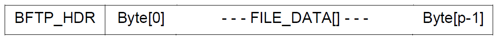
>
> Figure F-11: Basic FTP Protocol Data Unit (BFTP\_PDU)
>
> The detailed structure of the BFTP\_PDU shall be in accordance with the following Figure, and provide the following information fields:

1.  BFTP PDU Header Part:

    -   SIZE\_OF\_FILENAME - one octet in size.

    -   FILE\_NAME - a variable length field, equal in size to the value specified by the SIZE\_OF\_FILENAME field.

    -   SIZE\_OF\_FILE - a four-octet field.

2.  BFTP PDU Body Part:

    -   FILE\_DATA\[\] - a variable length field, equal in size to the value specified by the SIZE\_OF\_FILE field.

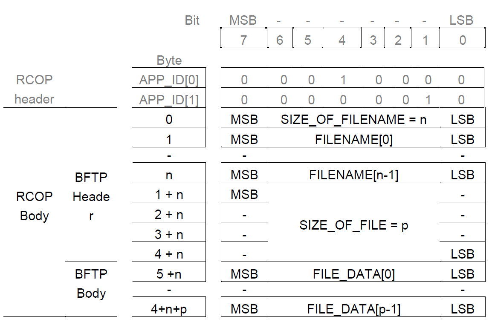

Figure F-12: BFTP Protocol Data Unit Structure

> For backwards compatibility with the BFTP specification in earlier versions of STANAG 5066 Annex F Edition 1, the Application Identifier (i.e., the last two bytes of the RCOP header) for BFTP **shall** be 0x1002. \[NB: The two-bytes in the Application Identifier correspond in value and position to the first two bytes (i.e., the synchronization bytes) of the BFTP header as defined Annex F Edition 1. They represent the control bytes DLE (Data Link Escape) and STX (Start of Text), which started the Z-modem protocol.\]
>
> The SIZE\_OF\_FILENAME field **shall**(1) be a 1-octet fixed-length field whose value (n) **shall**(2) equal the number of octets used to encode the FILENAME field.
>
> The FILENAME field is **shall**(1) be a variable-length field, the size of which **shall**(2) be specified by the value (n) of the field SIZE\_OF\_FILENAME. This field represents the name of the file sent using the Basic File Transfer Protocol. The first byte of the filename **shall**(3) be placed in the first byte of this field, with the remaining bytes placed in order. The semantics of file names and naming conventions are beyond the scope of this STANAG.
>
> The SIZE\_OF\_FILE field **shall**(1) be a 4-octet fixed-length field whose value **shall**(2) specify the size
>
> \(p\) in octets of the file to be sent. The first octet of the SIZE\_OF\_FILE field **shall**(3) be the highest order byte and the last byte the lowest order byte of the field's binary value.

1.  BFTP Segmentation and Reassembly Requirements

> If the BFTP\_PDU exceeds the maximum size of the data field permitted in the RCOP\_PDU (i.e, if the BTFP\_PDU is larger than the MTU\_size less 6 octets (i.e., MTU-6) ), the BFTP client **shall** segment the BTFP\_PDU, placing successive segments in RCOP\_PDUs with consecutive U\_PDU sequence numbers.
>
> When received, the BFTP client **shall**(1) reassemble the BFTP\_PDU if it determines that the BFTP\_PDU has been segmented. Subject to local-host file naming conventions, the BFTP client **shall**(2) store the received file with the name transmitted in the header with the file. \[*NB: there is no guarantee therefore that the file will be stored on the destination host with the same name that it was sent.\]*

1.  *File-Receipt Acknowledgement Protocol (FRAP)*

> Files sent over STANAG 5066 using a BFTP extended client **may** be acknowledged using the File-Receipt Acknowledgement Protocol (FRAP). \[NB: This protocol was used to acknowledge receipt of files sent using BFTP in earlier implementations of STANAG 5066. Therefore, this protocol has relevance to the earliest proofs of interoperability between different vendor implementations of STANAG 5066.\]
>
> Implementations of STANAG 5066 **may** provide support for the FRAP protocol if they also provide a BFTP (see Section F.10.2.2) or CTFP client (see Section F.14).
>
> Other Extended Client types **may** use FRAP.
>
> To acknowledge receipt of a file using FRAP, on receiving the last byte of a file, the receiving client **shall** send an RCOP\_PDU Header Part with an Application Identifier field value = 0x100B; the RCOP\_PDU Body Part is null. This serves to confirm that the entire file has been received. This is equivalent to the "ZEOF" message of the Z-modem protocol.
>
> 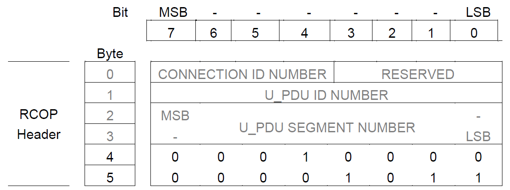
>
> Figure F-13: Application Identifier for the File-Receipt Acknowledgement Protocol (the full RCOP PDU is shown … the RCOP PDU Body Part is null).
>
> The CONNECTION\_ID\_NUMBER in the FRAP PDU (i.e., the RCOP\_PDU Header part with FRAP APP\_ID) **shall**(1) be set to the same value as the CONNECTION\_ID\_NUMBER of the connection over which the file was received. The U\_PDU ID value in the FRAP PDU **shall**(2) be set to the same value as the U\_PDU ID of the file being acknowledged. This provision corresponds to current practice in some implementations of STANAG 5066 that use the File-Receipt Acknowledgement Protocol.
>
> "Matching U\_PDU\_ID\_NUMBERs" allows use of FRAP under limited conditions to support pipelined file-transfer operations, where a new file transfer can be initiated (with a different U\_PDU\_ID\_NUMBER) before receipt of the acknowledgement for preceding files.

1.  *File-Receipt Acknowledgement Protocol Version 2(FRAPv2)*

> The original FRAP specification provided support for file transfers one at a time, or, in limited scenarios using Matching CONNECTION\_ID\_NUMBERs. To avoid potential ambiguity in FRAP, receipt of specific file can be acknowledged by name using FRAPv2. FRAPv2 includes a copy of the BFTP header file for the acknowledged file, as shown in the Figure below.
>
> 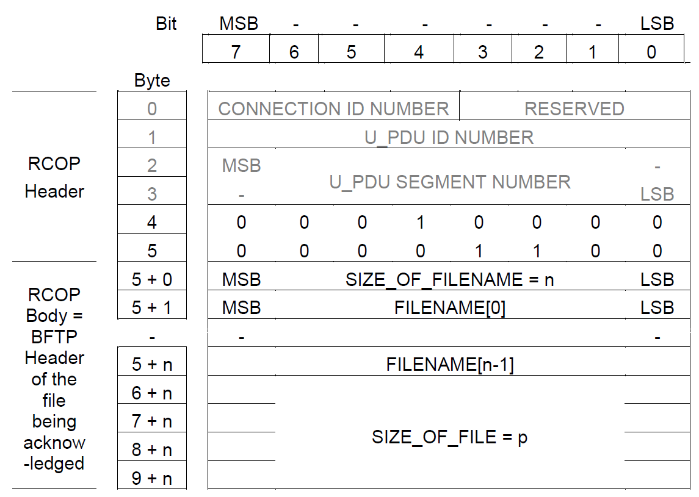
>
> Figure F-14: File-Receipt Acknowledgement Protocol Version 2 - RCOP PDU and contents Implementations of STANAG 5066 **may** provide support for the FRAPv2 protocol if they also
>
> provide a BFTP (see Section F.10.2.2) or CTFP (see F.14) client.
>
> Other Extended Client types **may** use FRAPv2
>
> The Application Identifier for FRAPv2 shall be 0x100C.
>
> To acknowledge receipt of a file using FRAPv2, on receipt of the last byte of a file the receiving client **shall** send an RCOP\_PDU Header Part with an Application Identifier field value = 0x100C and RCOP\_PDU Body Part consisting of a copy of the BFTP Header of the file being acknowledged.

# ETHER CLIENT

> The Ether client provides multi-protocol support over the HF subnetwork, encapsulating a two-byte Ethertype Field with the protocol data unit. Protocols that may be supported include the following:

1.  Internet Protocol Version 4 (RFC 791)

2.  Internet Protocol Version 6 (RFC 2460)

3.  Compressed IP (e.g., van Jacobsen's TCP/IP header compression, RFC 1144; Robust Header Compression, RFC 3843)

4.  Address Resolution Protocol (ARP, RFC 826) and its associated variants (Reverse ARP, RFC 903; Inverse ARP, RFC 2390)

5.  Point-to-Point Protocol (PPP, RFC 1661)

6.  other network protocol for which an Ethertype field is defined.

## General Requirements

> Implementations of STANAG 5066 **may** provide an Ether Client.
>
> The requirements of this section **shall** apply to any client that attaches directly to the HF subnetwork interface sublayer to send or receive Etherframes over the HF subnetwork. Such clients include end systems (e.g., web-servers or mail systems) and intermediate systems (e.g., routers).

1.  **EC\_FRAME Encapsulation**

> The ether client provides multi-protocol bearer services over the HF subnetwork using an EC\_FRAME structure derived from the Ethernet Type II Frame Format by discarding the ethernet addresses and CRC check, leaving only the Ethertype and Data fields as shown in the Figure below. STANAG 5066 Address fields for the HF subnetwork are contained within the S\_Primitives within which the EC\_FRAME is encapsulated. The EC\_FRAME, consisting of a two-byte Ethertype field and the Data Field, are the S\_Primitive's User-Protocol Data Unit.
>
> 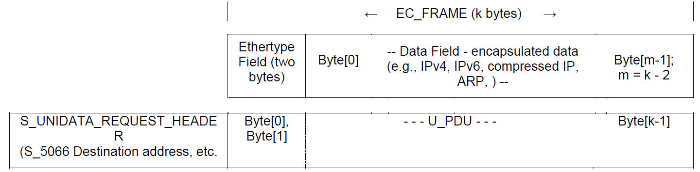
>
> Figure F-15 - Mapping of EC\_FRAME into an S\_UNIDATA\_REQUEST Primitive for transmission.
>
> The EC\_FRAME **shall**(1) be submitted to the HF subnetwork encapsulated in an S\_UNIDATA\_REQUEST Primitive and received from the subnetwork encapsulated in an S\_UNIDATA\_INDICATION Primitive. These S\_Primitives provide all necessary framing information to mark the beginning and end of EC\_FRAMEs when transported over the HF subnetwork.
>
> The first two bytes of the EC\_FRAME (i.e, the Ethertype field) **shall**(2) be placed in the first two bytes of the U\_PDU field within the primitive, and so on to the last byte of the EC\_FRAME and S\_Primitive U\_PDU field, as shown in the Figure. Encoding of the Ethertype field shall conform to 'network byte order', with the most-significant byte of the Ethertype field the first byte in the U\_PDU field and the least-significant byte of the Ethertype field the second byte in the U\_PDU field.
>
> The encoded data of the EC\_FRAME **shall**(3) be bit-/byte-aligned with the octets in each U\_PDU encapsulated in the S\_UNIDATA\_PRIMITIVE, with the least-significant bit (LSB) or each character aligned with the LSB of the octet.

## Ethertype Field Encoding

> Encoding of the Ethertype field **shall** conform to IEEE assigned numbers and requirements for this field. Encoding is in network-byte order, i.e., most-significant-byte first. Field values of interest for protocols that **should** typically be supported by the Ether client are given in the Table below.
>
> Table F-6 – Ethertype Field Encoding for some protocols supportable by the Ether Client

<table>
<colgroup>
<col style="width: 15%" />
<col style="width: 32%" />
<col style="width: 52%" />
</colgroup>
<thead>
<tr class="header">
<th><blockquote>

Field Value (hex)

</blockquote></th>
<th><blockquote>

Encapsulated Protocol (i.e., Data Field contents)

</blockquote></th>
<th><blockquote>

Comments

</blockquote></th>
</tr>
</thead>
<tbody>
<tr class="odd">
<td><blockquote>

0x0800

</blockquote></td>
<td><blockquote>

IPv4

</blockquote></td>
<td><blockquote>

IPv4 datagram payload per Section F.11.5.1

</blockquote></td>
</tr>
<tr class="even">
<td><blockquote>

0x86DD

</blockquote></td>
<td><blockquote>

IPv6

</blockquote></td>
<td><blockquote>

IPv6 datagram payload per Section F.11.5.2

</blockquote></td>
</tr>
<tr class="odd">
<td><blockquote>

0x876B

</blockquote></td>
<td><blockquote>

TCP/IP Header Compression

</blockquote></td>
<td><blockquote>

'Van Jacobsen' header compression per RFC 1144

</blockquote></td>
</tr>
<tr class="even">
<td><blockquote>

0x0180 *

</blockquote></td>
<td><blockquote>

ROHC

</blockquote></td>
<td><blockquote>

Robust Header Compression per RFC 3843 and RFC 3095

</blockquote></td>
</tr>
<tr class="odd">
<td><blockquote>

0x0806

</blockquote></td>
<td><blockquote>

ARP

</blockquote></td>
<td><blockquote>

IP Address Resolution per RFC 826

</blockquote></td>
</tr>
<tr class="even">
<td><blockquote>

0x880B

</blockquote></td>
<td><blockquote>

PPP

</blockquote></td>
<td><blockquote>

Point-to-Point Protocol per RFC 1661

</blockquote></td>
</tr>
</tbody>
</table>

> \* no Ethertype value has been assigned officially for ROHC over Ethernet; this is a value assigned from the 'Experimental' block of Ethertype values.

## Ether-Client Subnetwork Service Requirements

> Ether clients **shall**(1) bind to the HF Subnetwork at SAP ID 8. Client rank and priority are implementation-dependent parameters for this application. Use of Rank = 15 is discouraged.
>
> The STANAG 5066 address in the S\_Primitive will be an node group address corresponding to the HF subnetwork address of the host to which the EC\_FRAME is being sent.
>
> HF Subnetwork implementations **shall**(2) provide MTU sizes sufficient to support placement of an entire EC\_FRAME (up to 2048 bytes) within a single S\_Primitive.
>
> All EC\_FRAMEs **shall**(3) be submitted to the HF subnetwork using the normal S\_UNIDATA\_REQUEST Primitives, with the default service requirements for transmission mode, delivery-confirmation mode, and deliver-order defined as required by the protocol supported (see section F.11.5 for minimal requirements for know protocols).
>
> Requirements for other service parameters — such as Transmission Mode (ARQ/non-ARQ), Delivery Confirmation, Deliver-in-Order — **should** be defined as a function of the service requirements of the EC\_FRAME data field.

## Minimal Requirements for Supported Protocols

> The range of protocols that could be supported by Ethernet, and consequently could be supported (in theory) over a STANAG 5066 Ether client is broad. Detailed requirement specifications are beyond the scope of this Annex.
>
> Some minimal requirements for supportable protocols of interest are given below.

1.  *IPv4-over-Ether-client Service*

> With few exceptions — noted here — the requirements for the IP-client given in section F.12 apply when supporting IPv4-over-Ether client. In particular:

1.  IPv4-over-Ether-client service **shall** use SAP ID 8, per the Ether client service requirements;

2.  IP-datagram encapsulation requirements for IPv4-over-Ether client operation modify the IP-datagram encapsulation requirements of section F.12.2; the IP datagram **shall**(1) be encapsulated within the EC\_FRAME Data Field as shown in the figure below rather than in the U\_PDU field; other IPv4 datagram-encapsulation requirements of section

> F.12.2 **shall**(2) apply;

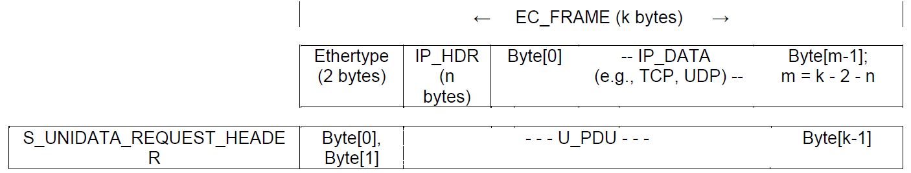

Figure F-16 - IPv4-datagram mapping into EC\_FRAMEs for subnetwork transmission as an S\_UNIDATA\_REQUEST Primitive.

1.  ARQ and non-ARQ services **shall** be used in accordance with section F.12.3;

2.  the Quality of Service (QOS) requirements of section F.12.4 **shall** apply;

3.  the Segmentation and Reassembly requirements of section F.12.5 **shall** apply;

4.  the Internetwork Control Message Protocol (ICMP) **shall** be supported

5.  requirements for address-resolution and mapping between IP-address and STANAG 5066 addresses given in section F.12.7 **shall** apply; in addition, IPv4-over-Ether operation **should** be capable of dynamically resolving addresses using an ARP-over-Ether client.

    1.  *IPv6-over-Ether-client Service*

> IPv6 over Ether-client **may** be supported. In general, implementations **should**(1) conform to the requirements for the transmission of IPv6 over Ethernet (RFC2464), with exceptions (e.g., formation of interface identifiers for stateless autoconfiguration) as noted here.
>
> IPv6 capabilities that depend on or are derived from an *interface identifier* (see RFC 2373, section 2.5.1)— such as the IPv6 Stateless Address Autoconfiguration protocol (RFC 2462) — **shall** use as a 32-bit interface identifier their STANAG 5066 address in the format prescribed by STANAG 5066 Annex A, sec A.2.2.28.
>
> ARQ and non-ARQ service characteristics **should**(2) be defined as a function of an IPv6-datagram's destination address and QoS requirements, using the IPv4 requirements of Section 12.3 as guidelines. Further requirements are currently beyond the scope of this Annex.

1.  *Compressed-IP-over-Ether-client Service*

> There are a number of IP compression techniques that could be used with the Ether client. All are suitable only for point-to-point (i.e., unicast-addressed) datagrams. Consequently, compressed-IP-over-Ether-client service **shall not** be enabled for multicast-IP traffic.
>
> Van Jacobsen (RFC 1144) defined a popular TCP-/IP-header compression technique (sometimes called VJ-compression). VJ-compressed IP-datagrams **shall**(1) use the IEEE required Ethertype of 0x876B for transmission over Ether-client service.
>
> RObust Header Compression (ROHC) has been defined for a number of profiles including IP-only (RFC 3843), and UDP/IP and ESP (RFC 3095). Ethertype specification for these profiles have not been standardized within IETF at this writing. Consequently, an Ethertype value of 0x0180 —from the block of values for 'experimental' use — **shall**(1) be used for ROHC-over-Ether-client service..
>
> Whether used experimentally or as a later standard, IP-compression techniques over the Ether-client **should** use ARQ service and IN-ORDER Delivery mode as most of these techniques are sensitive to errors and to out-of-order delivery. As ROHC is tolerant of errors, it **may** use non-ARQ service and IN-ORDER Delivery mode.

1.  *ARP-over-Ether-client Service*

> The address resolution protocol (ARP - RFC 826) **may** be supported over the Ether client interface, allowing nodes to develop a table a translation table between STANAG 5066 addresses and higher-level protocol (e.g., IP) addresses. However, when possible, these tables **should** be provided as static configuration data for HF-subnetwork nodes, to reduce traffic loading and HF subnetwork congestion.
>
> Resolution of STANAG 5066 addresses (i.e., addresses in the format in Annex A, sec A.2.2.28) to their corresponding upper-layer (e.g. IP) address **shall**(1) be made by representing STANAG 5066 addresses as a 48-bit 'psuedo-Ethernet address' in any ARP-packet format. The 48-bit 'psuedo-Ethernet address' shall encapsulate the STANAG 5066 address (including the size-of-address field and group-address flag) in the format defined in sec A.2.2.28), pre-pended with the two-byte field 0x5066 as shown in the Figure below:
>
> 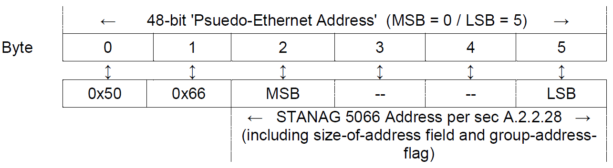
>
> Figure F-17 - Cross-mapping between Psuedo-Ethernet Addresses used for ARP-over-Ether-client and STANAG 5066 Addresses
>
> Other operation of ARP-over-the Ether-client **shall**(2) be in accordance with RFC 826.
>
> The mapping defined above between psuedo-Ethernet addresses and STANAG 5066 addresses **shall**(3) be used for other protocols, e.g., Reverse ARP (RFC 903) and Inverse ARP (RFC 2390) that use the ARP packet-format of RFC 826.

1.  *PPP-over-Ether-client Service*

> Implementations of STANAG 5066 **may** provide a PPP service over the Ether client. PPP over Ether-client service **shall**(1) use the IEEE Ethertype value of 0x880B.
>
> A PPP client **shall**(2) construct PPP frames in accordance with Section 2 of RFC 1661, using the 16-bit Protocol-field to identify the information encapsulated within the PPP and its upper-layer source.
>
> Framing characters (e.g., the HDLC framing symbols) **shall not** be included and are not allowed. The PPP packet is submitted to the HF subnetwork encapsulated in an S\_UNIDATA\_REQUEST Primitive and received from the subnetwork encapsulated in an S\_UNIDATA\_INDICATION Primitive. These S\_Primitives provide all necessary framing information to mark the beginning and end of PPP frames when transported over the HF subnetwork.
>
> The two bytes of the PPP frame (i.e, the Protocol field) **shall**(3) be placed in the first two bytes of the U\_PDU field within the primitive, and so on to the last byte of the PPP frame and S\_Primitive U\_PDU field, as shown in the Figure.
>
> 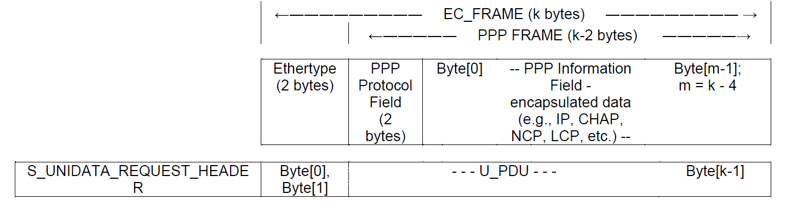
>
> Figure F-18 - Mapping of PPP-over Ether-client service into an S\_UNIDATA\_REQUEST Primitive for transmission.
>
> HF Subnetwork implementations **shall**(4) provide MTU sizes sufficient to support placement of an entire PPP frame (up to 2048 bytes) within a single S\_Primitive.
>
> All PPP frames **shall**(5) be submitted to the HF subnetwork using the normal S\_UNIDATA\_REQUEST Primitives, with the default service requirements defined as follows:

-   Transmission Mode = ARQ

-   Delivery Confirmation = NODE DELIVERY or CLIENT DELIVERY

-   Deliver in Order = IN-ORDER DELIVERY

> IN-ORDER Delivery is specified because the PPP protocol requires a serial, sequenced bearer service
>
> The address in the primitive will be an individual node address corresponding to the HF subnetwork address of the host to which the PPP frame is being sent.
>
> The encoded data of the PPP frame **shall**(6) be bit-/byte-aligned with the octets in each U\_PDU encapsulated in the S\_UNIDATA\_PRIMITIVE, with the least-significant bit (LSB) or each character aligned with the LSB of the octet.
>
> Implementers of PPP-over-Ether clients for STANAG 5066 HF subnetworks **shall**(7) provide support for the PPP service-negotiation protocol that initiates any PPP session.
>
> Implementers of PPP clients **should** provide support for the data compression capabilities of the Point-to-Point Protocol as a means of promoting HF subnetwork efficiency. Note that differences in data compression capabilities between clients will be resolved by PPP's initial service-negotiation protocol

# INTERNET PROTOCOL (IP) CLIENT

> NATO support for the Internetwork Protocol is mandated within the NC3TA and NCSP. The requirements for HF-subnetwork support of the Internet Protocol (Version 4), Internet Standard 5, Request for Comments (RFC) 791, are defined here. The Internet Protocol is a well known protocol whose requirements are not repeated here.

## General Requirements

> Implementations of STANAG 5066 **shall**(1) provide an IP client to the HF subnetwork, with some suitable implementation-dependent but standards-based local area network (LAN) interface for external access, such as Ethernet with 100/10 Base T / RJ-45 physical connector. The LAN interface for external access to the IP Client may be shared with the Raw SIS Socket Server (see Section F.16 of this Annex.).
>
> The requirements of this section **shall**(2) apply to any client that attaches directly to the HF subnetwork interface sublayer to send or receive IP datagrams over the HF subnetwork. Such clients include end systems (e.g., web-servers or mail systems) and intermediate systems (e.g., routers).
>
> Over the HF subnetwork interface, the IP client **shall**(3) be capable of sending and receiving encapsulated IP datagrams with unicast (i.e., point-to-point) IP addresses, using both ARQ- and non-ARQ-transmission modes in STANAG 5066.
>
> Over the HF subnetwork interface, the IP client **shall**(4) be capable of sending and receiving encapsulated IP datagrams with multicast (i.e., point-to-multipoint) IP addresses, using non-ARQ-transmission modes.

1.  **Encapsulation of the IP Datagram within HF Subnetwork S\_PRIMITIVES**

> IP datagrams **shall**(1) be encapsulated within the U\_DPU field of S\_UNIDATA\_REQUEST Primitives submitted to the HF subnetwork for transmission, and delivered to clients at the destination node(s) within the U\_DPU field of S\_UNIDATA\_INDICATION Primitives. There are no framing characters required or allowed.
>
> The first byte of the header of the IP datagram **shall**(2) be aligned with the first byte of the U\_PDU field within the primitive, and so on to the last byte of the IP datagram and U\_PDU field.
>
> The encoded bytes of an IP datagram submitted for transmission over the subnetwork **shall**(3) be bit-/byte-aligned with the octets in each U\_PDU encapsulated in the S\_UNIDATA\_REQUEST primitive.
>
> The least-significant bit (LSB) of each octet in the IP datagram **shall**(4) be aligned with the LSB of the U\_PDU's octet.
>
> 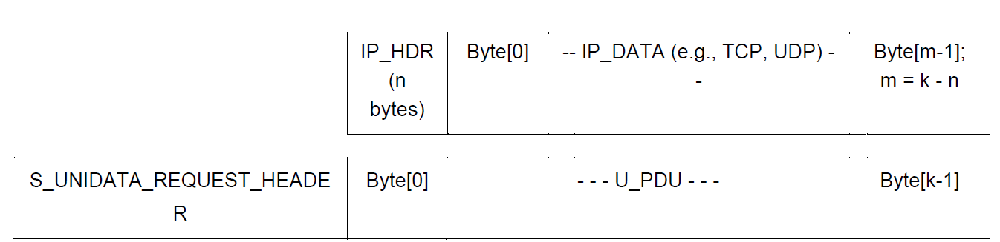
>
> Figure F-19 - Mapping of IP Datagram into an S\_UNIDATA\_REQUEST Primitive for transmission.

## IP-Client Subnetwork Service Requirements

> IP clients **shall**(1) bind to the HF Subnetwork at SAP ID 9.
>
> The client rank is a scenario-dependent parameter. Use of Rank = 15 is discouraged for anything but an IP client performing subnetwork management functions.
>
> IP support by the HF subnetwork **shall**(2) be configurable to use either ARQ or non-ARQ delivery services.
>
> Selection of the subnetwork's default service requirements (established in the S\_BIND\_REQUEST message) and delivery mode (established in the S\_UNIDATA\_REQUEST message), and traffic priority **shall**(3) be based on the type of IP address and IP Quality-of-Service (QoS) labels.
>
> An IP client **may** set the subnetwork's default service requirements in the S\_BIND\_REQUEST message as a function of the most likely traffic that it expects to process in accordance with the requirements of section F.12.4
>
> An IP client **shall**(4) be capable of overriding the subnetwork's default Service Type requirements and dynamically setting the S\_UNIDATA\_REQUEST Delivery Mode for each IP Datagram submitted to the HF subnetwork in accordance with the requirements of Section F.12.4.

1.  *IP Support using ARQ Service*

> HF subnetwork support using reliable point-to-point delivery between a pair of nodes is preferred for efficiency in the IP and higher-layer protocols, but in general cannot support IP-multicast protocols. \[NB: The exceptional case is when an IP multicast address can be mapped to a STANAG 5066 unicast address, e.g., when tunnelling multicast traffic over an HF point-to-point link.\]
>
> The service definition for reliable-IP datagram delivery using the ARQ service **shall**(1) be as follows:

<table>
<colgroup>
<col style="width: 33%" />
<col style="width: 32%" />
<col style="width: 29%" />
<col style="width: 4%" />
</colgroup>
<thead>
<tr class="header">
<th><blockquote>

1. Transmission Mode =

</blockquote></th>
<th>ARQ,</th>
<th colspan="2"></th>
</tr>
</thead>
<tbody>
<tr class="odd">
<td><blockquote>

2. Delivery Confirmation =

</blockquote></td>
<td><blockquote>

NODE DELIVERY,

</blockquote></td>
<td></td>
<td></td>
</tr>
<tr class="even">
<td><blockquote>

3. Deliver in Order =

</blockquote></td>
<td><blockquote>

IN-ORDER DELIVERY

</blockquote></td>
<td><blockquote>

or AS-THEY-ARRIVE,

</blockquote></td>
<td><blockquote>

as

</blockquote></td>
</tr>
</tbody>
</table>

> determined by QoS service requirements per section F.12.4.
>
> The destination address in the primitive will be an individual node address corresponding to the HF subnetwork address of the host to which the IP datagram is being sent. NOTE that this may NOT be the IP address contained within the datagram itself, because of the relay and routing properties of the IP protocol.
>
> Determination of the correspondence between HF subnetwork and IP addresses **may** be accomplished through the use of static look-up tables or the Address Resolution Protocol (ARP), Internet Standard 37 (RFC 826); use of ARP shall be supported using the ARP-over-Ether-client service defined in Section F.11.
>
> IP client implementations **shall**(2) provide a static look-up table for address-resolution for at least 10 IP addresses (unicast, multicast, or IP subnetwork).

1.  *IP Support using non-ARQ Service*

> If IP-multicast address groups must be supported within the HF subnetwork environment (i.e., an application wishes to take advantage of the broadcast nature of the HF channel to support IP multicast), then the HF subnetwork **shall**(1) be configured in non-ARQ mode to support this requirement.
>
> IP support using non-ARQ service **may** be used or specified for IP unicast services, e.g., to meet the Quality-of-Service (QoS) management requirements of Section F.12.4.
>
> For IP datagrams using non-ARQ service, the HF subnetwork service **shall**(2) be configured as follows:

1.  Transmission Mode = non-ARQ,

2.  Delivery Confirmation = none,

3.  Deliver in Order = IN-ORDER DELIVERY or AS-THEY-ARRIVE, as determined by QoS service requirements per section F.12.4.

> The number of repeats for the D\_DPUs in the service **may** be set to a value greater than one to provide some increased probability of receipt and reliability when using the subnetwork for IP multicast support.

## Quality-of-Service Requirements for IP Datagrams

> The IP client **shall**(1) have the capability of turning Quality-of-Service (QoS) management ON or OFF. More than one QoS management mode **may** be selectable when QoS is turned ON.
>
> An IP client **may** support QoS management for IP datagrams using the IP Type-of-Service (TOS) Byte in accordance with the following subparagraph on RFC1349 TOS.
>
> An IP client **shall**(2) support QoS management for IP datagrams using the Differentiated Services (DiffServ) in accordance with the following subparagraphs.

1.  *QoS Management using IP Type-of-Service (TOS) i.a.w. RFC1349*

> The IPv4 datagram has had subfields defined within the datagram's type-of-service (TOS) byte as shown in the following Figure.

<table>
<colgroup>
<col style="width: 12%" />
<col style="width: 12%" />
<col style="width: 12%" />
<col style="width: 12%" />
<col style="width: 13%" />
<col style="width: 12%" />
<col style="width: 12%" />
<col style="width: 12%" />
</colgroup>
<thead>
<tr class="header">
<th><blockquote>

0

</blockquote></th>
<th><blockquote>

1

</blockquote></th>
<th><blockquote>

2

</blockquote></th>
<th><blockquote>

3

</blockquote></th>
<th><blockquote>

4

</blockquote></th>
<th><blockquote>

5

</blockquote></th>
<th><blockquote>

6

</blockquote></th>
<th><blockquote>

7

</blockquote></th>
</tr>
</thead>
<tbody>
<tr class="odd">
<td colspan="3"><blockquote>

Precedence

</blockquote></td>
<td><blockquote>

Delay

</blockquote></td>
<td><blockquote>

Thruput

</blockquote></td>
<td><blockquote>

Relia-bility

</blockquote></td>
<td><blockquote>

Cost

</blockquote></td>
<td><blockquote>

----

</blockquote></td>
</tr>
</tbody>
</table>

> Figure F–20 – IP Packet Type-of-Service (TOS) Byte, with Precedence and Quality of Service subfields
>
> When configured to support QoS management using the IP TOS byte, an IP client shall specify the priority and delivery mode for S\_UNIDATA\_REQUEST primitives as follows:

1.  The three-bit precedence field in the IP TOS byte **shall** be mapped onto the priority field of the 5066 S\_UNIDATA\_REQUEST primitive in accordance with the following table.

> Table F-7 Mapping between IP Datagram Precedence Levels and S\_PRIMITIVE Priority Values

<table style="width:100%;">
<colgroup>
<col style="width: 7%" />
<col style="width: 7%" />
<col style="width: 7%" />
<col style="width: 8%" />
<col style="width: 9%" />
<col style="width: 9%" />
<col style="width: 8%" />
<col style="width: 39%" />
</colgroup>
<thead>
<tr class="header">
<th colspan="3"><blockquote>

<strong>TOS Byte Precedence</strong>

</blockquote></th>
<th colspan="4"><blockquote>

<strong>S_PRIMITIVE Priority Field (for S_UNIDATA_REQUEST and</strong>

<strong>S_UNIDATA_INDICATION)</strong>

</blockquote></th>
<th><blockquote>

<strong>Comments</strong>

</blockquote></th>
</tr>
</thead>
<tbody>
<tr class="odd">
<td><blockquote>

<em>0</em>

</blockquote></td>
<td><blockquote>

<em>1</em>

</blockquote></td>
<td><blockquote>

<em>2</em>

</blockquote></td>
<td><blockquote>

<em>7</em>

</blockquote></td>
<td><blockquote>

<em>6</em>

</blockquote></td>
<td><blockquote>

<em>5</em>

</blockquote></td>
<td><blockquote>

<em>4</em>

</blockquote></td>
<td><blockquote>

Bit Position within the octet (note the reversal of bit positions)

</blockquote></td>
</tr>
<tr class="even">
<td colspan="8"></td>
</tr>
<tr class="odd">
<td><blockquote>

0

</blockquote></td>
<td><blockquote>

0

</blockquote></td>
<td><blockquote>

0

</blockquote></td>
<td><blockquote>

0

</blockquote></td>
<td><blockquote>

0

</blockquote></td>
<td><blockquote>

0

</blockquote></td>
<td><blockquote>

0

</blockquote></td>
<td><blockquote>

Lowest IP priority level

</blockquote></td>
</tr>
<tr class="even">
<td><blockquote>

1

</blockquote></td>
<td><blockquote>

0

</blockquote></td>
<td><blockquote>

0

</blockquote></td>
<td><blockquote>

0

</blockquote></td>
<td><blockquote>

0

</blockquote></td>
<td><blockquote>

1

</blockquote></td>
<td><blockquote>

0

</blockquote></td>
<td></td>
</tr>
<tr class="odd">
<td><blockquote>

0

</blockquote></td>
<td><blockquote>

1

</blockquote></td>
<td><blockquote>

0

</blockquote></td>
<td><blockquote>

0

</blockquote></td>
<td><blockquote>

1

</blockquote></td>
<td><blockquote>

0

</blockquote></td>
<td><blockquote>

0

</blockquote></td>
<td></td>
</tr>
<tr class="even">
<td><blockquote>

1

</blockquote></td>
<td><blockquote>

1

</blockquote></td>
<td><blockquote>

0

</blockquote></td>
<td><blockquote>

0

</blockquote></td>
<td><blockquote>

1

</blockquote></td>
<td><blockquote>

1

</blockquote></td>
<td><blockquote>

0

</blockquote></td>
<td></td>
</tr>
<tr class="odd">
<td><blockquote>

0

</blockquote></td>
<td><blockquote>

0

</blockquote></td>
<td><blockquote>

1

</blockquote></td>
<td><blockquote>

1

</blockquote></td>
<td><blockquote>

0

</blockquote></td>
<td><blockquote>

0

</blockquote></td>
<td><blockquote>

0

</blockquote></td>
<td></td>
</tr>
<tr class="even">
<td><blockquote>

1

</blockquote></td>
<td><blockquote>

0

</blockquote></td>
<td><blockquote>

1

</blockquote></td>
<td><blockquote>

1

</blockquote></td>
<td><blockquote>

0

</blockquote></td>
<td><blockquote>

1

</blockquote></td>
<td><blockquote>

0

</blockquote></td>
<td></td>
</tr>
<tr class="odd">
<td><blockquote>

0

</blockquote></td>
<td><blockquote>

1

</blockquote></td>
<td><blockquote>

1

</blockquote></td>
<td><blockquote>

1

</blockquote></td>
<td><blockquote>

1

</blockquote></td>
<td><blockquote>

0

</blockquote></td>
<td><blockquote>

0

</blockquote></td>
<td></td>
</tr>
<tr class="even">
<td><blockquote>

1

</blockquote></td>
<td><blockquote>

1

</blockquote></td>
<td><blockquote>

1

</blockquote></td>
<td><blockquote>

1

</blockquote></td>
<td><blockquote>

1

</blockquote></td>
<td><blockquote>

1

</blockquote></td>
<td><blockquote>

0

</blockquote></td>
<td><blockquote>

Highest IP priority level; reserves one

level higher

</blockquote></td>
</tr>
</tbody>
</table>

1.  The IP-address type, i.e., whether the address is a unicast address or mulitcast address, and the remaining bit-fields in the TOS byte **shall** be used to select ARQ or non-ARQ delivery modes in accordance with the table shown.

> Table F-8 Delivery and Transmission Mode Selection as a Function of IP-Address Type TOS parameters (X = a 'don't-care' state)

<table>
<colgroup>
<col style="width: 13%" />
<col style="width: 8%" />
<col style="width: 8%" />
<col style="width: 9%" />
<col style="width: 9%" />
<col style="width: 20%" />
<col style="width: 32%" />
</colgroup>
<thead>
<tr class="header">
<th><blockquote>

<strong>IP-</strong>

<strong>address Type</strong>

</blockquote></th>
<th><blockquote>

<strong>Dela y</strong>

</blockquote></th>
<th><blockquote>

<strong>Thru</strong>

<strong>-put</strong>

</blockquote></th>
<th><blockquote>

<strong>Relia-bility</strong>

</blockquote></th>
<th><blockquote>

<strong>Cost</strong>

</blockquote></th>
<th><blockquote>

<strong>Transmission (Delivery) Mode</strong>

</blockquote></th>
<th><blockquote>

<strong>Comments</strong>

</blockquote></th>
</tr>
</thead>
<tbody>
<tr class="odd">
<td><blockquote>

Multicast

</blockquote></td>
<td><blockquote>

X

</blockquote></td>
<td><blockquote>

X

</blockquote></td>
<td><blockquote>

0

</blockquote></td>
<td><blockquote>

X

</blockquote></td>
<td><blockquote>

Non-ARQ

</blockquote></td>
<td><blockquote>

- this selection may be overridden in the case where an IP multicast address is resolvable into a unicast STANAG 5066 address.

</blockquote></td>
</tr>
<tr class="even">
<td><blockquote>

Multicast

</blockquote></td>
<td><blockquote>

X

</blockquote></td>
<td><blockquote>

X

</blockquote></td>
<td><blockquote>

1

</blockquote></td>
<td><blockquote>

X

</blockquote></td>
<td><blockquote>

Non-ARQ w/ repeats &gt; 1

</blockquote></td>
<td><blockquote>

- this selection may be overridden in the case where an IP multicast address is resolvable into a unicast STANAG 5066 address.

</blockquote></td>
</tr>
<tr class="odd">
<td><blockquote>

Unicast

</blockquote></td>
<td><blockquote>

1

</blockquote></td>
<td><blockquote>

0

</blockquote></td>
<td><blockquote>

0

</blockquote></td>
<td><blockquote>

0

</blockquote></td>
<td><blockquote>

Non-ARQ

</blockquote></td>
<td><blockquote>

"Minimize-delay" [RFC1349]

</blockquote></td>
</tr>
<tr class="even">
<td><blockquote>

Unicast

</blockquote></td>
<td><blockquote>

0

</blockquote></td>
<td><blockquote>

1

</blockquote></td>
<td><blockquote>

0

</blockquote></td>
<td><blockquote>

0

</blockquote></td>
<td><blockquote>

ARQ

</blockquote></td>
<td><blockquote>

"Maximize throughput" [RFC1349]

</blockquote></td>
</tr>
<tr class="odd">
<td><blockquote>

Unicast

</blockquote></td>
<td><blockquote>

0

</blockquote></td>
<td><blockquote>

0

</blockquote></td>
<td><blockquote>

1

</blockquote></td>
<td><blockquote>

0

</blockquote></td>
<td><blockquote>

ARQ

</blockquote></td>
<td><blockquote>

"Maximize Reliability" [RFC1349]

</blockquote></td>
</tr>
<tr class="even">
<td><blockquote>

Unicast

</blockquote></td>
<td><blockquote>

0

</blockquote></td>
<td><blockquote>

0

</blockquote></td>
<td><blockquote>

0

</blockquote></td>
<td><blockquote>

1

</blockquote></td>
<td><blockquote>

Non-ARQ

</blockquote></td>
<td><blockquote>

"Minimize Cost" [RFC1349]

</blockquote></td>
</tr>
<tr class="odd">
<td><blockquote>

Unicast

</blockquote></td>
<td></td>
<td></td>
<td></td>
<td><blockquote>

X

</blockquote></td>
<td></td>
<td><blockquote>

Other combinations are allowed and remain to be specified

</blockquote></td>
</tr>
</tbody>
</table>

1.  *QoS Management using Differentiated Services (DiffServ) Code Points (DSCP)*

> As a preferred mode of Quality of Service (QoS) management for IP packet transmission, the IP client **shall**(1) provide QoS management based on the Differentiated Services (DiffServ) field. \[NB: the bit locations for the TOS-byte and DS field in the IPv4 header are identical. Differentiated Services redefines the meaning of these bits as noted in RFC 2474, RFC 2597, and RFC 2598.\].
>
> As defined in RFC 2474 section 3, the Differentiated Services field in the IPv4 header is the Type-of-Service byte, with bit positions defined as in the figure below:

<table>
<colgroup>
<col style="width: 12%" />
<col style="width: 12%" />
<col style="width: 12%" />
<col style="width: 12%" />
<col style="width: 13%" />
<col style="width: 12%" />
<col style="width: 12%" />
<col style="width: 12%" />
</colgroup>
<thead>
<tr class="header">
<th><blockquote>

0

</blockquote></th>
<th><blockquote>

1

</blockquote></th>
<th><blockquote>

2

</blockquote></th>
<th><blockquote>

3

</blockquote></th>
<th><blockquote>

4

</blockquote></th>
<th><blockquote>

5

</blockquote></th>
<th><blockquote>

6

</blockquote></th>
<th><blockquote>

7

</blockquote></th>
</tr>
</thead>
<tbody>
<tr class="odd">
<td colspan="6"><blockquote>

Differentiated Services Code Point (DSCP)

</blockquote></td>
<td colspan="2"><blockquote>

CU = currently unassigned

</blockquote></td>
</tr>
</tbody>
</table>

> Figure F–21 – IP Packet Differentiated Services Field
>
> The IP client **shall**(2) provide a mechanism for mapping the Differentiated Services Code Point (DSCP) for each transmitted IP packet to the priority and service requirements of S\_PRIMITIVE that encapsulates it.
>
> The mapping between given DSCP values and corresponding STANAG 5066 service and priority markings **shall**(2) be configurable.
>
> The default mapping between given DSCP values and corresponding STANAG 5066 service and priority markings **shall**(3) be as shown in the table below:
>
> Table 9 - Default DSCP to STANAG 5066 Service and priority mapping

<table>
<colgroup>
<col style="width: 10%" />
<col style="width: 17%" />
<col style="width: 17%" />
<col style="width: 18%" />
<col style="width: 16%" />
<col style="width: 19%" />
</colgroup>
<thead>
<tr class="header">
<th><blockquote>

<strong>DSCP</strong>

</blockquote></th>
<th><blockquote>

<strong>IP Precedence Name</strong>

</blockquote></th>
<th><blockquote>

<strong>DSCP Name</strong>

</blockquote></th>
<th><blockquote>

<strong>S'5066 Priority Name</strong>

</blockquote></th>
<th><blockquote>

<strong>S'5066</strong>

</blockquote>

<strong>Priority Value</strong>
</th>
<th><blockquote>

<strong>Transmission Mode (*)</strong>

</blockquote></th>
</tr>
</thead>
<tbody>
<tr class="odd">
<td></td>
<td></td>
<td></td>
<td><blockquote>

<em>reserved</em>

</blockquote></td>
<td><blockquote>

1111

</blockquote></td>
<td></td>
</tr>
<tr class="even">
<td><blockquote>

111xxx

</blockquote></td>
<td><blockquote>

Network

</blockquote></td>
<td></td>
<td><blockquote>

Network

</blockquote></td>
<td><blockquote>

1110

</blockquote></td>
<td><blockquote>

ARQ/non-ARQ

</blockquote></td>
</tr>
<tr class="odd">
<td></td>
<td></td>
<td></td>
<td><blockquote>

<em>Reserved</em>

</blockquote></td>
<td><blockquote>

1101

</blockquote></td>
<td></td>
</tr>
<tr class="even">
<td><blockquote>

110xxx

</blockquote></td>
<td><blockquote>

Internet

</blockquote></td>
<td></td>
<td><blockquote>

Internet

</blockquote></td>
<td><blockquote>

1100

</blockquote></td>
<td><blockquote>

ARQ/non-ARQ

</blockquote></td>
</tr>
<tr class="odd">
<td></td>
<td></td>
<td></td>
<td><blockquote>

<em>Reserved</em>

</blockquote></td>
<td><blockquote>

1011

</blockquote></td>
<td></td>
</tr>
<tr class="even">
<td><blockquote>

101xxx

</blockquote></td>
<td><blockquote>

Critical

</blockquote></td>
<td><blockquote>

EF

</blockquote></td>
<td><blockquote>

Expedited

</blockquote></td>
<td><blockquote>

1010

</blockquote></td>
<td><blockquote>

ARQ/non-ARQ

</blockquote></td>
</tr>
<tr class="odd">
<td></td>
<td></td>
<td></td>
<td><blockquote>

<em>Reserved</em>

</blockquote></td>
<td><blockquote>

1001

</blockquote></td>
<td></td>
</tr>
<tr class="even">
<td><blockquote>

100xxx

</blockquote></td>
<td><blockquote>

Flash-Override

</blockquote></td>
<td><blockquote>

AF4

</blockquote></td>
<td><blockquote>

Flash-Override

</blockquote></td>
<td><blockquote>

1000

</blockquote></td>
<td><blockquote>

ARQ/non-ARQ

</blockquote></td>
</tr>
<tr class="odd">
<td></td>
<td></td>
<td></td>
<td><blockquote>

<em>reserved</em>

</blockquote></td>
<td><blockquote>

0111

</blockquote></td>
<td></td>
</tr>
<tr class="even">
<td><blockquote>

011xxx

</blockquote></td>
<td><blockquote>

Flash

</blockquote></td>
<td><blockquote>

AF3

</blockquote></td>
<td><blockquote>

Flash

</blockquote></td>
<td><blockquote>

0110

</blockquote></td>
<td><blockquote>

ARQ/non-ARQ

</blockquote></td>
</tr>
<tr class="odd">
<td></td>
<td></td>
<td></td>
<td><blockquote>

<em>Reserved</em>

</blockquote></td>
<td><blockquote>

0101

</blockquote></td>
<td></td>
</tr>
<tr class="even">
<td><blockquote>

010xxx

</blockquote></td>
<td><blockquote>

Immediate

</blockquote></td>
<td><blockquote>

AF2

</blockquote></td>
<td><blockquote>

Immediate

</blockquote></td>
<td><blockquote>

0100

</blockquote></td>
<td><blockquote>

ARQ/non-ARQ

</blockquote></td>
</tr>
<tr class="odd">
<td></td>
<td></td>
<td></td>
<td><blockquote>

<em>Reserved</em>

</blockquote></td>
<td><blockquote>

0011

</blockquote></td>
<td></td>
</tr>
<tr class="even">
<td><blockquote>

001xxx

</blockquote></td>
<td><blockquote>

Priority

</blockquote></td>
<td><blockquote>

AF1

</blockquote></td>
<td><blockquote>

Priority

</blockquote></td>
<td><blockquote>

0010

</blockquote></td>
<td><blockquote>

ARQ/non-ARQ

</blockquote></td>
</tr>
<tr class="odd">
<td></td>
<td></td>
<td></td>
<td><blockquote>

<em>Reserved</em>

</blockquote></td>
<td><blockquote>

0001

</blockquote></td>
<td></td>
</tr>
<tr class="even">
<td><blockquote>

000xxx

</blockquote></td>
<td><blockquote>

Routine

</blockquote></td>
<td><blockquote>

Default DSCP

</blockquote></td>
<td><blockquote>

Routine

</blockquote></td>
<td><blockquote>

0000

</blockquote></td>
<td><blockquote>

ARQ/non-ARQ

</blockquote></td>
</tr>
</tbody>
</table>

> \* transmission mode mapping: unicast IP datagram -&gt; ARQ mode; multicast IP datagram -&gt; non-ARQ mode

## Segmentation and Reassembly at the Subnetwork Interface

> Any S\_PRIMITIVE containing IP data (in particular the S\_UNIDATA\_REQUEST or S\_UNIDATA\_INDICATION primitives) **shall**(1) contain a complete IP datagram.
>
> An IP client **may** implement IP Datagram Segmentation and Reassembly in accordance with the applicable Internet Standards and consistent with the Maximum Transmission Unit (MTU) of the HF subnetwork. Note however that such implementation in accordance with applicable Internet standards will result in the encapsulation of a complete and fully formed IP datagram within an S\_PRIMITIVE (whether of 'request-' or 'indication-' type). \[NB: implementation of IP Segmentation and Reassembly protocols within an IP client is discouraged, in accordance with the recommendations of the Phil Karn et al., “Advice for Internet Subnetwork Designers”, Internet Engineering Task Force, July 2000.\]
>
> An IP client **shall**(2) conform to the requirements of the Internet Path MTU discovery (PMTU) Protocol \[RFC1191\] for IP datagrams marked with the DON’T\_FRAGMENT flag that also exceed the HF subnetwork MTU size.

## Internetwork Control Message Protocol

> An IP client **shall** implement the Internetwork Control Message Protocol (ICMP). \[NB: this requirement is levied to support error-reporting to an IP traffic source related to its use of the HF subnetwork, e.g., to support the PMTU protocol, and flow-control over the narrow-bandwidth HF subnetwork.\]

## Requirements for Address Resolution and Mapping between IP Address Formats and STANAG 5066 Addresses

> An IP client **shall**(1) translate addresses between the IP unicast address domain and 5066 unicast address domain.
>
> An IP client **shall**(2) provide address translation between the IP-multicast address domain and 5066-multicast-address domain.
>
> Users of the IP client **shall**(3) be capable of defining a static lookup table to perform address translation.
>
> Other methods of establishing correspondence between IP and STANAG 5066 address domains
>
> **may** be implemented.

## Filtering Requirements

> An IP client **may** filter IP management packets to prevent them from being sent over the subnetwork, reducing the traffic load required by IP management functions.

## Proxy Requirements

> An IP client **may** proxy the Internetwork Group Management Protocol (IGMP) for multicast destinations on the HF subnetwork; proxy configuration is performed statically in the basic client.

## IPv6 Support

> Support for INTERNET PROTOCOL Version 6 **may**(1) be provided by use of IPv6-over-IPv4 tunnels (encapsulation of IP datagrams within the payload segment of another IP datagram) and other evolution strategies in accordance with INTERNET Request for Comments (RFC) 2893.
>
> Support for INTERNET PROTOCOL Version 6 **may**(2) be provided by use of the Ether client of section F.11.

# RESERVED SERVICE ACCESS POINT IDENTIFIERS

> Some Service Access Point Identifiers numbers are reserved for future use.
>
> Clients **shall** not bind to Service Access Point Identifiers marked in Table F-1 as reserved for future assignment.

# COMPRESSED FILE-TRANSFER PROTOCOL (CFTP) CLIENT

> The Compressed File Transfer Protocol (CFTP) **may** be used to meet requirements in the NATO C3 Technical Architecture and the NATO Common Standards Profile (NCSP) for use of the SMTP Protocol. CFTP is used to reliably send compressed SMTP e-mail over a STANAG 5066 HF subnetwork from one SMTP mail server to another.
>
> CFTP is a vendor-defined standard derived from client definitions made in earlier, non-mandatory, versions of STANAG 5066 Annex F, and subsequently adopted by MIL-STD-188-110B as a mandatory provision. \[NB: MIL-STD-188-110B has adopted HMTP as a requirement only for interoperability with NATO HF networks using HMTP.\]

## General Requirements

> Implementations of STANAG 5066 **may** provide a CFTP client. If provided, a CFTP client **shall**(1)
>
> conform to the requirements specified herein.
>
> The CFTP protocol **shall not** be used for Formal or High Grade Military Messaging (i.a. military orders). For Formal or High Grade Military Messaging, STANAG 4406 Annex E **shall**(2) be used (see section F.4). The CFTP protocol **may** be used for informal interpersonal e-mail only.
>
> CFTP **shall**(3) operate within the node model shown, providing transfer services from one SMTP e-mail server to another via the CFTP client.
>
> 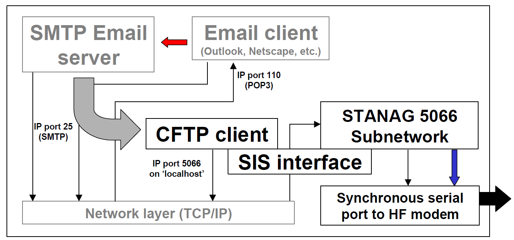
>
> F - 22 - CFTP Client and Node model
>
> In general, the interaction of the CFTP client with the mail-server is beyond the scope of this STANAG. In operation, when an email message is received at a 5066 node, it is placed in an incoming mail folder (mail spool directory). The CFTP client, also called the Delivery Agent (DA), removes mail from this incoming folder and processes the mail for delivery over HF via 5066. The CFTP DA compresses the message and information about the message, e.g. size, id, recipients, etc. into a file. This compressed file is then transferred to the destination 5066 node(s) using the original form of the Basic File Transfer Protocol (BFTP), referred to here as BFTPv1. The original BFTPv1 format is incorporated directly in the CFTP specification below to free it from dependencies on (and incompatibilities with) BFTP specification found in Section F.10.2 of this Amendment 1.

## CFTP Subnetwork Service Requirements

> CFTP clients **shall** bind to the HF Subnetwork at SAP ID 12.

## CFTP Connection-Oriented Protocol

> The CFTP application **shall** use the earlier form of the RCOP Protocol Data Unit ("RCOPv1") defined in the Figure below. \[NB: As a historical note, this corresponds to the definitions of the RCOP protocol found in the original information-only Annex F Edition 1. <u>It does not include</u> the Application Identifier within the PDU Header that has been added in this Amendment 1.\].
>
> 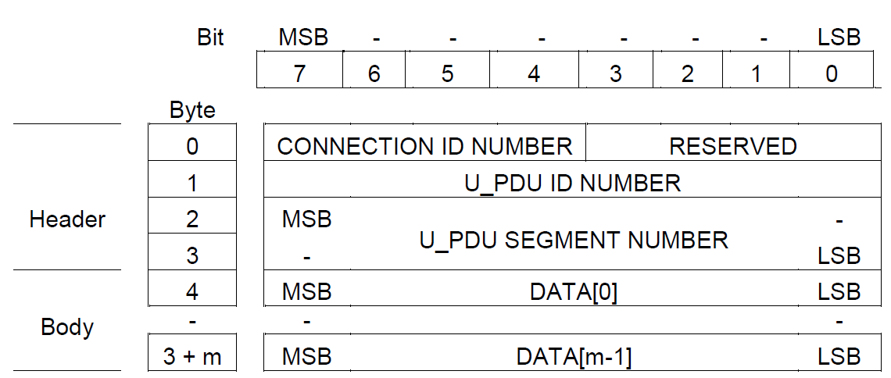
>
> Figure F-23. CFTP Protocol Data Units (identical in format to (Original) RCOP Protocol Data Units (RCOPv1) from STANAG 5066 Annex F Edition 1)
>
> The following are required for RCOPv1 PDUs:

1.  The connection ID number **shall** be a value from 0-15. Connection ID number 0 shall be reserved for non-multiplexed connections.

2.  The reserved bits **shall** be set to 0.

3.  The U\_PDU ID numbers **shall** be assigned consecutively to U\_PDU (i.e., files).

4.  The U\_PDU segment number **shall** be assigned consecutively to segments within a single U\_PDU. The first segment transmitted **shall** be assigned segment number 0. If a U\_PDU is not segmented, the single segment transmitted **shall** be assigned number 0.

    1.  *Compressed File-Delivery and Delivery-Confirmation*

> Compressed files **shall**(1) be transferred from one CFTP client to another using the Edition 1 Basic File Transfer Protocol ('BFTPv1') as defined in the subsections below.
>
> Client Delivery confirmation **shall**(2) be provided using the CFTP Message Acknowledgement, defined in the subsequent section (see F.14.3.2), as the body-part of the PDU.
>
> In principle, up to 256 files could be transferred concurrently using the unique RCOPv1 U\_PDU ID number for each transfer, using the U\_PDU\_ID as the identifier to match acknowledgements to the file acknowledged. As there is no negotiation protocol currently defined to determine if a given receiving node supports this capability, a sending node **must** have prior knowledge that a given receiving node supports concurrent multiple-file delivery.
>
> Consequently, the Client Delivery confirmation protocol is nominally stop-and-wait — a new file **should not**(1) be sent with a given U\_PDU ID until a message acknowledgement has been received. However, this recommendation **may**(1) be relaxed to allow concurrent multiple-file delivery when the sending node has prior knowledge that the receiving node supports the capability. New implementations of CFTP **should** support concurrent multiple file delivery.

1.  BFTPv1 Specification \[NB: corresponding to the original Edition 1 BFTP specification\]

> The format for the basic-file-transfer-protocol data unit Version 1 (BFTPv1) **shall**(1) be in accordance with the following Figure, which defines a header part and a file-data part for the BFTP\_PDUv1.

<table>
<colgroup>
<col style="width: 20%" />
<col style="width: 79%" />
</colgroup>
<thead>
<tr class="header">
<th><blockquote>

BFTP_HDR

</blockquote></th>
<th><blockquote>

Byte[0] - - - FILE_DATA[] - - - Byte[p-1]

</blockquote></th>
</tr>
</thead>
<tbody>
</tbody>
</table>

> Figure F-24: Basic FTP Version 1 Protocol Data Unit (BFTPv1 PDU)
>
> The detailed structure of the BFTPv1\_PDU **shall**(2) be in accordance with the following Figure, and provide the following information fields:

1.  BFTPv1\_PDU Header Part:

    -   SYNCHRONIZATION - two bytes corresponding to the control bytes DLE (Data Link Escape) and STX (Start of Text).

    -   SIZE\_OF\_FILENAME - one octet in size.

    -   FILE\_NAME - a variable length field, equal in size to the value specified by the SIZE\_OF\_FILENAME field.

    -   SIZE\_OF\_FILE - a four-octet field.

2.  BFTPv1\_PDU Body Part:

    -   FILE\_DATA\[\] - a variable length field, equal in size to the value specified by the SIZE\_OF\_FILE field.

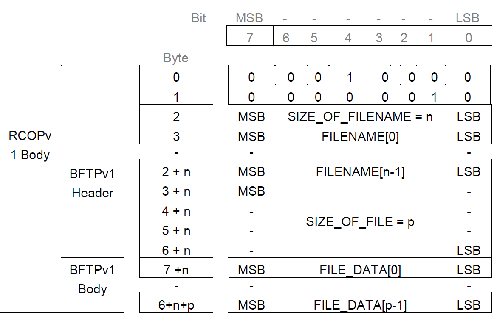

Figure F-25: BFTPv1 Protocol Data Unit Structure

> The SIZE\_OF\_FILENAME field **shall**(1) be a 1-octet fixed-length field whose value (n) **shall**(2) equal the number of octets used to encode the FILENAME field.
>
> The FILENAME field is **shall**(1) be a variable-length field, the size of which **shall**(2) be specified by the value (n) of the field SIZE\_OF\_FILENAME. This field represents the name of the file sent using the Basic File Transfer Protocol. The first byte of the filename **shall**(3) be placed in the first byte of this field, with the remaining bytes placed in order. The semantics of file names and naming conventions are beyond the scope of this STANAG (e.g., there is no requirement that the filename be a null-terminated character string.)
>
> The SIZE\_OF\_FILE field **shall**(1) be a 4-octet fixed-length field whose value **shall**(2) specify the size
>
> \(p\) in octets of the file to be sent. The first octet of the SIZE\_OF\_FILE field **shall**(3) be the highest order byte and the last byte the lowest order byte of the field's binary value.

1.  BFTPv1 Segmentation and Reassembly Requirements

> If the BFTPv1\_PDU exceeds the maximum size of the data field permitted in the RCOPv1 PDU (i.e, if the CTFP\_PDU is larger than the MTU\_size less 4 octets (i.e., MTU-4) ), the CFTP client **shall** segment the BFTPv1 PDU, placing successive segments in RCOPv1 PDUs (original Edition 1 format) with consecutive U\_PDU sequence numbers.
>
> When received, the CFTP client **shall**(2) reassemble the BFTPv1 PDU if it determines that the BFTPv1 PDU has been segmented. Subject to local-host file naming conventions, the CFTP client **shall**(2) store the received file with the name transmitted in the header with the file. \[*NB: there is no guarantee therefore that the file will be stored on the destination host with the same name that it was sent.\]*

1.  *Message Acknowledgement*

> Client Delivery confirmation **shall**(1) be provided using the Message Acknowledgement defined below, sent as the body-part of a CFTP/RCOPv1 PDU.
>
> 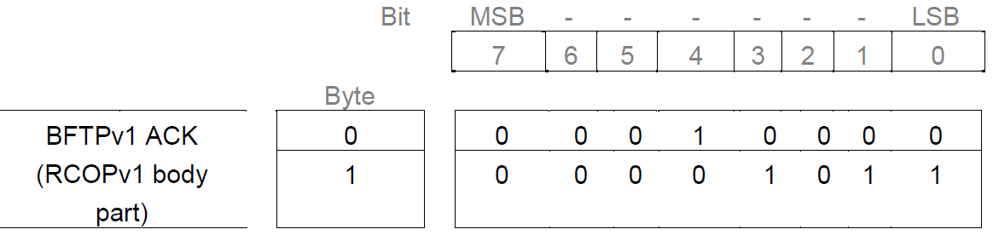
>
> Figure F-26: BFTPv1 Message Acknowledgement Structure
>
> On receiving the last byte of the message, the receiving client **shall**(2) send the Message Acknowledgement (0x10 0x0B) — with the same RCOPv1 U\_PDU\_ID NUMBER and CONNECTION
>
> ID NUMBER as the message being acknowledged — to confirm that the entire message has been received. (N.B. This is equivalent to the "ZEOF" message of the Z-modem protocol.)

## CFTP Compression/Decompression

> The compressed file **shall** be created and decompressed in accordance with RFCs 1950, 1951 and 1952 (i.e., the gzip utility defined in RFC1952).

## CFTP Compressed File Data Format

> The compressed file data **shall** be formatted as a series of fields. The fields are separated by the linefeed &lt;LF&gt; character 0x0A. The fields and the order in which they are compressed are described in the following table.
>
> Table F-10 CFTP Mail File Structure

<table>
<colgroup>
<col style="width: 15%" />
<col style="width: 14%" />
<col style="width: 70%" />
</colgroup>
<thead>
<tr class="header">
<th><blockquote>

<strong>Order of Compressi on</strong>

</blockquote></th>
<th><blockquote>

<strong>Field Name</strong>

</blockquote></th>
<th><blockquote>

<strong>Description</strong>

</blockquote></th>
</tr>
</thead>
<tbody>
<tr class="odd">
<td><blockquote>

1

</blockquote></td>
<td><blockquote>

MessageID

</blockquote></td>
<td><blockquote>

The MessageID field is represented by an arbitrary string that serves as the ID for the message. The MessageID is unique to an e-mail message. It is not the same as the ID in the email message that follows "Message-ID:" in the header. When the compressed file is decompressed, the MessageID is used as the root filename for the decompressed components. The MessageID must be less than 256 characters and is composed of upper/lowercase alphanumeric

characters.

</blockquote></td>
</tr>
<tr class="even">
<td><blockquote>

2

</blockquote></td>
<td><blockquote>

RecipientLis t

</blockquote></td>
<td><blockquote>

The RecipientList is a string containing e-mail addresses extracted from the e-mail message, each address delimited by the "," character (0x2c). The first address in the recipients list is the "Return-Path". There can be cases where there is no return path, e.g. the mail is being bounced by a Mail Transfer Agent. In these cases, the first address will be an empty string (i.e., either a single space [0x20] character or no characters at all) and it will be followed by a comma

(0x2c). The recipients list must be less than 10240 characters.

</blockquote></td>
</tr>
<tr class="odd">
<td><blockquote>

3

</blockquote></td>
<td><blockquote>

MessageSiz e

</blockquote></td>
<td><blockquote>

The MessageSize is encoded as a decimal number in string format. It represents the size (in bytes) of the Message field that follows the MessageSize field.

</blockquote></td>
</tr>
<tr class="even">
<td><blockquote>

4

</blockquote></td>
<td><blockquote>

Message

</blockquote></td>
<td><blockquote>

Actual message as received by an SMTP receiver <em><strong>i.e. including the terminating sequence &lt;CRLF&gt;.&lt;CRLF&gt; and any additional</strong></em>

<em><strong>characters that may be required for transparency as defined by RFC 821 para 4.5.2</strong></em> .

</blockquote></td>
</tr>
</tbody>
</table>

> Note 1. All characters are 8 bits.
>
> Note 2. The terminating sequence **&lt;CRLF&gt;.&lt;CRLF&gt;** is that shown in Example 1 of RFC 821 and equates to the 5 ASCII Characters with codes, in hexadecimal, of 0x0D, 0x0A, 0x2E, 0x0D, 0x0A.

## Detailed Description of CFTP

1.  An e-mail client is used to send an e-mail to an SMTP server.

2.  The CFTP application extracts the e-mail message from the directory in which it was placed by the SMTP server. An example e-mail message in the correct format is shown in Figure F-23 below.

3.  The CFTP mail-file **shall** be built as follows:

> &lt;MessageID&gt;&lt;LF&gt; // The MessageID field **shall**(1) be represented by a character
>
> string. The MessageID **shall**(2) be unique to an e-mail message. It is not the same as the ID in the email message that follows "Message-ID:" in the header. When the compressed file is decompressed, the MessageID **shall** be used as the root filename for the decompressed components. The MessageID **must** be less than 256 characters and **may** be composed of upper/lowercase alphanumeric characters.
>
> &lt;RecipientsList&gt;&lt;LF&gt; // The RecipientList **shall**(1) be a character string containing e-mail
>
> addresses extracted from the e-mail message, each address separated by "," character (0x2c). The first address in the recipients list **shall**(2) be the "Return-Path". There **may** be cases where there is no return path, e.g. the mail is being bounced by a Mail Transfer Agent. In these cases, the first address **shall**(3) be an empty string (i.e., either a single space \[0x20\] character or no characters at all) followed by a comma (i.e, a "," character with octet value = 0x2c). The recipients list **must** be less than 10240 characters.
>
> &lt;MessageSize&gt;&lt;LF&gt; // The MessageSize **shall** be encoded as a decimal number in string
>
> format terminated by the linefeed character. It represents the size (in bytes) of the Message field that follows
>
> &lt;Message&gt; // The Message field **shall** contain the e-mail message body part(s) extracted from the SMTP envelope.

1.  The CFTP message (including header) **shall** be compressed in accordance with RFCs 1950, 1951 and 1952 using an application such as gzip.

2.  The compressed CFTP message **shall** be encapsulated within a BFTPv1 PDU (i.e., it has a BFTPv1 header prepended to it, and the CFTP message shall be byte aligned within the FILE\_DATA\[\] field of the BFTPv1 PDU.

3.  The BFTPv1 message (i.e., BFTPv1 PDU) **shall** be segmented if necessary.

4.  Each BFTPv1 PDU segment **shall** have an RCOPv1 header added (in accordance with Annex F.14.3.).

5.  Each RCOPv1 packet **shall** be packaged into an S\_UNIDATA\_REQUEST and transferred using a Soft Link Data Exchange.

6.  On reception the BFTPv1 message **shall** be reassembled, if required, and decompressed using a method compliant with RFC 1952 and the CFTP message reconstructed.

7.  The received email messages **shall** be forwarded to an SMTP server using a standard SMTP dialogue based on information extracted from the CFTP header and inserting the "message" field into the payload of the SMTP message generated.

8.  

> **Received: from northampton (unverified \[127.0.0.1\]) by northampton.pdw**&lt;CRLF&gt;
>
> **(Rockliffe SMTPRA 4.2.4) with SMTP id [&lt;B0000000133@northampton.pdw]&gt; for**
>
> **[&lt;root@essex.pdw]&gt;;**&lt;CRLF&gt;
>
> **Wed, 9 May 2001 12:09:03 +0100**&lt;CRLF&gt;
>
> **Message-ID: &lt;001f01c0d878$74da90d0$0d02a8c0@pdw&gt;**&lt;CRLF&gt; **From: "Northampton" [&lt;administrator@northampton.two&gt;]**&lt;CRLF&gt; **To: [&lt;root@essex.pdw]&gt;**&lt;CRLF&gt;
>
> **Subject: Test** &lt;CRLF&gt;
>
> **Date: Wed, 9 May 2001 12:09:03 +0100**&lt;CRLF&gt; **MIME-Version: 1.0**&lt;CRLF&gt;
>
> **Content-Type: text/plain;**&lt;CRLF&gt; **charset="iso-8859-1"**&lt;CRLF&gt;
>
> **Content-Transfer-Encoding: 7bit**&lt;CRLF&gt; **X-Priority: 3**&lt;CRLF&gt;
>
> **X-MSMail-Priority: Normal**&lt;CRLF&gt;
>
> **X-Mailer: Microsoft Outlook Express 5.50.4522.1200**&lt;CRLF&gt;
>
> **X-MimeOLE: Produced By Microsoft MimeOLE V5.50.4522.1200**&lt;CRLF&gt;
>
> &lt;CRLF&gt;
>
> **This is the body of the test email**&lt;CRLF&gt;
>
> &lt;CRLF&gt;
>
> **.**&lt;CRLF&gt;
>
> Figure F-27 Example email in the Correct Format
>
> The red and blue text above is the message body with text in blue being the terminating sequence
>
> &lt;CRLF&gt;.&lt;CRLF&gt; i.e 0x0D, 0x0A, 0x2E, 0x0D, 0x0A.

# UNASSIGNED SERVICE ACCESS POINT IDENTIFIERS

> Service Access Point Identifiers numbers 13, 14, and 15 **may** be used by any arbitrary client type. Client types that already have assigned SAP\_IDs **may** use one of these unassigned Service
>
> Access Point Identifiers under various usage scenarios, for example to allow multiple clients of the same type to attach to the same subnetwork simultaneously.
>
> Other currently undefined clients of arbitrary type **may** bind using an unassigned SAP ID. For example, these might include new client types that do not wish to bind as an RCOP or UDOP client.
>
> There **will be**, in general, no guarantee that a client of a given type is bound to any of these unassigned SAP IDs. Standard operating procedure or out of band coordination **will be** required in a given scenario to provide such guarantee.

# RAW SIS SOCKET SERVER

> Implementations of the STANAG 5066 subnetwork profile **shall** provide a TCP/IP socket-server interface as the physical channel for connecting a client to the Subnetwork Interface Sublayer (SIS) of the STANAG 5066 subnetwork. TCP/IP socket servers that conform to the requirements of this section are referred to as a Raw SIS Socket Server. \[NB: The requirements of this section formalize some of the informational remarks given in STANAG 5066 Annex A.\]
>
> **NB**: A Raw SIS Socket Server **shall** be provided even for implementations that host client and subnetwork software on the same host computer.
>
> The Raw SIS Socket Server **shall** be accessible by clients that are not co-hosted with the HF subnetwork software via a standards-based Local-Area-Network interface. Use of Ethernet 100/10 Base T or similar common standard is **recommended**.
>
> The placement and scope of the Raw SIS-Socket-Server interface are illustrated in the following Figure.
>
> 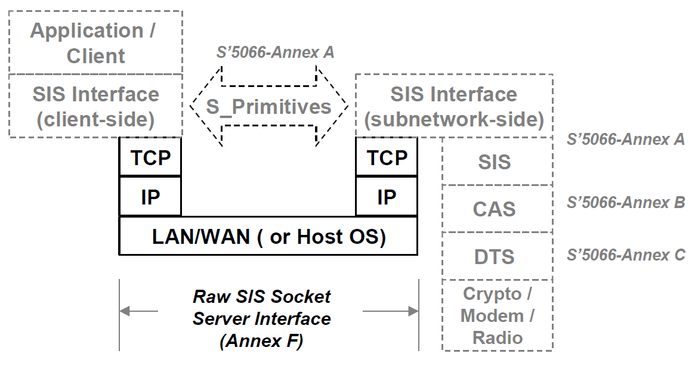
>
> Figure 28 - Scope and placement of the Raw SIS-Socket-Server Interface
>
> The Default SIS Port Number for the Raw SIS Socket Server **shall** be the decimal number '5066', a number registered with the Internet Assigned Number Authority (IANA) for this purpose. STANAG 5066 implementations, both clients and subnetworks, **should** be configurable to use any other valid port number as the default.
>
> The Raw SIS Socket Server **shall** listen on the Default SIS Port Number for connection requests from clients.
>
> The Raw SIS Socket Server **shall** accept a minimum of five connections simultaneously. Implementations **should** make the number of simultaneous connections a configurable parameter to allow support for a larger number.
>
> Once a connection between client and subnetwork has been established over the Raw SIS-Socket-Server Interface, further communication between a client and the HF subnetwork **shall** be in accordance with the requirements of STANAG 5066 Annex A, using the S\_PRIMITIVES defined in that Annex.
>
> The Raw SIS-Socket-Server Interface **shall** be bi-directional, allowing a client to send S\_PRIMITIVES to the subnetwork, and the subnetwork to send S\_PRIMITIVES to the client.
>
> S\_PRIMITIVES **shall** be sent over the Raw SIS-Socket-Server Interface without any separating characters or framing data other than the generic S\_PRIMITIVE encoding elements (e.g., the preamble, version, and size-of-primitive fields) currently defined in STANAG 5066 A (section A.2.2.2).
>
> Only S\_PRIMITVES **shall** be sent over the Raw SIS-Socket-Server Interface; no other messages between client and subnetwork. Implementation-dependent communication between a client and subnetwork over the Raw SIS-Socket-Server Interface for the purposes of system management shall be encapsulated within the S\_MANAGEMENT\_MSG\_REQUEST and S\_MANAGEMENT
>
> \_MSG\_INDICATION primitives defined in Annex A. \[NB: This does not preclude implementation-dependent communication over another socket on a different port number, but such use is outside of the scope of this STANAG and is not recommended.\]

  [&lt;B0000000133@northampton.pdw]: mailto:B0000000133@northampton.pdw
  [&lt;root@essex.pdw]: mailto:root@essex.pdw
  [&lt;administrator@northampton.two&gt;]: mailto:administrator@northampton.two
