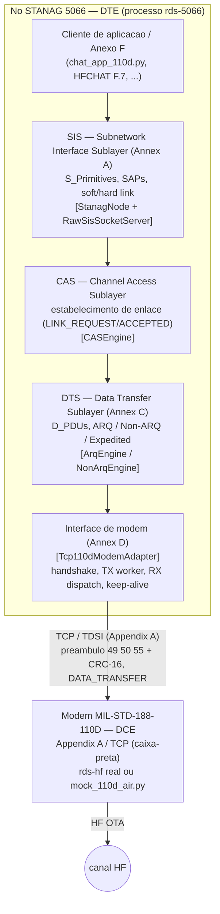
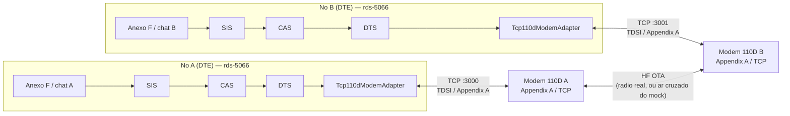

# Chat App STANAG 5066 sobre MIL-STD-188-110D (Appendix A / TCP)

`chat_app_110d.py` — GUI Tkinter de chat/transferência de arquivos que opera um
nó **STANAG 5066** (DTS + SIS) usando como modem um equipamento **MIL-STD-188-110D**
via o protocolo **Appendix A sobre TCP** (`Tcp110dModemAdapter`).

É o gêmeo do [`chat_app_sis.py`](./chat_app_sis.py): **toda** a lógica de aplicação
(SIS/SAPs, CAS, hard link, ARQ/Non-ARQ, transferência de arquivo, Raw SIS Socket)
é idêntica. A única diferença é o **transporte**: em vez de UDP ponto-a-ponto entre
os dois nós, cada nó é um **DTE** que abre uma conexão **TCP com um modem (DCE)**.

---

## 1. Diferença de arquitetura (importante)

```
 chat_app_sis.py  (UDP ponto-a-ponto)
 ┌──────────┐         UDP D_PDU cru          ┌──────────┐
 │ Node A   │ ◄────────────────────────────► │ Node B   │
 └──────────┘                                └──────────┘

 chat_app_110d.py  (DTE ↔ modem ↔ ar ↔ modem ↔ DTE)
 ┌──────────┐  TCP   ┌─────────┐   OTA    ┌─────────┐  TCP   ┌──────────┐
 │ Node A   │◄──────►│ Modem A │◄────────►│ Modem B │◄──────►│ Node B   │
 │ (DTE)    │ :3000  │ (DCE)   │  (rádio) │ (DCE)   │ :3001  │ (DTE)    │
 └──────────┘        └─────────┘          └─────────┘        └──────────┘
```

Consequências práticas:

- O app **não** tem mais "porta do peer". Ele só conhece **host:porta do seu modem**.
  Quem faz a ponte OTA entre os dois nós é o modem (`rds-hf` real, ou o mock local).
- O endereço do peer continua sendo o **endereço STANAG** (`remote_id` = 1/2), usado
  em `hard_link_establish` / `unidata_request(dest_addr=…)` — isso não muda.
- A conexão com o modem é **assíncrona**: o `Tcp110dModemAdapter` faz o handshake
  Appendix A (CONNECT/CONNECTACK/CONNECTION_PROBE), mantém keep-alive (2 s) e
  **reconecta sozinho** em caso de queda. A GUI mostra esse estado.
- A **taxa de dados** efetiva é a que o modem reporta no *Transmit Setup*; a GUI a
  exibe. Os seletores bitrate/interleaver continuam afinando a repetição do ARQ local.

### 1.1 Pilha de camadas de um nó (STANAG 5066 ↔ LAN 110D)

O nó STANAG 5066 (lado **DTE**) implementa as sub-camadas da norma; o
`Tcp110dModemAdapter` ocupa o lugar da **interface de modem** (Annex D), realizada
sobre o **LAN/TCP (TDSI) do Appendix A** da MIL-STD-188-110D. O modem (DCE) é
tratado como caixa-preta.



Mapeamento camada ↔ código ↔ norma:

| Camada STANAG 5066 | Função | Código (`src/`) | Fronteira 110D |
|--------------------|--------|-----------------|----------------|
| Cliente / Anexo F | Aplicação (chat, HFCHAT, e-mail…) | `interface/chat_app_110d.py`, `annex_f/*` | — |
| **SIS** (Annex A) | SAPs, S_Primitives, soft/hard link | `stanag_node.py`, `sis.py`, `raw_sis_socket.py` | — |
| **CAS** | Estabelecimento de enlace | `cas.py` | — |
| **DTS** (Annex C) | D_PDUs, ARQ/Non-ARQ | `arq.py`, `non_arq.py`, `dpdu_frame.py` | — |
| **Interface de modem** (Annex D) | Entrega de D_PDUs ao modem | `modem/tcp_110d_adapter.py` | **TDSI / TCP (Appendix A)** |
| Modem 110D (DCE) | LAN reactor, bridge, TDD, PHY HF | *(rds-hf — caixa-preta)* | LAN 110D §A.5.1 |

A fronteira **DTE↔DCE** é exatamente a seta `ADP → MODEM`: pacotes do Appendix A
(preâmbulo `49 50 55`, CRC-16, comandos `DATA_TRANSFER`/`TX_STATUS`/… — ver
`modem/appendix_a_codec.py`). Tudo acima dela é STANAG 5066 inalterado.

### 1.2 Topologia ponta-a-ponta (dois nós)

Cada nó conecta ao **seu** modem via TCP (TDSI); a ponte OTA entre os dois nós é
feita pelos modems (rádio real, ou o "ar cruzado" do `mock_110d_air.py`).



> Os endereços de peer continuam sendo os **endereços STANAG** (`remote_id` 1/2),
> usados em `hard_link_establish`/`unidata_request(dest_addr=…)`. O `host:porta` da
> UI endereça **o modem**, não o peer.

---

## 2. Requisitos

- Python 3.11+ com **Tkinter** (no Linux: `sudo apt install python3-tk`).
- Um destino de modem 110D:
  - o **mock local** `mock_110d_air.py` (incluído — não precisa do `rds-hf`), ou
  - um **`rds-hf` real** escutando TCP (Appendix A), com `tcp_port: 3000`.
- Display gráfico (X11/Wayland; no WSL, WSLg).

---

## 3. Como executar

### 3.1 Demo local sem `rds-hf` (3 terminais)

```bash
# 1) Sobe dois modems simulados cruzando o ar A↔B (portas 3000 e 3001)
python src/interface/mock_110d_air.py

# 2) Nó A (conecta no modem A, porta 3000)
python src/interface/chat_app_110d.py --node A

# 3) Nó B (conecta no modem B, porta 3001)
python src/interface/chat_app_110d.py --node B
```

O `mock_110d_air.py` reusa o mock fiel `tests/mock_110d_modem.py` (espelha o
`net_reactor.c` do `rds-hf`). Opções: `--port-a`, `--port-b`, `--data-rate`,
`--blocking-factor`.

### 3.2 Contra um `rds-hf` real

1. Suba o `rds_backend` com o serviço `110` e `tcp_port: 3000` (já configurado).
2. Estabeleça o link rádio (modo manual): `./ale_call.py force <ch> 110 <ip>` em ambos.
3. Em cada chat, ajuste **Modem host/Porta** para o IP:porta do respectivo modem
   antes de **Inicializar Nó** (ou passe `--modem-host` / `--modem-port`).

```bash
python src/interface/chat_app_110d.py --node A --modem-host 10.0.0.10 --modem-port 3000
python src/interface/chat_app_110d.py --node B --modem-host 10.0.0.11 --modem-port 3000
```

---

## 4. Fluxo de uso na GUI

1. **Inicializar Nó** — escolha bitrate/interleaver e (se preciso) edite **Modem
   host/Porta**. Ao clicar, o `StanagNode` é criado e o adaptador começa a conectar
   ao modem. O indicador **Modem** mostra `Conectando…` → `Conectado` quando o
   handshake Appendix A conclui; **Taxa modem** passa a exibir a taxa reportada.
2. **Conectar** (🔗) — só habilita após o modem conectar. Dispara o **hard link**
   (CAS MADE → S_PDU tipo 3). O painel de status acompanha CAS/SIS/DTS/ARQ.
3. **Enviar** (📨) / **Enviar Arquivo** (📎) — submete `S_UNIDATA_REQUEST` com os
   parâmetros de **Src/Dest SAP, Prioridade, TTL e Modo** (ARQ, NON_ARQ, EXP_ARQ,
   EXP_NON_ARQ). Arquivos são fatiados em chunks (`FILE/FCON/FEND/FALL`) com barra
   de progresso, throughput e contagem de retransmissões ARQ.
4. **Desconectar** (✂) — termina o hard link (S_PDU tipo 6).

### SAPs

- O app dá bind em **SAP 3** e **SAP 5**. SAP **5 = HFCHAT (Anexo F.7)**: o payload
  é ASCII terminado em CRLF; demais SAPs usam UTF-8. (SAP 0 é reservado ao Subnet
  Management e não é usado aqui.)

### System API (Raw SIS Socket)

- Cada nó também sobe o **Raw SIS Socket Server** (API de sistema, F.16) em
  `127.0.0.1:5066` (nó A) / `:5067` (nó B), permitindo clientes externos via SIS.

---

## 5. Indicadores de status

| Rótulo | Significado |
|--------|-------------|
| **Modem** | Estado da conexão TCP/handshake com o DCE 110D (`Conectando…`/`Conectado`). Reflete `Tcp110dModemAdapter.is_connected`. |
| **Taxa modem** | `TxDataRate`/blocking reportados pelo modem (Transmit Setup). |
| **CAS** | Estado do enlace físico (IDLE/CALLING/MADE/BREAKING). |
| **SIS** | Estado/typo da sessão de enlace (soft/hard link). |
| **DTS** | Estado da máquina DTS (idle/data/management/expedited). |
| **ARQ** | Estado do motor ARQ + janela/fila/LWE/UWE; RESET pendente. |

---

## 6. Mapeamento para o código

| Bloco | Onde |
|-------|------|
| Troca de transporte (UDP → 110D/TCP) | `_init_stanag()` constrói `Tcp110dModemAdapter(Tcp110dConfig(host, port, …))` |
| Campos host/porta + status do modem | `_build_ui()` (linha 2 do *frame* de config) e `_update_status_labels()` |
| Gating do botão Conectar pelo modem | `_update_status_labels()` (usa `modem.is_connected`) |
| Flags de linha de comando | `main()` (`--modem-host`, `--modem-port`) |
| Adaptador DTE (protocolo Appendix A) | `src/modem/tcp_110d_adapter.py` |
| Mock de demo | `src/interface/mock_110d_air.py` → `tests/mock_110d_modem.py` |

Detalhes do protocolo e decisões de fidelidade: `docs/PLANO_INTEGRACAO_5066_110D_TCP.md`.

---

## 7. Resolução de problemas

- **"Modem: Conectando…" não vira "Conectado"**: o modem (mock ou `rds-hf`) não está
  escutando no host:porta informado. Confirme que `mock_110d_air.py` está rodando, ou
  que o `rds_backend` está no ar com `tcp_port: 3000`. O adaptador reconecta sozinho
  com backoff — corrija o alvo e aguarde.
- **Ambos os chats em "Conectado" mas nada chega ao peer**: no modo mock, garanta que
  A usa a porta **3000** e B a **3001** (o ar é cruzado entre essas duas). No `rds-hf`
  real, confirme que o **link rádio/ALE** entre os dois modems está estabelecido.
- **`ModuleNotFoundError` / Tkinter ausente**: instale `python3-tk`.
- **Conectar (🔗) desabilitado**: ele só habilita após o modem conectar (o hard link
  precisa do enlace TCP com o DCE).
```
